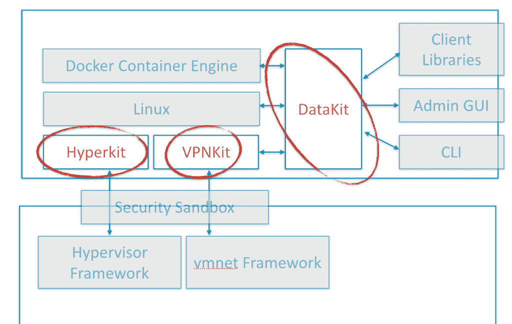

# Docker 的单核实验开始在 Mac OS 库上获得回报

> 原文：<https://thenewstack.io/dockers-unikernel-experiment-begins-paying-off-mac-os-libraries/>

unikernel 的承诺是，它将优化容器的打包方式，通过用只包含打包应用程序可能使用的代码的库来替换全功能操作系统内核，从而消除更多冗余代码。去年 1 月， [Docker 收购了 Unikernel Systems](https://thenewstack.io/docker-buys-unikernel-systems-plans-bring-unikernels-data-center/) ，这是该新兴领域的第一批公司之一，并立即开始平息现在显然是错误的观点，即针对工作负载的 Unikernel 打包将取代 Docker 和 CoreOS 容器。

周三，在得克萨斯州奥斯汀举行的 O ' Reilly OSCON 2016 大会的第一天，Docker Inc .在一篇公司博客文章中透露了其工程师如何致力于实现 unikernels，以简化 Mac OS X 上基于容器的开发

随着这些项目为公众消费做好准备，Docker Inc .现在正在开源三个基于单核的“kit”项目，其中包括——也许最具讽刺意味的是——[一个名为 HyperKit](https://github.com/docker/hyperkit) 的轻量级虚拟机管理程序，它旨在使任何 Mac 应用程序都能够实现虚拟化，甚至不需要首先提升权限。

“HyperKit 应用可以利用硬件虚拟化来运行虚拟机，但不需要提升权限或复杂的管理工具堆栈，”[写道，Anil Madhavapeddy](https://blog.docker.com/2016/05/docker-unikernels-open-source/) 在启动阶段领导 Unikernel Systems，现在正式担任 Docker Inc .的工程师。“由于 HyperKit 的结构大体上是一个库，因此将它与单内核库链接起来是很简单的。例如，我们添加了持久块设备支持，它使用用 OCaml 编写的 MirageOS QCow 库。”

在 OSCON 演讲期间，Docker 创始人兼 CTO Solomon Hykes 亲自向 GitHub 发布了包含 HyperKit、文件系统接口 unikernel DataKit 和以太网到套接字网络库 VPNKit 的存储库，供公众下载、分发和贡献。

Madhavapeddy 谈到了周三发布给新堆栈的 Alex Williams 的进一步细节，这是周三在 OSCON 制作的一个即将到来的播客。

## 永恒之美

在去年 7 月的一次演讲中，Madhavapeddy 关于单核的案例和他所描述的单核固有的 T2 不变性第一次出现在公共论坛上。在捷克斯洛伐克布拉格的一个名为 NetPL 的编程语言研讨会上，他告诉其他语言制作者，“我们正在构建一层又一层的软件，把它们放到云上，有越来越多的仿真层，整个软件栈开始分崩离析——安全漏洞；非常非常难编程；很难用一种有趣的、程序化的方式来操作。”

对于 Madhavapeddy 来说，花费如此多的精力来开发功能精美、时尚、流线型的应用程序，只是为了让它们落入 2000 万行左右的操作系统代码中，这是没有意义的，他认为这种方式本质上是不安全的。Docker Inc .及时采用 unikernels 作为打包和部署方法可能是为了躲避一颗极具破坏性的子弹。

“因为我们只静态链接所需的库，我们从成品中删除了许多不必要的服务和大量未使用的代码，”Unikernels 团队的另一名成员 Amir Chaudhry 在几个月前在[Docker Inc .的演示中解释道，“这也有助于我们提高速度，因为那些成品要小得多。”](https://www.youtube.com/watch?v=qvVzlxggnFk) [Chaudhry 继续解释](https://thenewstack.io/dockers-unikernel-purchase-changing-role-os/)他参与开发的名为 MirageOS 的库如何在建立 TCP 连接的过程中启动。

## 操作系统漏洞的终结？

正是这一事实，以及类似的其他事实，从根本上改变了传统上由操作系统甚至虚拟机管理程序执行的功能的潜在角色。我们习惯于将操作系统视为一大堆位于内存中的库，其中大部分永远不会被使用——就像政治演讲撰稿人的事实检查器一样。为了促进对“遗留”软件和系统的向后兼容性和支持，操作系统不得不构建一层又一层的外壳支持代码。

调试这些层完全不同于地质探险，需要先进的考古学来整理几十年来未被触及的逻辑。正是在这些旧代码层中，通常潜伏着世界上最常见、最有效的漏洞利用。

我们可以继续开发更快、更多的众包方法来发现这些缺陷，也许还能纠正它们。或者，正如 Unikernels 团队所展示的，我们可以引入一个大大减少的堆栈，其中根本不存在这些层。你不需要一个复杂的容器扫描器来检查已经不存在的代码层。

Docker 对单内核架构的集成已经为公司解决了潜在的主要架构缺陷，而不必承认它们的存在。它的 Mac OS 虚拟机管理程序工具包已经投入使用，作为该公司的 Docker for Mac 开发工具集的一部分。该公司周三通过 GitHub 开源的正是这种经过实战检验的功能。

周三在 OSCON，DeferPanic 创始人伊恩·埃伯格在一个会议上提出了“单核将在未来几年内取代容器生态系统”的观点 Docker Inc .可能不这么认为，尤其是在周三给出了一个非常令人信服的演示，展示了两者是如何整合的之后。

Docker 是新堆栈的赞助商。

通过 Pixabay 的特征图像。

<svg xmlns:xlink="http://www.w3.org/1999/xlink" viewBox="0 0 68 31" version="1.1"><title>Group</title> <desc>Created with Sketch.</desc></svg>