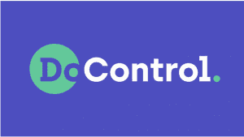

# 文档控制:自动执行 SaaS 数据安全策略

> 原文：<https://thenewstack.io/docontrol-automating-saas-data-security-policy-enforcement/>

很久以前，电视上每晚的公共服务广告吟诵道:“现在是晚上 10 点，你知道你的孩子在哪里吗？”

今天，人们可能会问，贵公司的 SaaS 应用程序中存在哪些漏洞。答案可能同样令人大开眼界。

总部位于纽约的[doc control](https://www.docontrol.io/)提供了一种自动化的方法来监控和修复主要软件即服务应用程序中的安全漏洞。它提供了一种方法来集中执行最低特权，并将[零信任](https://thenewstack.io/what-is-zero-trust-architecture/)原则扩展到 SaaS 数据层。

首席执行官[亚当·加维什](https://www.linkedin.com/in/adamgavish/)说:“我们首先帮助(组织)了解他们在 SaaS 应用程序中存储了多少数据，如 Google Drive、微软 SharePoint、Slack、GitHub 等。

然后是数据如何在内部和外部公开。它可以跨不同的部门—财务、工程—可以是他们不再合作的供应商、前员工的个人帐户等等。我们对技术债务进行量化，以便他们可以在内部向领导形象化地解释它，最重要的是补救暴露，修复它。”

任何数量的人，包括员工、供应商或合作伙伴，都可以访问谷歌文档——例如，你公司的客户名单或销售数据。当员工离开或合作关系结束时，谁会回来取消这种访问权限？

## 可见性和补救

应用程序通过安全的 OAuth 流连接到 doc control 平台，该流允许 doc control 接近实时地访问每个系统的元数据和更改日志。

该平台创建了一个集中的清单，其中包括经批准和未经批准的 SaaS 应用程序、用户、外部供应商、合作伙伴和其他有权访问的人员。它可以确定每个应用程序是否启用了多因素身份认证，并提供对数据访问的持续监控，以解决内部和外部滥用数据的风险。

“我们在演示中做的第一件事是插入他们的应用程序，并向他们展示。我们说，“好吧，看，你在 Google Drive 里有 20 万份文档或幻灯片或其他什么，你知道其中 10%有一个任何人都可以在互联网上访问的链接吗？DoControl 营销副总裁萨姆·阿德勒解释道。

他称之为许多公司的灯泡时刻。

“当然，其中很多可能是营销人员写的某个博客的草稿，或者大部分可能无关紧要，对吗？但是如果其中一个有 PII 呢？如果其中一个有【另一个风险因素】呢？不幸的是，一些来找我们的公司已经发生了事故。毒刺就在其中一份文件里。”

该平台提供了无代码条件逻辑工作流，这些工作流跨所有应用程序标准化了数据访问策略，其中许多策略无法在每个单独的应用程序中以本机方式实现。

‍DoControl 还提供了一个模板目录，用于为特定应用或使用案例定制安全工作流。

例如，您可以设置一个工作流来查找包含个人身份信息的可公开访问的文档(PII)。它可以设置为删除共享功能或要求所有者对共享进行是/否确认。

当问题出现时，它的 Slack/Teams bot 会通知适当的人员。

客户可以在常见情况下使用一键式操作，例如删除特定外部协作者的所有权限、更改数据所有权以及将某些数据设为私有。

事件驱动的基础架构还会对可疑活动发出警报，提供业务环境、风险映射和清晰的补救路径。可疑活动可能包括可疑的人为错误、潜在的数据泄露、OAuth 应用程序的过度访问等等。

## OAuth 的扩展功能

Gavish 曾在 Google Cloud Security and Privacy team 担任产品经理，与受监管的客户合作，例如政府机构，他们在使用 Google Cloud 保护数据访问和保持合规性之前，必须设置和应用多种不同的安全控制和策略。

谷歌建立了一个名为[的服务来保证工作负载](https://cloud.google.com/assured-workloads)来为他们处理所有这些，这成为了 DoControl 的灵感，DoControl 开始将这个想法扩展到 SaaS 应用程序。

加维什在 2020 年与里尔·兰和 T2 一起创立了这家公司。他们在一月份发布了[安全工作流引擎](https://c212.net/c/link/?t=0&l=en&o=3592256-1&h=2270462975&u=https%3A%2F%2Fwww.docontrol.io%2Fnews%2Fdocontrol-announces-the-first-no-code-security-workflows-triggered-by-any-saas-event-to-enforce-data-access-control&a=Security+Workflows+Engine)，最近又宣布了 [OAuth 治理和补救功能](https://www.docontrol.io/blog/oauth-saas-applications-discover-correlate-remediate-repeat)。

**"** 随着最近 OAuth 的发布，我们现在将覆盖范围扩大到包括所有第三方插件或附加组件。…因此，如果我是一个组织，我有使用 Google Drive 的员工，现在我们也涵盖了安装在 Google Drive 上的所有第三方应用程序，”Gavish 说。

该公司已经筹集了 4500 万美元，最近一次是 4 月份由 Insight Partners 领投的 3000 万美元 B 轮融资。(Insight Partners 也拥有新的堆栈。)DoControl 的支持者包括 CrowdStrike 的早期投资基金 CrowdStrike Falcon Fund 等。

Insight Partners 董事总经理 [Stephen Ward](https://www.linkedin.com/in/stephen-ward-75731013/) 谈到这笔投资时说:“每个现代公司都必须应对难以管理的 SaaS 数据访问风险，敏感的公司、员工和客户数据存储在流行的企业应用程序中。”。

“DoControl 提供了资产管理、安全自动化和补救措施的罕见组合，消除了因缺乏 SaaS 数据保护功能而造成的暴露风险。”

到目前为止，该公司一直专注于保护前 15 名的企业 SaaS 应用程序，包括 GitHub、Slack、DropBox 等。新的资金将允许该公司在此基础上进行扩展，并建立一个更强大的 API，安全团队可以使用它来集成 DoControl 尚不支持的应用程序。

Gavish 说这个工具是高度可定制的。一些公司希望大量自动化；其他人希望得到风险通知，并由人来处理。

“[在谷歌]我看到我们的许多客户在使用 [CASB(云访问安全代理)](https://www.docontrol.io/blog/modernizing-dlp-and-casb-with-docontrol)解决方案时都在使用，这太棒了。但为他们提供数百种不同的现成安全策略是非常硬编码的，但他们非常固执己见，不容易根据特定的业务需求进行调整和定制，”他说。

他说，DoControl 只是一个工具；客户决定自动化程度符合他们的需求。

<svg xmlns:xlink="http://www.w3.org/1999/xlink" viewBox="0 0 68 31" version="1.1"><title>Group</title> <desc>Created with Sketch.</desc></svg>