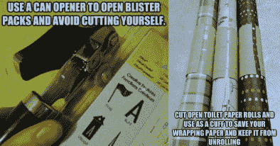

# 机器人过程自动化是软件测试自动化的“技术黑客”吗？

> 原文：<https://thenewstack.io/does-robotic-process-automation-work-as-a-tech-hack-for-software-test-automation/>

Tricentis 赞助了这篇文章。

很难忽略标题为“10 大生活窍门”或更糟的文章和帖子，*…*和第 6 条建议会让你大吃一惊！！!"这些技巧和窍门表面上是关于如何以意想不到的方式使用普通家居产品来改善你的生活，但却诱使你去了解更多。

我承认我被这个点击诱饵骗了。老实说，有时候我会感到惊喜。例如，谁知道你可以用开罐器切开恼人的塑料泡罩包装，或者用卫生纸卷筒来防止包装纸展开？

我试了上面的两个“黑客”，猜猜会发生什么？至少在一段时间内，它们“有点”起作用了。开罐器切穿了塑料熔合的接缝，但没有切穿包装的长度。卫生纸支撑了包装纸一段时间，但最终纸板变弱，包装纸散开。毫不奇怪，使用塑料泡罩包装的剪刀和包装纸的小胶带工作得更好。

同样，许多组织现在正在考虑使用 [机器人过程自动化(RPA](https://en.wikipedia.org/wiki/Robotic_process_automation) )来自动化软件测试:一种软件测试的“技术黑客”。然而，正如卫生纸卷不能提供一个可持续的解决方案来防止我的包装纸展开一样，RPA 对于软件测试自动化来说也不是一个可持续的解决方案。使 RPA 工具可持续用于软件测试自动化任务所需的修改将是，嗯，一个黑客。

## 为什么它是一个黑客

 [韦恩·阿里奥拉

来自 Tricentis 的 Wayne 是持续测试、基于风险的测试、服务虚拟化和 API 测试等软件测试领域公认的思想领袖。Wayne 创造并销售了支持动态软件开发、测试和交付环境的产品。他推动了许多创新技术的设计，并获得了多项发明专利。他为软件测试领域贡献了 15 年，在软件行业工作了 20 多年。在 LinkedIn 或 Twitter 上与他联系。](https://www.linkedin.com/in/wayneariola/) 

如果您的组织中已经有了 RPA 工具，并且您正在寻求开始测试自动化，那么您的 RPA 工具可能看起来是一个合理的选择。自动化一些基本的测试场景(例如，创建一个新用户并完成一个事务)，添加验证并相信您已经走上了测试自动化的道路，这通常是相对容易的。

然而，重要的是要认识到成功的——并且可持续的——测试自动化需要的不仅仅是点击应用程序路径的能力。为了超越低于 20%的令人沮丧的行业平均测试自动化率，团队还必须能够构建和稳定有效的自动化测试套件。RPA 工具通常不是为实现这一点而设计的。

结果，您将遇到测试自动化的障碍。它们包括等待所需测试数据和测试环境的延迟、侵蚀对自动化计划的信任的不一致结果，以及消耗大量资源但不提供清晰、可操作的反馈的“臃肿”测试套件。

要快速了解 RPA 工具和测试自动化工具之间的范围差异，请比较 Gartner 的以下定义:

*   **RPA 工具**“对结构化数据执行‘if，then，else’语句，通常使用用户界面(UI)交互的组合，或者通过连接到 API 来驱动客户端服务器、大型机或 HTML 代码。RPA 工具通过将 RPA 工具语言中的过程映射为软件“机器人/跟随”来操作，运行时被分配为通过控制仪表板执行脚本”；
*   **测试自动化工具**“使一个组织能够设计、开发、维护、管理、执行和分析自动化功能测试……它们在软件开发生命周期(SDLC)中提供产品和功能的广度和深度。这包括测试设计和开发；测试用例的维护和重用；以及测试管理、测试数据管理、自动化测试和集成，重点是支持持续测试。”

当您考虑以下两者之间的一些核心差异时，对这些额外测试功能的需求就变得很明显了

*   将生产环境中的任务序列自动化，以便在整个流程中成功执行定义明确的路径，从而使您可以更快地完成工作；
*   在测试环境中自动化真实的业务流程，以查看应用程序失败的地方，这样您就可以做出明智的决策，确定应用程序发布的风险是否太大。

## 软件测试的复杂性

以上差异对于软件测试意味着什么？

*   自动化必须在一个典型的不完整、不断发展和受约束的测试环境中执行；
*   管理有状态的、安全的、符合标准的测试数据成为一个巨大的挑战；
*   有效的测试用例设计是成功的关键；
*   失败需要提供对商业风险的洞察。

更具体地说，让我们考虑测试在线旅游服务的例子。假设您想要检查允许用户延长其预付酒店预订的功能。首先，您需要决定需要多少次测试来彻底测试应用程序逻辑——以及每一次测试需要使用什么样的数据组合。

然后，您需要获取并提供将应用程序设置为可以执行测试场景的状态所需的所有数据。在这种情况下，您需要(至少)一个现有的用户帐户，并在未来的某个日期进行现有的预付费预订—由于隐私法规(如 GDPR)的原因，您不能使用实际的生产数据。

接下来，您需要一种方法来从连接的酒店预订系统(房间可用/不可用)、信用卡(交易批准/拒绝)等调用所需范围的响应。—但实际上没有预订房间或用信用卡付款。

当然，您需要自动化这个过程。这包括登录、检索现有预订、表明您想要修改它，然后指定扩展的长度。

一旦实现了整个过程的自动化，就需要在不同的检查点配置大量的验证。适当的细节是否以适当的信息格式发送到酒店？您的用户数据库中的预订更新了吗？支付数据是否正确发送给了信用卡提供商？是否应用了任何帐户信用？如果预订不能延期，用户是否收到了适当的消息？如果信用卡被拒绝了呢？如果信用卡被拒绝，您的系统会回复到原来的预订时间长度，而不是增加实际上没有支付的额外住宿吗？

现在假设您的公司决定对所有预付预订收取 10 美元的改签费。您能轻松地将这个新需求融入到您现有的自动化测试中吗——或者您必须对每个测试进行大量的返工来适应这个微小的变化吗？

即使这个简单的例子也暴露了许多软件测试的复杂性，而 RPA 工具并不是用来解决这些问题的。RPA 工具旨在自动执行序列中的特定任务。软件测试自动化工具被设计用来测量更广泛的任务序列的弹性。直截了当地说:RPA 工具是为了让流程工作而设计的。但是对于软件测试来说，你需要一些工具来帮助你确定一个过程是如何中断的。

低效的软件测试自动化因延迟发布和消耗大量资源而臭名昭著。随着组织在通过更快的软件交付来改善客户体验的数字化转型计划上投入了越来越多的资金，在软件测试上的吝啬会适得其反。为工作选择正确的工具将在加速交付、降低业务风险和投入更多资源进行创新方面带来显著回报。

*[获取 Gartner 分析师对 RPA 与软件测试自动化的观点—观看汤姆·墨菲](https://www.tricentis.com/resources/test-automation-rpa/)* 的主题演讲

通过 Pixabay 的特征图像。

<svg xmlns:xlink="http://www.w3.org/1999/xlink" viewBox="0 0 68 31" version="1.1"><title>Group</title> <desc>Created with Sketch.</desc></svg>