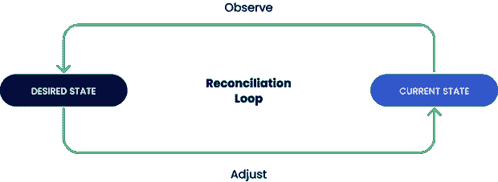
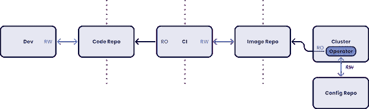
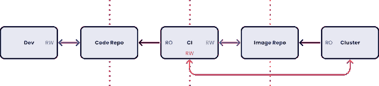
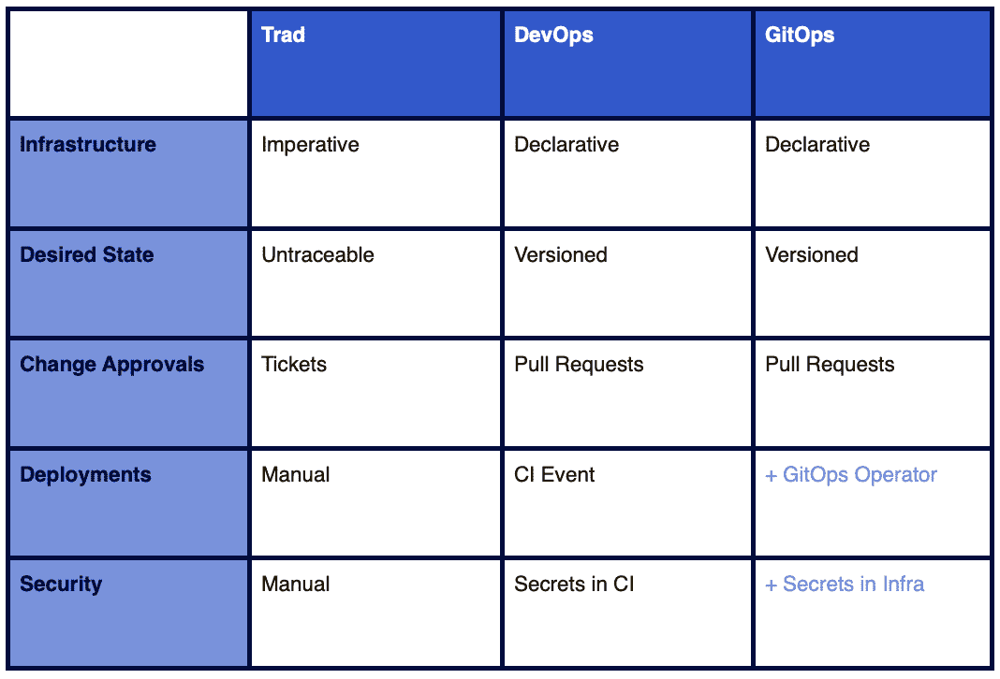
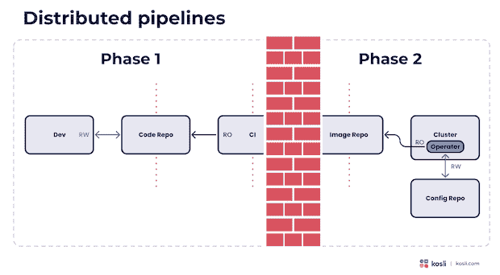
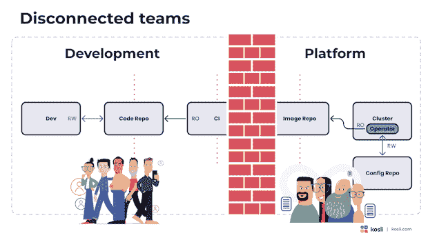
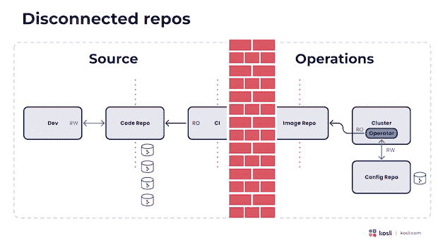
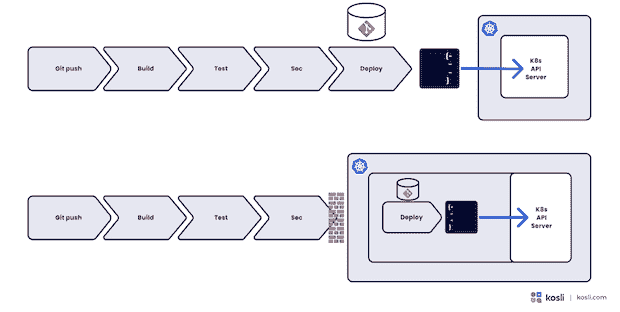
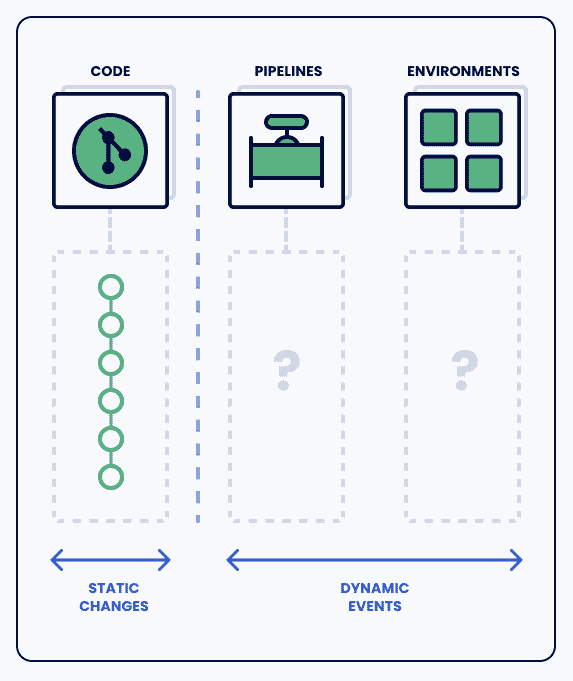
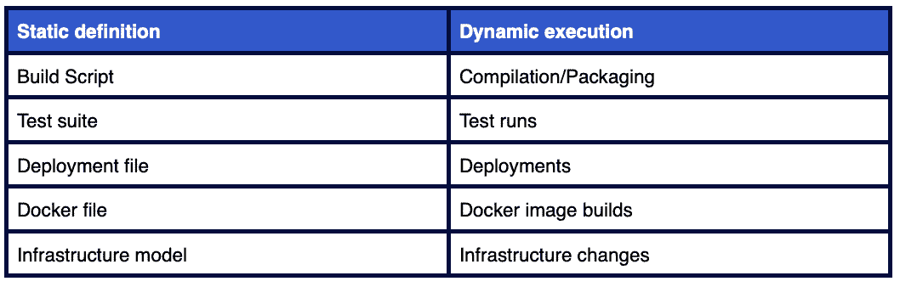

# 吉托普斯皇帝没有衣服吗？

> 原文：<https://thenewstack.io/does-the-gitops-emperor-have-no-clothes/>

在 git 中捕获一切代码[有很多好处。静态定义、配方和我们如何制作软件的规范的存储库在各方面都是有用的。🌈](https://thenewstack.io/tutorial-git-for-absolutely-everyone/)

然而，这些定义并不能帮助我们理解我们的动态环境，这就是我对 [GitOps](https://thenewstack.io/what-is-gitops-and-why-it-might-be-the-next-big-thing-for-devops/) 的问题。很多声明[是针对 GitOps](https://thenewstack.io/gitops-git-push-all-the-things/) 的——它提供了更好的安全性、历史记录，以及一个解决漂移和调和的方案。我发现自己怀疑这些是否真的是真的，在这篇文章中，我将解释为什么。

GitOps 让我想起了古老的汉斯·克里斯蒂安·安徒生童话，关于什么是真实的，什么是想象的。皇帝**宣称**他穿着衣服，但是如果他**实际上**什么都没穿呢？

## 我们所说的 GitOps 是什么意思？

在我们深入研究之前，让我们根据 [Weaveworks](https://www.weave.works/?utm_content=inline-mention) 建立的 [四原则](https://www.weave.works/technologies/gitops/) 为我们描述的 GitOps 设定一个基线:

1.  整个系统以声明的方式描述。
2.  在 git 中，规范的期望系统状态是版本化的。
3.  有可以自动应用到系统的已批准的更改。
4.  软件代理确保正确性，并对差异发出警报。

就像敏捷宣言一样，这四个原则很容易被接受。但是和敏捷一样，将理论转化为实践是有趣的部分。

## GitOps 实际上是什么样子的？

GitOps 强烈强调软件代理不断运行以将系统状态与期望状态融合的思想。

那么，我们如何使用典型的 GitOps 方法来协调这些状态呢？

我们将一个操作员(或代理)安装到我们的集群中，该操作员从 git 配置报告中“提取”(稍后将详细介绍)所需的状态，做出决策并相应地调整工作负载。

这是作为标准 DevOps 管道的替代方案提供的，标准 devo PS 管道将更改“推”到集群:

好了，我们已经概述了理论并描述了基本的实践。现在谈谈 GitOps 的好处。当我们开始实现它时，它们是如何实现的？

## GitOps 的额外安全措施？ 🧐

首先，增加安全性。与简单地对我们的集群进行更改相比，采用“基于拉动”的方法有什么好处？主要的优势是，使用 GitOps，您的 CI 服务器没有生产访问权限，因此我们可以说这提高了我们的安全性。

然而，这种设置真的有额外的安全性吗？如果 CI 系统可以更新配置，GitOps 如何防止访问 CI 的恶意参与者部署流氓工作负载？🤔

## 版本和环境历史

GitOps 的另一个主要卖点是环境的版本化历史。这是真的，但是如果您的管道和部署信息在源 repo 中，您也可以从普通的旧 DevOps 中得到这一点。这个历史是有用的，但是它并不是环境实际变化的真实记录(稍后将详细介绍)。

## 反转

使用 GitOps 回滚更简单吗？我的观点是，您最好通过恢复提交来使用常规的旧 DevOps。这里的好处是它使回滚成为一个标准的开发人员工作流，并使用源存储库进行版本控制。有什么不对劲吗？简单来说就是`git revert`。

## 灾难恢复

当您的整个集群宕机时会发生什么？当您想要启动一个新的集群时会发生什么？这些都是合理的问题。但是大多数团队没有推出蓝/绿集群。大多数公司都有一个或多个静态集群。大多数灾难恢复不会因为需要运行部署管道而受阻，我认为这应该在不需要 GitOps 的情况下编写脚本。

所以，是的，我对它的好处表示怀疑。但是当我们开始考虑我们在实现 GitOps 时必须做出的权衡时，我有更多的保留。让我们看看那些。

## GitOps 面临的挑战

GitOps 面临的第一大挑战是它对我们管道的影响。将部署从管道的早期阶段中分离出来会导致它们变得分布式。从价值流的角度来看，这使得很难理解从提交到生产的整个路径。它将资格鉴定的早期阶段与后期阶段分开。

这很重要，因为它从价值流中去除了开发人员的反馈。在这种情况下，如果部署失败，反馈来自哪里？开发人员如何获得部署过程的信息？他们如何通过自己的通知来增强部署过程？他们如何改进部署流程？

第二个副作用是将这些阶段分成两个工具集增加了开发和操作之间的差距。

通常，中央平台团队运行和管理 GitOps 工具。CI 系统通常在团队的领域内。

通过使用单独的配置 repo 来存储所需的状态，差距会进一步扩大:

通常，git 存储库以单个微服务为中心，用一个单独的公共 repo 来描述所需的环境状态。一个是以代码和开发人员为中心，一个是以运营为中心。此外，不得不编写 glue pipeline 脚本来更新配置报告的情况并不少见。

## 重新审视推与拉

GitOps 的主要创新似乎是将运营转移到基于拉动的模式。这似乎是一个很大的变化，但仔细观察，我认为这不是真的。【感谢我的好朋友亨利克·霍格给我解释了这些。]

通常，GitOps 操作员从 git repo 中读取一个配置，对其应用零到多的转换，然后 ***将它*** 推入 Kubernetes API 服务器。这正是您的部署工具在基于推的模型中所做的事情！使用 GitOps，我们将管道分布在两个异步工具上，使用 git 存储库作为信号量，但是使用这两种方法，我们都将*变更*推送到集群中。

## 这是一个伟大的漂移和和解，对不对？

GitOps 的另一大优势是协调循环——自动修复任何偏差或手动更改。任何未记录的更改都将被删除，环境将与 git 定义保持一致。

从表面上看，这似乎是一笔巨大的奖金。然而，我对此也有不同的看法。在我们开始协调未记录的变更之前，我们需要先问一下**为什么它们会发生。**也许我们不想让他们和好？可能有很好的理由进行手动更改，我们可能不希望环境被自动修复。

另一个原因可能是蓄意破坏，在这种情况下，我们肯定希望人类参与调查和管理这种情况。在任何一种情况下，**配置漂移都应该导致适当的事件管理过程**发生，而不仅仅是来自协调环路的松弛消息消失在以太网中。

而且技术面，我感觉 Kubernetes 已经有和解循环了。您以声明的方式描述您的部署和配置，Kubernetes 的工作就是实现这一点。分层协调循环似乎增加了不必要的复杂性。

## 地图 Git 回购不在区域内

我们喜欢**认为**git 配置存储库等同于事物如何变化，但实际上，在这些静态定义和动态 DevOps 自动化中实际发生的事情之间存在差距。所有这些关于 GitOps 提供“单一真相来源”的说法都是不真实的。如果我想知道周四晚上**实际上**在做什么，没有简单的方法。

GitOps 配置无法洞察手动更改、缩放事件、失败的协调和许多其他边缘情况。这些类型的事件会引发事故，但是当事故发生时，GitOps 不提供情景感知。

当一个事件发生时，我们真正需要的是了解事情 ***实际上*** 是如何变化的。现代 GitOps 的一个大问题是开发人员和运营团队很少或没有实际发生的变更的真实记录。我们需要清楚，期望的状态并不是实际的状态。

## 静态地看待变化是有益的，但也是有限的

我一开始说我完全赞成将我们想要的 DevOps 的配方、定义和规范放在版本控制中。它给我们带来了各种各样的好处。让我们来回顾一下它们是什么:

*   **更好的透明度** **:** 以熟悉的技术实现共享、审查和审计。
*   **代码工具和工作流** **:** 支持基于分支/拉式请求的方法来集成变更。
*   **更好的质量** **:** 允许您在自动化过程中添加棉绒、检验器和静态分析，并强制变更的一致性。
*   **不变性** **:** 有助于最小化配置漂移。
*   **集中化** **:** 有助于减少“配置蔓延”，即分布在多个未连接系统上的流程配置。

到目前为止还不错——但是每个静态定义都有一个动态执行。有真实的事件发生，异步地和自动地，我们需要记录和理解结果。

毫不夸张地说，动态世界就是行动的地方。对于开发人员来说，从 GitOps 定义返回到事件、更改、排序和依赖项并不容易。

如果你仍然想知道为什么这很重要，谷歌 SRE 的书告诉我们“70%的停机是由于实时系统的变化。”所以，当事情出错时，动态世界应该是我们寻找答案的第一个地方。

## 结论——谁是 GitOps？

就像敏捷宣言一样，GitOps 的松散定义意味着它可以并且将会以各种不同的方式应用。广泛教会的方法是完美的书呆子狙击。Terraform 是 GitOps 吗？也许吧？我不知道！

像敏捷一样，每个人都经历 FOMO。如果这是下一件大事呢？我们会因为害怕被抛在后面而赶潮流吗？对于敏捷，我们需要问**“谁是敏捷的？”也许我们需要问“谁是 GitOps？”和以往一样，我们真正需要问自己的是“我们在用这些工具为谁服务，我们在试图解决什么问题？”T32**

在“皇帝的新衣”的结尾，皇帝周围的人继续称赞他的新衣服，即使他们意识到他是完全赤裸的。当我们全身心投入某事并希望它成真时，我们任何人都会陷入尴尬的境地。就像人群中大喊“但是皇帝什么也没穿！”有时候，把你看到的说出来，让所有事情简单化是件好事。

<svg xmlns:xlink="http://www.w3.org/1999/xlink" viewBox="0 0 68 31" version="1.1"><title>Group</title> <desc>Created with Sketch.</desc></svg>