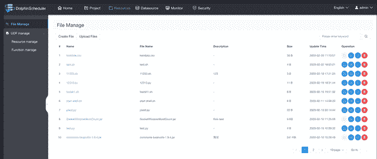
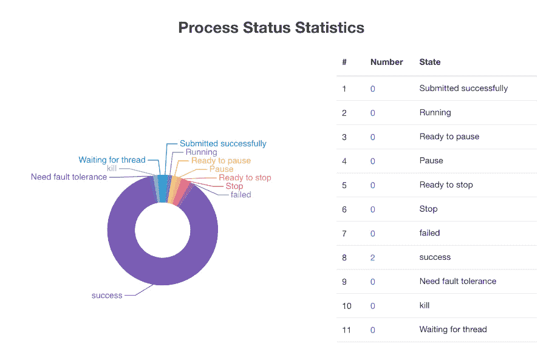
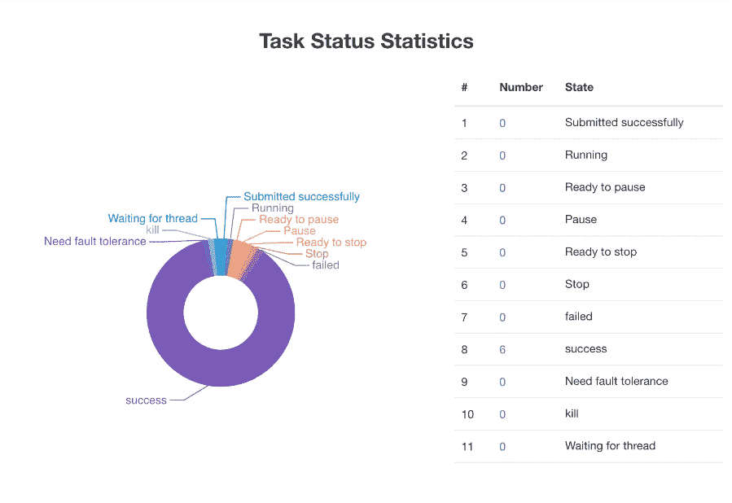
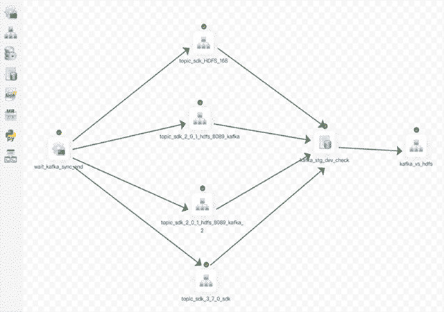

# DolphinScheduler 塔梅什复杂数据流程

> 原文：<https://thenewstack.io/dolphinscheduler-tames-complex-data-workflows/>

像许多 IT 项目一样，一个新的 Apache Software Foundation 顶级项目 [DolphinScheduler](https://dolphinscheduler.apache.org/) 在挫折中成长。

“我们发现数据科学家和数据开发人员很难通过使用代码来创建数据工作流。一个晚上，我们在多数据中心运行了 30，000 多个作业，并且只有一个主架构师。Apache DolphinScheduler 项目管理委员会的戴立东(Lidong Dai)和郭(William Guo)在一封电子邮件中写道:“通常，由于网络抖动或服务器工作负载，我们不得不在晚上醒来解决问题。”。“我们尝试了许多数据工作流项目，但没有一个能够解决我们的问题。”

它被设计成:

*   云原生—支持多云/数据中心工作流管理、Kubernetes 和 Docker 部署以及自定义任务类型、分布式调度，整体调度能力随着集群规模的增长而线性增长。
*   高度可靠—具有分散的多主机和多工作人员、高可用性、自身支持和过载处理。
*   用户友好—所有过程定义操作都是可视化的，定义的关键信息一目了然，一键部署。
*   支持丰富的场景—包括流、暂停、恢复操作、多租户和其他任务类型，如 Spark、Hive、MapReduce、shell、Python、Flink、子流程等。

“我们对 Apache [DolphinScheduler](https://github.com/apache/dolphinscheduler) 有一个口号:‘白天数据工作流开发更高效，晚上维护更省力。’当我们将项目上线时，它确实提高了 ETL 和数据科学家的团队效率，我们晚上可以睡个好觉了，”他们写道。

DolphinScheduler 主要位于中国，被百威啤酒、中国联通、IDG 资本、IBM 中国、联想、诺基亚中国和其他公司使用。

## 非中心设计

该项目于 2017 年 12 月在 [Analysys Mason](https://www.analysysmason.com/) 开始。2019 年 8 月进入阿帕奇孵化器。

它使用户能够根据任务在有向无环图(DAG)中的依赖关系来关联任务，以实时可视化任务的运行状态。他们可以设置任务的优先级，包括任务故障转移和任务超时报警或失败。

它采用一种主/工方法，具有分布式、非中心的设计。两者都使用 [Apache ZooKeeper](https://zookeeper.apache.org/) 进行集群管理、容错、事件监控和分布式锁定。

通过使用 DAG 用户界面设置触发条件和调度时间，用户只需拖放即可创建复杂的数据工作流。他们还可以预设几种错误代码的解决方案，如果出现错误，DolphinScheduler 会自动运行它。还有一个子工作流来支持复杂的工作流。

多主架构师可以支持多云或多数据中心，而且能力也是线性增长的。这种设计极大地增加了并发性。它支持多租户和多数据源。他们写道，在用户的性能测试中，DolphinScheduler 可以支持 10 万个作业的触发。

它通过租户和 Hadoop 用户实现了多对一或一对一的映射关系，以支持调度大型数据作业。支持分布式调度，整体调度能力会随着集群的规模线性增长。

任务队列允许在单台机器上灵活配置任务的数量。任务队列中缓存的任务数量的高容忍度可以防止机器堵塞。

## 成长项目

DolphinScheduler 与 Apache [Oozie](https://oozie.apache.org/) 这样的 Hadoop 工作流调度程序竞争；开源[阿兹卡班](https://github.com/azkaban)；还有阿帕奇[气流](https://airflow.apache.org/)。它标榜高可扩展性、与 Hadoop 的深度集成和低成本。

他们说，T3-Travel 选择 DolphinScheduler 作为其多主控和 DAG UI 设计的大数据基础设施。同样，中国联通的数据平台团队支持超过 300，000 个工作岗位和 500 多名数据开发人员和数据科学家，他们迁移到该技术以获得其稳定性和可扩展性。

“JD Logistics 使用 Apache DolphinScheduler 作为一个稳定而强大的平台，来连接和控制来自 JDL 各种数据源的数据流，如 SAP Hana 和 Hadoop。它提供开放的 API、简单的插件和稳定的数据流开发和调度环境，”JD Logistics 的架构师 Xide Gu 说。

在 Apache 孵化器中，存储库代码贡献者的数量增长到 197 个，全球有超过 4，000 个用户和超过 400 个企业在生产环境中使用 Apache DolphinScheduler。

戴和郭这样描述了该项目的前进道路:

1: **迁移到微内核插件架构**

内核只负责管理插件的生命周期，不应该因为系统功能的扩展而不断修改。所以这是一个面向未来的项目。这些插件包含特定的功能，或者可以扩展核心系统的功能，因此用户只需选择他们需要的插件。这样可以提高整个系统的可扩展性、易扩展性、稳定性，降低测试成本。

DolphinScheduler 社区有许多来自其他社区的贡献者，包括[天行者](https://thenewstack.io/apache-skywalking-observing-the-heterogenous-stack-at-scale/)、[鲨鱼圈](https://shardingsphere.apache.org/)、[杜博](https://github.com/apache/dubbo)和 [TubeMq](https://github.com/Tencent/TubeMQ) 。该调度系统与其他大数据生态紧密结合，项目组希望通过插入微内核，各个领域的专家能够以最低的成本做出贡献。

2: **核心环节优化**

该团队希望引入一个轻量级调度器来减少外部系统对核心链路的依赖，减少除数据库之外的组件的强烈依赖，并提高系统的稳定性。通过优化核心链路执行过程，核心链路吞吐量将在性能方面得到提高。

3: **提供轻量级部署解决方案**

该软件提供了多种部署解决方案:独立、集群、Docker、Kubernetes，为了方便用户部署，它还提供了一键部署，以最大限度地减少用户的部署时间。它还支持动态快速扩展，因此用户可以轻松方便地扩展容量。

考虑到小公司的服务器资源成本，团队也在计划提供相应的解决方案。用户可以根据其他非核心服务(API、LOG 等)的实际资源利用率来选择嵌入式服务的形式。)，并且可以通过简单的配置将 LoggerServer 和 ApiServer 作为一个服务一起部署。核心资源将放在核心服务上，以提高整体机器利用率。这仅适用于任务量较小的情况，不建议用于数据量较大的情况，这可以根据实际的服务资源利用情况来判断。

<svg xmlns:xlink="http://www.w3.org/1999/xlink" viewBox="0 0 68 31" version="1.1"><title>Group</title> <desc>Created with Sketch.</desc></svg>