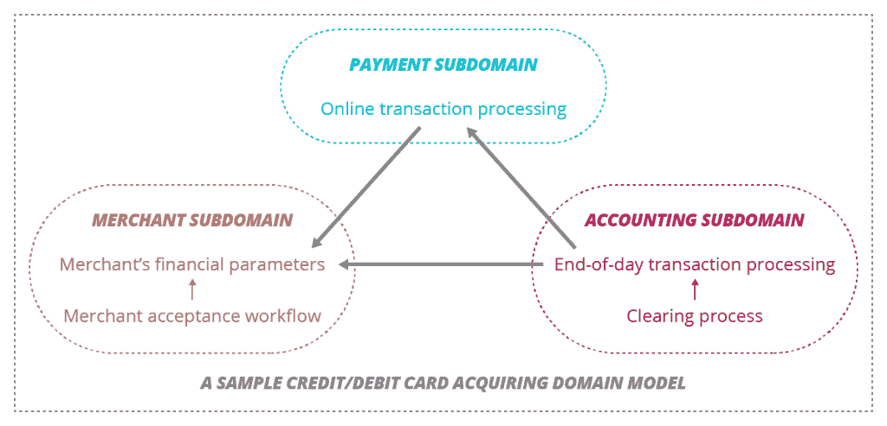
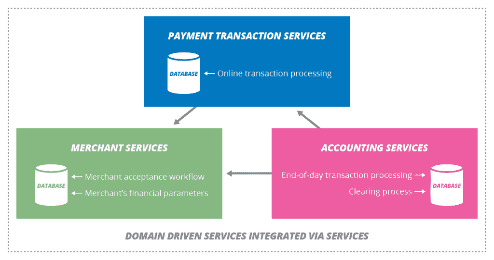

# 领域驱动设计如何帮助微服务架构的规划

> 原文：<https://thenewstack.io/domain-driven-design-aids-planning-microservices-architecture/>

全球 IT 咨询公司 ThoughtWorks 的软件开发人员 Berke Sokhan 主张回归服务架构的领域驱动设计。

他现在担心，谈论领域驱动设计(DDD)的光芒已经消退，DevOps 将很快转向下一个明智的想法，而没有真正利用 DDD 为微服务架构带来的机会:

> 因为它现在变得越来越老，炒作水平越来越低，我们许多人都忘记了 DDD 方法确实有助于理解手头的问题，并有助于设计对解决方案有共同理解的软件。

在应用程序开发中，DDD 将问题定义为域和子域。独立的步骤和问题区域被定义为有界的上下文。鼓励使用一种通用语言来定义实体、值对象和聚合路由规则。

Sokhan 说，这与微服务非常相似:目标是将单片应用程序分成多个独立的服务应用程序。对于那些没有在遗留系统的技术债务中挣扎的人来说，服务可以从一开始就使用有界上下文来创建。

在单一的遗留系统中，通过数据库集成各种服务的情况并不少见。

但是，随着越来越多的企业寻求一种灵活的方式来开发新的面向客户的产品和扩展现有的计划，通过数据库集成服务的架构阻止了水平扩展(因为他们需要添加更多的应用服务器来发展)，并最终需要通过将业务逻辑包含在一些数据库模型中来模糊业务逻辑。

索汗说，结果是，“向更好的架构的演变以单片应用程序的服务集成的形式发生。”

但是即使有了这些分离，业务开发的摩擦还是出现了，因为在数据库的深处是一堆代码，它们人为地将服务紧密地耦合在一起。多年来未记录的开发人员变通方法和补丁使情况变得更糟，这些方法和补丁在当时解决了一个特定的问题，但现在当后退一步并试图弄清楚为什么一个体系结构以这种方式串连在一起时，似乎完全没有意义。

Sokhan 建议使用领域建模来帮助公开这些紧密耦合的服务。他建议首先映射必要的应用程序功能，这是对理想场景的一种想象。从记录现有的应用程序架构开始太容易将开发人员带入一个他们再也无法爬上来的兔子洞:通过尝试检查代码来理解应用程序限制的上下文，开发人员太容易“迷失在杂草中”

Sokhan 使用了一个信用卡/借记卡域模型的示例:

在其核心，领域驱动的设计模型通过阐明潜在的分离点和展示一个领域内分离的有界上下文如何促进多个服务应用的开发，来帮助企业迁移到微服务架构。他还将它视为将业务和工程团队聚集在一起的工具。“一旦过渡到微服务架构(在域模型的帮助下)，DDD 和更细粒度的服务可以协同工作，相互支持，”索汗假设。

专题图片:[旧 TriMet 市中心地图 15K](https://www.flickr.com/photos/jmchuff/2301894318/in/photolist-4vpNZ5-9P6uej-9P3BPz-9P6urJ-9P6tKs-9P6qa7-9P3ChZ-9P6tgf-9P6tCh-9P3CpR-9P3CL2-9P3CTg-9P6sQy-9P6t61-9P6qgA-9P6uku-9P3xBv-9P3DDZ-9P3rWR-9P3Dvk-9P6u95-9P6sJs-9P3yVX-9P6vhJ-c8TQrC-d2BzuU-yHbTN-8kjgfr-8kjfhH-9P6jt9-9P3F9K-9P6xfd-9P3vze-9P3uw2-9P6AHq-9P6yMd-9P6CC7-9P6nqU-9P3v1k-9P6jWu-9P6mRC-9P3x68-9P6yAm-9P3xXp-9P3K8z-9P3Jaz-9P3xLM-9P6hsw-9P3sfk-9P3GCt) 作者[杰森·麦克哈夫](https://www.flickr.com/photos/jmchuff/)。根据 CC BY-SA 2.0 获得许可。

<svg xmlns:xlink="http://www.w3.org/1999/xlink" viewBox="0 0 68 31" version="1.1"><title>Group</title> <desc>Created with Sketch.</desc></svg>