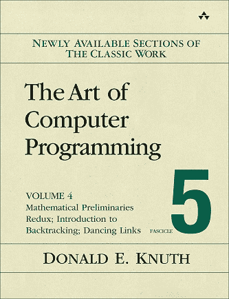
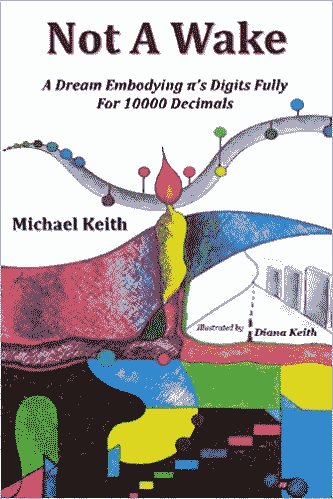
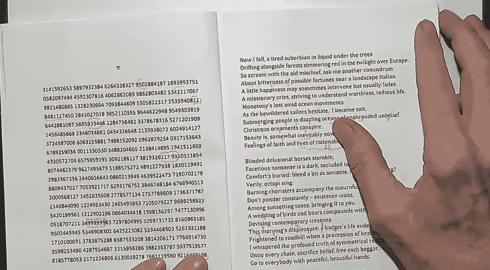
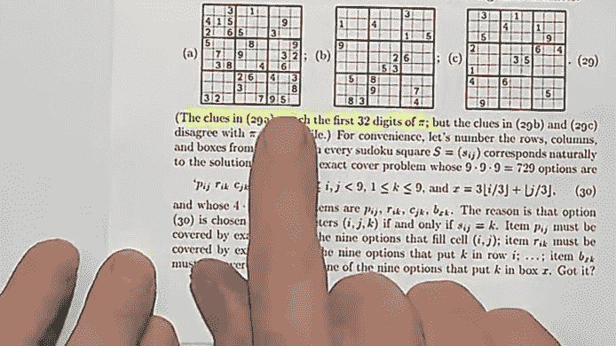
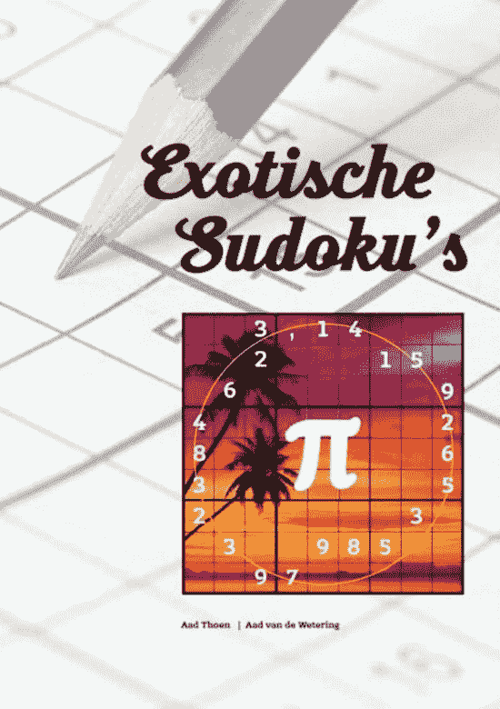
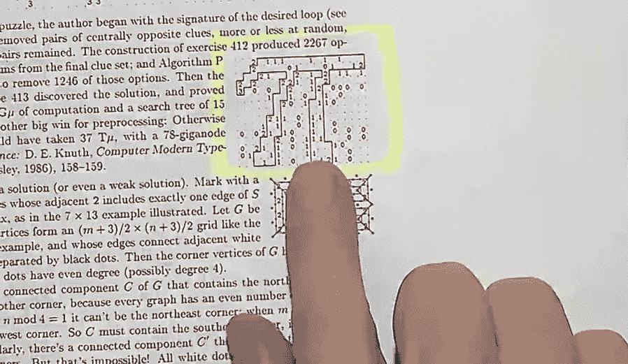

# 唐纳德·克努特 2019 年的“圣诞树讲座”在“计算机编程的艺术”中探索了圆周率

> 原文：<https://thenewstack.io/donald-knuths-2019-christmas-tree-lecture-explores-pi-in-the-art-of-computer-programming/>

四分之一个世纪以来，斯坦福大学伟大的计算机科学荣誉退休教授每年 12 月都会举办一场特别的“圣诞树”讲座。唐纳德·克努特(Donald Knuth)即将迎来他的 82 岁生日，他于 12 月 5 日再次出现在第 25 期年度节目中，并花时间提醒他的观众，他还在勤奋地写他在过去 57 年中一直在写的书。

那本书是《计算机编程的艺术》,被程序员们尊称为对算法最全面的分析。根据斯坦福大学的一个网页，这本书“被广泛认为是本世纪最好的科学著作之一”。“我的全职写作计划意味着我必须成为一个隐士，”[在他的个人网站](https://www-cs-faculty.stanford.edu/~knuth/retd.html)上写道。

因此，当这位伟人现场亮相时，这是一个加倍特殊的场合。

这里是*新书库，*我们有[自己的圣诞传统](https://thenewstack.io/donald-knuths-christmas-tree-lecture-on-dancing-links-and-organ-music/):好好看看——分享几张截图——来自 Knuth 的最新演讲。在 2017 年，我把它描述为“像在假期里拜访最喜欢的亲戚”和“一个看到伟大思想行动的机会。”

今年的讲座也不例外。

## **易如反掌**

Knuth 的讲座在 12 月 5 日举行，但直到 12 月 21 日星期六才发布。(截至周一，该视频的浏览量已经超过了 2000 次。)

[https://www.youtube.com/embed/3DKo219ZHMw?feature=oembed](https://www.youtube.com/embed/3DKo219ZHMw?feature=oembed)

视频

Knuth 还有另一个值得骄傲的理由，他举起刚刚出版的《计算机编程的艺术》附录来结束讲座。他把这本书描述为“我认为这本书非常有趣，顺便说一下，这本书还教授了一些算法。”

第 4 卷第 5 分册已于上月发行。

看起来 Knuth 自己也玩得很开心。“感谢大家的到来，”Knuth 告诉观众。“我猜你还没有厌倦我，”他开玩笑说，并补充道，“但我们要看看明年是否有人会出现……”

但是对于今年的讲座，Knuth 做了一些特别的事情。他向观众展示了，在过去的半个世纪里，他是如何在他的书中反复地将圆周率的数字运用到各种练习中。Knuth 告诉观众，他使用 Linux 工具 *egrep* 搜索了自己的书《计算机编程的艺术的全文，他发现 pi 这个词出现了多达 1700 次，“这意味着到目前为止，pi 可能在书中每五页出现两次。”他认为在他的例子中使用圆周率可以向读者保证算法真的会起作用，即使是在任意选择的一串数字上。

但没过多久，他的演讲就变成了一种知识界的娱乐场所，分享其他与圆周率有关的杂记，这些杂记往往令人惊讶，有时甚至令人难以置信。

他首先展示了数学家马丁·加德纳的《黑客帝国博士的数字命理学》一书*的封面，并分享了书中圆周率前 32 位小数的图表。Knuth 记得在 TAOCP 早期的一卷中包括了它，并引用了 Gardner 的论点，即当正确解释时，圆周率的数字传达了人类的整个历史。“在某种程度上，你可能会说，我生活的主要目的就是正确地解释圆周率的数字，”Knuth 告诉他的听众。"在一生中，完成什么更重要？"*

但是视频的描述狡猾地暗示，“这个讲座将检查这些数字的许多解释，包括正确的和不正确的。”

不久，Knuth 分享了一种记忆圆周率的第一个数字的记忆装置。通过计算短语中每个单词的字母数，可以得到它的第一个数字，即 3.14159265358979:

“在听完涉及量子力学的沉重讲座后，我多么需要喝一杯——当然是酒精饮料。”

接下来，他展示了一本书，他称之为“欧利皮文学的伟大成就之一”——一种作家遵循严格(有时是数学)约束的文学形式。它的标题？

*不是醒来:一个梦，将圆周率的数字完全具体化为 10000 位小数*

书名中每个单词的字母数又与圆周率的前几个数字完全对应，Knuth 高兴地读着这本书的封底。“这是一部戏剧，一个故事，现代诗歌和其他作品中的幻想，无一例外地遵循教科书中的数学主题……”这句话也使用了每个词的长度都与圆周率中相应的数字相匹配的词。“在这本书里，”Knuth 补充道，“他做了 10，000 个数字。”然后他在读这本书的第一页诗…

*“现在我倒下了，一个疲惫的郊区居民在树下的液体中漂流
在欧洲的暮色中，沿着森林慢慢变红……”*

数字 0 用 10 个字母的单词表示，11 可以用 11 个字母的单词表示。“这是他称之为 *Pi-lish* 的语言，”Knuth 笑着说。圆周率中连续出现六个 9 的著名数列呢？这位诗人写道:

无可指责的，不流血的，无罪的，无休无止的，无限的。”

当 Knuth 继续热情地翻阅这本书时，他的观众鼓掌了。有散文、短诗、警句，甚至还有一部电影剧本——配有对话——是一部名为 *Zompyr Chronicle* 的科幻史诗。每一个单词都有正好和它对应的圆周率数字一样多的字母。

"然而，真正的杰作是一个纵横字谜……"

等等，什么？是的，虽然仍然严格遵守圆周率的每个数字所指定的单词长度，但那本书的一页突然提供了一个纵横字谜的线索——随后是一页可以输入答案的实际网格。它的标题暗示，答案词包括单词首字母互换的书名——果然，沃尔特·惠特曼的经典作品《情人的格里夫斯》和詹姆斯·乔伊斯的开创性小说《温尼根的赝品》都有线索和答案

在书的后面，甚至有一首完美的莎士比亚十四行诗…

然后 Knuth 透露在他自己的书《计算机编程的艺术》4A 卷的索引中有一个关于圆周率的特别微妙的参考，“然后你必须弄清楚 382 页上的圆周率看起来像什么。”答案？

*+00++-++-000-*

它是“也许是所有数字系统中最奇妙的”圆周率——平衡的三进制数字系统，它使用符号 0、+和–来表示以 3 为基数的系统中的数字。

## **莫名其妙用圆周率**

最后，Knuth 转向新出版的第 4 卷第 5 分册的出版前厨房，说如果你翻到任何一页，你可能会发现一个谜题，“因为事实证明，我在这里描述的这种算法最好通过它们与谜题的联系来说明。”这本书的重点不是如何*解决*谜题，“而是如何*创造*谜题。”举个例子，他随意地向观众展示了一个他创造的数独游戏，其中已经填好的数字是 3，1，4，1，5，9…

"我可以把圆周率的前 32 个数字存在里面."

你能用超过 32 位数的圆周率做数独游戏吗？不——原因很简单，圆周率的第 33 位数字是零，这是数独游戏中从未使用过的一位数。

但接下来，他展示了一本名为 *Exotische Sudoku* 的书的封面——这本书不仅在数独游戏中使用了圆周率的数字，甚至[还将它们排列成了一个圆圈](https://www.bol.com/nl/p/exotische-sudoku-s/9200000055151293/)。这是一本充满数独谜题的书，仅使用圆周率的数字作为填充线索，同时还要遵守一个额外的约束条件——解决方案中九个正方形的两条对角线必须*和*每个数字恰好包含一次。

Knuth 还展示了两个包含棋子的拼图示例。在“骑士数独”中，解决方案的每一行、每一列和每一个盒子都正好包含三个骑士。线索将只显示一些骑士，以及一个揭示他们最终能够攻击多少其他骑士的数字——当然，Knuth 构建了一个谜题，其中这些数字是 3，1，4，1，5…

然后还有一个使用*象*的类似谜题——当然，完全相同的圆周率衍生数字。

然后他去了肯肯谜题，在那里每组相邻的方块中的数字将组合起来给出它的特定解(使用特定的数学运算符)——在克努特的版本中，线索数字是 3、14、15、9、2 和 6……有一个卡库罗谜题——一种用数字做的纵横字谜——克努特要求他的读者设计一个答案将是 31、41、59、26、53、58、97 的谜题。甚至还有一个 Hidato 难题——将连续的数字放在一个网格上，但只能放在相邻的方块上(水平、垂直或对角)。Knuth 向他的读者挑战，只用圆周率的数字来创造这样一个难题。

这是一种非凡的方式来证明算法真的适用于任何一组数字——甚至是 3.141592。但在他的压轴戏中，Knuth 揭示了可能是所有谜题中最引人注目的谜题——slitherlink 谜题，这种谜题挑战其勇敢的解答者在网格中绘制一条连接点的连续线，同时只接触由正方形的编号指定的点的“正方形”的边数。Knuth 的书问读者在一个特殊的 slitherlink 谜题的解答中隐藏着什么惊喜？

当 Knuth 揭示了这个令人瞠目结舌的谜底时，他赢得了长时间的掌声。

“非常感谢，”他得意洋洋地告诉观众。

"圣诞快乐"

<svg xmlns:xlink="http://www.w3.org/1999/xlink" viewBox="0 0 68 31" version="1.1"><title>Group</title> <desc>Created with Sketch.</desc></svg>