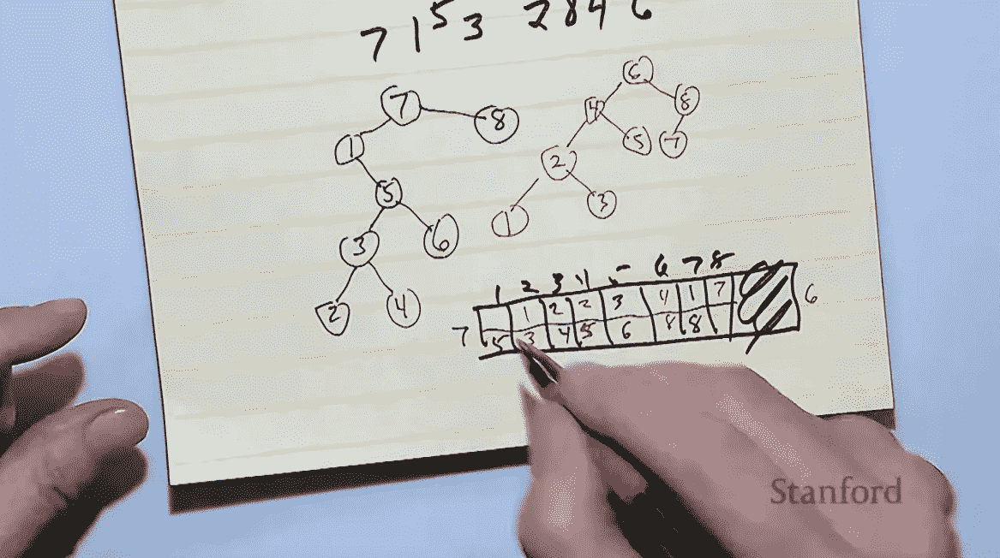

# 唐纳德·克努特 2022 年的“圣诞树”演讲是关于树的

> 原文：<https://thenewstack.io/donald-knuths-2022-christmas-tree-lecture-is-about-trees/>

今年，2022 年是 1962 年那个决定性的一天的 60 周年，当时 24 岁的唐纳德·克努特开始写“[计算机编程的艺术](https://www-cs-faculty.stanford.edu/~knuth/taocp.html)”现在，Knuth 接近 85 岁生日，几乎已经成为计算机编程界的一个传奇——他还在为他的大量算法分析撰写额外的书籍。

但是每年圣诞节前后，[会有](https://thenewstack.io/donald-knuths-christmas-tree-lecture-addresses-curious-problem-combinatorial-geometry/) [另一个](https://thenewstack.io/donald-knuths-christmas-tree-lecture-on-dancing-links-and-organ-music/) [传统](https://thenewstack.io/donald-knuths-2019-christmas-tree-lecture-explores-pi-in-the-art-of-computer-programming/)。Knuth 为斯坦福大学(Knuth 是该校名誉教授)的一小部分观众和更多的在线观众做了一场“针对非专业人士”的特别讲座。因为疫情，Knuth 已经有三年没有这个传统了。

所以今年的观众对 Knuth 有一种额外的期待感。

## 树木的魔力

Knuth 俯身看着一个记事本(它被投影到他身后的一个屏幕上)，开始了第 26 届年度圣诞演讲，他指出，晚上的主题已经隐藏在众目睽睽之下 20 年了。在最初的 20 年里，他们称之为“圣诞树”讲座，因为“树对计算机科学家来说是最重要的东西之一”。每年我都学到至少两件关于树的新的很酷的事情……”

大约五年前，他们把名字改成了“圣诞讲座”——但问题不是树不再有趣了。“我每年还会学到一些关于树的很酷的东西。但是他们越来越难向普通观众解释了！”

因此，今年成功的“回家”讲座确实会包括树木——特别是 Knuth 描述为“孪生树”的现象，以及 Baxter 排列和平面图。Knuth 指出，这些都是在最新一卷《计算机编程的艺术》中涉及到的话题，然后开玩笑地提醒观众，他的书是一份很好的圣诞礼物。

他笑着补充说，“从一个讲师的角度来看，当你有自己喜欢谈论的东西时，总是最好的。”

Knuth 从向观众介绍二叉树开始，二叉树是一种熟悉的分支数据结构，当你向下工作时，每个节点可以有两个更低的节点(一个左边和一个右边的“子”节点)。但随后他向观众展示了“50 多年来我最喜欢的算法之一…二叉树插入。”如果数据比键值低，就在左边的分支中插入数据，如果比键值高，就在右边的分支中插入数据。

为了生成一个真正随机的序列，他会让观众大声喊出这些数字应该出现在 8 个数字的序列中的哪个位置——然后在他的记事本上把这些混乱转换成一棵整齐的二叉树。

但是，然后以相反的顺序遍历这些相同的数字，Knuth 神奇地产生了一个互补的第二二叉树——当你在单个图表上写出两棵树的每个父节点的子节点时，没有重叠。

Knuth 演示了如何使用红色墨水书写一棵树的子节点，然后使用绿色墨水书写另一棵树的子节点:

罕见？几乎没有。Knuth 分享了一个惊人的计算，即有超过 10，000 个八节点孪生树。“这个树插入算法是我从 20 世纪 60 年代中期就开始研究的东西，”Knuth 告诉惊讶的观众，“我已经在无数的计算机程序中使用了它。

“但我从来没有——过了 50 年，我才明白它同时也给了我孪生姐妹！”

## 小号和大号

下一个数学珍品是巴克斯特排列，这是一种数列，Knuth 给出了一个非常简单的定义。如果任何固定数字 *k* 和 *K + 1* 上面的数字是“大”，下面的数字是“小”，那么在百特排列中，“我不能有一个大后面跟着一个小。”(反之亦然。如果在序列*中，k* 在较大的 *k + 1* 之前，那么“我不能让一个小的跟着一个大的。”)

Knuth 提供了一个例子——但随后又玩起了分支。

颠倒数字的顺序总是会产生另一个百特排列。你也可以通过给序列中的每个数字加上一个常数来产生另一个巴克斯特排列。如果这个常数等于或大于你的序列的最大值，那么你可以通过在你的原始序列上追加*这个序列来产生一个更长的 Baxter 排列。(或者甚至由*前置*-待定序列。)*

所有这些场景都保留了巴克斯特序列最初的独特性质，Knuth 向观众重申。无论你选择哪一对由 1 分隔的数字来进行测试，“所有的小家伙都将首先出现，大家伙随后出现。”

Knuth 提出了最小可能的*非巴克斯特*排列——3，1，4，2。他称之为“圆周率变异”，因为它是圆周率的四位数近似值。

这些年来，Knuth 发现，当测试关于排列的猜想时，“如果猜想是错误的，它几乎总是在π突变时失败。”序列的反转也不是巴克斯特排列——仅有的两个这样的失败序列(在 24 个可能的序列中)。

## 三个漂亮的算法

当晚的最后一个主题是平面布置图——一种看起来很熟悉的将矩形分解成更小的子矩形的方法。(或者，这是平面图，分成“房间”)作为题外话，Knuth 指出，这种建模在制造硅芯片时变得很重要——在那里“房间”变成了模块或逻辑门。

然后他问了一个挑衅性的问题:两个平面图相同意味着什么？

Knuth 重新安排了他在 X 轴和 Y 轴上的坐标名称的顺序，然后画了另一个平面布置图，其中矩形相对于彼此保持相同的位置。(“我还不如把整件事都写下来，因为这会在网上流传，”Knuth 曾开玩笑说。)

这个特殊的平面布局遵循了榻榻米的条件——没有四个不同的矩形在一个点相遇的“四角”点。Knuth 展示了绘制平面图的替代方法——这使他进入了他的压轴表演。"这与双树和巴克斯特排列有什么关系？"

令人惊讶的是，当使用最后一种制图方法时，*每一个*百特排列的数字序列都会给你一个有效的平面布置图。按照同样的顺序，先向前后向后，总会得到一对孪生二叉树——你猜对了——它们又是完全互补的。(当您将两棵树的每个父节点的子节点写在一个图表上时，没有重叠。)

“你给我一个巴克斯特排列，我可以告诉你平面图是什么。你给我一个平面图，我可以告诉你孪生树是什么，你给我一个孪生树，我可以告诉你产生它的独特的巴克斯特排列是什么！”

正如 Knuth 在他的网页上解释的[，“三个迷人的概念，起初看起来完全互不相关，实际上是通过三个美丽的算法一一对应的。”](https://www-cs-faculty.stanford.edu/~knuth/musings.html)

Knuth 编写了执行所有操作的程序——比如将 Baxter 排列转换成平面布置图的程序。(“如果你给它一个不是巴克斯特排列的排列，”Knuth 告诉观众，“它会嘲笑你，说‘太糟糕了。你输了。这不是巴克斯特排列！”)他甚至使用 Unix 管道发送一个程序的输出，作为下一个程序的输入——“当然，我得到的是我开始的那个程序。"

`> baxter-to-floorplan | floorplan-to-twintree-ttform | twintree-to-baxter`

经过 60 年的写作，以及一生对数学算法的探索，Knuth 抬起头来，发现自己已经超过预定时间 10 分钟了。然后他开玩笑说他很高兴。“我原本预计会超过 20 分钟。”

“谢谢你们的倾听，我准备好回答问题了。”

[https://www.youtube.com/embed/zg6YRqT4Duo?feature=oembed](https://www.youtube.com/embed/zg6YRqT4Duo?feature=oembed)

视频

* * *

# WebReduce

<svg xmlns:xlink="http://www.w3.org/1999/xlink" viewBox="0 0 68 31" version="1.1"><title>Group</title> <desc>Created with Sketch.</desc></svg>