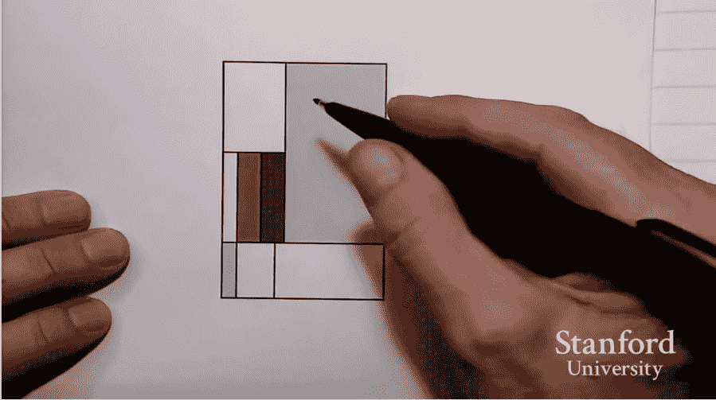
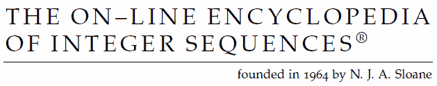
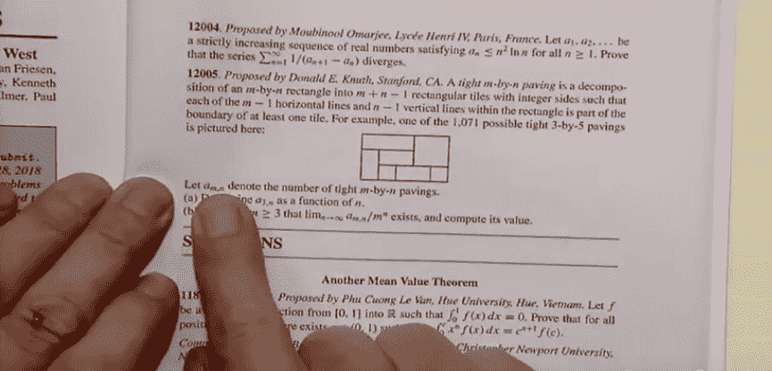
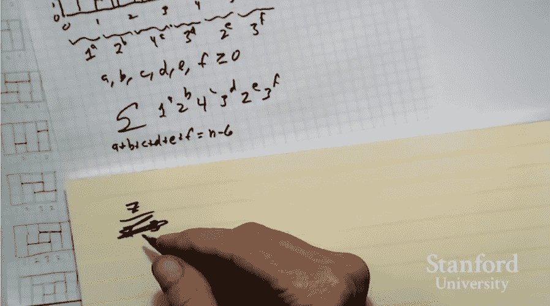

# 唐纳德·克努特的圣诞树讲座解决了组合几何中的一个“奇怪问题”

> 原文：<https://thenewstack.io/donald-knuths-christmas-tree-lecture-addresses-curious-problem-combinatorial-geometry/>

1962 年，24 岁的唐纳德·克努特开始写“计算机编程的艺术”*——他现在仍在写作。根据斯坦福大学(Knuth 是该校名誉教授)的一个网页，这本书在程序员中备受尊崇，被“广泛认为是本世纪最好的科学著作之一”。*

 *这又是一个例子，说明一个人对他的手艺的投入可以为其他人留下有形的材料遗产。

以下是斯坦福大学的一个网页对克努特遗产的总结。Knuth 提出的“有文化的程序设计”基本上认为，开发计算机程序应该着眼于人的理解，而不是计算机的可读性。他坚持认为，将自己的作品清楚地传达给其他人这一行为本身就会提高作品的质量。克努特个人网站的常见问题部分甚至[解释说](http://www-cs-faculty.stanford.edu/~knuth/retd.html)“我提前退休是因为我意识到我需要 20 年的全职工作来完成《计算机编程的艺术》，这是我一直认为是我生命中最重要的项目……

“我的全职写作时间表意味着我必须成为一名隐士……”

然而上周，79 岁的他出现在斯坦福做了一个新的“圣诞树”讲座。这是一年一度的传统，Knuth 在他的“电脑沉思”博客上展示了[。](http://www-cs-faculty.stanford.edu/~knuth/musings.html)

*“不收学费，不考勤，不学分。每场演讲都独立于其他演讲，面向非专业观众……我试图通过强调动机、范例和高层次的画面，最大限度地减少行话和复杂性，而不是完全掩盖细节。”*

或者，[正如 i-Programmer 网站描述的那样](http://www.i-programmer.info/news/112-theory/11385-donald-knuths-christmas-tree-lecture-2017.html)，“12 月，唐纳德·克努特(Donald Knuth)穿上华丽的套头衫，发表一场公开演讲，如果可能的话，以某种树形结构为特色，这是斯坦福大学的一个既定传统。”

对一些人来说，这就像是在假期拜访最喜欢的亲戚。这也是一个机会，看到一个伟大的思想在行动。

[https://www.youtube.com/embed/BxQw4CdxLr8?feature=oembed](https://www.youtube.com/embed/BxQw4CdxLr8?feature=oembed)

视频

讲座的公告将其描述为“组合几何中的一个奇怪问题。”但它也让我们得以一窥一位开创性数学家的生活——以及他对自己的学科有多热爱。“当我有一个好故事要讲时，也总是很有趣。”Knuth 开始。

他演讲的题目是“一个必须为真的猜想”，但他也分享了一个热情的副标题。“为什么做研究这么有趣。”他以 4 月份想到的一个例子开始，这个例子即将更新为“计算机编程的艺术”。今年，他在写一种叫做“跳舞链接”的数据结构，他把它扩展到了艺术世界的一个数学问题。

蒙德里安的画以矩形中有矩形而闻名——“当然，这是一种早在蒙德里安之前人们就已经在研究的模式。”但是矩形中的矩形有什么模式吗？

Knuth 解释说，人们认为数学家已经解决了所有的问题，但是“它们每年都会出现几次。这就是一个例子。”他一头扎进去，试图将矩形中的矩形图案缩小成数字。(“我是一个以整数为导向的人，所以我想把这个转换成我更理解的东西。”)

Knuth 创造了他所谓的“简化模式”，他画了一个网格，每个坐标代表假想线与矩形的至少一个角相交的地方。

在草草画出一个“简化模式”图，最终创建了一个非常粗糙的网格后，当他真诚地说，“好吧，实际上，只要看看这本书”时，他再次赢得了观众的热烈笑声。然后用手指指向页面上一个完美绘制的图表。“那么，这就是了。”

但是矩形中的矩形的最小数量是多少呢？他警告说这有点棘手，因为“有很多错误的方法可以得到答案。”(正确答案是`n + n -1`，“所以在这种情况下，七。三加五减一。”)他称这是一个“紧密铺设”矩形的例子——紧密是因为它达到了可能的矩形数量的下限(同时仍然至少使用网格中的每条垂直和水平线条一次)。

他即将教给他的观众一些非常有用的东西——但首先，他要让他们发笑。“现在每个人都知道互联网是找到任何主题的绝佳资源——所以我用谷歌搜索了‘紧密铺设’,下面是它向我展示的内容。”他调出了建筑工地的图像。

"换句话说，我知道没有人在数学讨论中使用过“紧密铺垫”. "观众又笑了。

但现在真相大白了。“在过去的 30 年或更长的时间里，有一种奇妙的工具可以解决这种形式的各种问题，而且它已经在线很长时间了。”他向观众介绍了在线整数序列百科全书 (一个如此古老的网站，单词“在线”仍然用连字符连接。)“这是自数学切片以来最好的事情，因为你通过计算进入了文献。如果你想知道是否有其他人研究过某个问题，你所要做的就是评估它的前几个案例，然后你去查，就有了。”

但是故事还没完。“这不仅是一个伟大的资源，而且事情策划得很好。我的意思是，一天之内我就有七个人评论它，你知道，改进我的演示文稿，检查一切。所以 OEIS 真是太棒了。”这很重要，因为他在 OEIS 大学的论文中说有“一个简单的生成函数，和一个简单的封闭形式”来产生整数序列——但是因为他已经把这个问题提交给了美国数学月刊*的*，要求读者计算正确的答案，所以只有在杂志发表了答案之后才能揭晓。Knuth 指出这是一个巨大的讽刺。

“从他们发表文章的方式来看，我似乎能够解决这个问题。”

Knuth 已经确认“这种美丽的图案”适用于矩形中的小矩形网格——但是这就足够了吗？“这个故事有一个快乐的结局，”他说，“因为沃尔特·斯特罗姆奎斯特是这个问题的裁判，编辑非常喜欢这个问题，他甚至告诉了我裁判的名字，并让我与沃尔特·斯特罗姆奎斯特通信”——而幸运的是，斯特罗姆奎斯特找到了一个证据。

但是对我们所有人来说，还有一个更大的教训…

Knuth 分享了一个关于 19 世纪数学家(兼牧师)Thomas Penyngton Kirkman 的有趣故事，他因 Kirkman 女学生问题而闻名。柯克曼还研究了一种被称为“三重系统”的数学现象，当克努特看一篇数学论文时，有趣的事情发生了。它用公式概括了三重系统，他声称这些公式是正确的。但是当我看到他的推理是什么——为什么是真的——基本上是上帝不想让公式比我的更复杂。”

“所以他没有真正证明他的公式……他只是说它必须是真的。因为很难让*相信*这可能是假的。”

这种情况比你想象的更常见。Knuth 记得他曾经分析过因子分解算法，确定一个随机数的最大因子的平均大小到第 20 位小数。他发现了一个公开发表的解决方案”，但在第 16 位小数中不同意。所以这里我有一个非常自然的数学问题，它符合一个非常自然的数学表达式——最多 16 位小数，然后它失败了。

一周以来，他一直在探索数学之谜，却没有发现差异来自哪里。“最后，事实证明我的程序是正确的，但我使用了一个数值积分公式，只有当你要积分的函数的四阶导数连续时，这个公式才是正确的。这个特殊的函数有一个不连续的四阶导数

然后他耸了耸肩，做了一个“你要做什么”的手势——观众同情地笑了。

“还有一次，我在分析二进制欧几里德算法……”

实际上，这是一个关于另一个数学家的分析的故事，但它建立在同一个教训上。“仅仅因为你在很多地方达成了一致，并不意味着这个猜想一定是真的。我已经看到它是双向的。”

但是他的长篇大论以给听众上的又一课结束。“这是研究的方向。当你找到证据时，你会开心几天。

"当然，第二天你会发现另一个问题."

*唐纳德·克努特的博客最近宣布，过去讲座的录像带正在被数字化并在网上分享。节日快乐！！*

* * *

# WebReduce

<svg xmlns:xlink="http://www.w3.org/1999/xlink" viewBox="0 0 68 31" version="1.1"><title>Group</title> <desc>Created with Sketch.</desc></svg>*