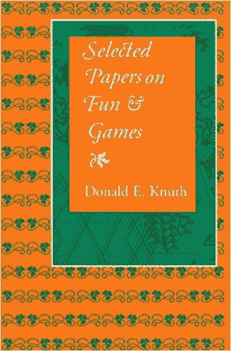
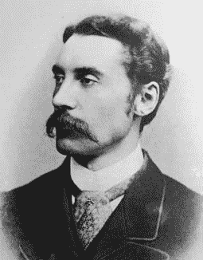

# 唐纳德·克努特关于跳舞环节和管风琴音乐的圣诞树讲座

> 原文：<https://thenewstack.io/donald-knuths-christmas-tree-lecture-on-dancing-links-and-organ-music/>

在过去的 24 年里，计算机科学传奇人物唐纳德·克努特一直在斯坦福大学发表年度圣诞演讲，他是那里的荣誉退休教授。在过去的几年里，视频已经开始悄悄地出现在网络上，让世界上的其他人观看，这几乎就像是在假期拜访一位老朋友。

“上帝，我爱这个人，”YouTube 上的一位评论者写道，并补充道，“继续努力，唐！”

《纽约时报》上周将这位受人尊敬的 80 岁数学家描述为“硅谷的尤达”和“算法领域的精神领袖”公平地说，Knuth 实际上写了一本关于算法的书——特别是他的杰作，“计算机编程的艺术”，在过去的 56 年里，他已经分期出版了这本书。1993 年，55 岁的 Knuth 退休，专注于最终完成它。他说他还需要 25 年才能完成这本书——尽管《纽约时报》指出他已经说了将近 40 年了。

12 月 4 日星期二，这位 80 岁的数学家再次走进斯坦福大学黄工程中心的英伟达礼堂——穿着他传统的圣诞毛衣。“今晚我将谈论一些技术性的东西，”他告诉他的观众，“但主要是展示和讲述。”(意思是他会很快演示一些东西，诱使他的观众稍后去查阅。)

[https://www.youtube.com/embed/_cR9zDlvP88?feature=oembed](https://www.youtube.com/embed/_cR9zDlvP88?feature=oembed)

视频

讲座给人一种节日的感觉——就像一场期待已久的活动。他正在谈论“跳舞”链接的圣诞主题，这个想法最初是在 1979 年发明的，但后来由 Knuth 在 2000 年发表的一篇论文中推广开来，并在那年的年度圣诞讲座中，“在这个特殊的房间建成之前。”他将其描述为“一个如此简单的想法，你可能会说，‘怎么会有人谈论这个想法超过五分钟？’"

它扩展了链表的基本计算概念——一个数据结构序列，不仅包含值，还包含序列中下一个和上一个值的位置。如果您将数据网格描绘成行和列，那么每一行(或列)都可以用一个链表来表示。经典的问题是选择行的子集，这将使您在每一列中都有一个值，但没有重复。Knuth 画出了一个网格，然后提出了一个令人惊讶的简单技术来寻找解决方案。“当你看着它时，就好像计算机中的这些数字在遵循一种优雅编排的舞蹈，这就是为什么我称之为舞蹈链接。”

很明显，他真的很喜欢算法，Knuth 承认他就像一个在圣诞节得到新玩具的孩子。“因为我有这种跳舞链接的技术，我可以用它来解决我从未想过我会在有生之年解决的问题。”然后，他警告观众说，不幸的是，“这完全与深度学习正交”，这引来了笑声和掌声

Knuth 已经为他的书的下一部分写了 350 页。他还提到了他的另一本书——“关于娱乐和游戏的精选论文”——“这是一本非常棒的圣诞礼物。”

但他很快转向解决其他问题的类似算法。他展示了一张图片，展示了有 13 种解决方案的管理难题。他跳到了 1892 年 P.A .麦克马洪的三角形拼图。然后，他讲述了 1964 年斯坦福大学人工智能实验室的故事，当时该实验室进行了有史以来第一次大型计算——记录麦克马洪平方问题。(运行 40 个小时后，斯坦福的研究人员计算出有 12261 个解。)Knuth 告诉他的听众，这是一个“在整个 20 世纪 60 年代的许多出版物中”重新发表的事实，并补充说“事实证明这是错误的。”

这让你觉得做唐纳德·克努特一定很有趣。在他演讲的最后，他谈到了鹧鸪问题——这样命名是因为数学家鲍勃·温赖特想到了“圣诞节的十二天”这首歌中的数字模式。甚至单词搜索谜题也出现了，因为 Knuth 大声地想知道他是否应该为下一次圣诞节演讲留些东西。他涉及音乐、多米诺骨牌、着色问题、字母树——甚至像 KenKen 和 Kakuro 这样的数独游戏。大约一个小时后，他开始玩一个我童年时就记得的圣诞礼物——一个[Soma cube](https://www.fam-bundgaard.dk/SOMA/NEWS/N160817.HTM)——据说是第一个被渲染的非方形物体。

## **其他兴趣**

除了算法，Knuth 还对《蜉蝣》的广泛领域感兴趣。2012 年，Knuth 和他的妻子悠闲地驾车穿越俄亥俄州，拍摄他们在高速公路上看到的每一个菱形高速公路标志。他们现在是拥有 1150 张照片的[的一部分](https://cs.stanford.edu/~knuth/diamondsigns/diam.html)——有些照片是粉丝在网上提供的——每张照片都有他们的 GPS 坐标。

《纽约时报》甚至追溯到更远的地方，包括年轻的唐纳德·克努特抱着一只黑猫的感人照片，或者是他 19 岁时写的刊登荒谬的“波特兹比度量衡系统”的《疯狂》杂志。61 年后，我们生活在这样一个世界里，谷歌已经[实现了从 Potrzebie 系统](https://www.google.com/search?ei=Q9T4WZPBHYuB0wLR1rfICA&q=3+potrzebie+%2F+2+ngogn&oq=3+potrzebie+%2F+2+ngogn&gs_l=psy-ab.3...216750.220355.0.221077.0.0.0.0.0.0.0.0..0.0....0...1.1.64.psy-ab..0.0.0....0.d50B9hpie1k)的转换，作为其搜索引擎的一部分(这显然是他们[10 年前](http://fubar.school.nz/techblog.php?action=show&id=25)为庆祝 Knuth 的 70 岁生日而推出的功能)。

《纽约时报》回忆说，高中毕业后，出生于密尔沃基的克努特在凯斯西储大学学习，“在这门学科存在之前，他就成为了一名计算机科学家。”他甚至管理篮球队，管理他通过 IBM 的一台大规模生产的计算机 IBM 650 收集的统计数据——IBM 新闻短片称赞“学生数学家唐纳德·克努特”帮助他的“电子教练”的壮举。

[https://www.youtube.com/embed/dhh8Ao4yweQ?feature=oembed](https://www.youtube.com/embed/dhh8Ao4yweQ?feature=oembed)

视频

据《泰晤士报》报道，通过编写编译器，他已经比他的教授挣得多了。但也许他的根源可以追溯到更远。克努特的父亲曾是一名教师——在当地高中教簿记——还拥有一家印刷企业，这预示着他儿子未来的一些兴趣，包括 20 世纪 70 年代在数字排版方面的开创性工作。

根据一本传记，克努特的父亲[也演奏风琴](https://books.google.com/books?id=-0tDZX3z-8UC&pg=PA90&hl=en#v=onepage&q&f=false)——周日的克努特会看到他的父亲在他们的教堂演奏风琴。传记作者写道，“唐纳德继承了他父亲对音乐和教育的欣赏，尤其是语言模式。”[另一本传记](https://books.google.com/books?id=-0tDZX3z-8UC&pg=PA90&hl=en#v=onepage&q&f=false)引用克努特的话说“数学是模式的科学。音乐是模式。”

20 世纪 50 年代，十几岁的克努特甚至想过从事音乐事业，但二战后，“这个体系把任何有科学天赋的人都引导到了物理领域。”他获得了凯斯西大学的全额奖学金，在那里他的兴趣开始改变。"他很快意识到，比起物理，他更喜欢数学，尤其是离散数学领域."最终，他获得了加州理工学院的博士学位，在那里他开始以副教授的身份工作，并探索计算机科学的新领域。“许多发表的论文完全是错误的……所以我的动机之一是把一个被讲得非常糟糕的故事讲清楚。”

但他从未停止对音乐的热爱。他的房子甚至有一个音乐室，里面有一个定制的 812 管管风琴。今年 1 月，他 80 岁了，这是一个为期三天的研讨会，题为“ [Knuth80:算法、组合学和信息](http://knuth80.elfbrink.se/program/)”，在瑞典城市皮特奥举行。克努特在他的网站上写道[，称这次活动“无疑是我生命中最大的亮点之一”。他说:“我无法充分感谢所有为这次活动做出巨大贡献的人们。”可能是因为这一事件随着他为管风琴创作的新多媒体作品](https://cs.stanford.edu/~knuth/news.html)[“启示录幻想曲](http://www-cs-faculty.stanford.edu/~knuth/fant.html)*”的全球首演而达到高潮，Knuth 将其描述为 50 年的制作过程。*

 *[https://www.youtube.com/embed/_gRD9k_impU?feature=oembed](https://www.youtube.com/embed/_gRD9k_impU?feature=oembed)

视频

安大略省第一联合教堂的荣誉退休管风琴师简·奥弗丁(Jan Overduin)在一段视频中解释说，这首曲子充满了有趣的智慧转折，他称之为“对古代《启示录》的某种直译”例如，在某个地方有一段巴赫清唱剧的摘录——但是旋律是反向播放的。“幻象预言了未来——未来的事件——所以时间正在被逆转。颠倒的，颠倒的。”甚至还有天启四骑士的特别音乐。“如果是一匹白马，它会在白色的琴键上演奏，”奥弗丁解释道。“如果它是一匹黑马，它将在黑键上演奏…

“一匹红色的马，或者说是一匹苍白的马——嗯，那就有点棘手了。不过，我给你个提示。为了红马？”他弹了一段欢快的曲子，然后转向镜头严肃地说:“圣诞老人。”

克努特将在知识共享许可(CC0)下向全世界发布他的杰作——“不保留任何权利。”

<svg xmlns:xlink="http://www.w3.org/1999/xlink" viewBox="0 0 68 31" version="1.1"><title>Group</title> <desc>Created with Sketch.</desc></svg>*