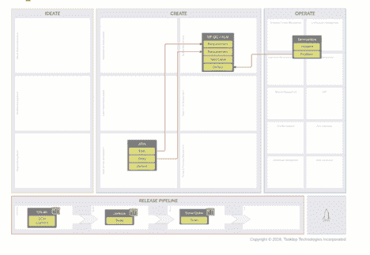

# 不要被最新的工具整合浪潮所诱惑

> 原文：<https://thenewstack.io/dont-be-seduced-by-the-latest-wave-of-tool-consolidation/>

 [肖恩·明托

肖恩·明托是 Tasktop 的技术服务和支持高级总监。他是 Tasktop 团队的原始成员之一，在 Tasktop 成立之前，他曾与首席执行官 Mik Kersten 在 Mylyn 上共事。Shawn 的职业生涯始于 Tasktop，他是一名软件工程师，负责产品开发的各个方面。他利用自己在工具、流程和产品方面的专业知识转变为面向客户的角色，与客户一起了解他们的工具环境，并为他们的长期部署提供最佳指导。](https://www.tasktop.com) 

在简化企业软件交付过程的永恒的激烈竞争中，很自然地，又一波工具整合的浪潮正席卷企业 it 领导者的办公桌。数字破坏的龙卷风正迫使成熟的组织做出灾难性的反应，因为他们疯狂地寻求创建软件驱动的商业模式，以与科技巨头的寡头垄断竞争。

来自整个工具领域的供应商正在提出解决方案，承诺单一平台体验，使团队能够管理从构思到操作的整个价值流。然而，历史不言自明；以前任何整合支持复杂流程的工作流的尝试都失败了。

Mik Kersten 博士在[项目到产品](http://projecttoproduct.org/)中写道:“软件交付对于一个工具、一个团队甚至一个组织来说太复杂了。相反，精英企业的成功表明，重点应该放在为利用最佳工具链奠定基础上，该工具链:

*   最大限度地发挥最新尖端工具的价值。
*   支持不断增长的专业 IT 团队网络。
*   支持适应性、模块化的基础设施，能够响应不断变化的业务和市场性质。

## 单一工具谬论

当我们倾听和学习过去时，我们也必须倾听现在；到 2022 年，全球应用开发和部署市场的价值预计将接近 3.5 亿美元。工具领域的多样性和广阔性是有原因的。正如没有一个医疗从业者、流程或技术可以治疗整个人体一样，也没有一个工具可以满足参与软件规划、构建和交付的不断变化的 IT 员工的所有需求。很多“为什么”可以从 IBM Rational 的兴衰中找到。

在 80 年代，IBM Rational 作为一个复杂而有效的工具链，帮助 IT 部门跟踪他们的软件生命周期。它具有大型软件计划的可见性、控制力和可预测性。但是随着软件开始蚕食这个世界，Rational 的瀑布模型太慢了，跟不上一个被对数字体验不断增长的需求所改变的经济。敏捷和 DevOps 的出现是为了加速价值流的创建和发布阶段，以提高产品的质量和上市时间，以及产品的持续改进(随之而来的是工具的寒武纪大爆发，以支持正在出现的无数专业角色)。

由于软件已经扩展并直接影响了更多的业务领域，我们已经看到跨学科、团队、部门甚至组织的利益相关者稳步增加。他们都有自己的需求、目标、流程和工具，与他们在产品价值流中的份额相关。当你深入研究这些不同的团队和领域，以及它们是如何相互联系和协作的，你就会明白为什么没有一个工具可以管理这样一个创造性的、技术性的，以及至关重要的，人性化的过程。

## 了解您的价值流架构

价值流包含了一个隐含的网络，其中涵盖了流程的四个关键阶段——构思、创造、发布和运营。从销售到业务分析，到产品和项目管理，到开发和测试，到发布和支持，每个领域都有优秀的工具来支持专家，简化和优化价值流的某些领域(尤其是在发布阶段)。

然而与此同时，Tasktop 对多个行业的 300 多家领先组织的工具链进行的研究[发现，令人鼓舞的是，其中 40%的组织在 CI/CD 之前的设计和开发阶段连接或计划连接四个或更多工具](https://www.tasktop.com/press-releases/tasktop-research-largest-enterprises-now-extending-devops-process-automation-beyond)。如下面的典型价值流架构图所示，软件交付不仅仅是发布管道:

价值流架构映射练习揭示了业务价值如何在价值流网络中的关键工具和团队之间流动。在这个例子中，有六个工具，其中只有一半处于发布阶段。团队在发布之前和之后的阶段创建和管理的所有其他关键信息呢？

如果一个工具供应商能够为流程中的所有从业者提供健壮的功能——覆盖流程以及与他们的工作和产品开发相关的所有丰富数据——它会的。但是这些供应商在他们的客户领域是成功的(销售、产品管理、项目管理、敏捷规划、测试管理和服务台事件等)。)是有原因的。他们的专家用户需要专门构建的工具来反映他们的日常工作，并提高他们的工作效率和有效性。

## 跨团队协作

可以理解的是，这种情况下的供应商仍然希望让这些跨职能团队更容易合作。正如 Atlassian 吉拉所看到的，一些工具可以包含更多的工作流，成为机器中不可或缺的一部分，并支持其他学科，特别是对于一些只有几百名 IT 员工且不需要高级测试管理等专门功能的较小组织。

鉴于其团队的规模、工作量和工作类型(不受监管),这意味着这些类型的组织对其价值流有很好的看法和理解。团队可以很容易地分析他们的工作，因为他们实际上只有一个相关的数据源(吉拉)来收集有价值的性能指标，如交付时间和瓶颈，以持续改进过程。

对于拥有 15，000 多名 IT 员工的大型企业来说，将所有工作和数据整合到一个工具上是行不通的。除了纯粹的运营规模之外，像吉拉这样的敏捷规划工具不是为高层次的需求、投资组合或复杂的测试管理而设计的，而这些需求、投资组合或复杂的测试管理对于金融、医疗保健和政府等高度监管的行业来说是至关重要的，在这些行业中，可追溯性是关键。此外，只迁移到一种工具会有很多问题:

*   一个通用 UI 没有针对从业者的工作环境进行优化。
*   通过在工具之间共享信息的非增值工作，增加了手动浪费。
*   当它关闭时，所有的生产都会停止。
*   随着新技术不可避免地进入市场，可能会过时。
*   导致不同层次的业务受挫，无法在必要的流程中工作。

相反，这些组织应该接受多样化的工具链，以满足构建和维护其关键产品和服务组合的员工的多样化需求。通过连接和自动化系统之间的数据流，您可以增加现有投资，同时创建一台为现代市场不可预测的严酷条件而设计的机器，该机器具有以下重要优势:

*   削减人工开销并改善跨团队协作。
*   创建可见且可追踪的工作流。
*   加速整个价值流的流动。
*   通过合并和收购适应组织变革。
*   支持新版本和新工具，而不会中断工作流程。
*   生成端到端数据流，以提取和构建技术和业务层面的指标，从而加速价值交付。

所以下次有人告诉你一个工具提供了管理整个价值流的单一平台体验时，不要被诱惑了。如果这听起来好得不像是真的，那很可能是真的。

通过 Pixabay 的特征图像。

<svg xmlns:xlink="http://www.w3.org/1999/xlink" viewBox="0 0 68 31" version="1.1"><title>Group</title> <desc>Created with Sketch.</desc></svg>