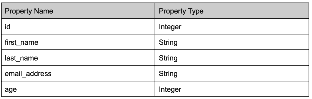
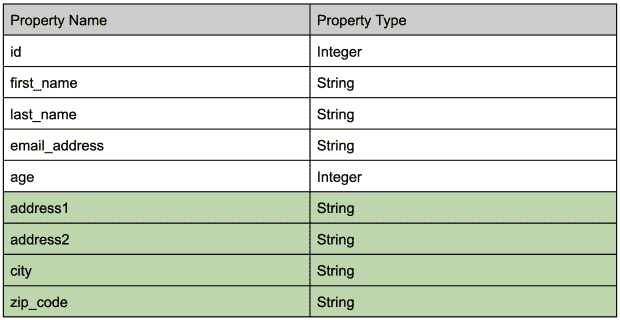
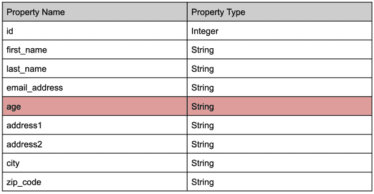

# 不要破坏应用程序:使用 Apache Pulsar 管理模式更改

> 原文：<https://thenewstack.io/dont-break-that-app-manage-schema-change-with-apache-pulsar/>

模式是任何数据平台的重要组成部分。它们是定义数据形状、属性名称和数据类型的元数据。模式有两方面的帮助。首先，它们为数据格式提供了一个固定的蓝图，这可以防止在模式的上下文中使用格式错误的数据。第二，模式让用户了解如何解析数据，以及对数据属性的期望。

[Apache Pulsar](https://dtsx.io/3RDt1jF) 是一个开源的分布式发布-订阅(pub-sub) [消息系统](https://thenewstack.io/apache-pulsar-a-unified-queueing-and-streaming-platform/)，它使用模式实现服务器到服务器的数据传输[。消息通过主题发送，生产者将消息放在这些主题上，供消费者阅读。用户可以为 Pulsar 的模式注册表中存储的主题定义一个模式。当](https://pulsar.apache.org/docs/next/schema-get-started)[消息](https://thenewstack.io/apache-pulsar-a-unified-queueing-and-streaming-platform/)被添加到主题中时，Pulsar 代理检查消息是否符合模式，并确保只发送有效的消息。模式充当生产者和消费者之间的契约，使双方都知道数据的确切格式。

随着时间的推移，随着应用程序的发展，应用程序产生的数据也可能会发生变化。但是，模式更改会影响数据的下游消费者，他们需要特定格式的数据。如果没有管理生产者和消费者之间模式的方法，就很难在不破坏下游应用程序的情况下对消息或事件中写入的数据进行更改。为了避免这种问题，消息的模式也必须随着新属性的添加而发展，并允许消费者理解新旧格式的数据。这个概念被称为模式进化，Pulsar 支持它。

本文讨论了模式进化的原因，并深入研究了 Pulsar 如何实现和支持模式进化。

## 为什么图式会进化

模式提供了关于原始数据的上下文。它们通常描述系统中的特定实体，包含该实体的所有属性。例如，您可能有一个为用户注册的应用程序。它存储用户的详细信息，如姓名、电子邮件地址和年龄。将会有一个描述底层数据并提供上下文的用户模式，例如字段的名称和其中的数据类型。该模式可能如下所示:

现在，假设您想要扩展捕获的数据，以包括地址数据并支持直接邮寄给用户。然后，您需要扩展模式以包含用于捕获地址的新字段，例如地址的第一行、城市和邮政编码。包含这些新字段后，模式将如下所示:

这是模式演变的一种简单形式，因为原始字段没有改变，只是添加了新的字段。在大多数情况下，对于下游消费者来说，这不应该是一个突破性的变化，因为消费者可以继续下去，就好像新领域不存在一样。消费者只需要更新就可以消费和使用新的属性。

但是，有时需要修改现有字段来支持新功能。例如，假设用户不愿意给出一个准确的年龄，而你改变应用程序来获取年龄范围，比如 18-24 岁、25-39 岁、40-49 岁和 60 岁以上。年龄列需要将其数据类型从整数修改为字符串。

这是一个更复杂的模式演变，因为这可能会破坏正在处理年龄属性并期望它是一个数字或者正在使用 Java 等严格类型语言解析数字的下游消费者。他们还可以对属性执行数值计算，这在新格式下将不再有效。

为了克服这一挑战，数据平台可以支持模式进化来处理这样的场景。Pulsar 认识到图式对数据处理的重要性；事实上，通过包含内置的模式进化支持，它将 it 视为一等公民。让我们看看脉冲星是如何做到这一点的。

## Pulsar 如何支持模式进化

Pulsar 在名为`SchemaInfo`的数据结构中定义模式。这是一个特定于 Pulsar 的数据结构，它本身就是一个模式，描述了通过 Pulsar 传输的消息的模式。每个`SchemaInfo`属于一个主题(消息通道),并描述使用该主题产生和消费的消息。

每个`SchemaInfo`都有一个详细描述所使用模式类型的类型。这可以是整数、字符串或复杂模式(如 Avro 或 Protobuf)中的任何内容。

为了支持[模式演化](https://pulsar.apache.org/docs/schema-evolution-compatibility/#schema-evolution)，Pulsar 使用[模式兼容性检查](https://pulsar.apache.org/docs/schema-evolution-compatibility/#schema-compatibility-check-strategy)来比较传入的模式和主题的已知模式。当生成器或使用者尝试连接到特定主题时，会进行架构兼容性检查。策略是在配置代理时选择的，值为`schemaCompatibilityStrategy`。目标是用现有的`SchemaInfo`检查连接客户端提供的`SchemaInfo`,看它们是否兼容。

Pulsar 支持八种不同类型的[模式兼容策略](https://pulsar.apache.org/docs/schema-evolution-compatibility#schema-compatibility-check-strategy)，您可以根据变更的需求进行设置。这些策略还附带了一些规则，这些规则概述了可以进行哪些更改，以及应该首先更新哪些客户端。(查看上面链接的文档，了解每种兼容性策略的更深入的解释)。

回到前面的例子，让我们使用 Pulsar 的兼容性策略来实现模式更改。首先，从初始用户模式开始(没有地址)。这将是你的模式的 V1。所以当你第一次实现一个 Pulsar 生产者或者消费者的时候，这个版本的`SchemaInfo`会被存储，生产者和消费者会像预期的那样工作。

接下来，您希望将新的地址字段添加到您的用户模式中。第一步是参考模式兼容性策略，并确定哪种策略最适合这种更改。使用文档中的“允许更改”列，查找任何允许添加新字段的策略。这给了你向后，向后传递，向前和向前传递。

当不能保证使用旧版本的消费者能够理解新模式时，应该使用向后。当最新模式版本的使用者可能无法读取旧版本中的数据时，使用 FORWARD。如果您想首先更新所有的使用者以使用新的模式，请使用向后策略。否则，向前是最好的。

从更大的角度来看，Pulsar 将发展主题模式的整个行为称为[模式验证](https://pulsar.apache.org/docs/schema-evolution-compatibility/#schema-verification)。它是提供`SchemaInfo`的生产者或消费者、为主题选择的兼容性策略以及决定做什么的代理的组合。

## 结论

模式很少会永远保持不变。随着新的特性被引入到应用程序中，模式经常需要发展来支持这些特性。然而，当模式被修改时，保持数据的生产者和消费者同步常常是一个挑战。

Pulsar 内置的模式进化概念有助于应对这些变化。使用模式兼容性策略，它可以定义模式的不同兼容版本的规则。Pulsar 将其与模式验证过程结合使用，然后使用这些规则来确定消费者在连接到特定主题时可以使用哪些模式。

<svg xmlns:xlink="http://www.w3.org/1999/xlink" viewBox="0 0 68 31" version="1.1"><title>Group</title> <desc>Created with Sketch.</desc></svg>