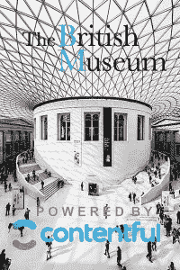

# 不要把 Contentful 的内容基础设施称为“CMS”

> 原文：<https://thenewstack.io/dont-call-contentfuls-content-infrastructure-cms/>

关于 Contentful 的 CMS， [Chris Schagen](https://www.linkedin.com/in/christianschagen/) 想让你知道的第一件事是，它不是一个内容管理系统，而是用于构建数字产品的内容基础设施。

Contentful 的首席营销官 Schagen 说:“我们现在的工作方式，软件的开发方式，已经发生了根本性的变化。“基于云的模块化架构已成为标准，可重用组件使团队能够几乎毫不费力地进行扩展，轻松扩展到新渠道，并以前所未有的速度迭代新产品。”然而，他继续说，许多组织在通往数字未来的光辉道路上遇到了一个主要的障碍:内容。

Schagen 认为，内容已经成为现代敏捷商业的瓶颈。公司正在尝试交付越来越大、越来越复杂的应用程序，同时仍然使用上世纪的工具—传统的内容管理系统—作为平台。

“Post 和 pages 工作了很长一段时间，但我们已经走得很远，很快，”Schagen 说。他解释说,“老式的、以页面为中心的”模式需要孤立的内容，这些内容必须重新输入，并且经常重新格式化，以便在其他平台上重用。此外，这种整体式体系结构扩展起来既麻烦又昂贵，更糟糕的是，响应速度慢——对新产品进行迭代或调整现有产品以适应实时市场需求的速度很慢。

“我们正处于一场软件工业革命之中，在这场革命中，建立一个企业已经变成了建立软件，而数字团队还在使用过去时代的 CMSes。”

进入 Contentful 的内容基础设施，这是一种 API 优先的可组合基础设施方法，内容可以在许多不同的设备和用例之间无缝重用。一个敏捷的、以集成为中心的、上下文无关的架构，专为云分发和灵活的 CI/CD 生产流程而构建。

然而，没有一种方法与“无头 CMS”方法相混淆，这种方法去掉了表示层，通过 API 调用来获取内容，但仍然依赖于单一的老式 CMS 架构。Contentful 的高级产品经理 Paul Biggs 将这一举动描述为“权宜之计”——将 Contentful 的内容基础设施方法与 headless CMS 混为一谈是一种严重的伤害。

比格斯说:“想想看，Stripe 从根本上重塑了互联网商务，但没有人把它们称为‘无头支付’。

## 内容基础架构堆栈

事实上，Contentful 经常与 Stripe 这样的提供商合作，提供电子商务功能，Stripe 是一套为各种规模的在线企业处理商务的支付 API，以及用于通信的 [SendGrid](https://sendgrid.com/) (电子邮件)和 [Twilio](https://www.twilio.com/) (语音和消息传递)，而 Contentful 则管理内容。

Schagen 说，这些公司共同充当新软件堆栈的模块化基础层，其中专门的云服务充当应用程序开发的“构建模块”，通过 PaaS 提供商(如 [Heroku](https://www.heroku.com/) )进行协调，然后移交给 AWS 或其他一些云基础设施提供商。

> “问任何一个开发者他们是否喜欢他们的 CMS——我可以告诉你答案是什么，”Paul Biggs 说。"目前所有的都变成了营销平台，这对开发者来说意味着专有地狱."

Biggs 说:“可以把它想象成开发人员在需要的时间和地点策划一套最好的服务，为任何给定的项目挑选最好的工具。”“80%的工作都是一开始就完成的，组件的这种通用性使得任何新项目的启动和运行速度都快得离谱。”

“这一切都很有意义:公司正在转向这种结构，在这种结构中，你可以对整体业务流程进行数字编排，从运营业务到开发和营销整个数字项目组合，每个方面都由一个数字团队管理，”Schagen 插嘴道。“你几乎需要它成为一个工厂，能够扩展、维护和操作这些移动部件，同时让它们一起工作。”

最终，虚拟工厂在很大程度上依赖于内容。“如今你登录的任何应用程序基本上都是一堵文字墙，”比格斯说。“这堵文本墙需要许多不同的团队来访问，并不都是技术团队。”

## 专有地狱

CMS 难题——功能强大到足以完成工作，但对于人力资源和市场营销来说也足够容易使用——是普遍存在的。“问任何一个开发者他们是否喜欢他们的 CMS——我可以告诉你答案是什么，”Biggs 说。"目前所有的都变成了营销平台，这对开发者来说意味着专有地狱."

“作为开发人员，我们喜欢生活在 GitHub 的土地上，但是人们在那里会感到害怕，”Schagen 回答道。“想象一下，一些业务用户想要对内容进行更改，工程师给他们发送了一个链接，让他们到 GitHub 提交他们想要的更改的 PR。与此同时，工程师们会说，‘啊，我怎么才能解决他们制造的这些混乱呢？’"

Contentful 的回答是分离内容管理系统的工作流，允许开发团队和内容团队使用他们自己选择的工具分别完成他们的工作。“与传统的面向网络的内容管理系统不同，我们的内容基础设施从一开始就被设计为一个开发者平台，”Schagen 解释道。

有了 Contentful 的“一个内容基础设施来管理它们”，开发人员可以使用他们喜欢的语言和工具，所有这些都集成到他们现有的部署管道中。与此同时，内容提供商团队获得了一个直观而强大的 markdown editor web 应用程序，允许他们在任何平台上创建内容—独立于 IT 部门。每个人都能够将内容无缝地推送到网络、移动应用、物联网设备以及接下来的任何平台。

## 汉堡和汉谟拉比

利用 Contentful 的内容集成的一个开心的客户是快餐供应商 Jack In The Box。该公司选择 Contentful 来管理他们的网站流量，然后在 2016 年超级碗期间的一次商业广播中宣布，这家快餐连锁店将赠送 100 万个汉堡。顾客可以在[盒子里的杰克网站](https://www.jackinthebox.com/)上注册，获得一张免费的汉堡优惠券。

"交通太拥挤了！"沙根回忆道。“CMS 行业总是把超级碗看做‘天哪，碧昂斯的网站瘫痪了！’—但对我们来说，内容基础架构的稳健性是我们的亮点。该系统完全自动扩展——有一个疯狂的流量高峰，但基础设施在下面完全平稳运行。”

Contentful 也为大英博物馆多面的数字世界提供动力。它的收藏包含了跨越 200 多万年历史的 800 万件物品，从刻有[汉谟拉比法典](https://www.google.com/culturalinstitute/beta/asset/cul-asia-mespot-33-stones-stelae-hammurabi/vAGSPkBXnIBTYw)的石头到[比特币钱包](https://www.google.com/culturalinstitute/beta/exhibit/0gJSaMG8uxpTIw)。大英博物馆在创造丰富的互动数字体验方面开辟了一条道路——2015 年有 4370 万虚拟游客——并选择 Contentful 来推动其面向公众和内部的策展项目。

“我们有许多不同的渠道，从网站到音频指南和画廊技术，再到利用世界上最大的谷歌内部空间街景的互动游览，”博物馆数字和出版部门的前首席技术专家威尔·罗宾逊说。“博物馆数字体验的规模和多样性完全超出了传统 CMSes 的能力。”

他继续说，在 Contentful 的推动下，博物馆已经建立了一个能够为其整个数字项目组合提供动力的平台，一个中央内容中心为所有频道提供信息。与此同时，在幕后工作的几十个策展团队使用 Contentful 的灵活编辑应用程序，可以根据每个策展团队的特定需求和偏好进行定制。

博物馆通过使用 Contentful 制作其数字博物馆内音频指南进行了测试，该指南有十种口语和英国手语。“这是一个很好的尝试方式，”Contentful 的 Schagen 说。“许多客户开始时规模很小，通过一个非关键项目来测试他们是否满意并实际完成工作。但是他们意识到，‘天哪，这真的有用！给我们报名吧！"

## CMS 网关药物

公司经常被他们的开发团队带得心满意足。Contentful 产品经理比格斯说:“我们看到大型组织希望经历‘数字化转型’，并给予他们的工程师重新设想堆栈的特许 CMS 是改造堆栈的门户药物。“很多地方都在尝试将新的敏捷 API 技术与 Oracle 或他们 15 年前构建的一些陈旧系统一起运行。”

“我们存在的根本原因是世界已经改变了，”沙根说。“团队变得非常以软件为中心，没有一种工具可以解决所有这些新的软件范式，CI/CI、IoT 等。所以 Contentful 不只是试图建立一个更好的捕鼠器，相反，我们提供了一个全新的内容基础设施范式。”

大英博物馆对此表示赞同。“最终目标是唤起实体空间的游客在我们的虚拟游客中体验到的同样的情感和精神反应，所以他们觉得他们也在亲身体验，”罗宾逊说，他最终离开了博物馆，在 Contentful 担任解决方案架构师。“大英博物馆的工作人员一直在探索新的方法，通过虚拟现实和增强现实，试图不仅推动博物馆正在做的事情，也推动私营部门。”

"心满意足无疑会让这条路走得更容易."

<svg xmlns:xlink="http://www.w3.org/1999/xlink" viewBox="0 0 68 31" version="1.1"><title>Group</title> <desc>Created with Sketch.</desc></svg>