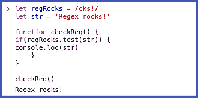

# 不要害怕正则表达式:正则表达式入门

> 原文：<https://thenewstack.io/dont-fear-regex-getting-started-regular-expressions/>

正则表达式会让你偷偷害怕吗？不要担心，你可以承认——对 regex 的恐惧并不是你需要隐藏的某种可耻的怪癖。各种各样的人，甚至是有经验的程序员，都避免这些看起来像鸡轨迹的奇怪字符串(如果说鸡碰巧在滑冰。在吸食冰毒时)。

在很长一段时间里，我是那些被 regex 可笑地吓倒的人之一。在绝对必要的时候，我可以磕磕绊绊地学习基础知识，但却避免真正去学习。它看起来，我不知道，有点像外星人。此外，仅仅是试图掌握 JavaScript 和 Node.js，我就已经感到超负荷了。然而，慢慢地，很明显，这些变通办法比认真研究并弄清楚到底是另一种计算机语言要痛苦得多。具体来说，这是一种非常强大的搜索模式语言，可以为任何了解其工作原理的程序员节省大量时间。

正则表达式到底是什么？我为什么要在乎？

根据 good ol' [Mozilla 开发者网络](https://developer.mozilla.org/en-US/docs/Web/JavaScript/Guide/Regular_Expressions)，“正则表达式是用来匹配字符串中字符组合的模式。”是的，文本中的字符串或者——[编程 Perl](http://www.oreilly.com/catalog/pperl3/) 的作者指出——“如果你尽可能广义地理解‘文本’,也许你所做的 90%是 90%的文本处理。”

这很有用，因为正则表达式几乎可以匹配任何模式。它们很快——肯定比不写正则表达式所需的递归 cruft 更快。虽然正则表达式不是最容易阅读的，特别是对于语法新手来说，但是考虑一下，与获得相同结果所需的几十行非正则表达式代码相比，您是否更愿意花费精力去理解一行神秘的字母和符号的逻辑。

所以您应该关心，因为正则表达式可以帮助您节省时间，同时您可以编写更短、更干净、更高性能的代码。对于大多数编程语言来说也是如此:正则表达式内置在一些语言的语法中，比如 [Perl](http://perldoc.perl.org/perlre.html) 和 JavaScript(由 [ECMAScript](https://en.wikipedia.org/wiki/ECMAScript) 提供)。其他的，像 [Java](https://docs.oracle.com/javase/tutorial/essential/regex/) 、 [C++](http://www.cplusplus.com/reference/regex/) 和 [Python](https://docs.python.org/2/library/re.html) ，都有正则表达式支持作为它们[标准库](https://en.wikipedia.org/wiki/Standard_library)的一部分。你甚至可以在谷歌代码搜索中使用正则表达式，更不用说任何文本编辑器或 IDE 了。

好吧，你说服我了。如何开始使用 Regex？

今天我们将关注 JavaScript 中的正则表达式。JavaScript 中 regex 最酷的一点是正则表达式实际上是对象，这意味着我们得到了内置的方法，如**test()**——它返回一个布尔搜索结果，指示是否存在匹配——以及**exec()**—它返回一个匹配结果数组(如果没有找到匹配结果，则返回 null)。

但这有点超前了。让我们从简单的正则表达式语法开始。

## 正则表达式 101

这一切都归结到斜杠(“/”)符号。斜杠开始和结束所有正则表达式。考虑用它们代替单引号(' ')甚至双引号("")会有所帮助，否则您会用它们来括起一个普通的旧字符串。

下面是正则表达式的最基本形式:一个或多个简单的字母数字(和/或标准标点)字符，在两个斜杠之间:/ *a* /。然后测试传递的字符串中是否存在搜索字符——所有包含的字符，完全按照那个顺序出现，没有空格；将它们视为子字符串，并返回一个布尔值:


斜杠符号(/regex code here/)之间的表达式是绝对文字。(重要说明:大写和小写字母字符被视为两个独立且不同的值，非常类似于 ASCII 字符代码)。两个斜杠之间的任何内容都将被视为文字字符，所以如果您正在搜索变量名，请记住这一点。搜索 var 名称是完全合法的，也是完全可行的——但是，结果不会解析到指定的值。然而，另一方面，您可以将正则表达式赋给变量，甚至将返回值用作测试条件:



## 模式识别

精确搜索和布尔返回都是有用的，但最终也是有限的。幸运的是，regex 有各种有用的搜索模式语法和符号，允许搜索您能想到的任何排列。

首先，范围运算符。当在一个字符串中搜索多个字母数字字符时，regex 需要您用一个表示 regex 范围的符号来表示目标字符:

*   管道符号(“|”)表示**或**，这并不奇怪(因为 JavaScript 中的“or”是两个管道:“||”)。
*   方括号(“[ ]”)本质上意味着“这些括号内的任何内容”
*   破折号(“-”)表示范围，如在字母表的连续数字或字母之间，包括起始值和结束值。“A-D”等同于“A、B、C 和/或 d”
*   最后，反斜杠加小写字母 D(“\d”)是“0 到 9 之间的所有整数”的 regex 速记(而“\ D”是所有非数字字符的速记)。

下面所有四个 regex 语句都在测试是否存在 1 到 9 之间的数字。注意，您**有**来使用符号之一——管道、破折号或括号——来获得准确的返回值。(为什么会发生这种情况超出了本文介绍的范围；就目前而言，接受现实，继续前进。


也适用于字母字符:


### **从头到尾**

破折号、括号和管道范围操作符都搜索我们的目标字符或模式**出现在指定搜索字符串内的任何地方**。但是您可以锁定特定的搜索位置:

*   **^** 告诉搜索从字符串的第一个字符开始。
*   **$** 表示“在字符串的**端**搜索”


### **现在量化搜索**

到目前为止，我们知道要搜索什么(数字、字母、某些标点符号)以及在哪里寻找它们。但是到目前为止，我们使用的模式只搜索模式的单个外观。如果我们想要不止一个——或者根本不要——怎么办？输入句点( ".")，星号(“*”)，问号(“？”)、加号(“+”)和花括号(“{ }”)。每一个都用来指示 regex 需要搜索多少个实例。

*   "."(句号)表示除换行符以外的任何字符。搜索/d.g/将返回' dag '，' dbg '，' dcg '，' ddg '等。
*   "?"表示搜索**零* *或* *一个*事件:*

 *

*   “*”以同样的方式工作，只有“*”是寻找零个或多个出现的*；它会一直过去，找到一个事件*
*   “+”查找搜索模式的一个或多个匹配项，如果没有匹配项，将抛出 false。
*   “{ }”是最有针对性的。“{x}”表示准确找到出现的次数*x*；“{x，}”查找 *x* 或更多的出现次数；“{x，y}”表示查找 *x* 或更多次，但不超过 *y.*

### 快速回顾

逐一来看，这些正则表达式操作符都是简单的概念。但是我们已经看了不少，所以让我们快速回顾一下。

*   所有正则表达式都包含在左斜杠和右斜杠中:

```
        /cat/.test('catbird')<i>  // true</i>

```

*   方括号("[ ]"):方括号[ ]内的任何表达式都是字符集；如果任何一个字符匹配搜索字符串，正则表达式将通过测试，返回 true。除非被其他正则表达式操作符修改，否则它会在找到一个后停止:

```
        [0-5]   looks for  a  single numeric character between  0  and  5
        [A-F]  looks for  a  single CAPITAL letter between  A  and  F

```

*   星号(“*”)查找零个或多个搜索模式
*   加号(“+”)查找搜索模式的一个或多个匹配项

```
        /[123]+/.test(‘abc312’)  <i>// true because each individual -- 
        literal  --  search item in the square brackets occurs in the
        test string.  Order is not important.  </i>

```

*   问号(“？”)查找零个或一个匹配项，有时被称为“可选”操作符，因为即使缺少某些内容，它也能匹配。例如，这可以有效地应用于常见单词的美式和英式拼写差异之间的常见拼写变化:

```
 var britCheck  =  /colou?r/
 britCheck.test('colour')  //true
 britCheck.test('color')  // also returns true

```

*   大括号(“{ }”)括起搜索范围:

    ```
     /ba{2,3}b/.test('baab')  // <i>true; there are 2 'a's</i> 
    ```

    ```
    <i></i> /ba{2,3}b/.test(‘bab’)  // <i>false; searching for 2 or more </i><i>instances of ‘a’ </i> 
    ```

*   脱字符号(“^”)表示从目标字符串的*开始*开始搜索。
*   美元符号(“$”)表示在目标字符串的*结尾*查找搜索表达式

### 把所有这些放在一起，你得到了什么？

探索正则表达式 15 分钟后，你— **是的，就是你！** —已经能够使用这种简单的正则表达式语法来验证电话号码了！

这个练习的关键是花括号，花括号充当正则表达式的量词，也就是说，花括号前面的字符在目标搜索中出现的次数。因此当前面的字符或字符范围恰好出现 n 次时，“{n}”告诉 regex 进行匹配。

因此，例如:为了验证一个十位数的电话号码是否以正确的格式输入到表单中，我们可以使用**/\(\ d { 3 } \)-\ d { 3 }-\ d { 4 }/**。这告诉正则表达式编译器寻找:

1.  **\( :** 左括号(用反斜杠转义，表示是文字值)
2.  **\d{3}** :数字 1 到 9 出现三次
3.  **\)** :右括号，再次用反斜杠转义
4.  **–**:破折号
5.  \ **d{3}** :数字 1 到 9 又出现了三次
6.  **–**:又一个破折号
7.  **\d{4}** :最后四位数字。


(注意，要在 Chrome 浏览器(v63)中传递，表达式必须用方括号和正斜杠括起来。其他浏览器的行为可能有所不同；有些可以在有或没有括号的情况下验证)。

在这种情况下，破折号是合适的，因为它们被视为文字，而不是 regex 运算符。严格地说，这个表达式并不完全成功:按照惯例，典型的美国区号(括号内的第一组数字)和 NXX 交换机(第二组三个数字)都不会以零开头。这在上面的表达式中是允许的，因为\d 允许从 0 到 9 的所有数字。因此，为了真正合法，表达式 syntax [1-9]\d{2}可用于查找始终有效的区号和 NXX 交换。

## 现在，休息一下。

说真的。你应得的。这是一个关于 regex 基本要素的快速而肮脏的初级读本，帮助您入门。查看我们后续部分将帮助您迈向正则表达式狂喜的下一步，在那里您将学习消极和积极的“前视”，用 JavaScript 中内置的 **exec()** 方法匹配字符串，以执行一个或多个匹配的搜索，并返回一个信息数组(或 null，如果不匹配)而不是一个布尔值。

最后，我们将使用正则表达式来匹配强密码。所以喝点咖啡，练习一下到目前为止学到的东西，下次再见！

<svg xmlns:xlink="http://www.w3.org/1999/xlink" viewBox="0 0 68 31" version="1.1"><title>Group</title> <desc>Created with Sketch.</desc></svg>*