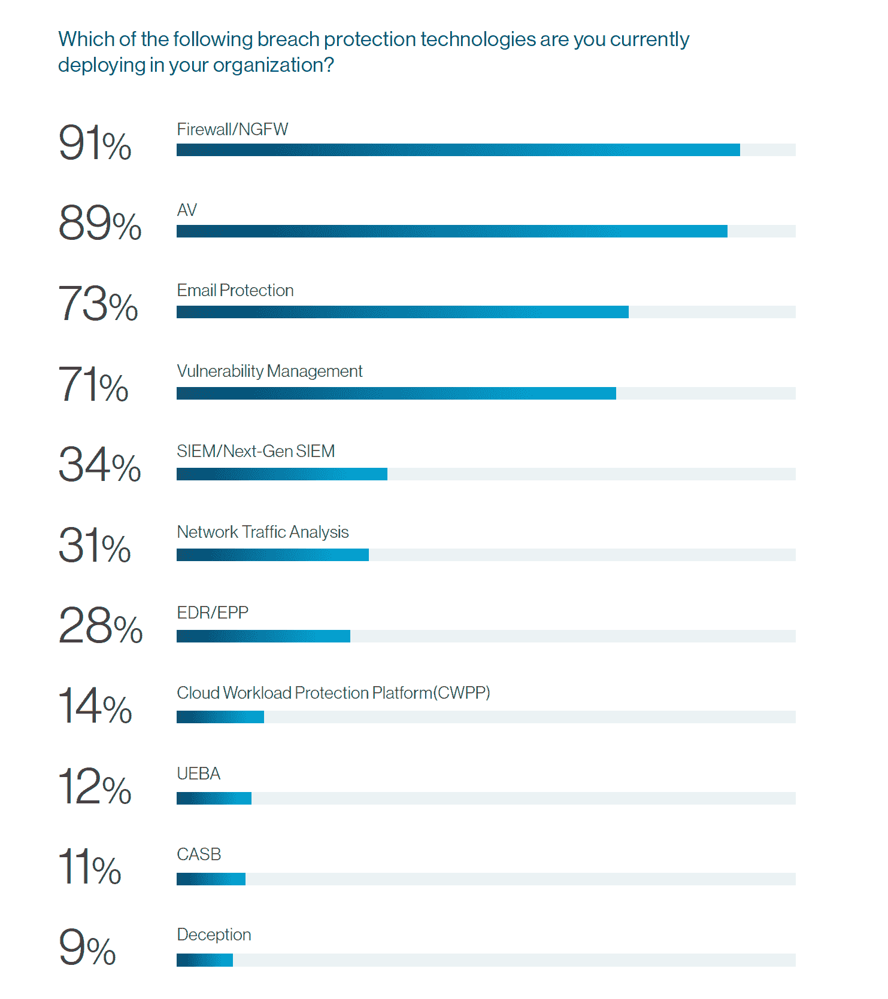

# 别忘了病毒，电脑类的

> 原文：<https://thenewstack.io/dont-forget-viruses-the-computer-kind/>

防病毒软件和防火墙是最广泛采用的安全技术，多年来一直如此。它们降低了风险，但被认为是理所当然的。非技术领域最近的新闻提醒我们，媒体对[话题*今日*的关注是有害的，如果它分散了对解决长期存在的问题的持续努力的关注。换句话说，虽然像](http://www.msnbc.com/msnbcanswers)[民族国家网络攻击](/crowdstrike-and-the-nation-state-threat-to-cybersecurity-facts-vs-hype/)这样的新兴威胁和像[零信任](https://thenewstack.io/how-to-start-applying-googles-zero-trust-model/)这样的新技术方法值得解决，但不要忘记长期信息安全方法的功效。

根据 Cynet 的“2020 年数据泄露保护状态”报告，只有 2%的网络安全专业人士认为防病毒项目是他们在数据泄露保护方面的主要关注点在同一项研究中，87%的企业使用防病毒(AV)软件，这通常属于更广泛的反恶意软件类别，也可以解决蠕虫、僵尸程序和勒索软件等威胁。如前所述，企业可能变得[过于自信](https://thenewstack.io/information-security-spending-dont-be-fooled-by-overconfidence/)他们拥有能够有效管理安全风险的控制措施和技术。反恶意软件出现过这种情况吗？

虽然反病毒市场已经过时和成熟，但安全厂商并不一定自满。他们继续监控新的威胁，并采用了更广泛的类别，即端点检测和响应(EDR)，该类别将反恶意软件的元素与提供实时异常检测、取证分析和补救功能的更新工具相结合。毫不奇怪，EDR 正准备快速增长。尽管 Cynet 调查中只有 28%的人使用该技术，但 57%的人表示，EDR 是他们预计今年将重点关注的漏洞保护项目。

有一些迹象表明，恶意软件的威胁正在减弱。例如， [SonicWall Capture Labs](https://www.sonicwall.com/lp/capture-labs/) 威胁研究人员观察到的恶意软件攻击数量实际下降了 6%,只有区区 99 亿次。此外，根据[谷歌的透明度报告](https://transparencyreport.google.com/safe-browsing/overview?hl=en&unsafe=dataset:1;series:malware,phishing;start:-820540800000;end:1563087600000&lu=unsafe)，涉嫌传播恶意软件的网站数量处于 2007 年以来的最低点。不幸的是，这种下降伴随着网站数量的急剧增加，这些网站在不要求访问者下载的情况下钓鱼获取个人信息。

疫情冠状病毒似乎引发了 T4 恶意软件和诈骗的爆发。这篇文章不是要成为诱饵和开关。大量证据表明，恶意软件仍然是首要的安全威胁。仅仅因为人们不再谈论防病毒，并不意味着不需要它。尽管我们关注云原生安全性、开源社区的“健康”和软件供应链安全性，但请放心，新的堆栈保持了广泛的历史视角。

计算机病毒将恶意代码注入文件，并在其主机内传播，还可能传播到其他主机。大多数终端安全产品都可以抵御这种和其他几种恶意软件。"资料来源:O. Or-Meir，N. Nissim，Y. Elovici，L. Rokach，["现代时代的动态恶意软件分析-最先进的调查"](https://dl.acm.org/doi/fullHtml/10.1145/3329786)， *CSURACM Comput。Surv。*，第 52 卷第 5 期，第 1-48 页，2019 年 9 月。

## 要考虑更多的数据点和图表

*   **防恶意软件覆盖范围中的漏洞:** 28%的终端(例如，笔记本电脑、手机、服务器)的防恶意软件/防病毒软件已经过时(21%)，或者没有这种类型的保护(7%)。(资料来源:《2019 端点安全趋势报告》，该报告分析了来自 12，000 家已激活 [Absolute Software 的](https://www.absolute.com/)产品的组织的设备的数据。)
*   **自动化和反病毒:** 74%拥有反病毒技术的公司已经实现了解决方案的全自动化。这是否会导致缺乏必要的人类关注？(资料来源:[《2020 年 Ponemon 调查报告:自动化时代的 IT 安全职能人员配备》](https://www.domaintools.com/resources/survey-reports/2020-ponemon-survey-report-staffing-the-it-security-function)，调查了 1，027 名 IT 和 IT 安全从业人员。)
*   **电子邮件与网络:**尽管新的 WebAssembly 实现带来了密码挖掘和安全问题，但 68%的恶意软件攻击是通过电子邮件进行的。(来源:[Check Point Software Technologies '](https://www.checkpoint.com/)[《2020 年网络安全报告》](https://pages.checkpoint.com/cyber-security-report-2020.html))。此外，71%的 IT 决策者看到了恶意活动从一个受感染的用户传播到其他员工的攻击。(数据来源: [Mimecast 的](https://www.mimecast.com/)[《2019 年电子邮件安全状况报告》](https://www.mimecast.com/the-state-of-email-security-2019/)，该报告调查了 1025 名 IT 决策者。)

 

来自 Pixabay 的 S. Hermann & F. Richter 的特写图片。

<svg xmlns:xlink="http://www.w3.org/1999/xlink" viewBox="0 0 68 31" version="1.1"><title>Group</title> <desc>Created with Sketch.</desc></svg>