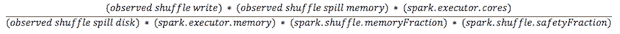

# 不要卡住:迁移到后火花的纱线世界

> 原文：<https://thenewstack.io/dont-get-stuck-migrating-to-a-post-spark-on-yarn-world/>

[Chad Smykay](https://www.linkedin.com/in/chad-smykay-a780761/)

[Chad 在 USAA 工作期间拥有丰富的运营背景，并在 Rackspace 这一世界一流的支持组织中帮助构建了许多共享服务解决方案。他帮助实施了许多生产大数据/数据湖解决方案。作为 Kubernetes 在应用领域和数据分析用例的早期采用者，他为业务用例带来了应用现代化领域的广泛背景。](https://www.linkedin.com/in/chad-smykay-a780761/)

如果你曾经在你的车里陷在泥里，那会是一次令人不安的经历！你觉得被困住了。去年夏天，我就遇到过这种情况，但幸运的是，有一个简单的解决方案:增加牵引力。

从后 Spark on YARN (SoY)实现迁移到运行在 Kubernetes 上的 Spark 操作符有时会有同样的感觉——就像你陷入了泥沼。那么，如何把 Kubernetes 的经验慢慢介绍给你的团队，并在后大豆时代成功运行呢？你能做些什么来获得牵引力？

我支持 20 多个不同的财富 100 强客户迁移到后大豆时代，这让我看到了他们迁移中的一些共同因素。只需将其分解为几个关键策略，您就可以成功地实现更现代化的 Spark 实施:

1.  哪些工作负载具有最简单的作业和纱线容器要求？
2.  哪些工作负载的数据连接需求最少？
3.  哪些工作负载需要严格的计算和存储延迟？

## 工作和纱线要求最简单的工作负载

当然,“唾手可得的果实”是移动那些具有最不复杂的纱线配置的工作负载。有许多文章、博客文章，甚至是定制的计算器，介绍如何最好地为您的工作负载计算纱线容器配置。我最喜欢也是最支持的是普林斯顿研究计算中心的[调优 Spark 应用](https://researchcomputing.princeton.edu/computational-hardware/hadoop/spark-memory)。忽略 SLURM 的要求，他们的解释是最简单的，当你试图调整纱线上的火花应用程序时。

图一。计算您的纱线容器配置，普林斯顿研究计算

通常，您可以从这两个纱线配置桶开始:

*   简单容器定义
*   复杂调度程序定义

您最简单的纱线容器定义应该首先被转移，因为这些定义更容易转化为 Kubernetes 的资源分配(CPU 数量、内存等)。).如果您有更复杂的纱线调度程序定义，例如那些与公平调度程序或容量调度程序一起使用的定义，那么您应该在考虑如何定义 Kubernetes 资源分配之后，将这些定义移到最后。应该注意的是，使用容量调度器的 YARN 实现更容易转化为具有多个工作负载的单个 Kubernetes 集群部署中的共享资源。

## 验证您的数据连接需求

迁移到后大豆实现的一部分是在连接到 Spark 可以使用的当前或新数据源上有更多的选择自由。我看到的一些常见方法有:

*   连接到现有的 HDFS 集群。
*   连接到启用 S3 API 的存储。
*   连接到云对象存储提供商。
*   使用 Kubernetes CSI 连接到其他文件系统。

我的大多数客户都在花时间更新他们标准的数据访问定义模式，这意味着他们正在定义哪种类型的数据应该存储在哪种类型的数据系统/对象中。他们花费时间来定义数据应该存储在哪个业务用例或数据类型中。例如，来自股票交易的金融股票数据将以拼花文件格式存储在 S3 API 系统上，而数据科学机器学习工作簿将存储在符合 k8s 的 CSI 文件系统上。最常见的是将所有数据存储在 S3 API 支持的存储上，如 HPE Ezmeral Data Fabric 或云提供商内的存储。

请记住，使用 Kubernetes，您可以更加灵活地连接到更多新的有趣的数据源，这些应该在您的数据治理策略中加以考虑。

## 计算和存储延迟需求

Hadoop 时代工作负载的优势之一是其强大的组合，让您的存储成为计算的“隔壁”。当然，在最初的 MapReduce 阶段，您在工作负载的随机任务方面遇到了一些问题，但是如果需要的话，您可以控制它们。SoY 的部分优势是将计算和存储结合在一起，这意味着对于大多数工作负载，数据传输应该会减少。当您在 Kubernetes 的工作负载上迁移到 Spark 时，您必须记住这个事实。

有几个关于大豆工作量的问题要问:

1.  我是否有大量数据大小的文件或数据集被读入到您的 Spark 作业中？
2.  您的 Spark 作业中是否会读取大量文件或数据集？
3.  如果我在 Spark 作业中引入额外的读取或写入延迟，会影响我的作业时间或性能吗？

在新的 Spark 实现上运行一个样本作业非常重要，要注意记录您的 RDD 读写时间。在当前实施与新实施之间获得基本性能“水平集”的一种方法是关闭 rdd 上的所有“MEMORY _ ONLY”[设置。为什么？因为如果您可以获得“仅使用磁盘”的性能基准，假设您将在 Kubernetes 中使用相同数量的资源进行分配，那么启用内存的 RDD 的性能应该差不多。](https://spark.apache.org/docs/latest/rdd-programming-guide.html#which-storage-level-to-choose)

同样值得注意的是，进入后大豆时代意味着您必须重新审视您的安全政策和监控系统实现，以正确保护和监控 Kubernetes 资源上的 Spark。幸运的是，HPE·埃兹迈拉拥有一个用于分析的单一容器平台，可以支持您完成新工作负载的中央安全和监控之旅。

## 概述

通过这些简单的步骤，您可以利用 Kubernetes 为后大豆时代的实施创造所需的动力:

*   首先迁移最简单的纱线配置，注意花时间在复杂的纱线调度器定义上，并根据需要将它们转换成 Kubernetes 资源定义。
*   验证 K8s 集群中任何新的数据连接需求，以及这些需求带来的安全隐患。
*   在计算和存储分离后运行测试工作负载，以确保不会给工作带来任何新的延迟。

如果你或你的组织正在努力开始你的后大豆实施之旅，HPE 在这里帮助你。查看 [HPE AMP 评估计划](https://assets.ext.hpe.com/is/content/hpedam/documents/a50001000-1999/a50001473/a50001473enw.pdf)，这是一种经过验证的最佳实践迁移方法，了解 HPE 如何帮助您避免陷入困境，并开始您的迁移之旅。

<svg xmlns:xlink="http://www.w3.org/1999/xlink" viewBox="0 0 68 31" version="1.1"><title>Group</title> <desc>Created with Sketch.</desc></svg>