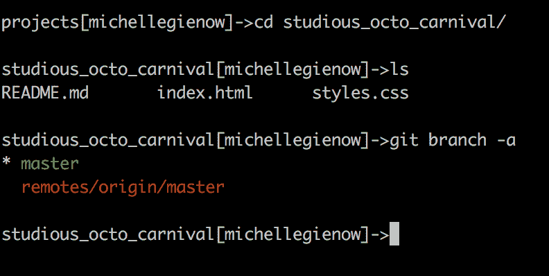
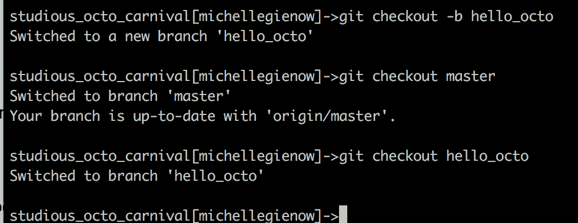
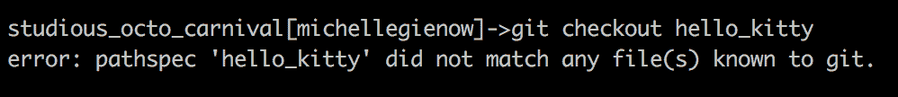
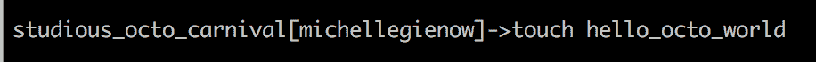
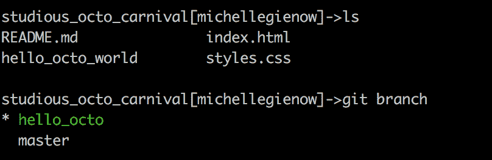
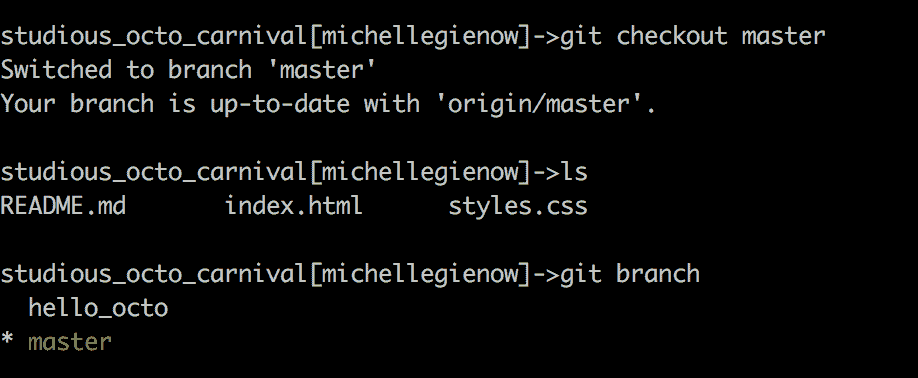
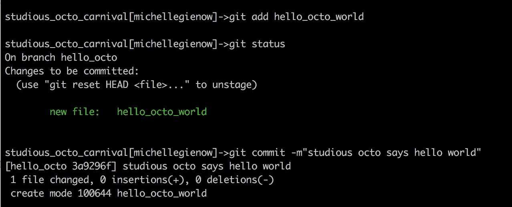
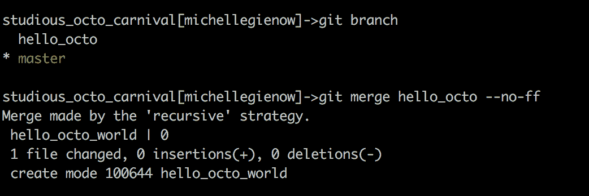
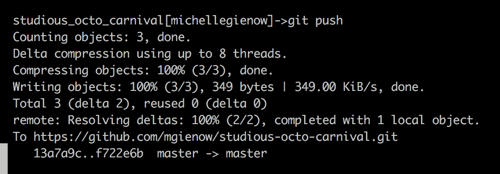
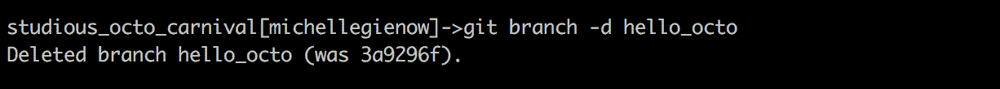

# 在 Git 和 GitHub 中使用分支

> 原文：<https://thenewstack.io/dont-mess-with-the-master-working-with-branches-in-git-and-github/>

在我们之前的 git 版本控制软件教程中，我们学习了使用 git 的[基本命令，以及如何与 Github.com](https://thenewstack.io/tutorial-git-for-absolutely-everyone/)一起工作[来建立一个存储库并将我们的项目代码推送到网站。](https://thenewstack.io/git-with-the-program-getting-started-with-github/)

现在是时候按照 GitHub(和 git)应该使用的方式开始实际工作了:将项目中的更改安全地放到一边，一旦它们被证明是正确的，就将它们合并回原始项目中。或者至少不是灾难性的。

到目前为止，您已经理解了 git 将项目的每个版本都保存为代码的快照，就像您提交它时一样。本质上是随着项目的进展创建一个版本的时间表，以便在灾难发生时可以回滚到更早的版本。

git 和 GitHub 管理这个时间线的方式——特别是当不止一个人在项目中工作并做出改变时——是通过使用分支。一个分支本质上是一组具有唯一名称的代码变更。每个存储库可以有一个或多个分支。主分支——所有更改最终都被合并回主分支，称为主分支。这是你的项目的正式工作版本，也是你在 github.com/yourname/projectname.访问项目库时看到的版本

不要惹主人。如果你对一个团队项目的主分支进行变更，而其他人也在工作，你的即时变更会波及到其他人，很快就会出现冲突、哭泣、撕裂衣服和蝗灾。有那么严重。

为什么大师这么重要，不能乱来？一句话:主分支是可部署的。这是您的生产代码，随时可以发布到世界各地。master 分支应该是稳定的，开源软件的社会契约是永远不要将任何未经测试或破坏构建的东西推给 master。GitHub 能够工作的全部原因是，从主人那里工作总是安全的。

## 分支

相反，每个人都使用从主文档创建的分支来进行试验、编辑、添加和更改，一旦这些分支被批准并已知可以工作，最终将它们返回到主文档中。然后更新 Master 以包含所有的新内容。

为了在项目中开始任何新的工作，或者改变现有的东西，您从稳定的主分支中创建一个分支。让我们继续使用为上一个教程 good ol '好学 _octo_carnival 创建的示例项目。现在，请在您的计算机上打开您的版本，并将 cd 放入目录中。

### 第一步:盘点库存。

在创建新分支之前，我们希望检查任何其他现有分支。我们知道大师，但谁知道我们的项目合作者可能会做些什么，那些淘气的猴子？因此，我们可以通过在 terminal 中键入“git branch -a”来查看所有现有的分支，这告诉 git 我们希望看到这个项目中的所有分支，甚至是不在我们本地工作区中的分支。

这将返回您在下面的代码示例中看到的输出。根据您的操作系统和终端应用程序的不同，它的外观可能会有所不同，但信息最终是相同的。输出第一行中“master”旁边的星号表示我们当前在该分支上。第二行告诉我们，在名为 origin 的遥控器上，有一个单独的分支，也称为 master。(记住我们的远程是这个项目的 GitHub repo)。

### 步骤 2:创建一个新的分支

现在我们知道如何查看分支，让我们创建一个！请记住，我们有我们的主分支，我们的原始项目。我们现在要创建一个项目的新版本，一个分支，在我们的本地计算机上进行试验和修改——而项目的原始版本，即主版本，在 GitHub 上保持安全不受干扰。我们给新的分支一个描述性的名称，以提醒我们在其中工作时打算做什么。在这种情况下，它将是一个简单的“Hello World”东西，所以我们称它为 hello_octo。

要创建这个新分支，键入“git checkout -b branchNameHere”(因此，在我们的例子中是“git checkout -b hello_octo”)。

假设没有其他人已经创建了名为“hello_octo”的分支，git 返回“切换到新的分支‘hello _ octo’”(在已经存在同名分支的情况下，git 会告诉我们“fatal:名为‘hello _ octo’的分支已经存在。”没什么大不了的，只是用新的名称变体再做一次 git checkout -b)。

我们还可以使用 git checkout 命令在两个分支之间来回切换。键入“git checkout branchName”切换到该分支。所以，“git checkout master”带你去 master 而“git checkout hello_octo”带你回 hello_octo 分支。

如果你试图切换到一个不存在的分支，比如“git checkout hello_kitty”，git 会让你知道这是不可行的:

git 如何知道您当前在哪个分支上？Git 总是在观察你做的事情，并保持一个叫做 HEAD 的特殊指针。就像指南针上的指针总是指向北方一样，头总是指示你当前所在的地方分支。

(我们也可以使用 git 命令“git branch branchNameHere”创建我们的分支，然后使用 git checkout 切换到它。然而，在“git checkout -b branchNameHere”中带有“-b”的简洁的小快捷方式既创建了分支又切换到它。我不能告诉你有多少新进 git 的程序员会产生错误信息和沮丧，因为他们在创建新的分支后，没有记住去改变它。因此，我们坚持使用 git checkout -b，mmmkay？)

## 对我们的工作分支进行更改

现在我们有了多个分支——我们的工作分支可以进行更改，我们的主分支保持安全不受干扰——我们可以开始工作了。在我们的场景中，我们将使用“hello_octo”分支来进行和测试我们的更改，然后将这些更改推回到 GitHub 上的主分支。

记住要确保你在你的工作分支上，而不是主分支上，使用好的旧 git branch -a。

### 第三步。创建一个新的空白文件，命名为“hello_octo_world”:

(这个空白文件只是为了演示，所以不用担心没有文件扩展名/类型)。

因为它是全新的，现在这个文件只在你的分行。使用“ls”命令查看它:

然而，回想一下，我们是在我们的工作分支 hello_octo 上，我们在那里创建了这个新东西。master 不知道任何关于 no hello_octo 的事情，因为它与我们在工作分支上所做的任何随意的改变都是安全隔离的。它仍然是我们开始时那个安详不变的主人:

### 步骤 4:准备并提交我们的新文件到工作分支。

现在是时候在工作分支上存放(添加)和提交我们的新文件了。(听着耳熟？).这将把这个新实体附加到工作分支，为最终将它转移到主节点做准备。这个文件现在存在于 hello_octo 分支上；正如我们在上面看到的，它目前不存在于主分支上。

此时，您已经获得了分支变更的快照。在现实世界的项目中，可能有更多的变化和工作要做。现在是你这样做的时候了，在逻辑点上提交。请记住，在 GitHub 上，提交代表您的连续保存。每个提交都有一个关联的提交消息，它是一个描述，具体解释了您在那里做了什么以及为什么做。提交消息捕获了您的变更的历史，因此未来的您，以及其他项目贡献者，可以理解您做了什么以及为什么。

## 在分支之间合并代码

一旦我们最终完成了所有的更改和添加——并且一切正常——就该合并了。有趣的部分发生在我们切换回我们的主分支(跟我说！—我们使用“git checkout master”)。“Hello_octo_world”似乎丢失了，但它没有——目前，它存在于我们的工作分支上，而我们在我们的主分支上。我再次向您展示这一点，因为这是理解 git 分支的核心:

现在:在这个练习中，“hello_octo_world”表示对任何文件的任何更改(或者添加一个全新的文件),该文件已经通过了我们开发分支上的所有测试，并准备投入生产。在分支之间移动代码的过程(通常是从开发到生产)被称为合并。

非常重要:当合并时，我们需要在我们想要合并的分支上。基本上，我们会告诉 git，“看到那个新东西了吗？现在拿过来就可以了。”

### 步骤 5:合并工作分支变更

在这种情况下，由于我们想要从我们的工作分支，即“hello_octo_world”文件所在的分支，合并到我们的主分支，所以我们需要在主分支上。

一旦到达主分支，我们所要做的就是运行 merge 命令。最好的方法是键入“git merge–no-ff”——额外的“–no-ff”告诉 git 我们希望保留合并之前的所有提交消息。这将使将来跟踪更改更加容易:

## 回到 GitHub

我们现在需要做的最后一件事是让 GitHub 知道我们已经和 master 一起在本地开发环境上瞎折腾了。

换句话说，是时候 git 推送了。你能行的！

git 输出确认了从您的开发分支到您的本地环境中的主分支的合并现在已经被复制到远程服务器:“主→主。”

就是这样！我们成功地创建了一个独立于 master 的工作分支。对其进行了更改。准备并提交这些变更。然后在我们的本地工作环境中将它们合并回 master 中。然后，最后，把所有东西都上传到 GitHub，这样我们项目的所有版本在任何地方都是一样的！

## 最后一点

现在需要进行一些清理:因为我们已经成功合并了 hello_octo 分支，所以不再需要它。要删除一个合并的分支，只需输入“git branch -d branchName”:

不用担心:如果您不小心试图删除一个尚未合并的分支，git 将抛出一个错误。

所以！到目前为止，我们一直在使用一个极其简化的示例项目，因为此时最重要的事情是理解和吸收 git 工作流。在现实世界中，合并要比这多得多——例如，如果因为合并有冲突而收到错误消息，会发生什么呢？别担心，新水手，我们会到达那里的。

您的家庭作业:在示例项目中创建(“接触”)更多的新文件，并练习进行更改、分段、提交，最后将它们合并回去。注意理解你的头脑指向哪里——也就是说，你当前的分支是什么。只向您的工作分支提交变更。

因为，记住:不要。一团糟。与。的。主人。

<svg xmlns:xlink="http://www.w3.org/1999/xlink" viewBox="0 0 68 31" version="1.1"><title>Group</title> <desc>Created with Sketch.</desc></svg>