# 不要“对象化”我:JavaScript 函数式编程介绍

> 原文：<https://thenewstack.io/dont-object-ify-me-an-introduction-to-functional-programming-in-javascript/>

起初，计算机就像恐龙一样:体积庞大，但计算能力却很小。

尽管函数式编程是有史以来第一个计算机编程范例，但它被命令式和面向对象的范例所掩盖，这种大脑只有核桃大小的现象就是原因。很简单，早期的计算机处理能力有限，根本无法承受函数调用比简单循环更昂贵的事实。因此，几十年来，函数式编程在很大程度上存在于学术界，而我们其他人则不得不与副作用和(令人不寒而栗的)状态作斗争。

计算机进化了。很多。在过去的几年里，主流程序员重新发现了函数式编程。所有酷孩子都对用纯函数来表达他们的代码感兴趣，这些函数有绑定的输入和明确的输出。(实际上，当你这么说的时候，听起来有点热。难怪它变得如此受欢迎)。JavaScript 开发人员可能是最兴奋的，因为事实证明 JavaScript 实际上有三种方式。除了我们在与世界上分布最广的计算机编程语言的爱恨关系中所享受的面向对象和命令式属性之外，事实证明 JavaScript 也可以作为一种非类型化的函数式编程语言。

实际上，ES6 引入了一些非常函数式的编程友好特性，如 **map()** 和 **reduce()** ，所以对函数式好奇的程序员可能想探索更多是有道理的。所以，事不宜迟，下面是 JavaScript 函数式编程的入门指南。

## 那么到底什么是函数式编程呢？

函数式编程是一种以函数为王，而不是以对象和赋值为王的范式。它也是一种编码风格，是一种组织和编写代码的风格，是一种思考如何完成任务或解决问题的不同方式。

在函数式编程中，一切都用函数来表示。(大惊喜吧？).它非常明确:只接受特定函数范围内的输入，计算并返回输出。就是这样。而命令式编程采用“先取这个，后做那个”的风格，从各种范围内随意抓取变量——这可能导致意想不到的副作用。在面向对象编程中，你会得到“这种”绑定的[乐趣。](https://thenewstack.io/tutorial-mastering-javascript/)

典型命令功能:

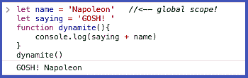

做同样事情的一个更实用的方法是定义一个接受输入、名称并返回直接输出的函数:

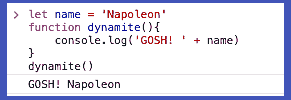

## 纯粹的功能，还有一点副作用(效果)

函数式编程就是声明性和显式的，并且拥有不可变的数据。(不变性是另外一种东西 [ES6 用‘let’和‘const’](https://thenewstack.io/fat-arrow-points-way-easy-es6-goodies-busy-js-devs/)，btw)带到 JavaScript 中)。这有助于避免副作用——也就是说，函数可能做的任何事情，除了接受您给它的输入、计算并返回输出。我们通过使用纯函数来做到这一点，纯函数是任何给定相同输入，将总是返回相同输出而没有副作用的函数。(例如: **Math.cos(x)** ，一个“内置”到 JaveScript 的数学函数，对于相同的 x 值，将总是返回相同的结果，因此是纯的)。

一个纯函数什么也不做，只接受它的输入，用它来计算输出，然后返回输出。麦克风掉落。

在上面的简单函数代码示例中，这不是一个纯粹的函数:它使用一个全局定义的变量来计算输出。让函数之外的东西参与函数本身的工作是最不纯洁的。(顺便说一下，从技术上讲 **console.log()** 也没有通过纯度测试，但是我们原谅这一点，因为它非常有用，而且也不太可能因为产生副作用而实际上搞砸我们的代码)。

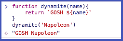

对 **dynamite()** 唯一重要的是我们给它的参数，它唯一返回的是它的输出。这意味着如果你想替换一个数组中的一个对象，你可以 **map()** 遍历它(参见 JavaScript 内置 **map()** 方法的函数搭便车指南)，然后 **map()** 返回一个全新的数组。您不需要替换同一数组中的对象，这在命令式编程中可能会发生。最终结果:您的结果总是如预期的那样，没有副作用，并且调试变得容易多了！所以，除非你喜欢在电脑屏幕前哭…

### 功能是一等公民。高阶函数尤其如此。

函数式编程在这种语言中运行良好的全部原因是因为 JavaScript 将函数视为值。因此，您可以将函数指定为值，并将它们作为参数传递。您甚至可以将另一个函数作为输出返回，并将其传递给另一个函数！

以其他函数为输入的函数称为高阶函数。在下面的示例代码中，注意 **vote()** 函数如何返回另一个函数作为输出。我们可以通过将外部的高阶函数赋给变量来访问这两个函数——但是我们的输入完全由嵌套函数控制，因此是不可变的。它们不在全局范围内:

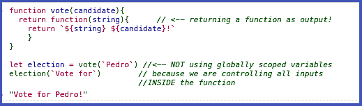

我们的“election”输入不在全局范围内的原因与闭包有关:闭包中定义的函数会记住它是在哪个代码块中创建的，因此将只接受也在同一个代码块范围内的输入。

花点时间坐下来好好想想。围绕函数返回函数(返回函数)的概念思考是用函数式风格编程的关键。我们需要更高阶的函数来避免我们习惯于从其他范例中使用的技巧。比如说…

## 不要迭代

在 JavaScript 中，尤其是 ES6 之前的 JavaScript，我们习惯于迭代数组和对象，并对其中的所有项进行操作。好 ol' **for()** 和 **while()** loops，我们在看你。

相反，在函数式风格中，我们使用高阶函数，如 **map()** 、 **reduce()** 和**filter()**——它们不仅接受您想要访问的对象或数组作为参数，还接受您想要应用于它们的任何函数作为参数。

女士们，先生们，我给你的地图减少三明治:

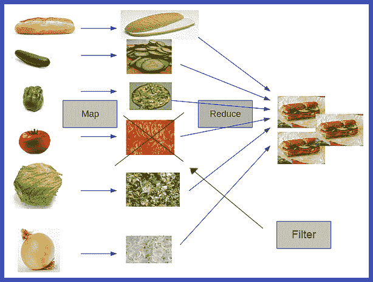

我们都知道怎么做三明治，对吧？所以你有一个数组，成分列表的形式。你需要改变每种成分，以便为三明治制作过程的下一步做好准备——比如我们想把它们切开或切碎。(“Slice”更像是我们在现实生活中所做的，但是我想避免与实际的 JavaScript **slice()** 方法混淆)。

在命令式 JavaScript 中，我们将运行一个“for”循环:对于这些成分中的每一种，执行以下操作:

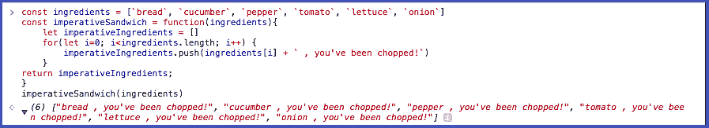

但是，在函数式风格中，我们采用 map()方法，向它传递配料数组和 chopped()函数，它返回一个新的列表，其中所有内容都已被切碎。Yum:

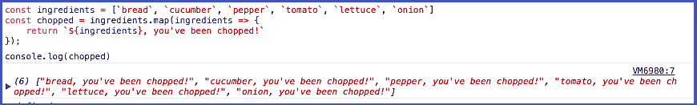

当比较两者时，很明显，使用函数式编程，我们的代码是可组合的、更干净的，并且是为匹配我们想要解决的问题而编写的。此外，没有奇怪的随机成分破坏我们的三明治的风险！

在所有的东西都被切碎后，我们可以使用 **reduce()** 方法将所有的东西组合成我们美味的三明治。

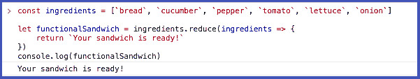

而且，如果你碰巧讨厌西红柿，有一个**过滤器()**的方法可以确保只有那些不是西红柿的东西才能通过过滤器。

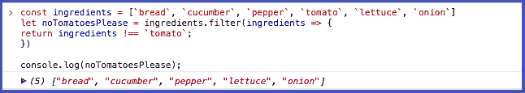

现在不要去改变。

函数式编程完全是为了避免可变性——也就是说，不要就地改变对象。(我们喜欢他们本来的样子)。不可变意味着数据一旦到位就不能被改变；我们可以把它设定好，忘记它，它永远不会改变。

让我们看一个例子。一、突变(不好！):

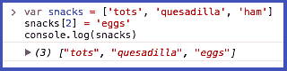

我们有一个“小吃”变量，包含 tots、墨西哥玉米饼和火腿，然后我们意识到，实际上，火腿应该是鸡蛋，所以让我们用“鸡蛋”替换“小吃”中的索引位置 2 这意味着“零食”变量已经被改变:也就是说，我们已经改变了存储在变量中的内容。没错。我们彻底改变了数据集。

函数式编程避免在对象或数组内部就地更改数据，因为这可能会导致许多意想不到的后果。事实上，它经常是面向对象编程中严重问题的根源。因为，如果您无意中更改了数据，您认为您正在处理的午餐——tots、墨西哥玉米煎饼、一些火腿——更像是一顿早餐，因为当您在代码的早期替换该数组元素时，火腿被换成了鸡蛋。这可能会引入一些很难追踪的大错误。想想看:在代码的某一点上，“零食”是正确的，而在另一点上“零食”是错误的——但它们都是“零食”

这就是函数式编程中不可变数据的美妙之处:跟踪您的零食:

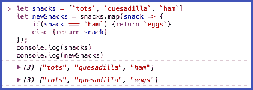

通过使用 **map()** 采用函数式编程方法，我们返回一个全新的数组 newSnacks，包含已更改的项目，而不是就地更改零食。这是通过向 map() ( < —高阶函数接受函数作为参数来实现的！)来查看“列表”(数组)中的每个小吃。如果是火腿，函数反而返回鸡蛋。否则，它返回原来的零食项目。一旦我们给这个 newSnacks 变量赋值，它就会保存我们所期望的美味佳肴，而我们最初的零食列表却丝毫没有改变。

是的，是的，我知道这看起来微不足道…但我保证数据不变性将帮助您避免许多令人头痛的问题。在你的电脑前哭泣。

## 我们才刚刚开始。

更多功能性编程友好且非常复杂的 JavaScript 工具在等着我们。例如，currying，它总是接受一个参数并返回另一个比较函数，然后返回一个参数，嵌套它们直到所有的参数都被应用。局部应用也很得心应手；使用 partial，我们将一个或多个参数应用于一个高阶函数，然后返回一个采用剩余参数的函数来完成应用程序。很好的东西，但是这些更多的是编程方法，而不是内置方法的直接应用。最好先从简单的核心概念开始。熟悉了 **map()** 、 **reduce()** 和 **filter()** 之后，才开始迷恋无脚本函数式编程。但是新的堆栈会在你准备好的时候回来给你指路！

采用这种方法需要改变我们理解 JavaScript 的方式，但是我真的相信学习和应用这种方法是值得的。函数式编程让我成为一名更好、也更自信的程序员。现在我发现很容易将一个大任务/代码块“分成”几个小块，使代码更加可靠和可预测。

要记住的唯一缺点是，一旦代码库变得非常大，就有可能开始出现效率问题:函数调用比那些愚蠢的简单循环更昂贵…昂贵，但通常是值得的。

<svg xmlns:xlink="http://www.w3.org/1999/xlink" viewBox="0 0 68 31" version="1.1"><title>Group</title> <desc>Created with Sketch.</desc></svg>