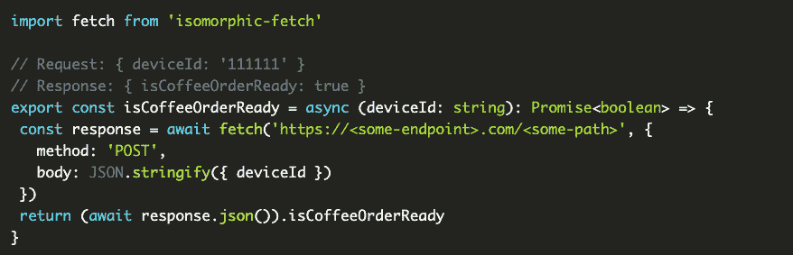
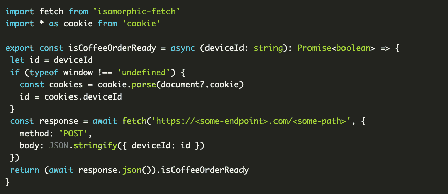
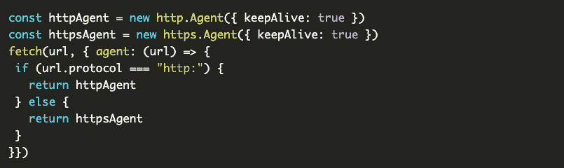
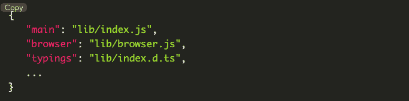
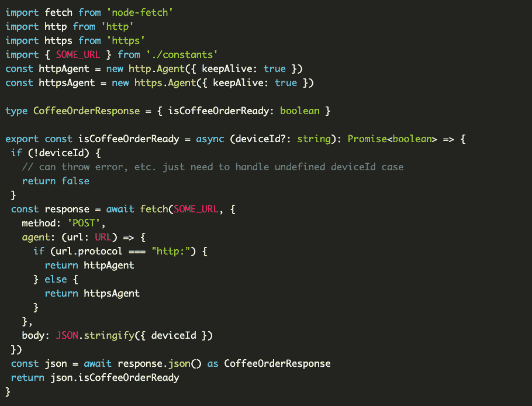
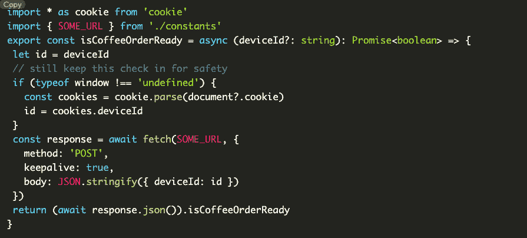

# Doordash 构建同构 JavaScript 库

> 原文：<https://thenewstack.io/doordash-building-isomorphic-javascript-libraries/>

在客户端和服务器端运行代码时，同构 JavaScript 库非常有用。构建它们伴随着许多挑战，包括添加正确的依赖项、创建在两种环境下相同的函数声明以及测试。任何同构库的成功创建或放弃包括不断的障碍解决或最终决定何时构建的复杂性超过后来的效率。

在线交付服务 [DoorDash](https://www.doordash.com/?ignore_splash_experience=true&&utm_source=Google&utm_medium=SEMb&utm_campaign=CX_US_SE_SB_GO_ACQ_TETXXX_9256288018_RSTRNT_+BR_ACQ_INMKT_GenDeliveryxx_EVG_CPAx_EXA_TZEST_EN_EN_X_DOOR_GO_SE_TXT_XXXXXXXXXX&utm_term=doordash&utm_content=91210141422&kclickid=_k_CjwKCAiAnZCdBhBmEiwA8nDQxbR985j6NZGj2PxhQiiWK1HILiryaW6JvRc6qGEGke6vImKbwOgyaxoCdfkQAvD_BwE_k_&utm_adgroup_id=91210141422&utm_creative_id=562233110360&utm_keyword_id=kwd-63454401416&gclid=CjwKCAiAnZCdBhBmEiwA8nDQxbR985j6NZGj2PxhQiiWK1HILiryaW6JvRc6qGEGke6vImKbwOgyaxoCdfkQAvD_BwE&gclsrc=aw.ds) 发现，通过同构，它的代码逻辑在多种环境下都能很好地工作。web 平台团队在几种 JavaScript 环境中编写代码，包括 [React](https://thenewstack.io/learn-react-start-of-a-frontend-dev-journey/) 和 [Node.js](https://thenewstack.io/what-typescript-brings-to-node-js/) 。为了进一步模糊界限，几个页面也正在经历从客户端到服务器端渲染的迁移，正如软件工程师 Nick Fahrenkrog 撰写的[博客文章](https://doordash.engineering/2022/12/06/five-challenges-to-building-an-isomorphic-javascript-library/)中所讨论的。

同构库的代价是构建起来有多复杂，效率有多高。说明这些挑战和大规模使用的技术的最佳方式是跟随 Fahrenkrog 构建一个虚构的同构库。

## **功能需求**

下面的例子是用 TypeScript 编写的。

是什么使得构建同构库具有挑战性？依赖于一个环境中的 API，而不是另一个环境中的。“获取”或“document.cookies”。其他挑战包括:

*   使用非同构的依赖关系。
*   客户端和服务器端行为不同的函数。
*   公开并非所有环境都需要的参数。

为了在 DoorDash 的例子中包含尽可能多的挑战，虚拟图书馆构建将**通过网络请求导出一个函数来检查咖啡订单是否准备好，并发送一个唯一的 id。**

范围:

—导出名为“isCoffeeOrderReady”的异步函数，该函数可以选择将“deviceId”作为参数，并返回一个布尔值。

*   向硬编码的端点发送请求正文为“{deviceID: <deviceid>}”的 http POST 请求。</deviceid>
*   在 Node.js 或浏览器中运行。
*   浏览器将直接从 cookies 中读取“设备 ID”。
*   使用保持活动连接。

讨论完细节之后，是时候深入探讨实现同构的五个主要挑战以及如何克服它们了。

### **挑战 1:选择正确的依赖关系**

*为了便于说明。这是节点< = 16，它不使用任何实验标志。节点 18 具有本地获取支持。*

浏览器可以支持 fetch，但是需要做出一个决定:同构库还是 Node.js 库？选择 Node.js 库，可能会仔细检查它对浏览器中的包大小的影响。选择同构，它需要满足每个环境对依赖性的要求…

DoorDash 选择了同构获取——node . js 中的 node-fetch 和浏览器中的 GitHub fetch polypill 的组合。下面的代码是获取请求的一个例子。



注意:为了简洁起见，许多重要的细节如重试和错误处理将被忽略。

下一个分歧是处理“deviceId”。“deviceId”是在 Node.js 环境中通过 fetch 请求发送的参数，但在浏览器中，它是直接从 cookie 中读取的。

窗口应该总是在浏览器中定义，而不是在 Node.js 中全局定义，所以 document.cookie 是在窗口中定义的。代码现在看起来如下图所示。



这不是检测代码是在服务器上还是在客户机上的唯一方法，尽管这是一种流行的方法。更多信息可在[这里](https://stackoverflow.com/questions/49411796/how-do-i-detect-whether-i-am-on-server-on-client-in-next-js)找到。

这个新的代码文件增加了另一个挑战。

### **挑战 2:设计环境间的统一 API**

“deviceId”参数在 Node.js 中是必需的参数，但在浏览器中不是。在进一步讨论之前，函数声明在两种环境中必须是相同的。两种可能的解决方案是:

**如图写 API，需要“deviceId”。** *注意*此操作可能会误导采纳者，因为该值必须在浏览器中传递，即使它会被忽略。

**使“设备 Id”可选。**这允许在浏览器中调用不带参数的函数，在 Node.js 中调用带参数的函数。这里的*注意*是它也可以在 Node.js 中被调用，而不需要参数。TypeScript 不能防止 API 的滥用。

第二种方法是更好的选择，但它不是万无一失的。

### **挑战 3:确保依赖关系只影响预期环境**

“document.cookie”代码更改引入了另一个问题。“Cookie”安装在 Node.js 中，不在代码路径中使用。在 Node.js 中拥有不必要的依赖比在浏览器中更好，但最好尽可能避免它们，并以最小的包大小为目标。

这个过程有两个步骤:分离代码文件，一个用于 Node.js，一个用于 browser，然后使用支持树抖动的捆绑器(比如 webpack)。

选择正确的依赖关系的重要性。node-fetch 实现了与本机浏览器 fetch 不同的规范，其中一个不同之处是保持活动连接。添加以下标志以在浏览器获取中使用保持活动连接:

```
fetch(url,  {  ...,  keepalive:  true  })

```

在节点获取中创建“http”和/或“https”http。代理实例，并将其作为代理参数传递给获取请求，如下所示:



在 Node.js 环境中，不能使用同构获取来正确设置保持活动连接，因为同构获取在内部使用 node-fetch，但不公开代理选项。为了正确设置保持活动连接，需要使用本地提取和节点提取库。

这可以通过按照特定于环境的代码路径分割入口点来实现。



这是用 TypeScript 设置的 webpack。

独立的入口点是可以接受的，但是为了与同构库的目标保持一致，只能使用一个 TypeScript 类型声明文件，以公开相同的 API，而不管环境如何。

这里列出了其他使用这种模式进行同构获取的同构 JavaScript 库。

最终的代码路径如下所示，记录在 *index.ts* 文件中。



…在*浏览器. ts* 文件中:



至此，这个库的功能需求就完成了。同构的全部好处没有展示出来，因为共享代码很少，但是在更大的项目中，共享代码的机会更多。确保导出的所有内容都具有完全相同的 API 也很重要，因为只发布了一个类型声明文件列表。

### **挑战 4:测试每个环境**

测试每个环境在很大程度上是编码的蔬菜:即使你不想这样做，这对你也有好处。测试同构库时要考虑的一个关键因素是，大多数测试需要编写两次，以确保两个环境中存在相同的功能。因为同构耦合了所有环境中的逻辑，所以一个环境中的变化需要在另一个环境中测试。

### **挑战 5:可观察性和指标**

在这两种环境中，可观测性的基础结构看起来非常不同。Node.js 可以扩展为捕获延迟、错误率、日志警告和带有上下文的错误，以帮助跨微服务进行跟踪，而浏览器可能只扩展为捕获错误。前面详述的相同的问题解决模式可以解决这些差异。

### **最后的想法**

在构建虚拟图书馆的过程中出现了几个挑战，但它们都是可以解决的。权衡利弊后，我们找到了解决方案。这是一种方法的一个例子，快速的谷歌搜索显示了关于这种同构的无穷无尽的信息和深度。

<svg xmlns:xlink="http://www.w3.org/1999/xlink" viewBox="0 0 68 31" version="1.1"><title>Group</title> <desc>Created with Sketch.</desc></svg>