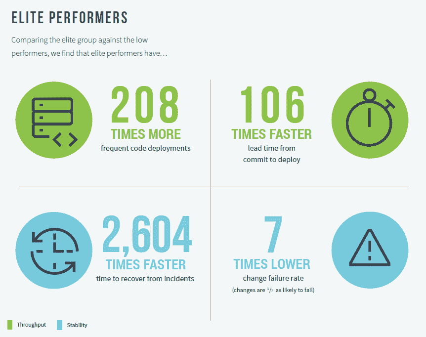
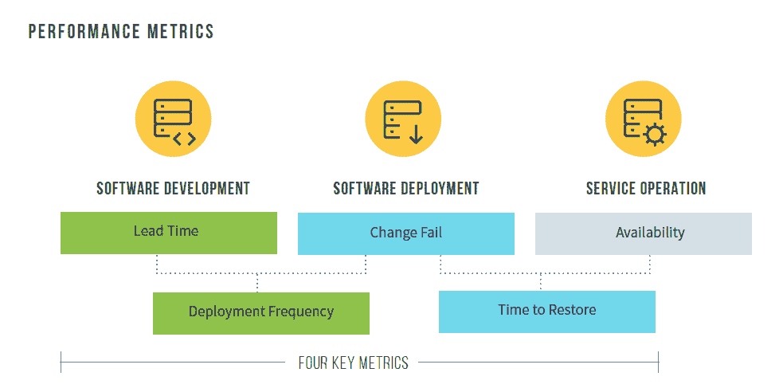
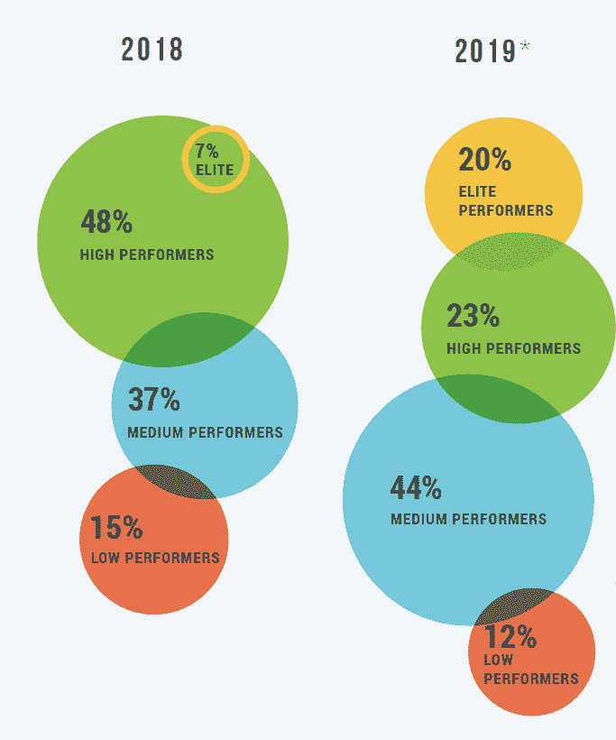

# DORA 2019: DevOps 努力改进，但没有完成

> 原文：<https://thenewstack.io/dora-2019-devops-efforts-improving-but-not-done/>

DevOps 行业作为一个整体正在提高其交付软件的速度和稳定性，尽管一些公司似乎将其视为一个一次性的项目。

这是 [2019 加速发展状况](https://cloud.google.com/devops/state-of-devops/)报告的发现之一。

[devo PS Research and Assessment(DORA)](https://devops-research.com/)，去年[被 Google 收购](https://devops-research.com/2018/12/dora-joins-google-cloud/)，将学术水平的严谨应用于软件交付性能的研究。其核心指标——从提交到生产的交付周期、部署频率、变更失败率和平均恢复时间——已经成为许多公司用来衡量其绩效的基准，也是 CloudBees 即将推出的[软件交付管理](https://thenewstack.io/cloudbees-expands-into-software-delivery-management/)产品等软件产品的一部分。

DORA 使用这些指标对公司进行从低到高的排名。今年，精英群体与高绩效群体决裂，从 7%增长到 21%，几乎翻了三倍。表现差的群体缩小了，但是，令人担忧的是，表现好的群体从 48%下降到 23%，而表现中等的群体从 37%上升到 44%。

这项研究是完全匿名的，所以没有公司被特别点名。这项研究在全球有超过 31，000 名参与者。

“[我们发现]你不必为了稳定而牺牲速度，也不必为了速度而牺牲稳定。DORA lead 的前大学教授 Nicole Forsgren 博士说:[连续六年，我们发现技术推动商业价值。](https://www.linkedin.com/in/nicolefv/)

“这表明这种精英表演对每个人都是可能的，你只需要执行。我说‘只是’，”她笑着补充道。“这是一项艰苦的工作，但我们会告诉你你必须做什么。”

有一小部分高绩效者又回到了中等绩效群体，这不能被认为是一件好事。

“你不能固步自封，说‘我已经成功了！她说，“我在高绩效的 DevOps 团队工作，我不干了。”她补充说，这可能是因为公司正在努力应对日益增长的复杂性，投资被削减，或者领导层目光短浅。

“如果技术是推动最终用户和客户价值的因素，那就没有意义。你为什么会停止投资于能够创造价值的技术？”她说。

“一些组织认为他们将进行‘转型’，当转型完成时，他们就完成了。他们转向云。他们检查他们的盒子。他们额头上有金色的星星。搞定了。事情不是这样的。”

报告的其他重要发现:

*   表现最好的人达到或超过其组织绩效目标的可能性是其他人的两倍。
*   在组织中扩展 DevOps 的最佳策略是关注在低级别和高级别构建社区的结构化解决方案。
*   云仍然是精英执行者的一个优势，并推动高性能。
*   组织可以进行明智的投资来提高生产力。
*   其中一项投资是改进变更审批流程，只有管理层能够控制这项投资。

今年的报告有一个关于提高生产率的新模式。

Forsgren 说，你不能用产出、代码行数、故事点或被压扁的 bug 来衡量生产率。

“我可以写很多行代码，但我会让软件变得臃肿，增加技术债务。你不能做故事点，因为你会有一个团队拒绝帮助另一个团队，因为这将减少故事点，”她说。

“因此，我们从谷歌和微软研究院的一些工作中发现，衡量生产率的最佳方式实际上是让人们说，‘我能够不受干扰、不受干扰地完成复杂、耗时的任务。’“我们理解，如果我们有这样的一天，”她说我们知道什么时候会有那些日子。"

当你在这样的日子里到达那个区域，你可以带着非常满足的感觉回家。她说，你不会永远纠结于你没有完成的事情。它也有助于防止倦怠。我们希望富有成效，但我们也希望工作/生活平衡。这是一个重大问题。她指出，世界卫生组织今年正式承认了倦怠。

组织可以进行明智的投资来支持这种类型的生产力。一是支持心理安全文化。另一个是投资好的、易于使用的工具。

传统上，我们不认为这是我们必须做的事情。我们认为他们是专家，他们能想出任何工具。但他们正在做如此复杂的工作，如果我们能给他们有用、易用的工具，他们可以专注于复杂的工作，而不是工具，她说。

内部搜索也很重要。如果员工能够找到他们正在寻找的信息，那将有助于加快工作速度。这是像 Lyft 的 [Amundsen](/lyfts-amundsen-data-discovery-with-built-in-trust/) 这样的项目着手解决的问题。

外部搜索也同样重要，比如堆栈溢出或 YouTube。一些组织专门锁定 Stack Overflow 或 YouTube，限制员工获得他们可能需要的帮助。她说，开源还开启了一个用户和解决方案的免费社区。

【T2

对最高绩效者的跟踪发现，在组织内扩展 DevOps 的最佳策略包括在所有级别建立社区。这并不意味着道场或卓越中心，它们只会制造更多的筒仓。她称 dojos 为“不去”，理由是缺乏证据表明这种学习转化为工人的“真正工作”。

对于资源有限的组织，她敦促在转移到更大的项目之前，找到可以投入足够资源的较小项目。

<svg xmlns:xlink="http://www.w3.org/1999/xlink" viewBox="0 0 68 31" version="1.1"><title>Group</title> <desc>Created with Sketch.</desc></svg>