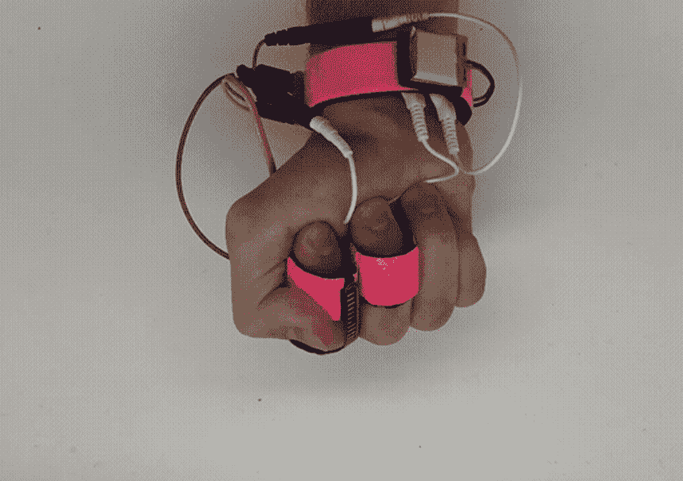
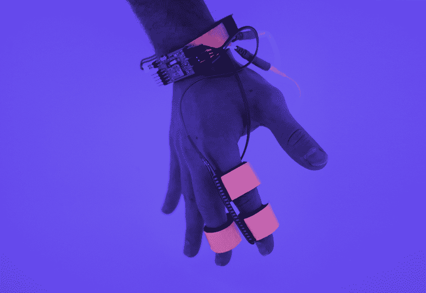

# 多米奥:麻省理工学院的睡眠界面系统控制梦境，增强创造力

> 原文：<https://thenewstack.io/dormio-mits-sleep-interface-system-controls-dreams-augments-creativity/>

数千年来，清醒和睡眠之间的过渡状态一直吸引着科学家和创新者。许多人都被称为睡眠痛，他们对这种介于睡眠开始前的意识状态着迷——从古代哲学家亚里斯多德，现代艺术家萨尔瓦多·达利，到发明家尼古拉·特斯拉和托马斯·爱迪生。这是一个生动的领域，在我们陷入深度睡眠之前，幻觉、半清醒的梦和其他流畅的创意可能会浮现出来。

因此，历史上发明家和创造者试图获得并保持更多进入这种状态的机会是有道理的——这是灵感和狂野创意的潜在来源，可能在其他地方无法获得。为这种梦幻般创造力的神秘状态提供立足点的是 [Dormio](https://www.media.mit.edu/projects/sleep-creativity/overview/) ，这是由[麻省理工学院媒体实验室](https://www.media.mit.edu/)开发的原型，它提供了一个系统，用于在睡觉前与这种短暂状态进行交互，以加强对人的梦的控制。

[https://www.youtube.com/embed/joYEbU2R57Q?feature=oembed](https://www.youtube.com/embed/joYEbU2R57Q?feature=oembed)

视频

由麻省理工学院研究生亚当·霍罗威茨领导的 Dormio 项目的灵感来自于爱迪生如何侵入这种半清醒状态以激发其创造力的故事。众所周知，爱迪生白天会小睡片刻，手里拿着钢珠。在这些小睡期间，爱迪生会故意进入催眠状态，体验“微梦”，这通常会提供对设计问题的更深入的见解。过了一段时间，当他正要入睡时，爱迪生的手会放松，随着一声巨响将这些钢珠释放到地面上，有效地在他真正进入更深的睡眠阶段之前唤醒了他。正如霍洛维茨在他的网站上写的:

“在这个项目中，我们将钢珠技术现代化。[..有了这个 Dormio 系统，我们第一次能够影响、提取信息并扩展催眠微梦。Dormio 系统使用生物信号来寻找从睡眠过度到更深的、无意识的非快速眼动睡眠阶段的过渡。它使用音频打断了这种过渡，但将这种音频作为一种机会——因为过去的工作表明，催眠梦受外部音频的影响。因此，你的唤醒触发器就成了你的梦。”

根据[主板](https://motherboard.vice.com/en_us/article/ywxjvg/steel-ball-control-dreams-dormio-mit-hypnagogia)的说法，该团队当前版本的 Dormio 需要用户戴上一只配备有[弯曲传感器](http://www.sensorwiki.org/doku.php/sensors/flexion)(也称为弯曲传感器)的手套，该传感器可以测量用户的手弯曲传感器所导致的偏转量。该系统还包括对诸如心跳之类的生物信号的监控。

在该小组的实验中，六名戴着手套的参与者被指示在清醒时躺下并握紧双手。随着他们逐渐开始入睡，他们的手会放松，手套的传感器会指示肌肉紧张度下降，然后会触发一条定制的音频消息播放——可以是智能手机应用程序，也可以是联网的机器人——这将促使他们想起一些特别的事情。

在这项研究中，当志愿者进入催眠状态时，他们被提示去思考叉子或兔子。在这段时间里，大脑的前额叶区域不太活跃，导致“自我审查”减少，发散思维增加，对参与者想象的景象和声音进行自由联想——其中一些是口头表达的，并由应用程序或机器人记录下来。

一旦这个人似乎从催眠状态过渡到更深的非做梦睡眠阶段，就会播放另一个信息来唤醒他们。进一步的测试包括志愿者在他们的 Dormio 会议后构思一个有创意的故事，并与没有使用 Dormio 的控制案例进行比较。最终结果表明，在使用 Dormio 系统后，大多数志愿者确实体验到了某种创造力的提升和更多的动力。

该团队目前正在研究一种侵入性更小的 Dormio 版本，该版本可以通过监测眼睑运动来检测睡眠过度。无论如何，Dormio 是麻省理工学院研究人员正在研究的各种“睡眠界面”之一——毕竟，我们一生中有三分之一的时间在睡觉，这些模糊的无意识和做梦状态是我们尚未完全探索的最后一个真正的前沿领域，更不用说控制了。最终，毫无疑问，这种与这些伟大的未知事物互动的系统将被证明对我们作为一个物种的集体进化具有深远的意义。

<svg xmlns:xlink="http://www.w3.org/1999/xlink" viewBox="0 0 68 31" version="1.1"><title>Group</title> <desc>Created with Sketch.</desc></svg>