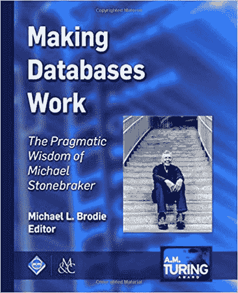

# 迈克尔·斯通布雷克博士:数据库系统简史

> 原文：<https://thenewstack.io/dr-michael-stonebraker-a-short-history-of-database-systems/>

谈到了解数据库系统的基础知识，可能没有比 T2 的迈克尔·斯通布雷克博士更好的人了，他和尤金·王一起在 1974 年创建了第一个工作的关系数据库系统 INGRES。更值得注意的是，在此后的 40 年里，他一直与数据库系统的发展保持同步。

在加州大学伯克利分校，他很快继续扩展 INGRES 的工作，开发一个对象关系数据库管理系统 Postgres。后来，在麻省理工学院，他参与设计了 Aurora/Borealis 流处理引擎、面向 C-Store 列的 DBMS、H-Store 事务处理引擎(后来成为 VoltDB)、SciDB 阵列数据库管理系统和 Data Tamer 数据管理系统。目前他担任 [VoltDB](https://www.voltdb.com/) 的顾问和 [Paradigm4](https://www.paradigm4.com/) 和 [Tamr](https://www.paradigm4.com/) 的首席技术官。

目前，他是麻省理工学院计算机科学的兼职教授，是专注于大数据的英特尔科技中心的联合主任。

2014 年，[计算机械协会](https://www.acm.org/)授予 Stonebraker】图灵奖，这是 ACM *最负盛名的技术奖项*，旨在表彰对计算具有持久重要性的重大贡献。该组织现在正在委托撰写关于每位获奖者的书籍，从斯通布拉克开始。今年 1 月出版的《[让数据库发挥作用:迈克尔·斯通布雷克的务实智慧》(精装本 119.95 美元/平装本 99.95 美元/电子书 79.96 美元，ACM 会员免费阅读](https://www.amazon.com/Making-Databases-Work-Pragmatic-Stonebraker/dp/1947487167/ref=sr_1_1?ie=UTF8&qid=1549040750&sr=8-1&keywords=%22Making+Databases+Work%22))，是斯通布雷克和该领域其他人的论文汇编，涵盖了他的工作以及它如何改变了计算。

我们与 Stonebraker 讨论了在过去几十年中是什么因素推动了数据库管理系统的发展，以及他对未来几年数据管理技术发展的看法…

** 出版一本关于你一生工作的书是什么感觉？**

这本书是由 ACM 委托的，它旨在反思我为什么会获得图灵奖。因此，当我在 2014 年获奖时，我的书实际上是关于每位图灵奖获得者的系列书籍中的第一本。所以，不管怎样，我喜欢这种方法；它从各个角度审视我的作品。这本书是由我的同事迈克尔·布罗迪编辑的，他征求了许许多多人的意见。所以你得到了很多视角。

**总体而言，在 20 世纪 70 年代甚至 80 年代，您是否意识到数据会像现在这样重要？**

啊，不。我的意思是，简单的答案是，在 20 世纪 70 年代，只有一个数据库市场，基本上是商业数据处理。数据管理的整体目标是让业务数据库更好地工作。关系数据库最初就是以此为目标设计的，直到 1990 年左右，这才是人们真正看到的唯一市场。然后我想在接下来的 15 年里，大多数人都会想到他们需要一个数据库系统。

因此，在过去的 10 到 15 年里，数据管理的需求变得无处不在。

**优秀，优秀。你多次指出，一种尺寸不能适合所有人。**

那是绝对正确的。我认为，当你听到大数据这个词时，它真正的意思是，本质上每个人都有一个大数据问题。无论是科学家记录数十亿字节的实验数据，无论是社交媒体人试图找出人们社交媒体言论的变化，无论是英国人计算逗号或句子结构，我认为本质上每个人都有大数据问题。

业务数据处理对关系数据库非常满意，但是对于所有人来说，一种尺寸并不适合所有人。因此，我认为在过去的 20 年里，替代数据管理解决方案出现了名副其实的爆炸式增长。

在这次采访之前，我不知道你和 Eugene Wong 已经创建了第一个关系数据库，第一个工作模型。

那是，嗯，那是在 70 年代早期到中期。Ted Codd 在 1970 年写了他的开创性论文，他说你应该将数据管理视为表，最简单的数据结构，然后用高级语言访问它们。这意味着 SQL。这些在当时是革命性的想法，与所有现有的数据管理系统背道而驰。

很快，在认为 Ted Codd 的想法看起来很棒的相关人士和认为你不可能构建一个高效的传统主义者之间展开了一场大辩论——即使你可以，也没有人能理解这些新奇的语言。

构建一个关系数据库系统是一件显而易见的事情。在 70 年代早期到中期，有两个主要的原型被制造出来。一个是 INGRES，是我和 Eugene Wong 在伯克利做的。另一个是由 IBM 研究院开发的系统 R。这是 70 年代的两个全功能的工作关系数据库系统。

所以 INGRES 和 System R 绝对是为商业数据处理而设计的。事情是这样的，在 80 年代早期的研究团体中，人们说哇，这种关系看起来棒极了。我会试着把它应用到计算机辅助设计或者图书卡目录上，或者点，点，点。

当你试图将关系数据库应用于不同的领域时，关系数据库基本上失败了。问题不在于关系模型，而在于 INGRES 和 System R 支持的数据类型是浮点数、整数、字符串、货币，而这正是业务人员想要的。但是如果你想建立一个地理信息系统，你需要点、线、多边形之类的东西。

因此 Postgres 的一个基本思想是让用户拥有他想要管理的任何基本数据类型，而不要通过坚持将它们应用于业务数据处理来预定义它们。

> “回过头来看，仍然很难理解一个研究生，他的论文探索了随机马尔可夫链的数学，他没有构建软件产品的经验和有限的编程能力(实际上，我相信没有)，如何最终帮助启动一个全新的 cs 研究领域以及一个每年 500 亿美元的行业。”— David J. Dewitt，[“让数据库发挥作用”](https://www.amazon.com/Making-Databases-Work-Pragmatic-Stonebraker/dp/1947487167/ref=sr_1_1?ie=UTF8&qid=1549040750&sr=8-1&keywords=%22Making+Databases+Work%22)

所以整个想法是扩展关系系统的范围，Postgres 正是这么做的。这是 20 世纪 80 年代的重大进步之一。

在 20 世纪 90 年代，零售业有了一个好主意，那就是记录连锁店中每个商店的任何收银台下的所有东西，并将这些历史记录保存在现在被称为数据仓库的地方。

买家与这个数据仓库互动，发现，例如，宠物石头过时了，芭比娃娃流行了。所以你可以利用这些信息来周转股票，你知道，把宠物石拿到前面来打折，把美泰和芭比娃娃的大订单捆绑在一起，这样你的竞争对手就买不到了。所以基本上股票轮换。

更好的股票周转在六个月内就支付了这些历史数据仓库的成本。但问题是，访问模式非常不同，您不希望按照人们过去的方式组织数据。

**你也帮助创建了 Vertica…**

所以我开始研究 Vertica 的学术先驱，叫做 C-Store。您可以将一个表想象成一堆行和列，在此之前，所有数据库系统都是将数据一行一行地存储在存储器中。事实证明，如果你一列接一列地组织数据，数据仓库查询的速度会更快——换句话说，把你的思维旋转 90 度。

随着时间的推移，所有数据仓库产品都演变成了所谓的列存储。他们仍然像以前一样运行 SQL 只是存储组织有很大的不同。

因此，Vertica 是一个很好的例子，即使在关系模型中，也说明了一种尺寸并不适合所有人。有些问题最好由行存储来解决，有些问题最好由列存储来解决。

我刚刚听了您最近的一次讲座，您提到数据分析师最终将被数据科学家和新一轮数据驱动分析所取代？

因此，数据仓库面向面向面向客户的历史数据记录。商业智能人员可以访问仓库，他们试图做更好的库存周转，或者更好地了解他们的客户，等等。这与数据科学家想要做的事情非常非常不同。

有一个新兴的数据库系统用户群体，他们自称为数据科学家。我最喜欢的数据科学应用的例子是我三四年前听的一家初创公司的商业推介。他们和拉斯维加斯的一家大酒店合作。酒店希望每晚客房收入最大化。这显然是每个酒店都想做的。你可以降低价格，住满房间，或者你可以收取高价格，有很多空房间，或者你可以实行动态定价，根据提前多长时间，你住满了多少，以及诸如此类的东西，你向人们收取多少费用。

因此，如果你是一名数据科学家，标准的智慧是说:为什么我不收集大量历史数据，为什么我不收集许多其他特征，比如现在有多少游客在拉斯维加斯，天气如何，等等。等。

> “2009 年，Mike 对 MapReduce 进行了著名的批评，令大数据社区懊恼不已，但五年后，当其创造者披露 Mike 的批评与他们放弃 MapReduce 和 Hadoop 以寻求自己制作的另一轮大数据管理解决方案时，这一批评被证明是正确的。”—迈克尔·布罗迪，[“让数据库工作”](https://www.amazon.com/Making-Databases-Work-Pragmatic-Stonebraker/dp/1947487167/ref=sr_1_1?ie=UTF8&qid=1549040750&sr=8-1&keywords=%22Making+Databases+Work%22)

所以你有很多特征，例如，天气，历史上的平均温度。和历史酒店入住率。你有很多功能，你有尽可能多的历史。然后，您希望为这些特征建立一个预测模型。预测模型希望根据所有这些不同的特征来预测酒店入住率或您希望收取的价格。因此，如果你可以拟合一个模型，然后看看模型的输出，你就可以根据这个预测模型的建议来设定你的价格。

这是数据科学家做的一种事情。与数据仓库或在线交易处理相比，这是一种非常非常不同的活动。

假设我有一个数据仓库，它会告诉你现在卖什么。还有一整套商业智能工具，可以让你查找更多的历史数据，并按照你想要的方式进行分割，获得一些商业洞察力。所以这些人被称为业务分析师。但是如果你把完全相同的数据交给一个数据科学家，他会说，我会为你建立一个预测模型，预测什么会畅销，然后你就可以做正确的事情。

有了商业智能的人，你会得到一大张数字表；有了数据科学家，你就有了预测模型。

如果你是这家公司的首席执行官，你会选择哪一个？你宁愿要预测模型。因此，未来十年或二十年将会发生的是，数据科学家将取代商业分析师，成为检查零售数据的人。此外，数据科学家会做所有其他的事情。因此，这将是一个更大的市场，也将淘汰当前的业务分析师。

**在你的一个新项目中，你与一家从事机器学习的公司合作，进行数据准备和数据清理，对吗？**

好吧，让我给你举个简单的例子。你知道什么是采购系统吗？

**哦，是的，是的，非常喜欢，是的。**

好的，如果你为一家公司工作，你想买一些回形针，你去你的采购系统。你输入一大堆关于向谁收费的东西，采购系统就会吐出一个采购订单。你把它拿到史泰博，他们会给你回形针。

好吧，所以任何公司都应该有一个采购系统。好吗？

是的，从逻辑上来说，是的。

所以通用电气有 75 个。

通用电气的首席财务官做了如下观察。如果你是这 75 名采购人员中的一员，当你与史泰博的合同到期续签时，如果你能弄清楚你的 74 名同行谈判的条款和条件，并要求“最惠国待遇”，那每年就值 1 亿美元。

所有这些不同的采购系统的原因是通用电气是非常部门化或筒仓化的。如果某个部门购买了大量回形针并获得了更好的价格，那么其他部门也会购买。

因此，事实证明，这 1 亿美元基本上都在长尾中，你想要的是不要买太多，找到买得更多的人，然后要求他们的条款。

所以这 75 个采购系统中的每一个都有一个供应商数据库。为了设法每年节省这 1 亿美元，您必须集成或统一这 75 个独立构建的数据库，总共有大约 900 万个供应商。

所以，这些都是独立建造的。没有全局键的概念。没有唯一供应商 ID 的概念。你知道，你必须用不完善的数据拼凑出相同的顾客是谁。因为在你的数据库里，可能是史泰博公司，地址在盖瑟斯堡。在我的数据库里，它只叫 Staples，地址在波士顿。

因此，目前的公司 [Tamr](https://www.tamr.com/landing-pages/master-data-management/) 所做的，是大规模地统一这些不同的数据库。换句话说，所有的企业都是孤立的，这样他们就可以把事情做好。所以他们分成业务单元，这样他们就可以获得敏捷性。

但是事后来看，将数据放在这些不同的筒仓中有很大的好处。这就是 Tamr 所做的，这是一个人工智能机器学习系统，它将实际上是同一件事情的两种表现形式拼凑在一起。

**所以它做数据清理或主数据管理，但你不必坐下来或写下所有的具体规则，这个 Staples 等于那个 Staples…**

是的，因为问题是主数据管理是一个非常成熟的领域。你说了这东西是怎么工作的。你写了一堆规则，说“这个和那个是一样的。”问题是，在这种规模下，这是行不通的。众所周知，这是行不通的。

举个简单的例子。通用电气公司，我猜这可能是在某一年，有 2000 万消费交易。他们有一个支出分类系统。你可以花在零件上，也可以花在服务上。零件可以是计算机，计算机可以是内存，等等。因此，他们有一个分类层次结构，他们想要做的就是将 2000 万笔消费交易归入这个层次结构。

因此，他们开始编写规则，完全按照主数据管理建议的方式，他们编写了 500 条规则。利用这 500 条规则，他们从 2000 万笔交易中分类出 200 万笔。

好吧，呼。所以很小的一部分，10%。

500 条规则是一个人最多能知道的。我从未见过有 5000 条规则的规则系统，因为这项技术无法扩展。因为人类无法理解大量的规则。

因此，传统的主数据管理无法大规模运行。所以 Tamr 所做的是，事实上，他们采用 GE 编写的 500 条规则，使用 200 万条这样的分类记录作为预测模型的训练数据，他们将预测模型拟合到 2000 万条消费记录，并使用 200 万条作为训练数据对 2000 万条记录进行分类。

所以机器学习会扩展，规则系统不会扩展，所以 Tamr 是一个机器学习系统，它的设计完全是因为人们想解决大问题。

**这听起来像是人工智能的一个增长领域。**

另一个简单的例子是欧洲的汽车公司丰田。所以从历史上看，丰田是按国家来分配汽车的。一家西班牙子公司，一家法国子公司，等等。所以问题是，如果你在西班牙买了一辆丰田，然后你搬到了法国，丰田就会患上健忘症。因为你是西班牙顾客，法国人不知道你是谁。

因此，丰田正在将来自 40 种语言、250 个不同数据集的 3000 万欧洲客户统一到一个统一的客户数据库中，以便他们能够提供更好的客户服务。另一个巨大的机器学习应用。

这种数据统一或数据集成或数据清理，数据准备，都是相同的东西，就是把不同的数据集放在一起。现在的情况是，除了每个人，每个人都有这个问题。

因为每个人都想把事情做好。有趣的是，在机器学习之前，大规模进行数据集成并不划算。有了 ML，你打开了一个全新的市场，能够大规模地做这些事情。

**我注意到，在我们讨论的所有这些创新中，在过去的几十年中，驱动力一直在为组织寻找赚钱或省钱的新途径，但无论是哪种情况，你都在接近一个非常具体的问题……**

我的观点(并不是每个人都同意这个观点)是，你可以说我要做一个锤子，然后我要去看看是否有人有钉子。这就是寻找想要创新的人的创新。我的观点是“那叫理论研究。”如果没有人想要你正在建造的东西，那么对我来说它就不值得做。

所以我花很多时间和有真正问题的人交谈。你知道，找出他们不喜欢当前解决方案的原因，然后找出如何做得更好。因此，它变成了客户驱动，而不是创新驱动。

<svg xmlns:xlink="http://www.w3.org/1999/xlink" viewBox="0 0 68 31" version="1.1"><title>Group</title> <desc>Created with Sketch.</desc></svg>