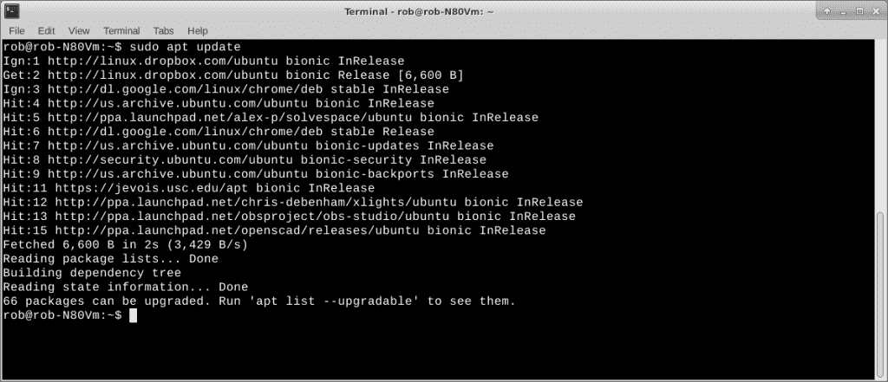
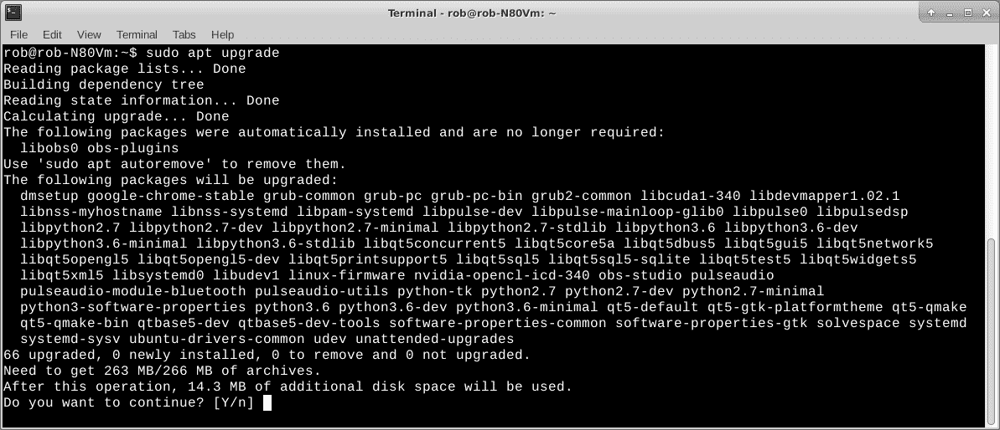
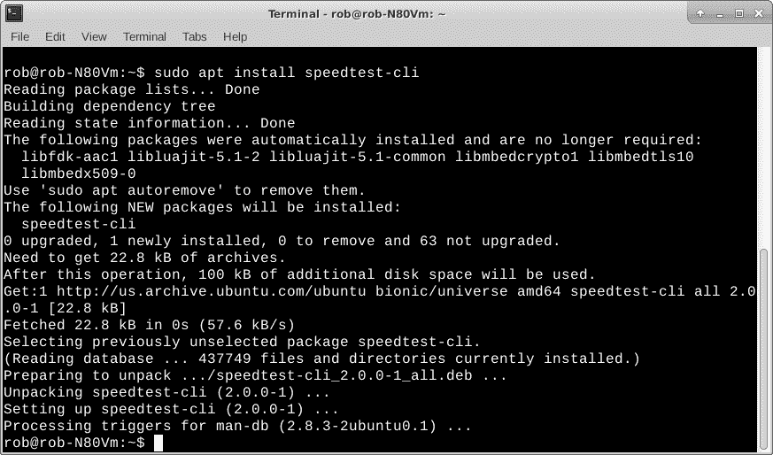
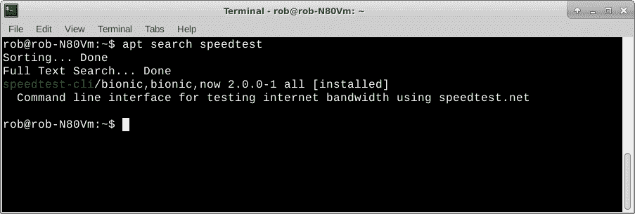
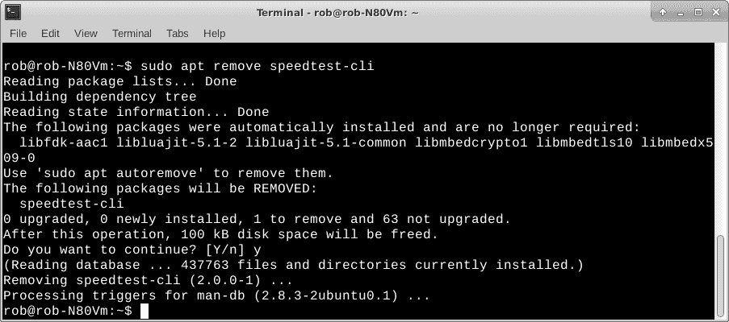

# Torq 博士:使用 APT 的基本 Linux 应用程序管理

> 原文：<https://thenewstack.io/dr-torq-basic-linux-application-management-with-apt/>

在安装了基于 Debian 或 Ubuntu 的 Linux 发行版之后，运行一些命令来确保您的机器上有最新的文件和应用程序总是一个好主意。如果你正在使用众多可用桌面中的一个，你可能只需要一个应用程序管理器，像[新立得](https://help.ubuntu.com/community/SynapticHowto)来更新一切。

我喜欢在工作中使用 Linux 命令行，所以当添加新的应用程序或升级某些东西时，我只需通过一个名为 **[APT](https://help.ubuntu.com/lts/serverguide/apt.html)** (“高级包工具”，它与 Debian 风格的软件包(包括 Ubuntu)一起工作)的程序来完成。Red Hat 有一个叫做 RPM 的打包方案，它可以通过一个叫做 **yum** 的程序来管理。我更喜欢 Debian 风格的系统，因为它在许多硬件平台上都是一样的。我的华硕笔记本上的 Xubuntu，以及我的树莓 Pi 小工具的 Raspbian Linux 都是 Debian 的衍生物。我使用的基于 Debian 的 Linux 构建包括作为标准包的 **apt** 。

今天，我们将介绍我如何使用 **apt** ，无论是设置 Linux 笔记本、服务器还是嵌入式计算设备。

## 重要的事情先来

apt 程序在你的 Linux 设备上维护一个已安装和可安装程序的列表。作为习惯，在安装或升级任何程序之前，我喜欢确保 **apt** 包列表尽可能是最新的。 **Apt** ，带更新选项，检索您的特定 Linux 版本的最新软件列表，检查您的系统上有什么版本，然后更新您机器上的列表。如果您在 *apt 升级*或 *apt 安装*之前没有运行 *apt 更新*，您可能无法在最近添加的存储库中获得程序的最新版本、重要的程序安全补丁或某些专业程序。它非常容易使用。

`rob% sudo apt update`

Apt 需要系统级的许可来改变程序和文件，所以我们使用 **sudo** 来实现这个目的。在执行该命令之前，请确保您已连接到互联网，否则您不仅无法获得最新的软件列表，也无法下载任何更新的文件。

apt 更新列表

使用*apt–help*，您总是可以获得 **apt** 命令选项的文本摘要。

`rob% apt --help`

## 提升

将我现有的软件升级到最新最好的版本与更新软件列表是齐头并进的。这是通过 **apt 升级**命令完成的。

`rob% sudo apt upgrade`

**Apt 升级**分析您机器上的软件列表，检查依赖性，下载新版本的应用程序、系统程序和其他杂项软件，然后继续安装使您的机器保持最新所需的软件。它可能会询问是否允许继续。 **Sudo** 将要求您输入常规用户密码，并将 **sudo** 配置为允许您的用户名进行系统级访问。

Apt 升级列表

在最近的系统安装后进行升级可能需要一些时间，并且取决于许多不同的因素。例如，在我的古董华硕笔记本上升级 Xubuntu Linux 的 T7 可能需要 5 到 10 分钟。这不合理吗？没有真正考虑到我将在一台 10 年以上的机器上运行最新的 Linux 稳定版本。用 Linux 之外的任何东西做这件事可能都是不合理的。

一款新的多核英特尔笔记本电脑，拥有数十亿字节的内存、固态硬盘和快速互联网连接，速度应该相当快。在硬件领域的另一端，nano-Linux 单板计算机(SBC ),如 BeagleBone Black，具有 1g 内存和基于微型 SD 卡的存储，在新系统安装后可能需要半个小时或更长时间来升级。

下载软件和更换软件包是一项庞大而复杂的工作。Apt 是最好由计算机执行的自动化工作的一个很好的例子，我们经常认为这些能力是理所当然的。我认为它在这么多不同的硬件配置上都能很好地工作，通常没有什么大问题，这很酷。

## 让我们安装一些东西

我们的 Linux 机器上的软件包列表和软件是最新的。现在，让我们安装一个包。

我最近想尝试一个名为 speedtest 的命令行程序。我在网上做了一点调查，发现这个包实际上叫做 [speedtest-cli](https://github.com/sivel/speedtest-cli) 。安装很简单。

`rob% sudo apt install speedtest-cli`

使用 apt install 添加 speedtest 包

您会在打印输出中注意到，apt 将下载大约 22KB 的程序数据，并需要大约 100KB 来安装所有内容。需要注意的是所需的磁盘空间，尤其是在可用存储空间有限的情况下，比如在基于 micro-SD 卡的系统上，比如 Raspberry Pi。另一个例子可能是，如果您为系统文件运行的磁盘空间相当小，而您已经安装了大量的软件包。如果您认为额外的软件不适合现有的存储空间，当提示您继续安装软件并执行[释放一些磁盘空间](https://thenewstack.io/dr-torq-rm-r-and-other-linux-command-line-gotchas/)时，您可能想要回答“否”。

## 搜索包

如果你知道你想安装的软件包的名字，只要用搜索选项把它输入 **apt** 就可以了。

`rob% apt search speedtest`

使用 apt 搜索查找 speedtest 包

上面的命令返回列出的软件名称，这是您在安装程序时输入的。在这种情况下，它是 **speedtest-cli** 。打印输出还显示了一些 Linux 版本信息和程序功能的概要描述。还要注意，它表示程序已经安装。

请注意，软件包搜索可能会返回几个与您的搜索字符串匹配的程序屏幕。搜索“LibreOffice”会返回近 350 个程序列表。是的，LO 是一个相当大的软件包套件。再次强调，要注意大软件包的磁盘空间。

## 摆脱软件

有时候，你不需要软件，想把它从你的系统中删除。使用 apt 中的 remove 选项。

`rob% sudo apt remove speedtest-cli`

用 apt remove 去掉 speedtest 包

基本上就这些了。您可以自己探索一下 **apt** 命令选项。

## 下一步是什么？

本文涵盖了我在日常计算活动中常用的 **apt** 选项。频率顺序或多或少是自上而下。搜索和删除只是偶尔使用，而更新和升级可能在我的生产 Linux 日常驱动笔记本上一周发生几次。

*在[doc@drtorq.com](mailto:doc@drtorq.com)或 407-718-3274 联系 [Rob "drtorq" Reilly](/author/rob-reilly/) 咨询、演讲约定和委托项目。*

来自 Pixabay 的 FMNelly 的特写图像。

<svg xmlns:xlink="http://www.w3.org/1999/xlink" viewBox="0 0 68 31" version="1.1"><title>Group</title> <desc>Created with Sketch.</desc></svg>