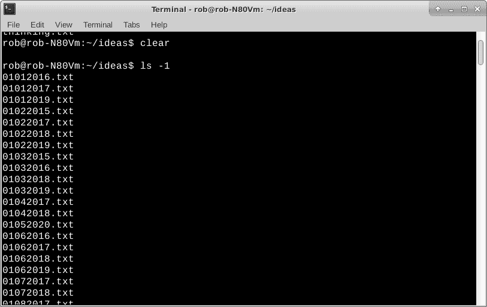

# Torq 博士:使用 Linux awk 在边缘进行数据处理

> 原文：<https://thenewstack.io/dr-torq-data-processing-at-the-edge-with-linux-awk/>

去年 6 月，数据科学家和可视化专家 [Nick Strayer](http://nickstrayer.me/) 在大规模数据处理方面学到了宝贵的一课:有时，即使是最新的面向“大数据”的软件也不如我们在 Unix 工具箱中已经有的软件好。为了解析 25TB 的基因数据，他尝试使用 Parquet 和 Spark 等工具，但最终，[发现最佳解决方案](https://livefreeordichotomize.com/2019/06/04/using_awk_and_r_to_parse_25tb/)是 R 统计编程语言和简陋的 **awk 的结合。**

有时我们需要获取大量的数据，并把它们分解成易于人类分析的东西。其他时候，同样的数据可能需要从一种格式转换成另一种格式，例如当您从使用一个应用程序转换到一个新的应用程序时。

awk 是一个出色的 Linux 命令行程序，用于执行这些类型的任务。它通常将纯文本作为输入，并生成特定格式的输出。当然，你可以用 Python 或 c 这样的通用编程语言来实现。如果你想开发大量的定制代码，这是一种方法。Linux 有 **awk** ，一个可编程的内置实用程序，那么为什么不使用它呢？

今天我们将通过几个基本的例子开始探索 **awk** 。未来的文章将涵盖更高级的主题。

## 从简单开始

假设我们想在系统上打印一个很大的文件列表，并且只显示文件名。和往常一样，Linux 为这项任务提供了多种解决方案。使用带有“-1”选项的标准“ **ls** ”命令(这是第一个选项)。

`rob% ls -1`

ls -1(一)列表结果

简单吧？

同样的事情也可以用 **awk** 来完成，尽管我们需要做一些额外的工作。再次获取文件列表，这次使用带有“-l”选项(字母 l)的“ **ls** ”命令，并将输出重定向到一个文件。

`rob% ls -l > rob2.txt`

ls -l 列表

我在这个截图中使用了带有“-n”选项的“ **head** 命令，来显示 rob2.txt 文件的前十几行。清单的第一行显示了目录中文件使用的 1k 块的数量。出于我们的目的，我们可以删除它来清理文件。请记住，大多数真实世界的数据转换通常需要少量的人工干预，以实现一切自动化。这只是切片和切块数据的性质。我使用 vi 编辑器删除了这一行，并重新保存了文件以备后用。

请注意，打印输出要复杂得多。

首先，使用标准打印语法，通过 **awk** 运行文件。这将输出 rob2.txt 文件中的每一行，很像普通的 Linux " **cat** "命令。

`rob% awk '{print}' rob2.txt`

简单 awk 打印结果

我们只需要文件名，所以应该在 print 语句中使用一个字段。文件名在字段 9 中，字段分隔字符是一个空格，这是默认设置。字段用“$”符号表示。

`rob% awk '{print $9}' rob2.txt`

仅使用字段 9 结果的 awk

那更好。它看起来就像“ **ls -1** ”命令输出。

一个稍微复杂一点的例子是打印文件名，后跟它们的创建日期。

`rob% awk '{print $9,$6,$7,$8}' rob2.txt`

使用 4 个字段的 awk 结果

请注意，我们使用了其他字段，它们可以放在您喜欢的任何地方。如果我们愿意，我们可以很容易地将日期放在文件名前面。字段六是月份。第七场是白天。第八个字段是年份。

有时文件使用逗号或其他字符作为字段分隔符。当您从 MS Excel 或 LibreOffice Calc 导出. csv 文件(逗号分隔值)时，电子表格会生成一个逗号分隔符。使用“-F”选项在 **awk** 中指定所需的字段分隔符。这里有一个你可以使用逗号的命令行的例子。

`rob% awk -F',' '{print $9,$6,$7,$8}' filename`

您也可以在打印输出中插入文本。添加“Date =”标签可能会有用。

`rob% awk '{print $9,"Date =",$6,$7,$8}' rob2.txt`

awk 使用四个字段并添加一个日期标签

## 你也可以搜索

awk 有内置的搜索功能。假设我们只想打印出包含“2015”的行。我们可以使用以下内容。

`rob% awk '/2015/ {print $9,"Date =",$6,$7,$8}' rob2.txt`

awk 搜索 2015 年结果

我用文件中“2015”的快速 grep 验证了输出。

`rob% grep 2015 rob2.txt`

rob2.txt 结果中的 2015 年 grep

另一种搜索方式是将字段与值进行比较。我们可以把第八场(年份)比作“2015”。

`rob% awk '{if ($8==2015) print $9,"Date =",$6,$7,$8}' rob2.txt`

字段 8 与 2015 结果的 awk 比较

也许你想搜索比“2015”更早的年份这里也用一个比较。

`rob% awk '{if ($8>2015) print $9,"Date =",$6,$7,$8}' rob2.txt`

awk 是大于 2015 年结果的字段 8

## 还有一点

我在文章的开头提到过，awk 对于数据转换和翻译来说非常棒。

假设我们要将年份从 2015 年改为 2016 年，这时它出现在字段 8(年份)。这就像用“2016”替换打印部分中的“$8”字段一样简单。

`rob% awk '{if ($8==2015) print $9,"Date =",$6,$7,"2016"}' rob2.txt`

awk 用 2016 年的结果取代 2015 年

虽然这是一个微不足道的例子，但原则上它可以用于相当多的实际情况。

## 更进一步

awk 有很多选项，它可以处理非常大的文件。我通常使用快速的一行程序，动态地将结果输出到我的终端，或者使用标准的 Linux 重定向(即>字符)将其保存到一个新文件中。 **awk** 有脚本功能，这可能会变得相当复杂。我们可以在以后的故事中调查这些细节。

数据转换和翻译可能很繁琐。 **awk** ，虽然实际上魔法确实有一个学习曲线。经过一点点实践， **awk** 肯定比手动浏览数据文件要好。

别忘了 **awk** 到处都有。你会在 Linux 服务器、台式机、笔记本、Raspberry Pi 板和各种 nano-Linux 机器上找到它。也许使用 **awk** 在边缘进行独立的高性能数据处理。

TNS 执行主编 Joab Jackson 对此文有贡献。

*在[doc@drtorq.com](mailto:doc@drtorq.com)或 407-718-3274 联系 [Rob "drtorq" Reilly](/author/rob-reilly/) 咨询、演讲约定和委托项目。*

通过 Pixabay 的特征图像。

<svg xmlns:xlink="http://www.w3.org/1999/xlink" viewBox="0 0 68 31" version="1.1"><title>Group</title> <desc>Created with Sketch.</desc></svg>