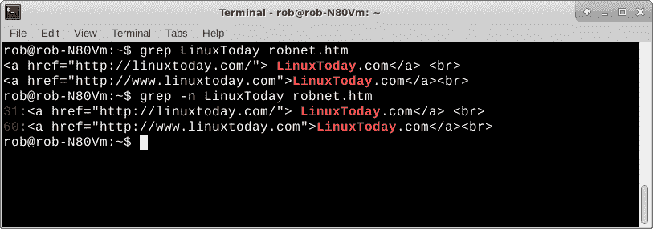
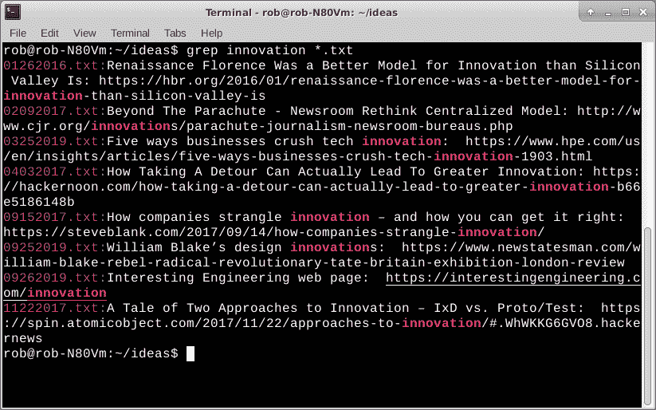

# Torq 博士:在 Linux 下寻找东西

> 原文：<https://thenewstack.io/dr-torq-finding-things-under-linux/>

我们人类在计算的时候总是需要找东西。也许我们想知道本地网络上目前有哪些机器正在运行。Linux 可以告诉我们这一点。也许我们需要从一堆文件中筛选出某个关键词或信息。Linux 在这种情况下也能有所帮助。就此而言，我们可以简单地搜索一年前我们的 Linux 机器上的某个文件。在 Linux 命令行中输入一些字符，您就可以开始工作了。

今天，我们将看一组 Linux 命令来查找东西。这些命令在 Linux 系统中是通用的，从最大的超级计算机一直到最低级的 Raspberry Pi。我们将从一个程序开始，这个程序可能在您的 Linux 版本的应用程序的标准装载中，也可能不在。安装一个像 **synaptic** 或 **apt-get** 这样的应用管理器很容易修复。其余的很可能已经安装在您机器上的核心 Linux 构建中。

## 使用 nmap 查找您的网络地址

Nmap 用于查找本地网络上的 IP 地址。您可以使用 IP 来确定哪些机器当前正在您的网络上运行。首先要做的是使用另一个名为 [ifconfig](https://linux.die.net/man/8/ifconfig) 的程序来查找自己机器的 IP。

`rob% ifconfig`

Ifconfig 结果

这里我们看到我的机器在 enp6s0(有线)以太网接口上的 IP 地址是 192.168.1.109。现在只需使用通配符将大部分地址插入到 **nmap** 命令中。

`rob% sudo nmap -sn 192.168.1.*`

Nmap 结果

确保使用 **sudo** root 命令，否则您可能无法获得所有地址。另外， **sudo** 允许 **nmap** 查询机器制造商信息。如您所见，192.168.1.40 设备是惠普公司的产品。我用那个地址设置了一台激光打印机，用于网络打印。

“-sn”选项有助于稍微简化输出。

你还会注意到一些设备显示一个未知的制造商。如果您无法将 IP 与您已知的机器联系起来，您可能需要使用 Wireshark[或去搜索流氓设备。](https://www.wireshark.org/)

接下来让我们看看 **grep** 。

## 使用 grep 搜索字符串

Grep 是一个在文件中查找文本字符串的强大工具。基本命令只是 grep，后跟文本字符串，然后是要搜索的文件名。这里有一个例子。

`rob% grep LinuxToday robnet.htm`

如果您想知道文件中特定的文本行，可以添加“-n”选项来获取找到的每个实例的行号。另外，请记住，Linux 将大写字母和小写字母识别为独立的不同字符。

Grep 结果

我把网页地址和它们的标题保存在一系列文件中，在我的“ideas”目录下，文件名中有日期。示例可能包括 12052019.txt 或 07192018.txt。网址和标题很容易分别使用 CTRL-C(复制)和 CTRL-V(粘贴)复制并粘贴到文本文件中。它还支持 Firefox 和 Chrome 浏览器中的复制/粘贴功能。

然后，如果我想使用标题或网页地址查找某个关键字，我只需要使用带有通配符的 grep 命令，一次性搜索所有文件。看看这个例子。

`rob% grep innovation *.txt`

浏览文件目录

**Grep** 让你在文本、html 甚至二进制文件中搜索字符串。

继续搜索文件，让我们看看查找和定位。

## 使用查找发现您的文件

[find](https://en.wikipedia.org/wiki/Find_(Unix)) 命令有条不紊地遍历您的目录，找到您要查找的文件。说我们要找 11222017.txt 文件。假设我们在我的主目录中，这个目录是/home/rob。

我们可以发布以下内容。

`rob% find . -name 11222017.txt`

的“.”告诉 find 从当前目录开始，向下搜索文件系统。

使用 find 在 Linux 目录树结构中搜索特定文件

它在底部，和路径名一起，来自当前目录。
如果您想要搜索整个分区，请使用“/”而不是“.”用于起始目录。没有真正简单的方法来抑制“权限被拒绝”的消息。我只是无视他们。

关于 find 要记住的一点是，每次搜索时，它都会遍历目录。如果您有许多目录、子目录和长文件名，这可能需要一些时间。在我的古董华硕双核笔记本电脑上，从 100+ GB 分区的根目录(/)启动上述文本文件大约需要一分钟。使用 locate 命令可以实现更快的文件搜索，尽管这是有代价的。

## 使用定位功能快速找到您的文件

在搜索过程中，Locate 查询用于映射文件的缓存，而不是遍历文件树结构。它大约每天使用 **updatedb** 命令更新一次数据库。

假设我们回到我的主目录，想要找到 2017 年的那个文本文件。下面是命令行。

`rob% locate 11222017.txt`

使用 locate 在 Linux 树结构中搜索特定文件

**Locate** 只用了大约两秒钟就返回了文件的位置。请注意，它还显示了完整的路径。

虽然**定位**很快，但是请记住，如果您有在过去 24 小时内创建或复制到您的文件系统的文件，它们可能不会显示在结果中。

## 更进一步

我们已经研究了一些我经常用来在 Linux 下查找东西的命令和技术。你可以在所有的命令中使用“*–帮助*”选项来获得更多的使用信息。当你学习在 Linux 命令行上使用程序时，“ **man** ”页面也很有帮助。一开始，有点尴尬和古怪。坚持下去，不断练习。你甚至可以把经常使用的命令和选项保存在一个小笔记本或备忘单上，直到它们成为你的第二天性。

*在[doc@drtorq.com](mailto:doc@drtorq.com)或 407-718-3274 联系 [Rob "drtorq" Reilly](/author/rob-reilly/) 咨询、演讲约定和委托项目。*

专题图片:“[罗摩和拉克什曼纳徒劳地寻找悉多:分散的罗摩衍那系列](https://www.metmuseum.org/art/collection/search/37910)”的插图对开本。1680-1690 年，印度，拉贾斯坦邦，梅瓦尔，[纽约大都会艺术博物馆](https://www.metmuseum.org/)。

<svg xmlns:xlink="http://www.w3.org/1999/xlink" viewBox="0 0 68 31" version="1.1"><title>Group</title> <desc>Created with Sketch.</desc></svg>