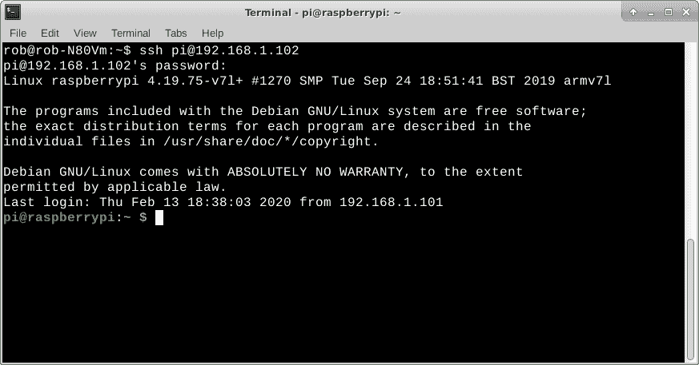
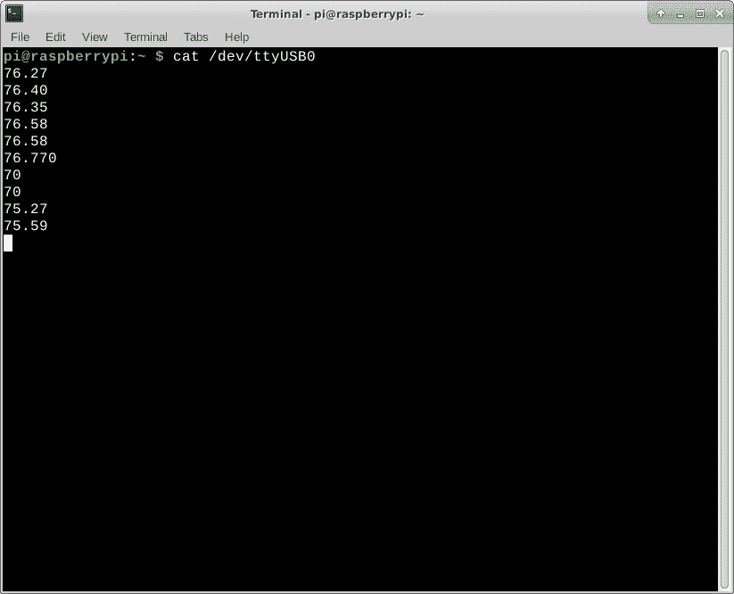
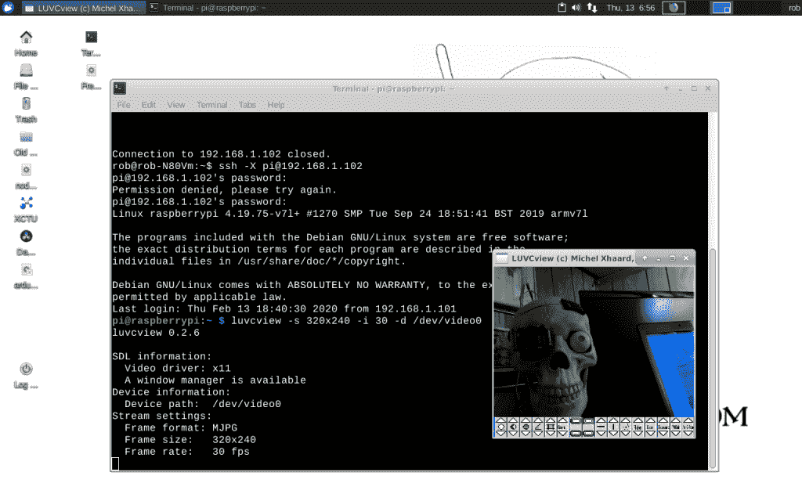

# Torq 博士:用 ssh 远程访问

> 原文：<https://thenewstack.io/dr-torq-go-remote-with-ssh/>

在一个网络化的云原生世界中，我们可能有 Linux 机器在某个遥远的地方运行，远离我们的物理范围。或者，我们可以在同一个房间里放置一堆连接到本地网络的机器。无论哪种方式，能够登录这些联网设备进行升级、维护、诊断、运行程序等等都是非常棒的。

[ssh](https://www.ssh.com/ssh) (安全 Shell)命令行实用程序已经存在很长时间了。它允许您通过网络以安全的方式访问远程 Linux 系统。大多数情况下，您会将它用作标准的基于文本的串行终端。这很好，因为即使在互联网连接缓慢的情况下，您的命令行会话也很简单。

当然，即使 **ssh** 客户端是安全的，你也要遵守标准的安全技术来挫败黑客。我通常在防火墙后或者在没有互联网的网络上使用它。对我来说，该程序在访问服务器、边缘设备和多个本地“无头”机器方面非常有效——没有键盘或屏幕的机器被称为无头机器。宋承宪让和他们交谈变得很容易。我目前的 Linux 设备要么运行 [Xubuntu](https://xubuntu.org/) (在我的笔记本上)，要么运行 [Raspbian Linux](https://www.raspbian.org/) (在 Pi 上)。

## 安装 ssh

许多 Linux 发行版都默认安装了 **ssh** 服务器和客户端程序。如果没有，使用常规的图形程序管理器(在桌面上)，比如 [synaptic](https://www.nongnu.org/synaptic/) ，来安装应用程序。或者，由于我的教程涵盖了 Linux 命令行的用法，您可以在终端窗口中使用 apt install。

`rob% sudo apt update
rob% sudo apt install openssh-server
rob% sudo apt install openssh-client` 

ssh 服务器应该在安装后自动启动。如果没有，请使用 service 命令。

`rob% sudo service ssh start`

拥有一个有效的 ssh 服务器可以让其他人登录你的机器。如果你在你的设备上运行任何防火墙软件，你可以打开端口 22(**ssh**默认)，以允许访问。虽然我在我的日常驱动 Linux 笔记本上安装了 ssh 服务器，但它通常不会运行。我只在需要的时候使用它。

使用 **ssh** 登录其他机器不需要任何特殊的防火墙规则或运行的服务器。我的基于 Raspberry Pi 的无头小工具通常运行着 ssh，所以我可以通过本地网络远程操作它们。

## 使用 ssh

通过 **ssh** ，远程 Linux 机器上的任何终端可用程序也可以通过网络使用。

例如，假设我想在我的一个无头 Raspberry Pi 小工具上编辑一个文本文件。我只需从我的 Linux 笔记本上用下面的命令登录 Pi。当然，您需要知道远程设备的 IP 地址，并确保 **ssh** 服务器启动并运行。

`rob-notebook% ssh pi@192.168.1.104`

通过 ssh 登录到远程 Linux 机器

一旦登录到远程系统，就可以使用 vi 来打开和修改文本文档。您在远程机器的终端上做的任何事情都可以通过网络使用 **ssh** 来完成。

越来越好了。

远程机器上的任何程序都将使用 **ssh** 运行。显然，程序必须安装后才能工作。此外，请记住，您需要正确的权限来运行某些程序。 **sudo** 也可以和 **ssh** 一起工作，如果设置好的话。

键入“ls ”,您将获得当前目录中文件的标准列表。键入“ **df -h** ”，您将获得分区和存储设备的列表。您甚至可以将命令串成脚本。

长期读者可能还记得我使用猫命令使用 ssh 来观看来自我的物联网(IoT)设备的实时数据流。我会使用 **ssh** 远程登录这个小发明，并从连接到 USB 端口的传感器读取数据。Raspberry Pi 和传感器可能在另一个房间，甚至在通过 wifi 连接的室外。坐在我的 Linux 笔记本上时，典型的命令行(在物联网设备上通过 **ssh** 执行)看起来如下。

`pi% cat /dev/ttyUSB0`

使用 cat 通过 Linux 笔记本上的 ssh 从 PI 上的 USB 端口传输数据

## GUI 程序呢？

你可以在你的 Linux 笔记本上远程运行 Chromium 浏览器。只需在 **ssh** 中添加“-X”选项即可。利用 Linux X-Window 功能，浏览器窗口将无缝地出现在您的笔记本电脑屏幕上，即使应用程序正在 Pi 上运行。你为什么要这么做？我不知道，但它会工作得很好。

`rob-notebook% ssh -X pi@192.168.2.101`

然后像往常一样运行您的命令。在这种情况下，您需要启动 Chromium 浏览器。

`pi% chromium-browser`

一个更实际的例子可能是在 Pi 上使用网络摄像头应用程序从摄像机获取视频。我喜欢 luvcview 应用程序，因为它是轻量级的，可以在不同版本的 Linux 上可靠地运行。这是一个很好的例子，因为视频需要大量的机器资源和大量的数据吞吐量。ssh 运行良好，没有任何问题。下面是通过 **ssh** 的命令行。

`pi% luvcview -s 320x240 -d /dev/video0`

通过一个 **ssh** 连接远程使用 luvcview

请注意，使用普通的流媒体服务器会提供更好的视频性能。随着分辨率的提高，视频延迟会越来越慢，尤其是在 wifi 下。使用 100 Mb/s 有线以太网明显比 wifi 快，但仍无法与专用视频流程序相提并论。我的意图是展示 ssh 将你“虚拟地”放在远程机器上，即使对于像视频流这样相当苛刻的工作。

## 更进一步

几乎没有人提到的最后一件事是用 **ssh** 复制和粘贴。没错！您可以在远程机器的终端(窗口)上突出显示文本，右键单击鼠标，选择“复制”项，将光标放在笔记本屏幕上的任何位置，然后将文本粘贴到该位置。我一直用它在机器之间来回复制代码片段和数据。

似乎微不足道，对吗？请放心，一旦你开始使用这项技术，它会节省大量的时间。

现在，您已经具备了使用 **ssh** 登录远程 Linux 机器的基础知识。请务必查看“**ssh–help**”和“ [man ssh](http://linuxcommand.org/lc3_man_pages/ssh1.html) ”屏幕，查看其众多选项的列表。

*在[doc@drtorq.com](mailto:doc@drtorq.com)或 407-718-3274 联系 [Rob "drtorq" Reilly](/author/rob-reilly/) 咨询、演讲约定和委托项目。*

图片由来自 Pixabay 的 mohamed Hassan 提供

<svg xmlns:xlink="http://www.w3.org/1999/xlink" viewBox="0 0 68 31" version="1.1"><title>Group</title> <desc>Created with Sketch.</desc></svg>