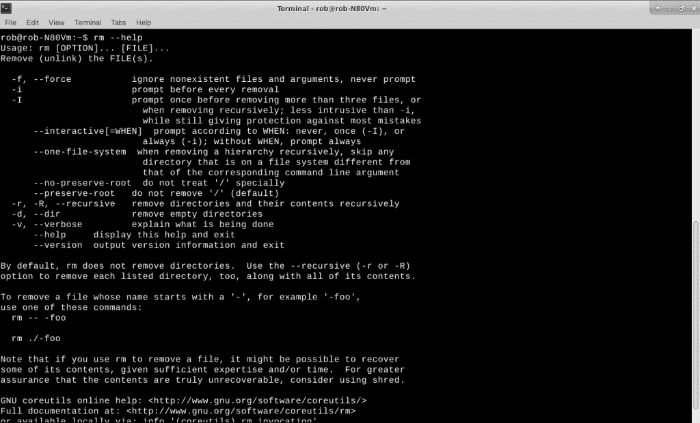
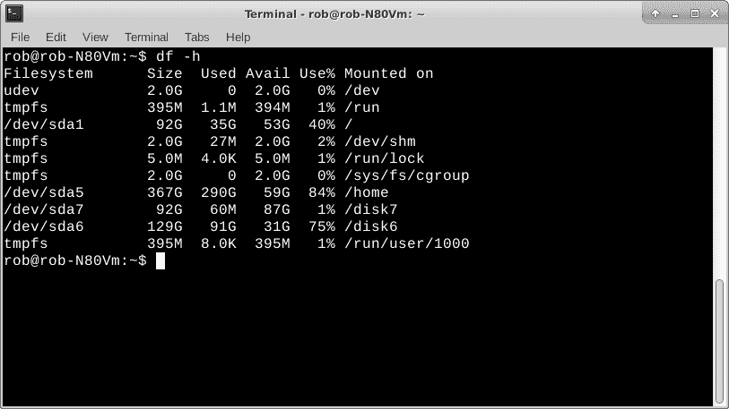

# Torq 博士:“rm -r *”和其他 Linux 命令行陷阱

> 原文：<https://thenewstack.io/dr-torq-rm-r-and-other-linux-command-line-gotchas/>

有人说 Linux 命令行晦涩难懂。但我称之为全面。像其他任何事情一样，您需要了解一些基础知识，以便开始让系统执行重要的计算工作。Linux 命令行非常强大。当然，伴随这种权力而来的是用户责任和潜在的危害。知道该做什么很重要，但知道什么不该做也很重要。

不要让它吓倒你。事情就是这样。

几个月前，在我的[拥抱 Linux 命令行](/off-the-shelf-hacker-embrace-the-linux-command-line/)帖子中，我们讨论了一些可以在 Raspberry Pi 的终端窗口中输入的命令。Linux 无处不在，你可以在笔记本、台式机或服务器上做同样的事情。就此而言，如果您在没有窗口管理器和网络连接上的窗口的情况下远程使用命令行，它会工作得很好。

今天，我们将探索您应该了解的几个方面，这将有助于您做出好的命令行决策。

## 臭名昭著的 rm 命令

你可能听说过 **rm** 命令。 **rm** 从系统中删除文件。这是一个非常强大的命令，应该受到适当的尊重。

像其他 Linux 程序一样， **rm** 有一些命令行选项。键入"*RM–help*"获取列表。

RM–帮助命令输出

一个特别臭名昭著的 **rm** 用法是使用 *-R* 选项和一个“*”作为文件名。这让系统管理员非常心痛。

–*R*选项命令 **rm** 向下进入子目录。*表示匹配它找到的所有文件。用这种方法，你可以很容易地、很快地删除很多文件。如果您以 root 用户的身份在顶级(/)目录下执行该命令，这尤其令人不安，因为 root 用户在 Linux 系统上拥有上帝般的权力。

假设您是一个忙碌的、没有多少经验的系统管理员，正在 Sun Unix 机器上做一些清理工作。那是我，在很多个月前以 root 身份登录。当它发生的时候，我正在浏览目录，清除旧的日志文件和不用的文件。

不知何故，我发行了一张 cd /我一定是分心了，因为我以为我还在日志目录里。在输入“*RM-R *”*并按回车键后大约三秒钟，我意识到了自己的错误。已经太晚了。

大约一分钟后，我听到两个我认识的用户在抱怨。这是一个小型的[computer vision——基于 Sun Microsystems Unix 的 CAD 图形系统](https://en.wikipedia.org/wiki/Computervision),所以真正的损失来自工具设计者丢失了他们那天早上对 CAD 模型所做的更改。它发生了。几乎每个 Unix 或 Linux 系统管理员都犯过类似的错误。

不用说，那天晚上剩下的时间里，我不得不从磁带和备份中重建系统。我备份了前一天的用户数据，因此我们损失了大约四个小时的生产工作。当我修理他们的系统时，工具设计者也必须做其他的工作。更多损失的生产时间，现在为两个人。那次之后，我有一段时间被打入冷宫。

幸运的是，作为一个普通用户，您不太可能用 rm 命令来清除您的机器。不过，您可能会无意中删除自己的文件，所以一定要确保您知道自己在目录结构中的位置。此外，请谨慎使用“*rm-R *”*与 RM 的组合。

用 Raspbian Linux 刻录一个 micro-SD 并把它放在 Raspberry Pi 中可能会有指导意义。然后以 root 身份在/目录下执行“*RM-R *”*，看看会发生什么。你总是可以重新刻录 micro-SD 来获得一个新的系统。还不如把最糟糕的事情解决掉。

## 磁盘已满的情况

您可能遇到 rm 问题的典型情况是，当您的磁盘已满或几乎已满，您不得不匆忙清除一些文件。有时你会在终端中收到一条信息，告诉你磁盘空间不够了。当您填满磁盘时，机器可能不会崩溃。因此，您可能有一点时间来处理一些文件并回收一些空间。

我们可以用 **df** 命令找出磁盘的状态。

测向命令输出

我喜欢使用 *-h* 命令行选项，这样我可以看到以兆字节和千兆字节为单位的文件空间大小。

我的古董华硕 Linux 笔记本里有一个 750GB 的磁盘。你可以把整个磁盘用于你的电脑，尽管我喜欢把它分成“分区”分区分割了磁盘空间，并将每个分区与/dev 名称相关联。这样，我可以将 Linux 操作系统和应用程序放在一个分区中，而将我的用户文件放在另一个分区中。当我定期升级到新版本的 Linux 时，我只是重新格式化根(/)目录，并在其上复制一个新的 Linux 映像。这对/home 目录中的用户文件没有影响。我将 */dev/sda1* 分区与/目录相关联。/home 目录绑定到 */dev/sda5* 分区。

查看上面的 **df** 清单，我们可以看到根文件系统(/)是/ *dev/sda1* ，大小为 92GB。我只为操作系统和应用程序使用了 35GB，这大约是总分区空间的 40%。还有大约 53 GB 的空间可用于存储更多的系统和应用程序文件。

清单中更靠下的是/dev/sda5 分区，与/home 目录相关联。如果您看到使用百分比超过 95%，可能是时候删除未使用的文件，或者将其中一些文件移动到另一个分区或外部归档驱动器上。

## 复制和移动文件

cp 命令将文件从一个地方复制到另一个地方。 **mv** 四处移动文件。

使用两者都很简单。这里有几个例子。

`linux-notebook% cp rob.txt test.txt`

`linux-notebook% mv rob.txt test.txt`

第一个将一个文件复制到一个新的名称下。第二个将 rob.txt 重命名为 test.txt。

您还可以复制和移动目录。假设您有一个名为 rob1 的目录。在 rob1 下有一个名为 test.txt 的文件。您可以将该目录和文件复制到一个新目录中。您必须使用-r 选项进入目录，并复制位于那里的文件。

`linux-notebook% cp -r rob1 rob2`

现在将有一个名为 rob1 的目录和一个名为 rob2 的目录，其中包含 test.txt 文件。

如果我们发出“*mv rob 1 rob 2”*会发生什么？

Linux 会将 rob1 目录移到 rob2。这将删除 rob1 目录。哦，它会覆盖 rob2 中已经存在的内容。Linux 不会问你要不要覆盖目录。它会继续前进，做你让它做的事情。

使用 **mv** 我们又回到了用户责任的问题上，所以再一次，要认识到你在目录树中的位置以及你实际上想要对你的文件做什么。

## 包裹

Linux 命令行对于所有类型的计算工作都是一个强大的工具。这有点危险，因为没有很多内置的安全措施来保护你远离麻烦。

了解一些陷阱将有助于您做出好的命令行决策。会犯错误，这只是学习过程的一部分。坚持下去，继续前进。有时候需要一点时间。Linux 很全面。

<svg xmlns:xlink="http://www.w3.org/1999/xlink" viewBox="0 0 68 31" version="1.1"><title>Group</title> <desc>Created with Sketch.</desc></svg>