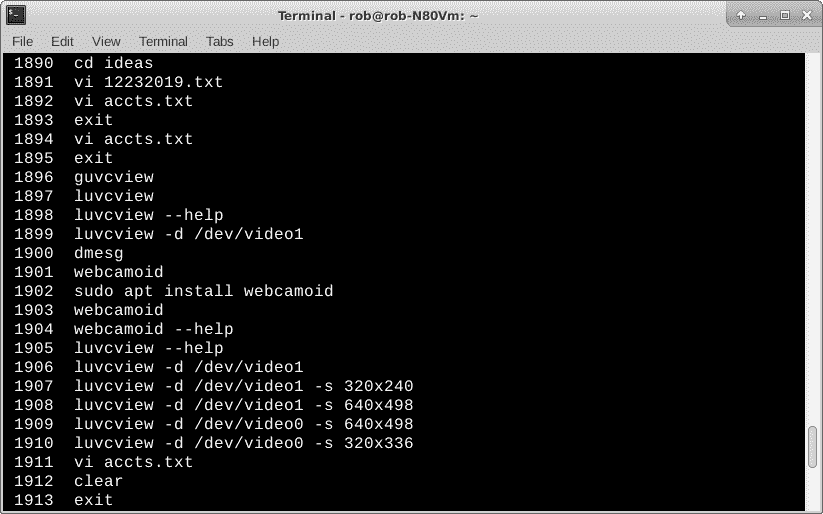
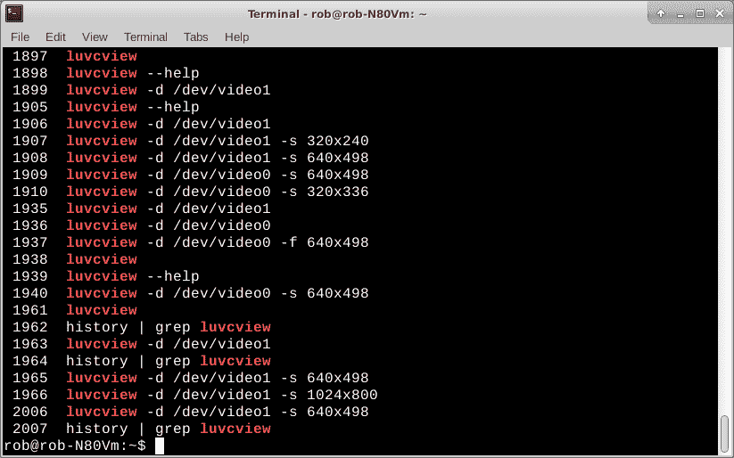

# Torq 博士:Linux 历史命令的及时提示

> 原文：<https://thenewstack.io/dr-torq-timely-tips-for-the-linux-history-command/>

Linux **[历史](https://linux.die.net/man/3/history)** 是非常有用的内置函数之一，对于新的 Linux 用户来说可能并不完全清楚。**历史**节省了在 Linux 终端窗口输入和执行命令的大量时间和麻烦。

我做了很多硬件小工具测试，并且经常不得不一遍又一遍地运行一系列命令行，经常在运行过程中改变选项。重新输入每一行极其繁琐，而且容易出错。Linux 命令行回调功能避开了所有这些，让您可以轻松地使用之前运行的程序。

今天，我们将探索使用历史和相关主题来帮助您简化您的 Linux 命令行活动，看起来像一个专家。

## 拥抱向上的箭头

打开 Linux 终端窗口，键入“ **ls** ”命令，然后按“Enter”键。您将获得当前目录中的文件列表。现在，再次输入“ **dmesg，**”，并输入“Enter”您将获得机器上所有系统级活动的详细打印输出，包括启动、初始化、错误和硬件更改。现在试试“ **df -h** ”和“回车”一个整洁的磁盘信息显示在你的屏幕上。

好的，现在点击向上箭头键三次，观察光标处会发生什么。又是那个“ **ls** ”命令。按“Enter”再次显示文件列表。酷毙了。现在输入“**CD/”**和“Enter”向上移动到根目录。这次按下箭头键四次。噗，光标处再次弹出 **ls** 。按下“回车”获得另一个文件列表。现在您将看到您的顶级系统级目录和文件。你正在一个完全不同的目录中使用相同的' **ls** '命令。

这是运行中的 Linux 历史函数。每次我们输入一个命令，Linux 都会把它记录在一个正在进行的列表中，我们可以在需要的时候调用它。我们使用上下箭头键在列表中移动。

您可以设置列表中命令的数量，但是我从来没有真正费心去改变默认设置。我的 Linux 笔记本和各种 Raspberry Pi 机器都有两三百个命令，开箱即用。即使在注销或重新启动后，这些命令仍然可用。只需打开一个终端，使用向上或向下箭头，找到以前执行的任务。

## 浏览历史

我承认。有时候，我过于依赖上/下箭头键。假设我一小时前输入了这个又长又复杂的命令行，现在需要再次运行它。没问题。只需用向上箭头指向命令，然后按回车键。

如果命令只是后退 10 或 15 步，这将非常有效。如果我真的敲击键盘，选择命令可能会退回 150 步。我的阅读速度很快，但很少能在按住向上箭头键滚动的时候找到我需要的内容。当然，有一种方法可以解决这种情况。

那是“**历史**号”指挥部的工作。只需运行“ **history** ”，然后按“Enter”键，就可以获得您之前输入的命令的列表。

`rob% history`

我的历史命令输出的一部分

请注意，清单中有一个数字，后跟几个空格，然后是命令。

您可以上下滚动来查找想要重新执行最长、最复杂的命令。通过返回命令行(只需按“Enter”键)并键入 bang(！)符号后跟命令行的编号。您之前的命令将神奇地再次运行。

这里有一个例子。上图显示了我当前历史列表的一部分。要以 640×498 的视频分辨率运行 luvcview 程序，我只需从列表中选择那一行。我选择的行显示为“*luvcview-d/dev/video 1-s 640×498*”，对应的命令号为 1908。砰的一声打出来。

`rob% !1908`

通过让历史命令通过 **grep** 会变得更好。Linux 管道用竖线符号(|)表示，它将一个程序的输出连接到另一个程序的输入。

**[grep](http://man7.org/linux/man-pages/man1/grep.1.html)** 是 Linux 文件搜索实用程序。它在文件中寻找文本字符串。我们可以通过如下操作在历史中找到一个命令。

`rob% history | grep luvcview`

这是打印输出，显示了我们的历史列表中所有的 **luvcview** 命令行及其对应的命令编号。

使用 grep 在历史列表中仅显示 luvcview 命令

挑出号码，在前面加上爆炸符号，我们就出发去比赛了。在做重复的开发和测试工作时，使用 grep 和 history 可以节省大量的时间。

另一种使用历史的方法是用鼠标的复制/粘贴快捷键，这样你就可以编辑这条线。

例如，选择相同的 1908 列表并突出显示它。在 **luvcview** 命令的开头单击鼠标左键，并将高亮显示拖动到行尾。松开鼠标左键，然后单击鼠标右键。从下拉菜单中选择“复制”。点击光标并再次点击鼠标左键。选择“粘贴”。触摸“输入”,命令将运行。

有趣的是，就在粘贴之后，你可以使用左右箭头键在线条上移动。例如，您可能想要用箭头指向并使用 delete 键来删除“640×498”分辨率，并将其替换为“640×240”。按“Enter”结束，然后 **luvcview** 将以新的分辨率运行。

这有多简单？

当我有冗长、复杂的命令行时，剪切和粘贴功能特别有用，只需要调整一下，比如从视频输入“ */dev/video0* ”切换到“ */dev/video1* ”我会把“0”换成“1”。每样东西都要重新打一遍会很麻烦。

## 更进一步

一旦你习惯了用向上/向下箭头来调用 Linux 命令，用 grep 来调用历史，用鼠标快捷方式来剪切和粘贴，你会想知道你以前是怎么用其他方法来做的。如果您使用这些技术快速地进行触摸输入，当您毫不费力地在命令行中跳跃并熟练地以创纪录的时间完成工作时，其他人将会惊讶地看着您。

*在[doc@drtorq.com](mailto:doc@drtorq.com)或 407-718-3274 联系 [Rob "drtorq" Reilly](/author/rob-reilly/) 咨询、演讲约定和委托项目。*

Pixabay 的 Pavlofox 的特征图像。

<svg xmlns:xlink="http://www.w3.org/1999/xlink" viewBox="0 0 68 31" version="1.1"><title>Group</title> <desc>Created with Sketch.</desc></svg>