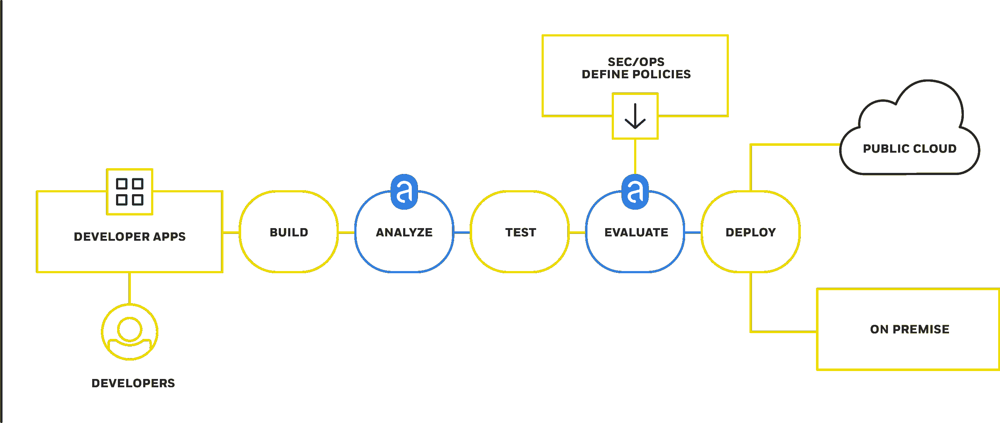

# TNS 研究:容器漏洞扫描器前景扫描

> 原文：<https://thenewstack.io/draft-vulnerability-scanners/>

自从最初出版以来，这个故事已经被更新。黑鸭毂于 2016 年 8 月 24 日加入餐桌。

[容器注册表](https://thenewstack.io/tns-research-defining-container-registries/)和漏洞扫描器经常捆绑在一起，但它们不是一回事。代码扫描可能发生在容器部署工作流中的多个点。一些扫描仪将与现有解决方案捆绑在一起，而另一些则是点式解决方案。这些差异可以通过他们使用的数据源、正在检查的内容以及作为扫描结果自动采取的操作来衡量。

扫描器基于一组特定的标准来检查工件，例如策略或特定代码的包含。出于本文的目的，我们只关注扫描应用程序和容器映像中的漏洞。对应用程序的扫描可以确定它们是否是使用来自流行存储库的经过广泛测试的包构建的。扫描映像还可以检查应用程序，但除此之外，它还会查找由于其构建时所处的独特部署环境而产生的漏洞。

一些容器注册中心使用捆绑技术不断扫描漏洞。例如，CoreOS 的 [Clair](https://github.com/coreos/clair) 扫描 Quay.io， [Docker Security Scanning](https://thenewstack.io/docker-launches-vulnerability-scanner-containers/) 与 Docker Trusted Registry 合作，Red Hat 在 Project Atomic 中为其 Atomic Registry 构建了一个新的扫描器。尽管 Docker Store 仍处于测试阶段，但它承诺提供经过公司扫描和批准的待售图像。Flawcheck Private Registry 在其产品中内置了一个自定义扫描仪。这些注册中心承诺为开发人员部署他们的代码提供“安全”的容器映像。

其他扫描仪如 [Aqua Peekr](https://www.aquasec.com/products/aqua-peekr/) 、 [Anchore](http://anchore.com/) 和 [Twistlock Trust](https://www.twistlock.com/trust/) 独立于特定注册表工作，如果您使用来自多个不同来源的容器图像，这可能很有价值。这些解决方案可以直接连接到构建/部署管道的多个部分。Anchore 下图中的工作流显示了一名开发人员在一个公开可用的映像上构建一个应用程序，然后分析和验证新构建的映像。然后，映像将返回到 CI/CD 工作流中进行测试。

在部署应用程序之前，会再次使用 Anchore 的扫描器。在流程的这一阶段，映像将经过同样的安全扫描，但更重要的是，它将接受评估，以确定它是否以及如何部署到生产环境中。到目前为止，安全和运营团队已经制定了政策，规定哪些容器是符合犹太规定的，以及允许使用哪些类型的资源。

Anchore 网站上的图片展示了它如何融入 CI/CD 工作流程。

我们在下面列举了 12 个容器漏洞扫描解决方案的例子。该列表有意排除了扫描和管理应用程序包和存储库的工具。正如这篇 CloudMunch [文章](http://www.cloudmunch.com/devops-debates-image-driven-or-build-driven-delivery/)中所描述的，有一种观点认为 DevOps 应该通过构建驱动而不是映像驱动来考虑其过程。JFrog 的首席技术官 Fred Simon 说，“你不再分发一个应用程序，而是分发整个堆栈。”如果采用这个角度，那么来自 [JFrog](https://thenewstack.io/new-jfrog-workload-inspection-tool-points-post-container-world/) 或 Sonatype 的检查工具将进入讨论。

扫描仪可以相对容易地创建。大多数针对相同的[数据](https://nvd.nist.gov/home.cfm)进行扫描。红帽有 [OpenSCAP](https://www.open-scap.org) ，这是一个扫描漏洞的工具汇编。它提供了价值，因为它是精心策划和组织的。然而，当 Red Hat 开发人员想要扫描 Project Atomic 中的容器时，他们创建了自己的自定义扫描仪。虽然这很有价值，但它本身不足以支持可行的商业模式。

专注于容器安全的软件公司将以几种方式中的一种将漏洞扫描货币化。一种方法是将扫描与容器注册捆绑在一起。他们还可能将扫描和分析功能捆绑到管理更大 CI/CD 部署管道的产品中。关注策略管理是第三种很有前途的方法，因为企业有支付策略管理的历史。策略管理工具是如何实现的，以及它们能实现什么类型的自动化将是以后文章的主题。与此同时，还有一些公司正在致力于使用政策来增强集装箱安全:

*新堆栈深度覆盖容器漏洞扫描。期待在即将到来的第四部[电子书系列](https://thenewstack.io/ebookseries/)中读到更多内容。*

<svg xmlns:xlink="http://www.w3.org/1999/xlink" viewBox="0 0 68 31" version="1.1"><title>Group</title> <desc>Created with Sketch.</desc></svg>