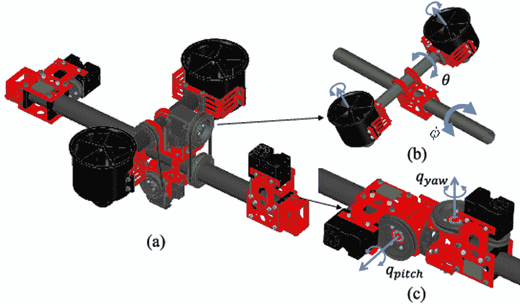
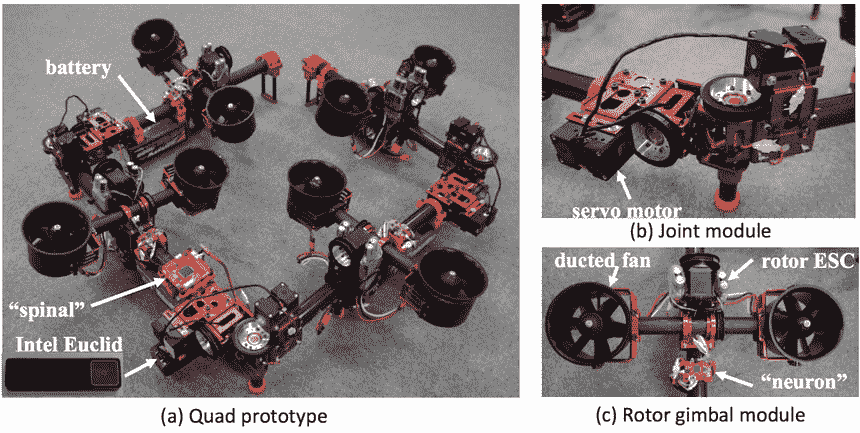
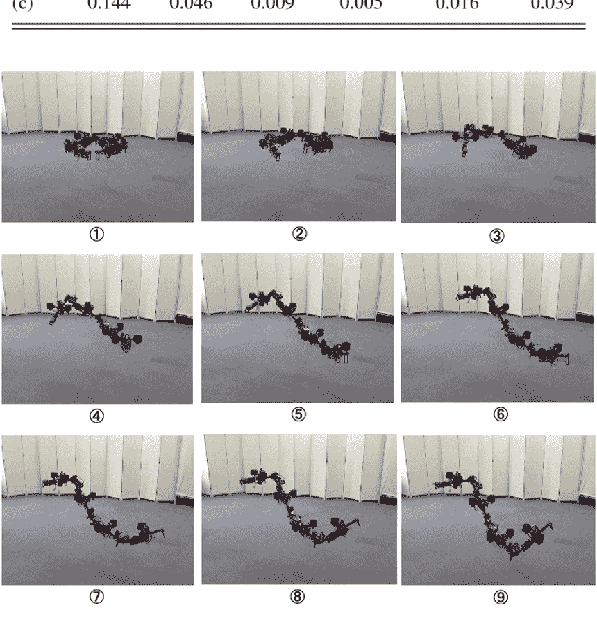

# “龙”是一种模块化无人机，可以在半空中变形

> 原文：<https://thenewstack.io/dragon-is-a-modular-drone-that-can-shapeshift-in-mid-air/>

近年来，我们看到无人机出现在各种令人兴奋的新领域，从[向偏远地区运送重要的医疗用品](https://thenewstack.io/drones-deliver-life-saving-medical-supplies-rwanda/)到[消灭威胁生命的害虫](https://thenewstack.io/underwater-drone-protects-salmon-blasting-lice-lasers/)的水下无人机，到[在海洋中收集数据的无人驾驶海洋车辆](https://thenewstack.io/creating-ocean-networks-with-drones-that-roam-the-seas/)。但无人机的一个缺点是，它们通常是静态的，这可能有一个优势，即在拾取和放下交付物或在空中和水中旅行时，它可能更健壮。但是，当涉及到更受限制的室内环境时，或者在地形可能更加不可预测和多变的搜救情况下，无法改变这种形式可能会成为一种障碍。

为了正面解决这个问题，东京大学 JSK 实验室的研究人员开发了一种模块化飞行机器人，它可以在半空中变形。这个活泼的机器被称为“具有多自由度空中变换能力的双转子嵌入式多连杆机器人”,简称为“龙”,它可以将自己扭曲成各种形状，以通过形状奇怪的开口或障碍。看着它走:

https://youtu.be/zMi5v2KznU4

龙的变形能力背后的秘密是它是如何设计的。整体而言，目前的 DRAGON 原型由一系列四个相互连接的模块组成。每个独立的模块都有一对导管风扇推进器，可以操纵它们来改变推力矢量，从而改变每个模块的前进方向。

这些模块然后通过由伺服电机驱动的铰链接头相互连接，所有这些模块都由机载[惯性测量单元](https://en.wikipedia.org/wiki/Inertial_measurement_unit) (IMU)控制，该单元测量并跟踪龙的加速度、速度和相对位置。每个链接也有一个分布式控制板，它充当一种“神经元”，以及使用电子速度控制器(“转子 ESC”)的涵道风扇转子。整个组件由电池供电，可提供约 3 分钟的飞行时间，并由一个[英特尔欧几里德](https://www.intel.ca/content/www/ca/en/support/articles/000024177/emerging-technologies/intel-euclid-development-kit.html)控制，这是一个集成到无人机第二个环节的模块，负责处理所有需要的计算。通过动态定义它的重心，龙的多连杆能够创造出一系列可能的运动——就像该设备的同名物，神话中的龙一样。

这里展示的是 DRAGON 的组件，由铰链连接的四个模块组成。每个模块都有涵道风扇推进器、飞行控制单元(表示为“spinal”)和惯性测量单元以及分布式控制板(即。“神经元”)和通过电子速度控制器控制的导管风扇转子(“转子 ESC”)。

正如在上面的视频中所看到的，龙的设计创造了一种更加灵活的形式，可以根据需要对其环境的任何变化做出反应和适应。在飞行过程中，这些模块既可以形成一条直线，也可以扭曲成之字形、螺旋形或 L 形。正如 JSK 实验室的研究人员之一樊氏告诉 [IEEE Spectrum](https://spectrum.ieee.org/automaton/robotics/drones/flying-dragon-robot-transforms-itself-to-squeeze-through-gaps) 的那样，这种适应性强的设计是一大进步:“[龙]是硬件设计的突破，它以一种美丽的方式将操纵臂与管道风扇驱动的空中机器人连接起来。这是空中操作的理想平台。”

这种模块化方法有很大的潜力，我们在无人机概念的其他迭代中看到，这些迭代利用[群体智能的想法来创建人工神经系统](https://thenewstack.io/swarmanoids-modular-robots-assemble-form-artificial-nervous-systems/)或[互动无人机群，它们充当“物质”](https://thenewstack.io/interactive-swarms-3d-pixels-future-programmable-matter/)的可编程像素。但是研究小组正着眼于创造一种不仅不会变形，而且可以成为自主代理的东西，能够自行决定如何最好地穿越障碍。更好的是，该团队设想龙可以主动与环境互动，可能会改变其形态，以便在不同的距离和高度移动、拾取和携带物体。研究人员现在正在努力建立一个包括多达 12 个模块的原型，其中两个末端模块像抓取装置一样使用。

图片:JSK 实验室

<svg xmlns:xlink="http://www.w3.org/1999/xlink" viewBox="0 0 68 31" version="1.1"><title>Group</title> <desc>Created with Sketch.</desc></svg>