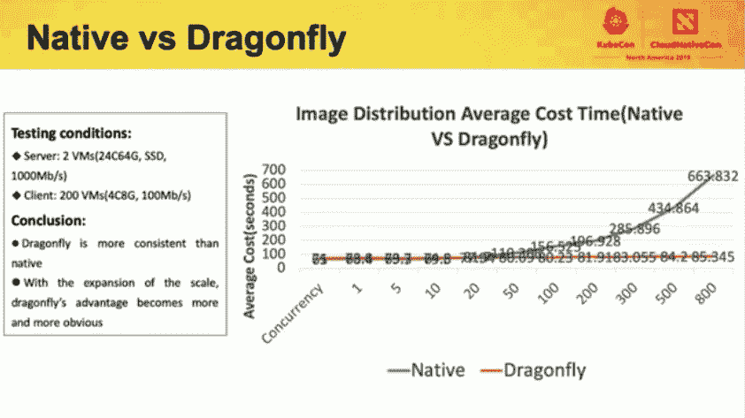

# 蜻蜓为 Kubernetes 带来了点对点的图片分享

> 原文：<https://thenewstack.io/dragonfly-brings-peer-to-peer-image-sharing-to-kubernetes/>

由[阿里云](https://us.alibabacloud.com/)开发的点对点图像和文件共享技术蜻蜓现在是[云原生计算基金会](https://www.cncf.io/)的孵化级托管项目。该软件提供了一种跨大型云本机部署快速分发映像的方法，消除了对单个注册表分发映像所有副本的依赖。

“蜻蜓是阿里巴巴生态系统中容器平台的骨干技术之一，每年支持数十亿次应用交付，并被世界各地的许多企业客户所使用，”阿里巴巴高级员工工程师[李毅](https://www.linkedin.com/in/li-yi-7427b5/?originalSubdomain=cn)在一份声明中说。

阿里云在 2015 年创建了[蜻蜓](https://d7y.io/en-us/)，最初是为了简化文件分发。到 2017 年，当它被用于在 Kubernetes 环境中共享容器时，它被中国云服务用于每月共享 3.4PB。它最初于 2018 年 10 月被纳入 [CNCF 沙盒计划](https://github.com/cncf/toc/blob/master/process/graduation_criteria.adoc)。

对等文件共享机制可以帮助云本地部署更快地跨集群分发新的和更新的容器映像，并且对上游网络的压力更小。20 年前由 Napster 等音乐共享程序首次普及的 P2P，可以充分利用集群的带宽，同时消除单个服务器响应所有新图像请求的可能瓶颈。在 P2P 网络中，每个节点或“对等体”可以彼此共享文件，而不是所有节点通过下载单个图像的相同副本来使图像服务器的带宽饱和。

随着越来越多的同事分享相同的材料，蜻蜓的表现也在提高。

蜻蜓不是一种纯粹的 P2P 技术，它仍然需要一个超级节点来调度和控制对等网络中的分发。每个节点上的代理 **dfget** 下载文件片段。另一个组件 **dfdaemon** 代理拦截从容器引擎到 **dfget** 的图像下载请求。

最新版本的蜻蜓 1.0.0 在 Golang 中完全重写，以提高性能，并可以与 [OCI(开放容器倡议)](https://www.opencontainers.org/)集成。它可以与 CNCF 港合作，通过图像预取进一步加快交付速度。用户可以在[普罗米修斯](https://prometheus.io/)中收集蜻蜓指标，并在 [Grafana](https://grafana.com/) 仪表板上显示出来。 [Helm](https://helm.sh/) 可用于在 Kubernetes 集群中安装蜻蜓。

项目维护人员来自阿里巴巴、字节跳动、易贝和美图。总体而言，它有来自 21 个组织的 67 名贡献者。它已经从 Docker Hub 下载了超过 10 万次，并聚集了 6000 名 GitHub 明星。

想了解更多关于蜻蜓的信息，请访问 https://github.com/dragonflyoss/Dragonfly。

[https://www.youtube.com/embed/LcxBgmmeA80?start=1633&feature=oembed](https://www.youtube.com/embed/LcxBgmmeA80?start=1633&feature=oembed)

视频

云计算原生计算基金会是新堆栈的赞助商

来自 Pixabay 的 liggraphy 的特征图像。

<svg xmlns:xlink="http://www.w3.org/1999/xlink" viewBox="0 0 68 31" version="1.1"><title>Group</title> <desc>Created with Sketch.</desc></svg>