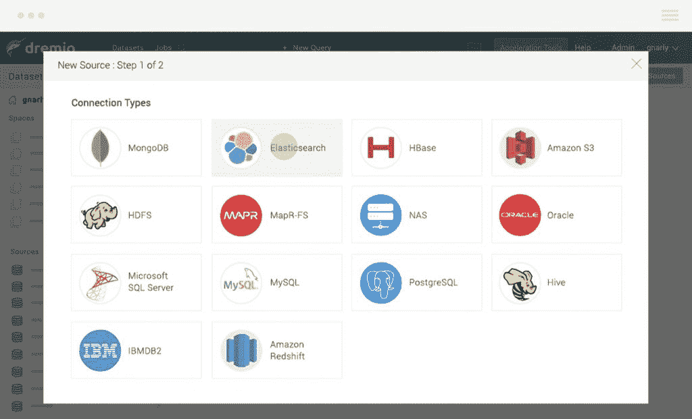
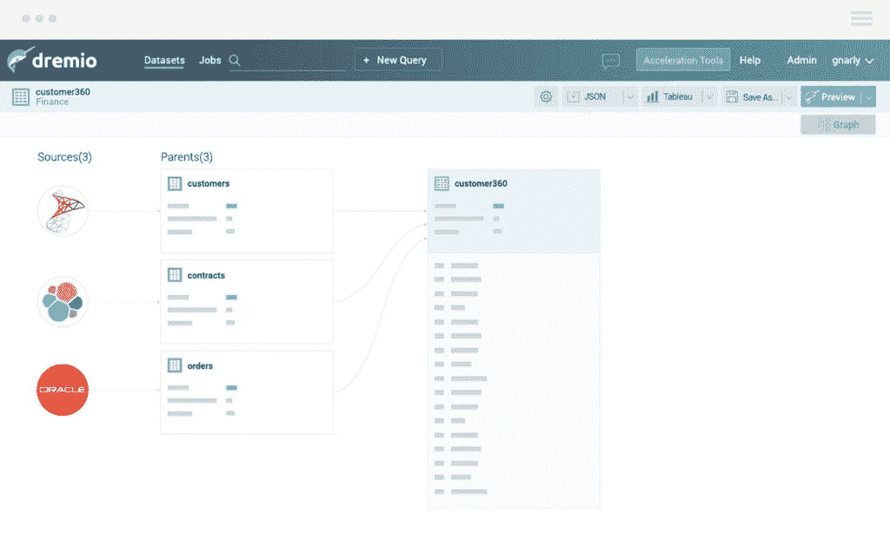

# Dremio 希望成为大数据的挥霍者

> 原文：<https://thenewstack.io/dremio-wants-put-data-scientists-drivers-seat/>

####  

总部位于加州山景城的 Dremio 于周三浮出水面，旨在使数据分析成为一种自助服务。这是 [Qubole](https://thenewstack.io/qubole-harnesses-automation-provide-data-self-service/) 的类似目标，尽管两家初创公司采取不同的方法。

本质上，Dremio 旨在消除中间层以及用户和数据存储之间的工作，包括传统的 ETL、数据仓库、立方体和聚集表。

两岁的 Dremio 的创始人是 [Tomer Shiran](https://github.com/tshiran) ，MapR[的前产品副总裁](https://mapr.com/)和 [Jacques Nadeau](https://github.com/jacques-n) ，他们在 MapR 负责分布式系统团队。两人都积极参与开源项目:Shiran 创建了 [Apache Drill](https://thenewstack.io/apache-drill-eliminates-etl-data-transformation-mapr-database/) 项目，Nadeau 是 [Apache Arrow](https://thenewstack.io/apache-arrow-designed-accelerate-hadoop-spark-columnar-layouts-data/) 的创建者和项目管理主席。

“我们创建了这家公司，因为我们相信这里有巨大的颠覆机会，”Shiran 解释道。“想想亚马逊能够为应用程序开发人员做些什么……十年前，如果你是一名应用程序开发人员，你真的要依赖它来为你购买和设置资源。亚马逊创造了一个将开发者放在驾驶座上的解决方案。它让开发人员能够获得自己的资源和自己的硬件，他们几乎可以在一分钟内瞬间完成。”

这就是 Dremio 旨在为商业分析师和数据科学家做的事情。

他们已经从光速风险投资伙伴和红点公司筹集了超过 1500 万美元。其管理团队包括来自 Hortonworks、Mesosphere 和 MongoDB 的大数据和开源领导者。

## 直接连接

Dremio 连接到组织的所有数据源、数据湖、数据库，处理中间的一切。基于箭头的执行引擎利用基于列的内存来执行在单个数据源或不同数据源之间的数据上运行的查询。

Shiran 说，它还优化了数据本身，类似于谷歌优化各种数据结构中的数据的方式，以便搜索查询可以非常快。它称这些数据结构为“反射”

它的用户界面很像谷歌文档，除了数据集而不是文档。用户自己可以看到数据并探索它。他们可以通过进行实时数据监管来创建新的数据集。他们可以直观地或通过 SQL 与数据进行交互。

“一切都是标准的 SQL，更多的技术用户可以在 SQL 的力量下做任何事情。你可以创建新的数据集，与同事分享。里面有完整的数据目录。

“然后，只需点击一个按钮，您就可以启动这些 BI 工具中的任何一个，将其连接到 Dremio 集群，并开始处理 Tableau 中的数据，而无需提取任何数据。没有数据副本。Dremio 内部的所有数据集和策展都是虚拟的。这都是在逻辑层完成的。目前所有的解决方案都是基于数据拷贝，而 Dremio 恰恰相反，”他说。

因为主要的 BI 工具都是基于 SQL 的，所以 Dremio 在 MongoDB 等 NoSQL 数据库之间架起了一座桥梁，自动从各种系统中学习隐式模式，即使它们没有原始模式。

“这有点像 Splunk 对日志做的事情，”Shiran 解释道。“以前人们并不是不分析日志，而是使用大量命令行工具并将日志加载到关系数据库中——这只是大量的手工工作。Splunk 专门为日志分析设计了一个解决方案，让您不必为了分析日志而将所有这些工具粘在一起。”

## 标准 SQL

Dremio 的设计[是为了](https://www.dremio.com/lp/architecture-guide)在单个集群中从一台服务器扩展到数千台服务器。它可以部署在 Hadoop 或专用硬件上。对于 Hadoop，它建议在 Hadoop 集群上部署 Dremio，以便原始数据位于本地缓存中。

Dremio 集群中有两个角色:

*   协调查询执行、管理元数据和管理 UI 的协调器。
*   执行者，处理查询。

通过在边缘节点上部署协调器，BI 工具等外部应用程序可以连接到它们。协调者使用[纱线](https://hortonworks.com/apache/yarn/)为集群提供计算能力，消除了手动部署的需要。该公司建议在集群中的每个 Hadoop 节点上安装一个执行器。

实际上，Dremio 是他们开源工作的延伸。Drill 是一个 SQL 引擎，可以查询和连接来自无数系统的数据。Dremio 使用 Apache Arrow(内存中的列)和 [Apache Parquet](https://parquet.apache.org/) (磁盘上的列)来实现高性能的列存储和执行。

对于任何工具来说，Dremio 看起来都像一个单一的高性能关系数据库。您只需发送标准的 SQL 查询。同时，Dremio 会针对缓存中的不同工作负载自动优化数据的物理组织，或者在您需要访问实时数据集时直接查询您的数据源。

它使用可以在 HDFS、MapR-FS、云存储(如 S3)或直连存储(DAS)上运行的持久缓存。据该公司称，缓存大小可以超过物理内存，这种架构使 Dremio 能够以更低的成本缓存更多数据，与传统的纯内存架构相比，缓存命中率更高。

它还提供了原生查询下推。Dremio 没有对所有查询执行全表扫描，而是优化了对底层数据源的处理。Dremio 用每个数据源(如 Elasticsearch、MongoDB 和 HBase)的原生查询语言重写 SQL，并优化对文件系统(如亚马逊 S3 和 HDFS)的处理。

它的数据图保存了数据流的完整视图。公司可以全面了解如何在所有来源和所有分析环境中访问、转换、连接和共享数据。

## **开源模式**

Dremio 有开源的[社区版](https://github.com/dremio)和企业版。企业版包括与 IBM DB2 等企业数据源的连接，以及安全性和治理功能。

它可以在内部或云中运行。Shiran 说，在云中运行 Dremio 有一些优势，例如你可以直接在 S3 上存储那些反射，优化的数据存储。

“这是一个完全托管的缓存，您可以独立扩展计算能力。他说:“比如说，在黑色星期五之后，你需要更多的分析能力，你需要增加一些 Dremio 实例，当你不需要时，你就停止运行。

<svg xmlns:xlink="http://www.w3.org/1999/xlink" viewBox="0 0 68 31" version="1.1"><title>Group</title> <desc>Created with Sketch.</desc></svg>