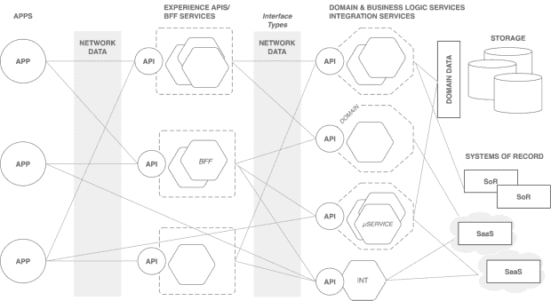

# 通过云原生应用推动数字体验

> 原文：<https://thenewstack.io/driving-digital-experiences-via-cloud-native-applications/>

这是 10 月 24-28 日 KubeCon + CloudNativeCon 系列文章的一部分。

可能有几十种现成的和软件即服务(SaaS)解决方案可用，但是如果组织想要参与竞争，他们仍然需要编写自己的应用程序。

我们生活在一个[体验经济](https://hbr.org/1998/07/welcome-to-the-experience-economy)中，这意味着现代企业内部的每一项 IT 工作和支出都必须专注于在内部和外部提供更好的数字体验。这些使用应用软件交付的独特数字体验是脱颖而出、实现收入增长的关键。

Twilio 联合创始人兼首席执行官杰夫·劳森(Jeff Lawson)表示，未能开发出这种软件[的组织将会消亡](https://www.youtube.com/watch?v=6HburD0ey-8)。

同样显而易见的是，提供数字体验的应用程序需要是云原生的，以支持快速创新，并动态扩展以满足需求。

仅仅使用传统的软件开发方法构建应用程序，然后将它们部署到云中是不够的。尝试这样做的组织很快发现，这种方法限制了他们利用云基础架构的能力，并增加了成本。相反，开发人员需要采用云原生应用的架构。

## **采用云原生架构**

云本地计算基金会( [CNCF](https://www.cncf.io/) )这样定义[云本地](https://github.com/cncf/toc/blob/main/DEFINITION.md):

“云原生技术使组织能够在现代动态环境(如公共云、私有云和混合云)中构建和运行可扩展的应用。容器、服务网格、微服务、不可变基础设施和声明式 API 就是这种方法的例子。

这些技术使得松散耦合的系统具有弹性、可管理性和可观察性。与强大的自动化相结合，它们允许工程师以最少的劳动频繁地、可预测地做出高影响力的改变。"

此外，CNCF 还定义了一个[云本地参考架构](https://www.cncf.io/blog/2017/05/15/developing-cloud-native-applications/)，包含五个堆栈:

1.  应用程序定义/开发
2.  编排和管理
3.  运行时间
4.  准备金提取
5.  基础设施

这篇文章概述了顶层的参考架构:应用程序定义/开发。

## **参考架构**

乍一看，该图看起来像是另一个水平绘制的分层架构，带有三层的阴影。尽管如此，我们的目的是根据特定的功能来使用通信和分组组件的顺序。请注意，组件是这个架构的原子单位。

让我们看看最右边的一组组件。

### **记录系统(SoR)**

企业通常依赖预构建的系统来实现标准业务功能。一些 SoR 的例子是会计，人力资源，客户关系和文件管理系统。在大多数情况下，员工、客户、订单和收入等关键业务实体都位于 SoRs 内部。这些系统正迅速转移到 SaaS，组织可以订阅和使用。然而，sor 的默认功能不足以满足现代数字企业的需求。因此，企业必须将其 sor 与增强 sor 默认功能的应用程序连接起来。

### **存储**

除了存储在 SoRs 中的数据之外，应用程序还必须在私有存储空间中存储主数据、交易数据和参考数据。虽然一些数据集单独驻留在 sor 上，但聚合数据通常保存在针对云的性能需求而优化的数据存储解决方案中。虽然 SQL、NoSQL 和云存储提供了基础，但诸如[数据湖](https://blog.architect2architect.com/microdata-architecture-5449596a3f6f#.a1ti7ingf)和[数据网格](https://martinfowler.com/articles/data-mesh-principles.html)等概念在创建存储系统和领域数据模型中发挥着至关重要的作用。领域数据模型以企业希望看到的方式表示业务实体(作为类型)。

### **域和业务逻辑服务**

领域和业务逻辑服务是独特的数字体验的基石，通过增加组织的可组合性和可重组性，将业务功能公开为应用程序编程接口(API)。这些 API 通常供内部使用，但是安全地公开它们供外部使用并不罕见。

域服务是使用域驱动设计( [DDD](https://martinfowler.com/bliki/DomainDrivenDesign.html) )概念设计和建模的，并且是用一组微服务构建的。这些微服务通过消费和处理来自数据存储和 sor 的数据来引入业务逻辑。我们为什么不把这一组组件称为“微服务”呢？原因是微服务太细粒度，无法作为业务功能公开，无法映射到敏捷、自主的团队开发，也无法提供所需的企业治理和安全性。因此，企业已经开始使用领域驱动的架构风格，例如:

*   面向领域的微服务架构( [DOMA](https://www.uber.com/blog/microservice-architecture/) )
*   应用程序、API 和服务的网状架构( [MASA](https://www.gartner.com/en/documents/3980382)
*   基于细胞的架构( [CBA](https://github.com/wso2/reference-architecture/blob/master/reference-architecture-cell-based.md) )

域服务边界内的微服务使用驱动程序、连接器和 API 与存储和 sor 连接。对于组件之间的域内通信，网状架构是一种可行的通信方式。相互传输层安全性(mTLS)提供了一种保护域内邮件流的有效方法。使用协议(如 HTTP/s 和 gRPC)开发的托管 API 可用于域间通信。在这个参考体系结构中，作为每个域服务的业务功能公开的 API 被标记为域 API，用于从外部访问服务。

### **集成服务**

企业服务总线(ESB)作为集中式中间件服务器，是面向服务的基于架构(SOA)的应用程序开发的主要集成技术。因此，ESB 模式不适合云原生架构的分布式本质。

然而，在当前的应用程序开发中，需要云到云的集成和一些企业集成模式( [EIPs](https://www.enterpriseintegrationpatterns.com/) )。处理这些集成的最佳方式是将它们包装在根据微服务架构( [MSA](https://martinfowler.com/articles/microservices.html) )原则设计的集成服务中。集成服务然后公开 API，可以从微服务、其他集成服务、应用、工作流和触发器中调用。

### **体验 API**

体验 API 是一组针对最终用户应用消费而优化的 API，面向应用开发者。在当前的 API 经济中，体验 API 被打包为 API 产品，并放入 API 市场供应用程序开发者发现和消费，同时为 API 提供商提供了引入货币化计划的机会。

体验 API 有很多种形式。例如，域 API 可以用作体验 API 的代理。但是，这种方法主要考虑的是原始领域 API 的增强安全性、可观察性和货币化。API 混搭、链接和组合是创建体验 API 的其他方法。域 API 不是内容感知的，也不是针对每种应用类型进行优化的。因此，后端对前端( [BFF](https://samnewman.io/patterns/architectural/bff/) )服务在这里扮演了一个角色，通过公开一个新的体验 API 来优化内容。BFF 使用 MSA 原则，它们是作为单独的组件开发和部署的。

### **应用与应用**

应用程序和应用程序之间有一点混淆。应用程序的范围比应用程序更广，涉及许多提供数字体验的功能，并包含许多组件类型。它们本质上是该参考体系结构的水平切片。

相比之下，应用程序是一个组件，充当连接人类与这些体验的渠道。网络、移动和物联网(IoT)是提供数字体验的主要渠道，但应用前景正随着元宇宙动态变化。

应用程序的消费者正在寻求个性化、实时、地理敏感和可预测的数字体验。同时，他们希望通过多种渠道与公司互动。因此，应用开发者必须更加关注用户体验(UX)和应用中暴露的信息。

在这个参考架构中，体验 API 通常用于交换用户、应用和后端系统之间的交互。然而，没有硬性规定只能依靠体验 API，应用程序可以灵活地调用面向外部的安全域 API 来实现这一目的。

### **网络数据**

网络数据块表示组件之间流动的消息和事件。API 是组件之间的粘合剂，并在这个应用程序架构中建立通信。可以根据需要使用请求/响应、发布/订阅和流式 API。

同时，业务数据类型可以用不同的传输风格来表示，比如 REST/HTTP、gRPC、GraphQ 和 AsyncAPIs，还有一系列消息格式，比如 JSON、XML 和 ProtoBuf。此外，API 主导的网络架构支持注入安全策略，并为 API 网关提供可观察性，从而增强应用的安全性和监控。

### **结论**

如今，企业认识到他们必须实施数字化计划来实现持续增长和增强创新。本文中描述的参考架构提供了一种实用的方法来解决希望交付云原生应用的应用开发团队所面临的需求和挑战。

团队还应使用其他云原生技术堆栈和标准，如 Kubernetes、Docker、Gitops、service mesh 和 SaaS 应用的 12 因素应用方法。通过采用本参考架构中的建议，开发团队可以应用云原生最佳实践来快速可靠地交付应用，从而推动盈利和增长。

*要了解有关云原生话题的更多信息，请参加 10 月 24 日至 28 日在底特律举行的 KubeCon + CloudNativeCon 北美 2022(和虚拟)会议上的云原生计算基金会和云原生社区。*

<svg xmlns:xlink="http://www.w3.org/1999/xlink" viewBox="0 0 68 31" version="1.1"><title>Group</title> <desc>Created with Sketch.</desc></svg>