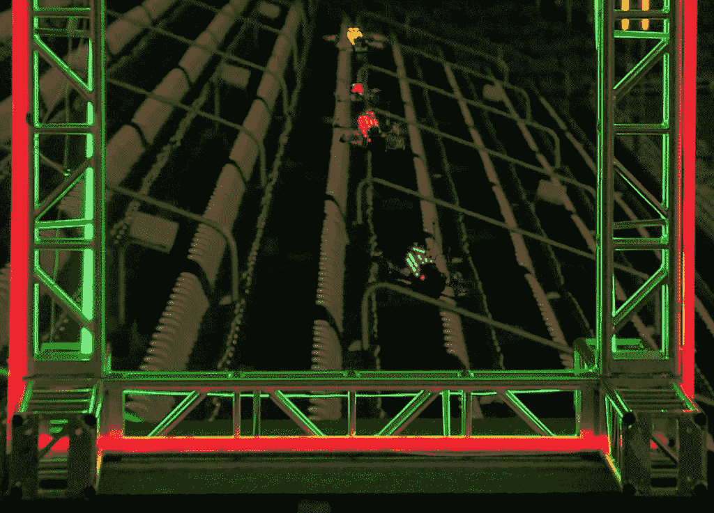
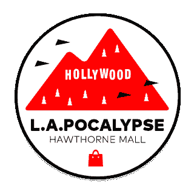

# 无人机竞赛:视频游戏变得真实

> 原文：<https://thenewstack.io/drone-racing-league-launches-major-new-media-campaign/>

“自古以来，飞行的梦想就是人类精神的一部分。今天，这个梦想有了新的形式，”无人机竞赛联盟(DRL)的最新视频自豪地说道。

诚然，这是一个宏大的声明，但该联盟的断言可能蕴含着真理的内核。

DRL 是探索新兴无人机竞赛世界的众多机构之一。在他们的活动中，有一个一致的主题正在浮现——这些年轻的无人机飞行员不仅仅是在享受自己，而且还发明了一种新的运动。正如一位评论者在 DRL 网站上写道的那样，无人机竞赛感觉就像 20 世纪 90 年代的滑板运动，“一小群人每天都在挑战极限和发明创造。”

这是否意味着我们有一天会看到“无人机公园”？或者更耐用的业余设备——甚至是无人机拆除比赛？飞行机器人大战？

无论如何，人们的兴趣正在快速增长。周二，无人机竞速联盟(或称“DRL”)出现在一篇彭博商业文章中，吹捧该联盟渴望成为下一个纳斯卡。到周四，联盟已经在 Time.com 的赢得了一个热情的形象[。](http://time.com/4196142/drone-racing-league/)

《时代》写道:“无人机竞速联盟正在打造一项疯狂的新运动。”。

随着这一波媒体的关注，DRL 本周发起了一场大规模的宣传攻势。该机构上周末发布了前四篇博客文章，并使用最适合展示这项运动的媒体，在一周内将 17 个诱人的视频上传到其[新的 YouTube feed](https://www.youtube.com/channel/UCiVmHW7d57ICmEf9WGIp1CA) 。

最近的一个出现在周四，标题是“地狱之门:梦想成真”

https://www.youtube.com/watch?v=ZGyxfRYILdI

新的无人机联盟正在与一些顶级新闻网站分享他们的镜头。在从联盟的一架飞行无人机上安装的机载摄像机中披露了 [90 秒的连续镜头后，Quartz 仅在两天内就获得了超过 1600 万的浏览量。](https://player.vimeo.com/external/153018974.hd.mp4?s=d251dd969980a159ed46df207d4edfe4e824953a&profile_id=113)

“现在有一个无人机竞赛联盟，感觉就像星球大战中的吊舱竞赛，”Quartz 的[热情标题](http://qz.com/602230/theres-now-a-drone-racing-league-that-feels-like-pod-racing-from-star-wars/)滔滔不绝。当镜头掠过空荡荡的体育场的座位时，一个字幕解释了它在一个更大的营销计划中的作用。“无人机竞赛联盟打赌，像这样的视频会在网上找到大量观众，有一天会让体育场挤满尖叫的粉丝。”

随着镜头倾斜，字幕警告说“你可能会发现这一部分让你恶心。”但是网上可以听到时髦的飞行机器人的光滑高清镜头。

他们分享了自己从一架飞行中的无人机拍摄的连续镜头——更多的是令人兴奋的“第一人称视角”(或 FPV)，这已经成为该联盟的一种商标——这也是由无人机竞赛联盟提供的。该视频显示了 12 月联盟“赛季揭幕战”的球场，这是迈阿密海豚队穿过体育场的一场复杂的比赛，也是六场精心设计的比赛的第一场。联盟现在正在编辑这个片段，准备在三月份发布。

该视频的发布应该与该联盟的下一场现场活动相吻合，据报道，该活动定于 3 月举行，被称为“洛杉矶末日”。根据 Quartz 的说法，这是洛杉矶的一个废弃商场，尽管该联盟更愿意将其描述为“一个废弃的场地——一个 40 英亩的 70 年代郊区过度的遗迹”。本赛季第二场比赛的完美背景。"

据彭博称，球迷们有望在线收听联盟的无人机比赛，尽管有一天他们可能会使用虚拟现实耳机体验*的比赛。最终会有大笔的钱处于危险之中。根据彭博报告的估计，像 Twitch 这样的游戏流媒体服务去年产生了 38 亿美元，而专业视频游戏产生了 7.5 亿美元，主要来自广告和赞助。*

该联盟的最新视频《梦想成真》展示了去年 7 月“季前赛”的片段，当时六名飞行员在一个名为“地狱之门”的课程上竞争。该联盟的网页解释道:“顶级飞行员头对头地飞过一个混凝土蒸汽朋克刑讯室，里面有铸铁立柱和来自另一个时代的巨大涡轮机。”这个流畅的视频展示了无人机和飞行员的真人镜头，以及显示该事件棘手过程的计算机动画。它甚至包括关于飞行员的背景故事，就像一个电视真人秀，以及一个合适的预示性画外音:

DRL 不是唯一的游戏。共有 32 名飞行员已经参加了去年的英国无人机全国赛。今年 10 月，夏威夷将举办名为[无人机世界](http://droneworlds.com/)的 2016 年世界无人机竞赛锦标赛。3 月 11 日，迪拜甚至将开始举办世界无人机大奖赛，承诺 100 万美元的奖金和“历史上最伟大的比赛，就在你头顶上进行。”但他们的标语道出了这项赛事的真正意义:“创造激励亿万人的未来运动。”

“Horbaczewski 和他的团队正在同时接受两大挑战:建立一项运动，建立一个企业，”彭博商业总结。“这有很多不同的商业模式，”Horbaczewski 告诉《时代》杂志。彭博还提到了“一些战略性安装的烟雾机”的存在，以增强戏剧效果。

一名飞行员告诉记者:“他们正在把这制作成一个现实生活中的电子游戏。”。

但也许真正的故事是飞行员自己的热情。从世界各地，他们开始聚集，从墨西哥，澳大利亚和巴西，从布福德，佐治亚州，从涉水河，纽约州，享受无人机比赛的新刺激。

一篇题为“为什么我们要飞”[的博客文章上周末出现在联盟的网站](http://thedroneracingleague.com/blog/why-we-pilot/)上，简洁地解释了戴上护目镜和体验无人机飞行的即时性的令人上瘾的快感。

“第一次从天空中的飞机上看到自己是令人困惑的，当无人机转弯时，你的身体会四处移动。控件的表现不像 xBox 或任何视频游戏——这是现实生活中的物理现象，而不是模拟。一开始很艰难，感觉不对，很难。”

但一旦飞行员习惯了，“你就能飞了。可以在三维空间里随意走动。快速灵活，比汽车、摩托车或飞机灵活得多。速度的冲击。你的心会开始跳动，你的手会出汗。你变得焦虑，紧张。

“你变成了无人机。”

* * *

# WebReduce

<svg xmlns:xlink="http://www.w3.org/1999/xlink" viewBox="0 0 68 31" version="1.1"><title>Group</title> <desc>Created with Sketch.</desc></svg>