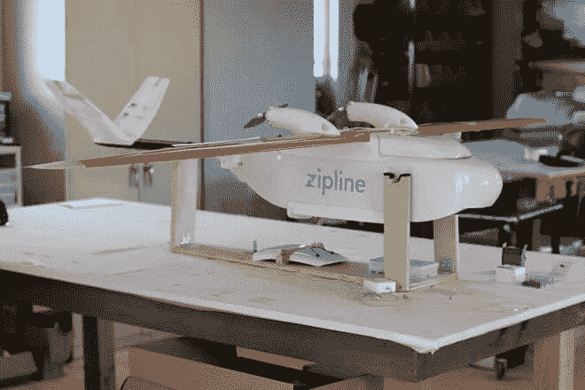
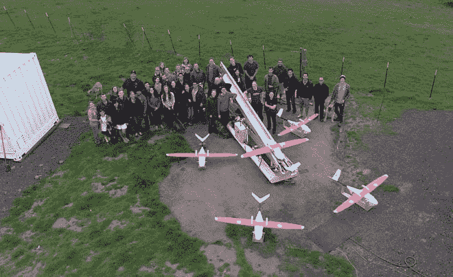

# 无人机向卢旺达运送救生医疗用品

> 原文：<https://thenewstack.io/drones-deliver-life-saving-medical-supplies-rwanda/>

在发展中国家运送救命的医疗用品可能是一场噩梦。如果没有铺设良好的道路基础设施或强有力的执法，道路可能会连续几个月无法通行，或者容易被匪徒劫持。

也许并不令人惊讶，这就是无人机可以拯救世界的地方——或者至少，这是美国公司 Zipline International 所期待的。这家硅谷初创公司现在正在非洲国家卢旺达试行无人机送货服务，将看到该公司的定制无人机舰队，绰号为“拉链”，运送药物甚至血液等物品。

医务人员可以通过电话或短信订购药品。几分钟之内，订单就在一个 Zipline 配送中心完成，包裹被装载到一架无人驾驶的固定翼 Zip 无人机上，该无人机将使用军用级 GPS 以每小时 62 英里的速度导航到卸货点。当包裹到达时，医生会收到警报，包裹会通过降落伞落到地面上，精确到几个停车位的范围内。交付后，无人机返回其仓库，在那里将装载新的包裹并安装新充电的电池。

[https://www.youtube.com/embed/t30taY9a3ZM?feature=oembed](https://www.youtube.com/embed/t30taY9a3ZM?feature=oembed)

视频

Zipline 的耐用电动无人机由美国宇航局、波音公司和 SpaceX 公司的工程师设计，每架重约 22 磅，能够携带多达 3 磅的货物。它们每次充电的续航里程约为 75 英里，该公司表示，其分散的 Zips 网络将能够在 30 分钟内交付包裹，这意味着供应品在运输过程中不需要冷藏。

滑索运输模式也更具成本效益:每次旅行比类似的摩托车旅行需要更少的钱和燃料，也更可靠。

## 卢旺达的独特机会

卢旺达地形崎岖，极具挑战性，被非正式地称为“千山之国”。尽管卢旺达政府还有其他不足之处，但在过去的几十年里，它展示了一种令人惊讶的[前瞻性的技术方法，慢慢地将 1994 年种族灭绝的痛苦遗产抛在身后，并产生了新一代的企业家和渴望在这里投资的外国公司。](http://www.bbc.com/news/world-africa-36285889)

Zipline 的首席执行官兼联合创始人凯勒·里瑙多(Keller Rinaudo)签署了一项合作协议，以测试一支由 15 条拉链组成的车队，从 7 月份开始，这些拉链将服务于卢旺达的一半地区。他表示，该国相对不受监管的空域对 Zipline 这样的项目来说是一个独特的机会。

“美国拥有世界上最复杂的空域之一，因此(联邦航空管理局)甚至比大多数监管机构更加规避风险，”里瑙多告诉[加拿大广播公司](http://www.cbc.ca/news/technology/drone-delivery-rwanda-1.3519594)。“所以我认为这将从需求非常高、空域相对空旷的环境开始。”

如果今年夏天向 20 家卢旺达医院和卫生中心运送物资的试点项目取得成功，该公司打算从明年年初开始建立更多的配送中心，向整个卢旺达运送物资。令人难以置信的是，根据该公司的说法，为 1000 万居民的整个国家提供服务所需要的只是两个位于改造后的海运集装箱中的枢纽，以及一支由大约 30 架无人机组成的车队。

Zipline 还希望在未来提供其他种类的医疗用品，如疫苗和毒液解毒剂，以及送货上门服务。Zipline 还着眼于向其他发展中国家扩张。该公司表示，有一个巨大的市场等待开发:在全球范围内，超过 20 亿人缺乏足够的医疗产品，导致了数量惊人的本可预防的死亡。

Zipline 对无人机的创新使用是这些机器如何改变我们的世界的又一个例子，它打破了日常业务，几乎毫不费力地跨越了以前无法逾越的障碍。医疗用品只是第一步；明天，无人机可能会在印度[运送器官移植](https://thenewstack.io/adapting-drones-uavs-changing-world/)，在 T2 与人类消防员一起扑灭野火，或者被用作劳动强度较小、无人机辅助的精准农业，这将提高农作物产量。安全和监管无疑将是一个问题，但无论无人机的未来可能预示着什么，这肯定会很有趣。

图片:国际滑索

<svg xmlns:xlink="http://www.w3.org/1999/xlink" viewBox="0 0 68 31" version="1.1"><title>Group</title> <desc>Created with Sketch.</desc></svg>