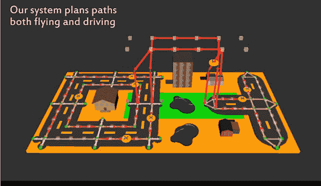

# 使用路径规划算法飞行和驾驶的无人机

> 原文：<https://thenewstack.io/drones-fly-drive-using-path-planning-algorithms/>

很长一段时间以来，飞行汽车一直是大众想象中的未来主题。虽然可以真正飞行的大规模制造的个人汽车尚未实现，但麻省理工学院[计算机科学和人工智能实验室](https://www.csail.mit.edu/) (CSAIL)的研究人员最近测试了无人机的原型，它们不仅可以在空中飞行，还可以在地面上行驶。查看它们:

[https://www.youtube.com/embed/s-oFD5X-QtQ?feature=oembed](https://www.youtube.com/embed/s-oFD5X-QtQ?feature=oembed)

视频

这种可在空中飞行但适合上路的无人机将解决传统无人机目前面临的一些设计问题。首先，它将解决电池寿命问题:尽管飞行无人机比地面车辆更加敏捷，但它们需要大量电力，这意味着电池寿命成为限制它们在需要充电之前可以行驶多远的因素。飞行中的无人驾驶飞机也很难在狭小的空间里操作。相反，地面车辆更节能，但速度较慢。

“飞行和驾驶的能力在有很多障碍的环境中是有用的，因为你可以飞越地面障碍，并在头顶障碍下驾驶，”该团队论文的主要作者、博士生布兰登·阿拉基说。“正常的无人机根本无法在地面机动。带轮子的无人机机动性更强，但飞行时间只会略有减少。”

CSAIL 团队最近在本月早些时候举行的 IEEE 机器人和自动化国际会议(ICRA)上展示了他们的设计。这种新的原型似乎融合了两个世界的最佳之处，同时也提出了一些有趣的方法，如如何组织一支可驾驶的无人机队，以便它们不会相互碰撞。

## 算法路径规划

在该团队的实验中，八架四轴飞行器无人机被制造成在一个小规模的，类似城市的景观中飞行和驾驶，该景观有建筑物，道路，停车区，着陆垫和禁飞区。这些多用途无人机建立在荒木之前建造[小甲虫](http://www.csail.mit.edu/node/2747)的工作基础上，这是一种模仿雄性鹿角甲虫的微小腿和翅膀的机器，不仅能够飞行，还能用它的小脚爬行、跳跃和抓取。

像 Picobug 一样，这些最新的原型可以自动驾驶，这要归功于每架无人机底部的两个微型轮式电机。为了确保这八架自主无人机不会相互碰撞，该团队制定了不同的“路径规划”算法，在空中和地面操作期间为它们提供指导，并确定能源使用和速度之间的最佳权衡。

该团队的试验让所有八架无人机同时部署，每架都自主遵循自己的路径。没有事故发生，研究人员发现，在需要给电池充电之前，这些机器可以飞行 90 米(290 英尺)或行驶 252 米(826 英尺)。该团队还发现，通过加入驾驶功能，原型可以在空中飞行的最大距离减少了 14%，但从长远来看，这种损失会得到平衡，因为驾驶模式比飞行更节能。目前，该团队的系统可以支持多达 80 架双模无人机同时运行。

除了在日常道路上导航，这种灵活的多模式无人机在紧急情况下也很有用，例如在自然灾害后道路不再可用时救援人员，或者提高效率，降低运输物品或乘客的成本。

虽然这种设计在真实城市街道和周围空域的复杂现实中推广和实施还需要一些时间，但这项实验表明，基于算法的系统在不同交通模式之间切换是可能的。该团队没有试图建造那种神秘的飞行汽车，而是提议利用基于无人机的研究，专注于开发类似的解决方案。

“随着我们开始开发飞行汽车的规划和控制算法，我们对小规模创造具有这些能力的机器人的可能性感到鼓舞，”CSAIL 主任 Daniela Rus 说。“虽然扩大到可以实际运送人类的车辆显然仍有很大的挑战，但我们受到了未来飞行汽车可以为我们提供快速、无障碍交通的潜力的鼓舞。”

点击[麻省理工学院新闻](http://news.mit.edu/2017/drones-drive-flying-cars-0626)阅读更多内容。

<svg xmlns:xlink="http://www.w3.org/1999/xlink" viewBox="0 0 68 31" version="1.1"><title>Group</title> <desc>Created with Sketch.</desc></svg>