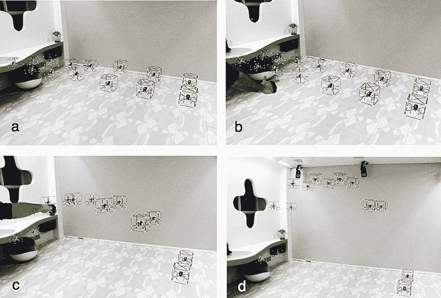
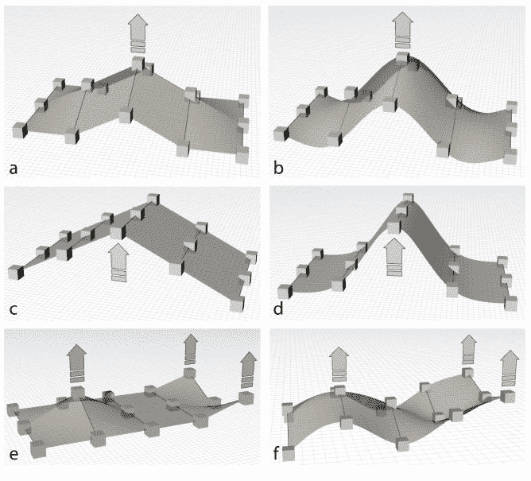

# 无人机为可编程事物制作了一个三维用户界面

> 原文：<https://thenewstack.io/drones-make-a-three-dimensional-ui-for-programmable-matter/>

在过去的几十年里，计算机用户界面发生了巨大的变化，从简陋的穿孔卡片到早期的命令行界面，再到今天易于使用的图形用户界面。也有[增强(AR)和虚拟现实(VR)界面](https://thenewstack.io/smartphone-app-can-control-robots-augmented-reality/)，但总的来说，今天可用的大多数界面都是二维的，不一定那么互动也不直观。但是，如果有某种方法可以创建一个交互式的三维用户界面，用户可以用手势控制，使用一些可以在实时和真实空间中被触觉操纵的[可编程物质](https://en.wikipedia.org/wiki/Programmable_matter)会怎么样？

这个有趣的想法并不新鲜，来自加拿大皇后大学[人类媒体实验室](http://www.hml.queensu.ca/)的研究人员正在开发一个平台，该平台使用一群立方体形状的纳米钳子，充当“交互式、可触摸的 3D 图形体素”的网格该系统被称为 GridDrones，允许用户通过一系列手部动作进行直接交互，允许人们用这些无人机“体素”(或像素的三维版本)实际雕刻出三维形状。这个想法是为用户提供创建不支持的结构的能力，比如拱门、 [NURBs](https://en.wikipedia.org/wiki/Non-uniform_rational_B-spline) (非均匀有理基础样条曲线)或者甚至可以在三维空间自由争论的 3D 动画，而不是在平面屏幕上。观看这项研究的演示:

[https://www.youtube.com/embed/qqVqFD-MMtI?feature=oembed](https://www.youtube.com/embed/qqVqFD-MMtI?feature=oembed)

视频

## 自悬浮体素

这项新的[研究](https://dl.acm.org/citation.cfm?id=3242658)建立在 [BitDrones](https://thenewstack.io/interactive-swarms-3d-pixels-future-programmable-matter/) 的基础上，这是该实验室之前对交互式 3D 显示器的研究。为了解决先前工作的一些限制，GridDrones 系统使用了更小的无人机，一种更好的通信系统，同时还采用了一种类似网格的模型，可以变形并进行三维空间转换。

“与 3D 打印材料不同，GridDrones 不需要结构支撑，因为每个元素都会自动悬浮以克服重力。与 3D 打印不同，该系统是双向的:你可以简单地通过拾取像素并重新排列它们来改变‘打印’，”人类媒体实验室主任、研究合著者和 Roel Vertegaal 教授说。“这是机器人系统将图形渲染为物理现实而不仅仅是光的重要的第一步。这意味着用户将在没有头戴式显示器的情况下获得完全沉浸式的体验，这种显示器免费提供触觉。”

该团队使用了 15 台 nano 四轴飞行器，通过使用 Vicon 运动捕捉系统，这些飞行器能够保持彼此的相对位置。每个纳米钳子代表一个可以通过三种不同类型的输入进行交互的物理构建模块:选择单个体素的单手触摸；双手触摸以选择体素组并旋转或变换网格；以及手势输入，例如发出与体素相交的“3D 射线”的“点”手势。

GridDrones 创建一个悬链线拱门，具有 a)一个 2×7 的无人机平面网格；b)用户使用“点”手势选择拱门的两个“基石”，在应用程序上设置一些拓扑参数；c)用户将楔石向上移动到 d)创建拱门。

除了这些输入，系统还利用了许多我们熟悉的其他常规输入，比如双击和套索。此外，该团队开发了一款智能手机应用，使用户能够使用触摸滑块轻松改变无人机体素之间的地形关系；例如，将体素之间的垂直距离设置为某个百分比，以便当一个体素移动时，其余的体素将自动重新定位以反映该百分比设置。

网格变换。顶部:点控制，其中一个体素以 a)体素之间的线性关系移动；b)曲线关系。中间:选择一行 3 个体素，在 z 维度上平移产生 c)刻面关系；d)复杂曲率。底部:在 z 维度中选择和平移的任意体素，导致 e)刻面关系；f)复杂曲率。

## 一个“真实的现实界面”

虽然目前的研究被认为是仅使用 15 架无人机的“低分辨率”版本，但根据研究人员的说法，GridDrones 系统可以很容易地扩展到包括更多的无人机。

“该系统的未来版本将以数十亿架无人机为特色，这些无人机非常小，它们能够粘在一起，创造出无法从真实的[3D]打印中辨别出来的物理结构，”该研究的合著者、丹麦奥尔堡大学的蒂姆·梅里特教授解释道。“这项技术有可能最终取代虚拟现实。真正的优势在于它位于用户的真实世界中。这就是为什么我们称之为“真正的现实界面”"

这种“真实的现实界面”可以用于为工程师、设计师和建筑师创造全尺寸原型能力，以及为所有年龄的人提供交互式教育工具。这种三维界面将通过结合[脑机接口](/brain-computer-interfaces-expose-us-hacking-manipulation/) (BCIs)得到进一步扩展，允许用户用他们的脑电波操纵物理体素。这是一个挑衅性的想法，可能会将用户界面带入我们的日常生活，并像做一个手势或思考一个想法一样简单地控制它们。

<svg xmlns:xlink="http://www.w3.org/1999/xlink" viewBox="0 0 68 31" version="1.1"><title>Group</title> <desc>Created with Sketch.</desc></svg>