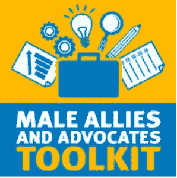

# 多元化的男人:一个男人如何产生积极的影响

> 原文：<https://thenewstack.io/dudes-diversity-one-guy-can-make-positive-impact/>

最近有很多关于科技领域性别歧视的讨论。也许你是一个男人，听你生活中的一个女人讲述她们每天为了完成工作不得不忍受的事情。也许你有一个聪明的同事，但她的工作并没有得到赞扬。或者，也许像我们一样，你会惊恐地读到杰出的技术专家杰西·弗雷泽勒(Jessie Frazelle)因死亡和强奸威胁而被赶出码头工人的岗位。

这些问题是系统性的、巨大的；但是一个人能有所作为吗？

是的，根据[布拉德·麦克莱恩](https://www.ncwit.org/profile/brad-mclain)，研究科学家和[国家妇女和信息技术中心](https://www.ncwit.org) (NCWIT)的说法。上个月在奥斯汀举行的 OpenStack 峰会上，麦克莱恩列出了普通人可以做出改变的简单步骤。

虽然前 10 条建议中的大部分都适用于管理(建立责任衡量标准，寻找招聘女性的方法，增加女性领导者的知名度等)。)，有几个关键领域，任何人都可以做到，可以产生巨大的影响。

一些简单的行动，比如在会议上询问女同事的意见，确保每个人都有发言权，打断无视女性建议的打断者，都会对男性产生巨大的影响，尤其是白人男性。

一个人的小举动会带来很大的不同。

麦克莱恩的演讲名为“变革的倡导者:让男性倡导多样性和包容性”，50 名听众聆听了 NCWIT 就多样性为何重要所做的研究，然后分成几个小组进行讨论。我们这个由三个女人和两个男人组成的小组讨论了微观不平等和小组成员可以做的积极的事情。

SanDisk 的开源策略师和产品营销专家 Nithya Ruff 谈到了微不平等是如何随着时间的推移积累到如此程度，以至于刺激女性转行的。当一个女人离开科技行业时，数千小时的培训和经验也随之离开。

拉夫解释说，微观不平等就像 T2 的千刀万剐。拉夫说，在员工会议上被打断并不是问题，但是当一个人不被允许在不被持续打断的情况下表达自己的观点，或者一个人的专业知识不断受到质疑时，这些个人经历就会累积起来。

> 总而言之，多元化对商业有益。不仅仅是技术方面，涵盖技术创新的所有方面，从概念化到软件开发，再到发布到市场。

[Red Hat 的领导力和组织发展执行教练 Alexis Monville](https://www.linkedin.com/in/alexismonville) 谈到了一个特别的“啊哈”时刻。为了准备一次会议，蒙维尔和同事们一起浏览了他的演示文稿。他回忆说，他们对内容都有非常积极的反馈，但有一个人指出，他演讲中的所有人物都是男性。他并没有想到自己是排外的，但一旦被指出，他就改变了自己的表述，使之更具包容性。

小改变，大不同。

该小组讨论了在工作场所出现类似情况时可以采取的行动。以一种非对抗性的方式，被打断的人可以说这样的话，“嘿，我真的很想听听唐娜对此有什么看法。”或者当一个男人把一个女人的想法当成他自己的想法，说“我喜欢你说的，它确实是建立在唐娜的想法上的。”

小变化，大不同。

麦克莱恩指出，微不平等是女性在职业生涯中期离开科技行业的比例是男性的两倍的原因之一，此外还有刻板印象威胁、制度障碍和个性惩罚(基本上不是男性)。

为什么这对你很重要？

根据麦克莱恩的说法，在 NCWIT 进行的[研究表明，一个群体的集体智力并不能由个体的智商来预测。但是，如果一个团体包括更多的女性，它的集体智慧就会提高——不仅是女性的数量，还有女性的活力，甚至在有争议的团体中，集体智慧。](https://www.ncwit.org/resources/what-impact-gender-diversity-technology-business-performance-research-summary)

总而言之，多元化对商业有益。不仅仅是技术方面，涵盖技术创新的所有方面，从概念化到软件开发，再到发布到市场。

如果你有兴趣了解更多或参与其中，NCWIT 有更多关于性别多样性对科技企业绩效的[影响的信息(剧透——这是积极的)，批判性倾听的](https://www.ncwit.org/resources/what-impact-gender-diversity-technology-business-performance-research-summary)[指南](https://www.ncwit.org/resources/critical-listening-guide-just-because-you-always-hear-it-doesnt-mean-its-true)(只是因为你总是听到它并不意味着它是真的)，以及众多其他资源中的[男性倡导者工具包](https://www.ncwit.org/resources/male-allies-and-advocates-helping-create-inclusive-highly-productive-technology-workplaces)。

瑞安·麦奎尔拍摄的专题图片。

<svg xmlns:xlink="http://www.w3.org/1999/xlink" viewBox="0 0 68 31" version="1.1"><title>Group</title> <desc>Created with Sketch.</desc></svg>