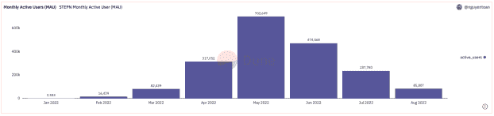

# Dune Analytics 简化了区块链数据分析

> 原文：<https://thenewstack.io/dune-analytics-simplifies-blockchain-data-analysis/>

区块链更有趣的一面是，每一笔交易都被记录为公开的记录。任何开发人员都可以通过直接查询区块链来分析原始交易数据。以有意义的方式解释这些记录要复杂得多，因为每个记录也可能是触发多个智能合约交互*和*的结果，一些关于交易记录的相关元数据可能存储在链外。 [Dune Analytics](https://dune.com/home) 正试图通过将区块链数据组织成更熟悉的数据库表结构，使其更易于访问。

Dune 越来越受欢迎的原因之一是，查询数据和创建仪表板对所有用户都是免费的，并且大多数具有 SQL 技能的开发人员都很熟悉。如果您能编写 SQL 查询并对区块链数据结构有基本的了解，您就能创建区块链数据的可视化和仪表板。社区贡献者被亲切地称为“奇才”

在接受 New Stack 采访时，Dune Analytics 的增长经理[乌戈·桑切斯](https://twitter.com/schezhugo)说:“Dune 是一个社区第一的平台。有如此多的数据和如此多的见解需要浮出水面，以至于一家公司不可能自己完成所有的数据分析。通过开放，我们试图创造空间的透明度，增加信息的获取。面向社区是一种拥有更好的数据和更好的数据展示方式的策略。”

在 Dune library 中有许多社区创建的查询和仪表板可供浏览。一个流行的例子是这个由 Dune 用户 [nguyentoan](https://dune.com/nguyentoan) 创建的[统计仪表板](https://dune.com/nguyentoan/STEPN-(GMT-GST)-Core-Metrics)，它是关于“移动赚钱”应用 Stepn 的使用，该应用因其在 [Q2 2022 年的利润](https://www.coindesk.com/business/2022/07/12/solana-based-stepn-reports-1225m-in-q2-profits/)而被大肆宣传。如果下面的示例图表有所提示的话，用户在第三季度已经转移到其他方面了。

## 可通过 SQL 查询的区块链数据

最初的 Dune 数据库是使用 Postgres 构建的，支持 PostgreSQL 查询。一个较新的沙丘引擎 V2 是建立在 Apache Spark 上的，它使用 Databricks SQL 进行查询。在这两种情况下，您都可以从以太坊、Solana、Polygon、币安智能链、乐观和灵知链查询区块链数据的原始表，其中包含一组较小的包含解码智能合约的表。在 Dune Engine V2 中，向导主题通过引用视图、表格和数据验证测试的社区贡献作为“[拼写](https://docs.dune.com/dune-engine-v2-beta/abstractions-in-dunev2/how-to-contribute-a-spell)”来扩展

创建和共享仪表板的自由访问有一些限制。您发布的任何仪表板都可以通过 Dune 水印被社区的其他人看到。没有办法用免费账号从 Dune 提取数据。专业帐户授予您访问权限，使您的查询和仪表板不带有水印。您还可以将查询结果导出为 CSV 格式。目前，免费帐户允许你并行运行三个查询，而专业帐户将限制扩展到六个并行查询。

我向 Sanchez 询问了一个用于执行查询和导出结果的 API 的可能性。根据 Sanchez 的说法，API 是 Dune 社区最需要的特性。该公司计划在年底前发布一个 API，这可能会使你更容易将区块链数据纳入自己的分析应用程序。

虽然 Dune 上的大部分内容是由社区为社区完成的，但该公司也为巫师创建了一个程序，通过[巫师请求程序](https://docs.dune.com/bounties/wizard-request-program)获得报酬。这个程序基本上允许任何人创建一个数据分析请求，以及请求的奖金，并发布到更大的社区以实现。如果你有扎实的 SQL 技能，这绝对是一种对 Web3 项目做出贡献的方式，而不需要成为一个可靠的或不可靠的开发人员。

<svg xmlns:xlink="http://www.w3.org/1999/xlink" viewBox="0 0 68 31" version="1.1"><title>Group</title> <desc>Created with Sketch.</desc></svg>