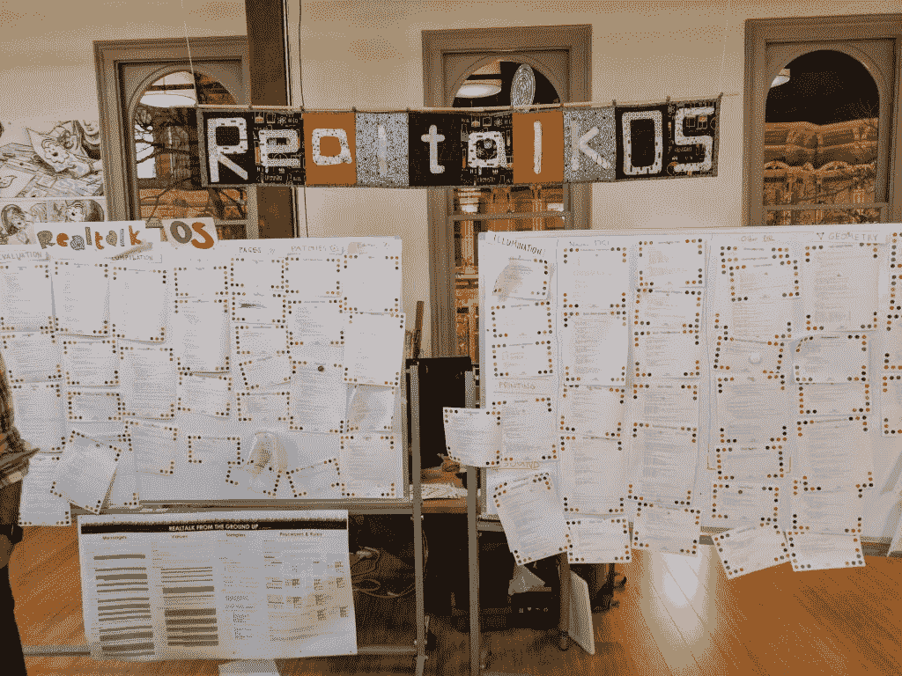
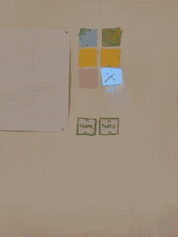
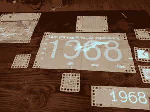

# 动态和彻底地重新思考计算机界面

> 原文：<https://thenewstack.io/dynamicland-rethinks-computer-interfaces/>

历史悠久的加州奥克兰市中心区[老奥克兰](http://www.old-oakland.com/)是一个典型的地方，你可以去那里购买时尚服装、一种新的桌游，甚至去见见足球明星马肖恩·林奇，他的[野兽模式](https://www.beastmodeonline.com/)商店就在这里，配有免费的自动售货机。

现在，老奥克兰是世界上最有趣的科技组织之一[dynamic and](https://dynamicland.org/)的所在地。

2014 年，企业软件提供商 [SAP](https://www.sap.com/index.html) 与 [CDG 研究实验室](http://www.cdglabs.org/)合作，以培养一个雄心勃勃的[施乐 PARC](https://www.parc.com/) 式的研发机构。CDG 由 PARC 资深人士兼 Smalltalk 创始人[艾伦·凯](https://amturing.acm.org/award_winners/kay_3972189.cfm)和 [Bret Victor](https://twitter.com/worrydream) 共同创立，Bret Victor 是苹果 iPad 和苹果手表 UI 开发人员。然后，两人开始招募有趣的年轻人才，并把他们带进 SAP，让他们自由地工作。虽然在那里完成的工作很有趣，但 SAP 最终决定不值得继续这个项目，并将他们的科学家和开发人员群体释放到世界各地。

Dynamicland 最初是 CDG 研究项目之一。今天，它是一个成熟的非营利组织，致力于了解计算机界面在未来 5000 年将如何演变。键盘、鼠标、手指和屏幕的现代模式在这里已经完全过时了。

在 Dynamicland 中，界面就是表格。或者墙。或者你看到的贴在每个表面的便利贴和纸。Dynamicland 充满了摄像机和投影仪，大部分都安装在天花板上。虽然该项目目前存在许多计算机，每个计算机覆盖一个固定的空间区域，但最终的想法是让整个建筑像计算机一样运行。

Dynamicland 的员工很快指出，投影仪、相机和纸张是这里的原型，这一堆中的每一个单独的部分都只是一部分，而不是最终目标。他们很快纠正那些惊叹于他们在桌子上投影能力的游客。惊叹于投影本身就是只见树木不见森林。

相反，在这里，墙上和桌子上的每一张纸，本质上都是它自己的 [Lua](https://www.lua.org/) 编程语言片段。一些纸片上印有它们的工作代码。Dynamicland 实际上可以对代码执行 OCR 并实时运行，但通常情况下，它在现实世界中象征性地使用代码，并在服务器端存储自己的数字部分。但是，当对象发生变化时，系统可以在纸质打印输出上突出显示变化的行，并且能够标记与其更新的数字副本不同步的代码页。

动态运行的 Realtalk 操作系统。先前的迭代实时运行代码，就像印在这些纸上的一样，但当有人走到电路板前挡住摄像头时，操作系统就会崩溃。

[弗吉尼亚·麦克阿瑟](https://twitter.com/vamcarthur70)是《动态庄园》的执行制片人。她已经在这个项目上工作了两年，她来自视频游戏世界，之前她曾在那里工作过模拟人生 Online.她说，整个空间的操作系统，主要是处理物体之间的关系，也是打印在纸上的。

“我们的想法是盒子里没有隐藏的东西。没有隐藏什么。我的职业不是程序员。我的职业是医学插图画家，”麦克阿瑟说。“我们想要的是一种社区意识；让人们聚在一起，在一个充满创意的空间里玩耍。”

一个绘图程序:用激光笔从便利贴上选择墨水颜色，然后在旁边的白纸上绘图。或者只是放个屁的噪音玩玩。

托比·沙奇曼反映了这种情绪，他从一开始就一直是动态土地项目的研究员。

“使用物理对象作为计算媒介的想法是这个小组的重点。你在这里看到的只是我们想要发展的表面。我们不希望你写代码来制造这些东西。你应该能够画出一个图表，并把它解释为一个图表，”他说。

“我们喜欢基于界面绘图的想法，”他说。该组织使用基于 Smalltalk 编程语言的操作系统，为对象之间的相互通信提供了一种方式。这包括作为一个对象的相机，某页代码说，“当相机看到一个图像时，找到它上面的所有点。”

这一概念在动态陆地和空间的许多方面都得到了证明。最早的实验之一是用便利贴在墙上创建一个绘图程序。用户通过将激光笔指向便利贴来选择绘图颜色，然后用同样的激光在附近的空白纸上绘图。自然，该团队还增加了一个“屁”按钮，用激光瞄准时会发出屁的噪音。它象征着动感之地的游戏性。

一个交互式图表，其特点是从用绿色投影线连接的小纸片中载入数据。

从这个基本的绘图界面中，产生了更多的想法，最终导致了 Dynamicland 在类似工作的行为中的实际应用。空间中的一个表将动态图形投影到用户表面上。用户可以选择由纸张表示的数据集，将它们移近图表会将数据带入图表。另一张纸使用冰棒棒作为滑动旋钮来选择显示信息的年份。

这种基于桌面的互动是 Dynamicland 愿景的精髓所在。目标是允许多人在一个开放的空间中直接、一起、动态地与一个程序及其代码进行交互。这种努力已经在该领域的许多其他实验中得到体现，从可以自己移动磁铁的机器人桌子，到用手绘纸张实时呈现游戏世界中资产的平台游戏。

Dynamicland 现在已经开始独立运作，成为一个独立的非营利组织，该组织正在寻求与其他硅谷公司进行磋商，以帮助其技术发展成为有用的应用。然而，目前的重点是建立一个当地社区，以扩大现有空间的使用。Dynamicland 设想未来这种“建筑即电脑”的空间会像图书馆一样普遍。

亚历克斯·汉迪的照片。

<svg xmlns:xlink="http://www.w3.org/1999/xlink" viewBox="0 0 68 31" version="1.1"><title>Group</title> <desc>Created with Sketch.</desc></svg>