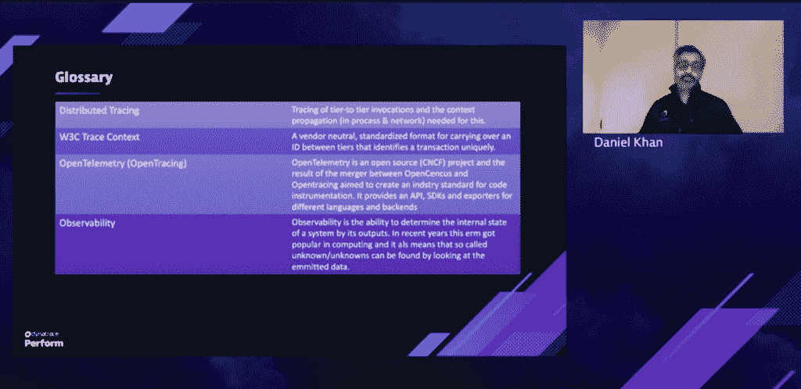
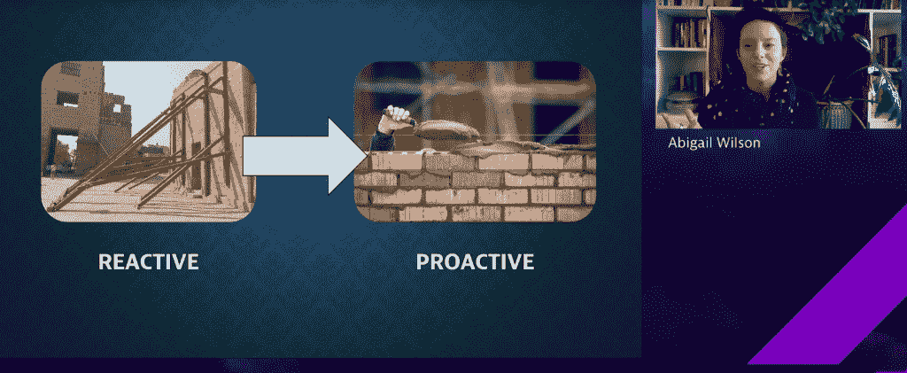

# Dynatrace 面临着可观测性的“未知的未知”

> 原文：<https://thenewstack.io/dynatrace-confronts-the-unknown-unknowns-of-observability/>

Dynatrace 上周在其 [Perform](https://perform.dynatrace.com/2021-americas/login) 虚拟会议上提供了关于其监控平台大量更新的详细信息，以支持其提供“完全可观察性”的雄心，将 DevOps 扩展到 BizDevSecOps 的所有方面，将业务和安全团队纳入应用生命周期管理。

Dynatrace 创始人兼首席技术官 [Bernd Greifeneder](https://at.linkedin.com/in/berndgreifeneder) 、 [Dynatrace](https://www.dynatrace.com/?utm_content=inline-mention) 告诉新的 Stack:“devo PS 将始终是 Dynatrace 平台的一个巨大焦点，但我们在这里不仅要用更精确的自动化来武装这些团队，还要让他们朝着 BizDevSecOps 迈出下一步。

Dynatrace 计划将其平台和工具扩展到可观测性之外，以帮助解决新兴的开发应用程序的挑战，同时支持“更广泛意义上的数字服务”的分析、人工智能(AI)和自动化的改进，Greifeneder 告诉新的堆栈。

在这次虚拟会议上，有很多东西需要解开。

## 可观察上下文

关于什么是可观测性以及 DevOps 如何利用它，仍然存在困惑。一些供应商因声称提供可观察性工具而受到批评，这些工具实际上是应用程序监控平台，而一些供应商声称[监控](https://thenewstack.io/observability-wont-replace-monitoring-because-it-shouldnt/)和警报与可观察性无关，这在作者看来是不正确的。

在他的演讲“[用 Dynatrace AI 和自动化解锁和扩展 OpenTelemetry】”中，Dynatrace 的技术战略总监 Daniel Khan](https://perform.dynatrace.com/2021-americas/breakouts-single-day-1-unlock-and-scale-opentelemetry-with-dynatrace-ai-and-automation) 讨论了“未知的未知”是如何发挥作用的。Khan 在与 Dynatrace 技术产品经理 [Daniela Rabiser](https://at.linkedin.com/in/daniela-rabiser-69a242135) 和 AWS 首席产品经理 [Nizar Tyrewalla](https://www.linkedin.com/in/nizar-tyrewalla) 的谈话中说，对于未知的未知因素，“很容易理解，你可能会监控或测量应用程序的请求时间，你会发现它变得很慢。“但如果你的系统是可观察的，你不仅会知道它慢，而且因为你可以深入了解，你会发现它只在你的商店进行货币兑换时慢，比如说英镑。所以这就是，知道，或者能够更深入地观察数据。”

在会谈中，还讨论了 Dynatrace 的未来项目，以及该公司对[云本地计算基金会](https://cncf.io/?utm_content=inline-mention)(CNCF)[open telemetry](https://opentelemetry.io/)项目的参与。CNCF OpenTelemetry 项目旨在帮助 DevOps 团队避免使用高质量的遥测技术，同时避免供应商锁定专有代理，提供供应商中立的集成点。这些有助于组织获得原材料——“遥测技术”——这些原材料为现代的可观测性工具提供燃料，并且在集成时只需最少的努力。

Rabiser 描述了 Dynatrace 如何提供“独立于供应商、高度稳定和高性能”的 OpenTelemetry 指标收集器，客户可以使用该收集器从 AWS 解锁自定义 OpenTelemetry 指标的智能可观察性。

“Dynatrace 不仅支持 OpenTelemetry 指标，它还自动进行数据收集和数据丰富，我们还确保将收集的数据放入 OpenTelemetry 和 open tracing 的上下文中，”Rabiser 说。“我们还涵盖了跨异构环境的自定义检测和预检测技术，然后将捕获的跨度集成到 Dynatrace 中。”

## 从理论到仪器

Dynatrace 通过对 Kubernetes 和多云环境的原生日志支持，扩展了其可观测范围，从而提高了其平台的基础设施监控能力。其他增强功能包括:

*   旨在进一步自动化运营和连续交付(CD)的云自动化模块。“自动化、安全性、服务水平和用户体验都始于开发人员——想想左移右移——因此跨越了整个软件生命周期，从前期生产到生产，然后返回，”Greifeneder 说。“Dynatrace 云自动化模块利用质量关和自动补救最佳实践，使开发运维团队和 SRE 团队更加敏捷，同时也提高了生产可靠性。”
*   更广泛的应用安全覆盖面，帮助开发团队做出“更明智的决策”，并帮助保护他们的云原生环境。Greifeneder 描述了 Dynatrace Application Security 如何通过“大幅减少预生产中的误报，以及对操作的持续保护”，在整个应用生产管道和部署生命周期中实现应用安全的自动化。
*   将会话回放和业务分析扩展到原生移动应用，以更好地支持监管程度更高的行业，如金融服务、医疗保健和政府。“通过为原生移动环境提供更多的会话重放功能，我们将客户的真实世界体验带回给开发人员，以便团队根据功能采用和客户旅程从 sprint 到 sprint 做出正确的决策，”Greifeneder 说。
*   新的 Dynatrace 软件智能中心，允许 Dynatrace 客户访问来自云提供商的 500 多种工具和技术，包括[亚马逊网络服务](https://aws.amazon.com/?utm_content=inline-mention) (AWS)和谷歌。“我们推出了 Dynatrace 软件智能中心，以允许客户轻松地将 Dynatrace 的自动化和人工智能协助扩展到他们的多云环境和更多的用例，”Greifeneder 说。

## AI 吃天下

除了作为上述公告的主要组成部分，自动化，尤其是人工智能，在 Perform 期间也经常被提及和讨论。为了实现跨多云和传统环境的可观察性和监控，Dynatrace 首席产品经理 [Wolfgang Beer](https://at.linkedin.com/in/wolfgangb33r) 使用了科幻小说经典作品[《黑客帝国》](https://en.wikipedia.org/wiki/The_Matrix_%28franchise%29)中现已成为标志性的数据流来说明在由数万台主机组成的 IT 环境中必须监控的数据的范围和规模。

“因此，想象一下，您的监控环境中的所有信息流:它可能看起来像一个矩阵风格的信息流。因此，有大量信息流入您的监控环境，并按主机、流程和服务等个体维度进行划分，”Beer 在他的演讲中说道，[“以 Davis AI 为 Dynatrace 平台的核心，以](https://perform.dynatrace.com/2021-americas/breakouts-single-day-1-automating-cloud-operations-with-davis-ai)Abigail Wilson、可靠性架构师 [CFA 协会](https://www.cfainstitute.org/)实现云操作自动化。”有了各种各样的维度，没有适当的人工智能在上面，你根本不知道这是怎么回事。因此，所有这些数据背后没有任何意义，人类可能会被这些数据流淹没。"

例如，威尔逊描述了以前在没有人工智能的情况下试图追踪一个根会导致数百个不同的工作单。“但是，一旦我们转向 Dynatrace 和 Davis，这有助于我们对这些问题有更多的了解，我们的事件数量现在处于较低的两位数，这对我们所有的团队来说都非常好，”Wilson 说，并补充说她的团队还可以使用 Dynatrace API 来监控与传统架构以及云环境相关的自定义事件和警报。

“有了所有这些东西，我们真正拥有了整个平台的集成视图，我们能够根据有助于做出决策的信息做出决策，不仅是对事件做出响应，还帮助我们向前迈进，”威尔逊说。

亚马逊网络服务、云计算原生计算基金会和 Dynatrace 是新堆栈的赞助商。

<svg xmlns:xlink="http://www.w3.org/1999/xlink" viewBox="0 0 68 31" version="1.1"><title>Group</title> <desc>Created with Sketch.</desc></svg>