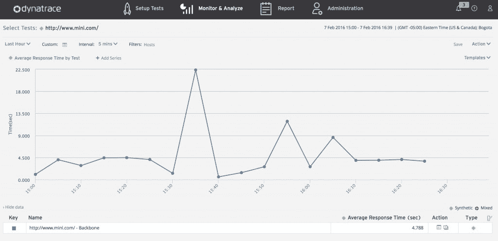
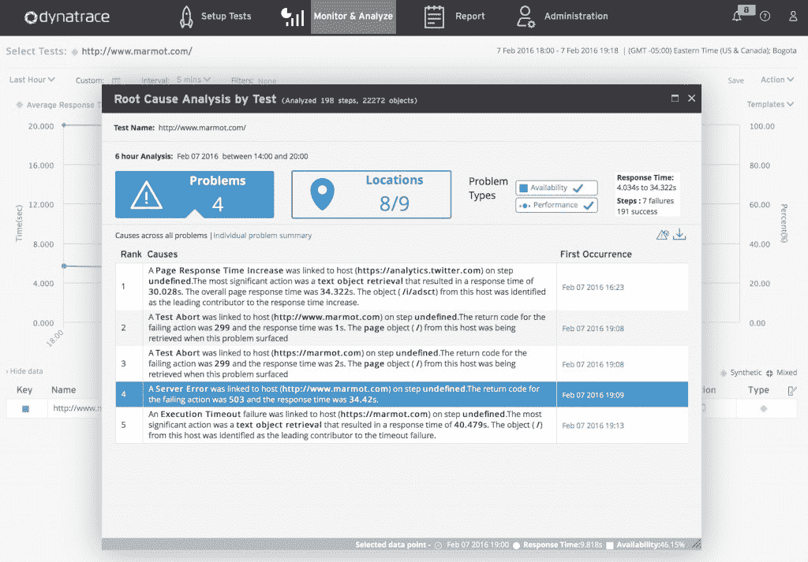
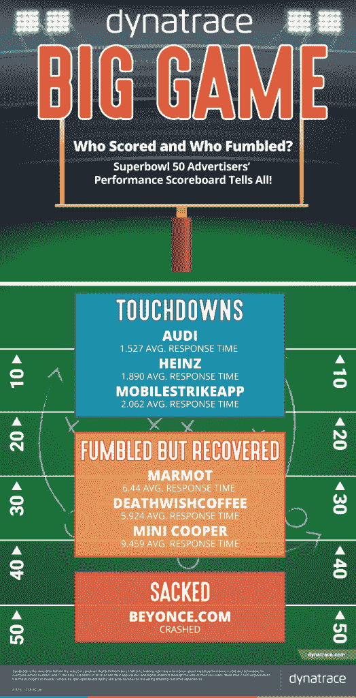

# 奥迪、亨氏赢得 Dynatrace 的网络性能超级碗

> 原文：<https://thenewstack.io/dynatrace-kicks-off-performance-bowl-superbowl-50/>

奥迪和亨氏的网站在周日电视转播的美国超级碗决赛中表现最佳。这两个网站都设法提供了不到两秒钟的连续响应时间，因为它们受到了成千上万好奇用户的点击，他们的兴趣被各自公司的超级碗广告激起。

虽然碧昂斯的表演[可能占据了中场休息时的聚光灯](https://www.youtube.com/watch?v=L_Hgh7sPDLM)，但“碧昂斯女王”的网站并不成功，经历了间歇性的崩溃。

仅仅 30 秒的播放时间就有[500 万美元或更多](https://www.linkedin.com/pulse/super-bowl-ads-lead-social-media-stock-price-boost-joe-martin)的高昂价格，每一个能够在电视转播的美国足球锦标赛上提供一个令人垂涎的时段的企业都希望自己的钱花得值。

因此，为了判断这些是否充分优化了他们的广告支出，应用程序性能监控解决方案 [Dynatrace](http://dynatrace.com) 选择了展示自己。Dynatrace 追踪并分析了在今年超级碗广告客户名单中获得一席之地的品牌的应用和网站表现，称之为“T8 表现碗”。

奥迪以平均 1.527 的响应时间在 Dynatrace Performance Bowl 中拔得头筹，其次是平均 1.890 的 Heinz 和平均 2.062 的 MobileStrikeApp。

在 Dynatrace Performance Bowl 中，Marmot、DeathWishCoffee 和 Mini Cooper 都经历了影响其网站的平均响应时间问题。

Dynatrace 仪表板-Mini.com 平均响应时间

“Dynatrace 监控重大活动的数字表现有几个原因。这些事件给网站带来了巨大的流量，而这些网站可能还没有准备好迎接这样的涌入。在这种情况下，应用程序(服务、进程、主机等。)可能会在压力下屈服——响应速度变慢，网站崩溃，用户体验受损，”Dynatrace 的数字性能专家大卫·琼斯在电子邮件中写道。

琼斯写道:“通过监控数字性能，我们正在帮助行业和参与我们测试的公司了解为什么会出现这些问题，以及如何在未来的事件中防止他们的客户变慢或断电。”

服务器端的响应时间对于连接到客户的企业至关重要。监控网站性能、 [APM](http://www.dynatrace.com/en/products/application-monitoring.html) 和综合性能可以确保开发团队不仅可以看到导致中断的原因，或者哪个 JavaScript 片段运行不正常，而且可以立即采取措施解决问题。

Dynatrace 使用其合成测试机器人在其性能碗中进行监控，并与来自 [Dynatrace Ruxit](https://ruxit.com/) 的实时数据相结合。将这两者结合起来，公司可以整体监控其网站和应用程序，以便更好地解决可能出现的服务中断问题。

Dynatrace 根本原因分析器–显示 marmot.com 性能问题

当服务中断发生时，如果公司有一个基于云的 PaaS 在其主机上运行一组微服务，则很难确定问题来自哪里。Dynatrace 通过监控最终用户响应时间来衡量哪些公司在性能碗中脱颖而出，最终用户响应时间受到服务器请求时间的严重影响。在整个超级碗期间，网站经常受到全球数百万用户同时访问他们的网站或应用程序的影响。大规模运营时，处理这些请求和扩展可能是一项挑战。这些请求以及更多的请求构成了 Dynatrace 在整个性能碗中报告的数字。

Dynatrace 希望在性能碗中留下自己的印记，鼓励企业关注改善其后端优化。优化后端代码可以减少服务器端的性能瓶颈，这意味着客户无需等待页面加载即可查看公司信息——如果页面加载的话。奥迪通过优化其登录页面的性能，保持内容低，对象最少，并运行单一的第三方应用程序，在性能碗中占据了首位。

对于那些希望通过在其基础设施中引入 APM 和合成监控来获得成功的企业，Dynatrace 的 Performance Bowl 展示了为什么监控是大规模运营时取得成功的关键——即使您没有参加超级碗。

<svg xmlns:xlink="http://www.w3.org/1999/xlink" viewBox="0 0 68 31" version="1.1"><title>Group</title> <desc>Created with Sketch.</desc></svg>