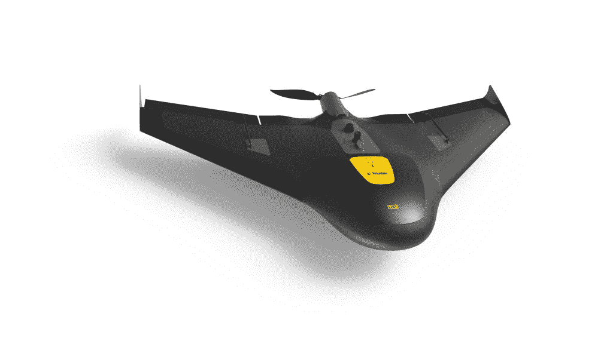
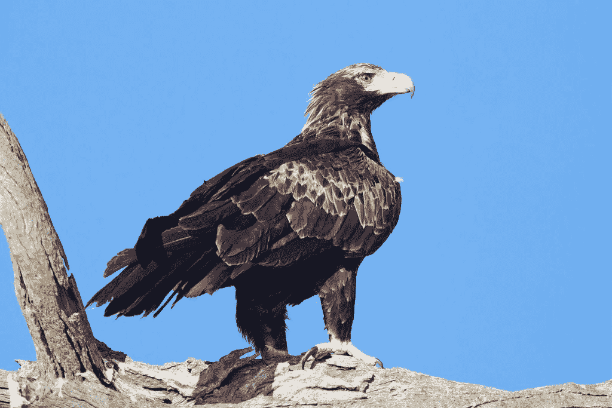
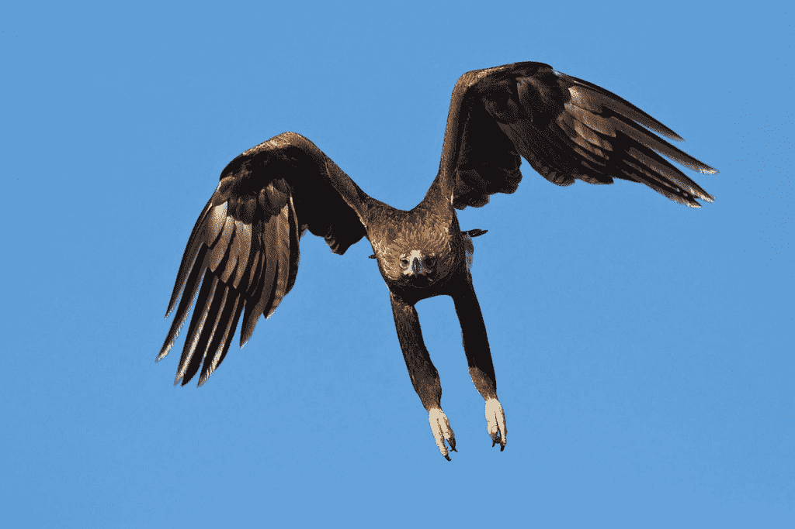
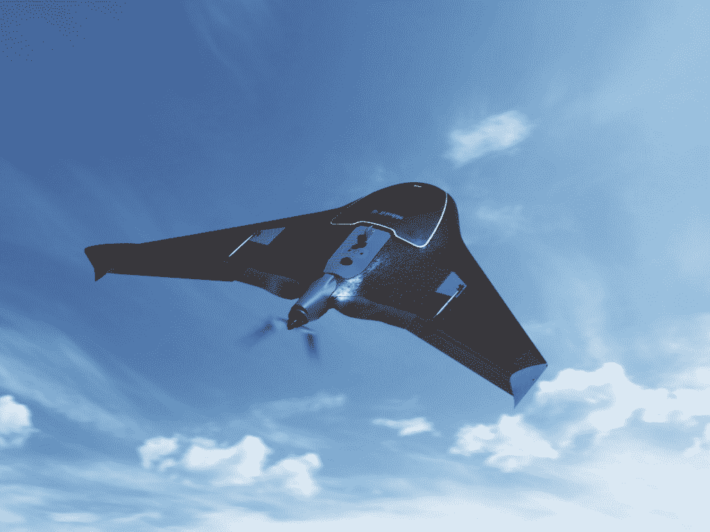
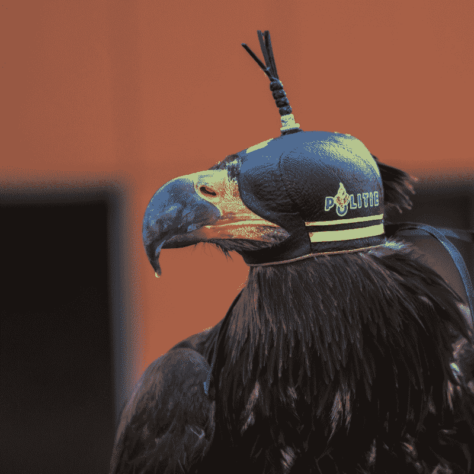

# 澳大利亚老鹰正在攻击无人机

> 原文：<https://thenewstack.io/eagles-attacking-drones-australia/>

既然美国已经吞噬了另外 4600 万只火鸡，也许是时候讲一个关于 T2 反击 T3 的故事了。在澳大利亚，老鹰似乎正在这样做，迄今为止已经永久退役了至少 9 架无人机。

这是一个历久弥新的故事，在这个故事中，人类将被一个世界第七大商业金矿公司代表，该公司在澳大利亚的坎巴尔达经营，采用了一些新的尖端监控技术。根据澳大利亚 ABC 新闻的一篇文章[，它使用一台价值 10，000 美元的相机拍摄了一些极其详细的照片(分辨率低至两厘米)，以确定最有希望的新挖掘地点。](http://www.abc.net.au/news/2016-11-17/wedge-tailed-eagles-bring-down-drones-in-goldfields/8033056)

此外，该公司还在用能生成详细等高线地图的设备勘测其金矿地形。为了覆盖所有这些潜在有利可图的领域，它将一些昂贵的高科技设备打包到一些坚固的碳纤维 Trimble UX5 无人机上。

这些特制的商业采矿无人机每小时飞行近 60 英里，高度可达 400 英尺，每架售价 1 万美元。这是价值 2 万美元的昂贵高科技设备，漂浮在澳大利亚的上空。虽然这是一个巧妙的计划，但有一件事他们没有料到。

老鹰队。

认识一下楔尾鹰，也被称为鹰鹰。[它是澳大利亚最大的猛禽](https://en.wikipedia.org/wiki/Wedge-tailed_eagle)，在离地面一英里以上的地方巡航，“连续几个小时翱翔，没有翅膀拍打，似乎毫不费力，”根据维基百科[。不祥的鹰鹰可以有超过 9 英尺的翼展——是地球上最大的鹰。它会攻击任何东西——当然是兔子，但有时也会攻击狐狸，甚至小袋鼠。“猎物的选择很大程度上是一个方便和机会的问题，”维基百科指出。](https://en.wikipedia.org/wiki/Wedge-tailed_eagle)

它的天敌是什么？没有了。楔尾鹰是“顶级掠食者”——食物链的最顶端。

维基百科补充说，因为鹰鹰希望保持这种状态，“它可能会通过扑向入侵者来保卫自己的领土”。"楔尾鹰是唯一一种以攻击悬挂式滑翔机和滑翔伞而闻名的鸟类."

很明显，还有无人机…

在位于卡尔古利-博尔德的澳大拉西亚采矿和冶金研究所举行的一次会议上，测量员里克·史蒂文走上讲台，讲述了他与有翼人的相遇。“我在圣艾夫斯的尾矿坝飞行时，同时遭到两只鹰的攻击，”美国广播公司报道史蒂文说。

“人们无法相信我能够拍到一只鹰在空中飞行的如此好的照片，但我没有……另一只鹰拍下了那张照片……我正试图驾驶我的无人机远离他们，突然，在一个高点，这只鹰下来了，并将它的两只爪子伸进了 UX5 的控制箱内。它将 UX5 转向一边，并在另一只鹰进入攻击时给它拍了张照片。”

“我认为这是历史上第一次记录到老鹰自拍。”

史蒂文是个严肃的人。他更喜欢“无人驾驶飞行器”这个术语，而不是商业术语“无人机”——毕竟，在你被允许驾驶它们之前，有五天的驾驶课程。他现在称楔尾鹰为“无人机的天敌”

“我已经打了 12 场了，”史蒂文告诉 ABC 新闻——其中 9 场损失直接归因于攻击鹰。这意味着超过 100，000 美元的不可挽回的设备损失，史蒂文现在将楔尾鹰形容为“我最大的问题”

他能做什么？他试图将无人机装扮成另一只鹰的样子，但没有成功。它“看起来像一只鹰，但不能像鹰一样反击，”史蒂文抱怨道。给无人机涂上天空友好的彩虹色也没有效果。[据《华盛顿邮报》](https://www.washingtonpost.com/news/morning-mix/wp/2016/11/22/giant-eagles-terrorize-australian-gold-mine-take-selfie-with-drone-camera/)报道，该公司现已实施了一项新的全公司政策。“如果我们看到一只鹰…我们放弃任务，立即着陆…

"我们现在提前飞行，希望老鹰还在筑巢！"

这并不总是关于领土。史蒂文告诉《邮报》:“我看到它们趴在一架被击落的无人机上撕咬它，就好像它们试图获取食物一样。”(想象一下，如果无人机载着玉米煎饼，他们会做什么)。

但在真正的人类时尚中，有人已经以此为业了。[从上方守卫](http://guardfromabove.com/)“承诺”认证“猛禽”为您所有的空中安全需求。该公司表示:“过去不可能击落入侵的无人机，现在我们可以提供解决方案。”

在其他地方，该公司承认这是“一个高科技问题的低技术解决方案”，尽管该公司的创始人已经与猛禽合作了至少 25 年。总部位于荷兰的该公司已经与荷兰警方和法国政府合作，调查他们基于鸟类的安全解决方案的实施情况。根据该公司的常见问题解答，这是一个有待实现的想法。(“有时，超现代问题的解决方案比您想象的更明显…”)

或者，正如他们的创始人告诉《纽约时报》的那样，“通常，最疯狂的想法效果最好。”

[https://www.youtube.com/embed/IfxCiIJLw6s?feature=oembed](https://www.youtube.com/embed/IfxCiIJLw6s?feature=oembed)

视频

《纽约时报》报道，在一个未使用的军用机场进行训练，一名侦察总警司称该项目“非常有前途”，他还补充说猛禽确实提供了另一个优势。他们实际上可以将无人机拖到地面上，这样它就不会撞到地面上无辜的旁观者。但是，尽管敌人的无人机是可牺牲的，“我们仍在不断研究任何可能的额外保护措施，以保护我们的鸟类。”

这提醒我们，即使在美味的感恩节晚餐中，许多人仍然支持鸟类。事实上，甚至在对《华盛顿邮报》关于澳大利亚金矿公司击落无人机的报道的评论中，一位用户只用两个词总结了他们的感受。

“老鹰加油！”

* * *

# WebReduce

<svg xmlns:xlink="http://www.w3.org/1999/xlink" viewBox="0 0 68 31" version="1.1"><title>Group</title> <desc>Created with Sketch.</desc></svg>