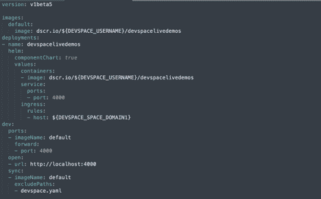
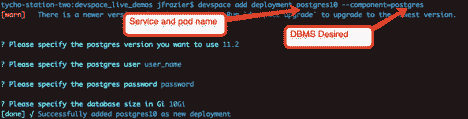

# 使用 DevSpace 和 Kubernetes 简化微服务开发

> 原文：<https://thenewstack.io/easing-microservices-development-with-devspace-and-kubernetes/>

[](https://www.figure-eight.com/)

 [乔希·弗雷泽

乔希·弗雷泽是 Figure Eight 的高级数据工程师，Figure Eight 是一家总部位于旧金山的人在回路机器学习和人工智能公司。五年前，在家乡马里兰州的小型软件公司磨练了自己的技能后，他第一次搬到了湾区。他曾为软件公司工作，从移动分析和安全初创公司到虚拟化领域的行业领导者。当他不写代码时，他喜欢阅读，学习数学和物理，和妻子一起旅行。](https://www.figure-eight.com/) [](https://www.figure-eight.com/)

当我在[数字八](https://www.figure-eight.com/)开始时，我得到了一个新工程师通常的“入门”材料；架构图、[合流页面、](https://www.atlassian.com/collaboration/confluence-create-content-with-pages) GitHub repos 等。在设置好我常用的开发环境之后，我开始从一个 Confluence 页面开始工作，该页面旨在让新工程师至少能够使用我们架构中的一些微服务。该页面引导用户完成初始依赖项和设置，然后继续检查几个回购并运行其应用程序堆栈。我们使用的是 **docker-compose** ，所以这里的想法是在每个 repo 中运行一个 *docker-compose up* 命令，应用程序堆栈就会出现。

我们马上遇到了一个小问题:即使 MacBook Pro 上没有运行任何其他东西，运行少量的微服务及其数据库、消息队列和 redis 实例也会导致性能问题。

> 分布式系统和微服务架构为遵循本地开发模式的工程师带来了真正的挑战。

在如此复杂的系统中，除了本地开发栈的资源限制之外，我还遇到了一些竞争条件的问题:微服务 A 会出现并试图连接到一个还没有被提供的 RabbitMQ，或者微服务 B 会在其 Postgres 数据库被引导之前出现。在几个部署中遇到这些问题后，我编写了一个脚本，首先显示基础设施组件，然后在尝试显示我们的 Figure 应用程序之前检查这些服务是否正常。这就成功了(虽然很明显我的 RAM 并不高兴)，所以我签入了这个脚本，并向团队阐明了它是一个有用的方法，可以绕过在本地运行堆栈的一些令人头疼的问题。

在微服务、容器和容器编排技术的时代，这个故事听起来可能很熟悉。这当然不是我工作过的第一家面临类似问题的公司；分布式系统和微服务架构为遵循本地开发模式的工程师带来了真正的挑战。

## 进入开发空间

根据另一名工程团队成员的建议，我们的核心平台团队决定审查 Kubernetes 开发工具 DevSpace，将其作为解决我们本地开发困境的可能方案。它承诺 Kubernetes 资源管理具有更合理的学习曲线，安全的多租户和命名空间隔离，为工程师提供[沙盒部署](https://devspace.cloud/products/devspace-cloud)，以及从本地机器到远程集群上运行的 pods 的热代码重新加载。

### 再次开始

在从我们的微服务堆栈中确定了一个理想的候选者后，我开始实施 POC。从回购的根目录，我能够运行

并在一分钟左右的时间内生成一个类似下图的 DevSpace 配置 yaml。该命令将引导用户将他们的名称空间连接到他们的部署，以及将在其上部署 pod 的集群。我们的是一个 Docker 商店，所以这一步非常简单，我们将项目的主要部署指向我们的。/Dockerfile 位于 repo 的根位置。

示例设备空间配置:



一旦连接上，我就可以运行

根据我的回购协议中的 order 文件，在短时间内运行了一个 pod。

获取给定项目的部署列表非常简单:

```
devspace list deployments

```

这会产生这样的东西:


读者会注意到，在这个过程中，我们没有为任何一个部署定义[舵图](https://thenewstack.io/how-to-install-the-helm-kubernetes-package-manager-on-ubuntu-server/)，DevSpace 会为我们配置部署。

对于相对简单的应用程序，没有任何外部依赖，这个初始化过程就是使用 DevSpace 在 Kubernetes 中启动和运行应用程序所需要的全部。显然，对于大多数应用程序来说，情况并非如此。我的 pod 启动了，但找不到完成工作所需的 Postgres 数据库，很快就死机了。

### 属国

我想用这种新技术避免的我们过去的本地环境错误之一是在每个应用程序的基础上管理依赖组件。我们所有的应用程序都使用 Postgres 数据库，然而在每个项目中，我们都使用每个
启动不同的 Postgres 实例

这种模式对于单个应用程序的一次性测试来说很好，但是当我们开始讨论将其他微服务部署到本地机器或集群时(将端口定义冲突排队)，这种模式就失效了。

我的想法是将我称之为“基础设施组件”的部署集中到它们自己的 repo 中，这样就可以在一个地方管理它们。

DevSpace 提供了一些带有组件标志的现成的“罐装”数据库管理系统，它们非常容易添加到 devspace.yaml 中用于部署定义:

```
devspace add deployment  &lt;name_of_service&gt;  —component=&lt;DBMS_NAME&gt;

```

要获得可用组件的列表，只需运行:

```
devspace list available-components

```

添加组件:



所以我们创建了一个 repo，它有自己的 devspace.yaml 文件，专门用于在部署任何微服务之前部署我们的基础设施。当一个新的空间被提出时，工程师简单地进入这个回购，运行

并且部署了我们平台的主干。不需要为我们的微服务或数据库制作任何舵图，或制作和管理任何 yaml 文件。

现在，当我们部署微服务时，我们可以让他们在部署之前检查他们的依赖关系。如果他们的依赖不存在，我们很快就会失败，并向用户提供有价值的反馈。

能够用一个命令进行部署只是 DevSpace CLI 工具带来的一部分功能。DevSpace 是一个强大的工具，用于管理 Kubernetes 部署，无需太多的先验知识，并帮助我们从 Figure 开始向新工程师提供我们的平台。现在，在 Figure Eight 的第一天，新工程师可以获得部署我们整个平台的第一手经验，以及关于哪些微服务依赖于哪些基础架构组件的宝贵见解。

## 含义，以及共享开发环境的问题。

DevSpace 为我们提供的功能不仅仅是给工程师提供他们自己的沙箱，以及管理它们的能力。

在采用 DevSpace 之前，即使是很小的变更也要进行集成测试，这意味着要在我们共享的开发环境中协商时间，以便这些变更可以在真实的场景中被审查，而不会对其他人的测试产生负面影响。这是一个常见的问题，也是我们在实现 DevSpace 以及围绕它构建的流程和基础设施时试图解决的问题。

自然地，我们想要 DevSpace 给我们的附加功能，也就是说，在代码变更影响到我们的测试环境之前，在完全运行的环境中测试代码变更的能力是非常引人注目的。对这种能力的渴望驱使我们思考这个项目，我们希望其他人可以从我们的经历中学习。

<svg xmlns:xlink="http://www.w3.org/1999/xlink" viewBox="0 0 68 31" version="1.1"><title>Group</title> <desc>Created with Sketch.</desc></svg>