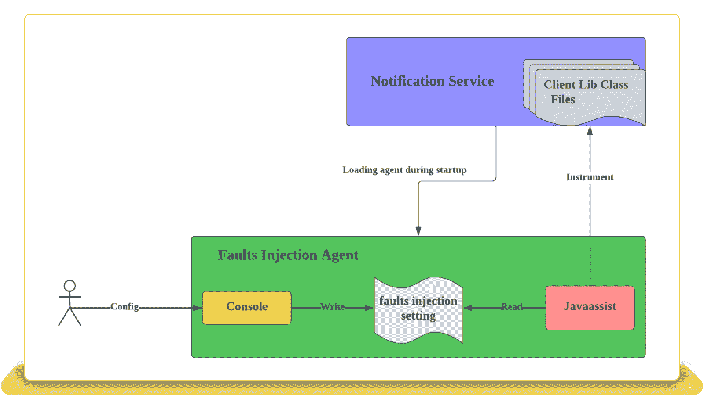
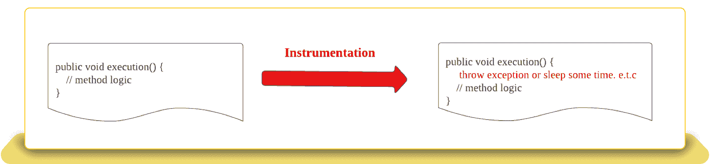
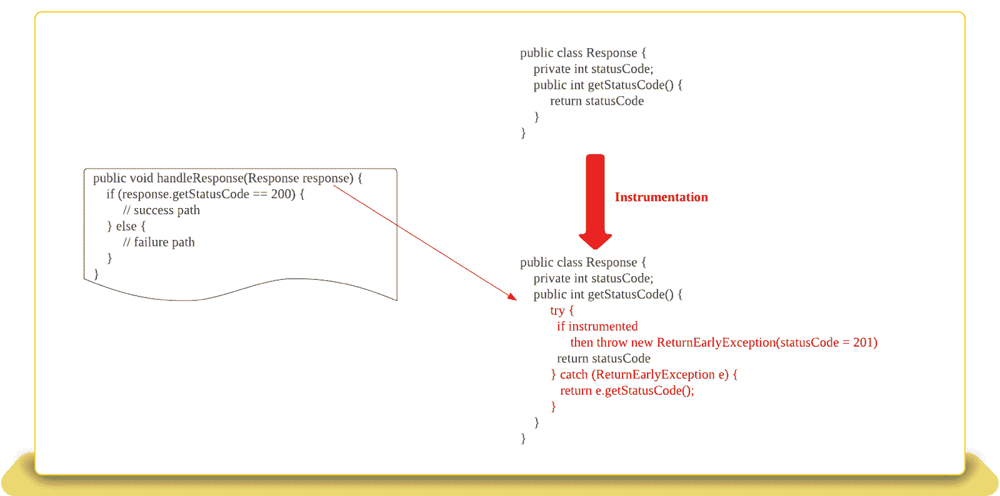
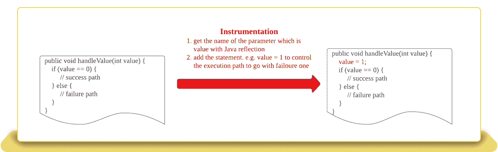
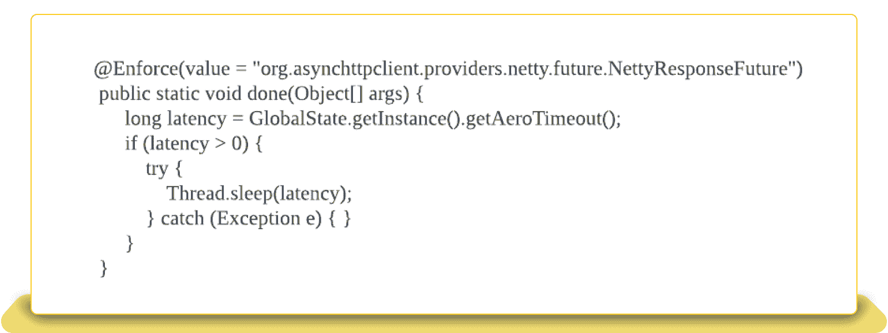
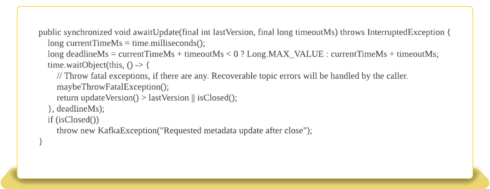
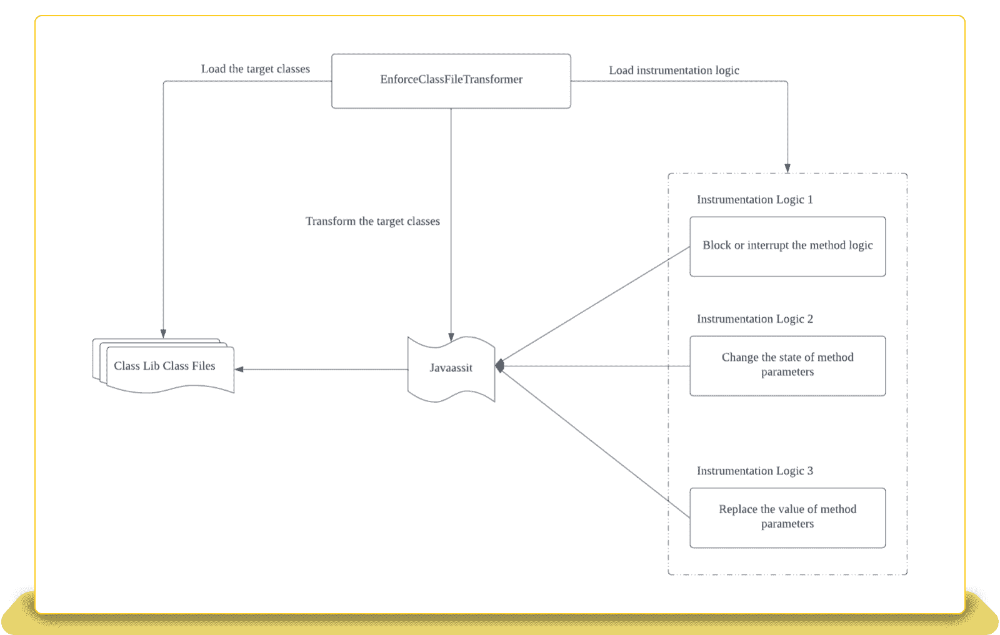
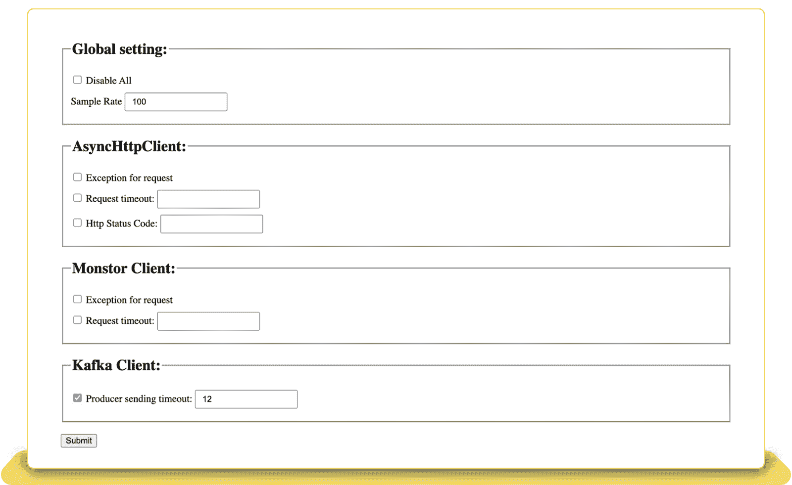

# EBay 在应用层面探索混沌故障测试

> 原文：<https://thenewstack.io/ebay-explores-chaos-fault-testing-at-the-application-level/>

网上购物巨头易贝已经对混沌工程有了信仰，但该公司的工程师正在尝试一种新的方法:破解应用程序，而不是基础设施，看看哪里会出错。

EBay 的通知平台是让买家了解价格、库存状态和付款状态的系统。这非常重要，并且需要更多的外部依赖来执行其核心功能。识别和排除故障点对易贝的工程师来说非常重要，但至少可以说破坏系统是不理想的。由易贝工程师陈为撰写的[博客文章](https://tech.ebayinc.com/engineering/how-ebays-notification-platform-used-fault-injection-in-new-ways/)详细描述了易贝如何通过使用 Java 代理并创建一个模拟环境，能够在不破坏任何东西的情况下破坏任何东西。

EBay 创建了一个模拟测试环境来执行应用程序级故障测试。测试包括三种模式——阻塞方法逻辑、改变方法参数状态和改变参数值。应用层故障注入非常成功，这些实践将在易贝得到进一步扩展。

## **基础设施级与应用层故障注入**

*故障注入(Fault injection)是故意将故障注入到系统中以观察行为并识别弱点的过程。*

关闭网络或关闭下游服务以引入 HTTP 断开或超时错误是基础设施级别的故障注入。同样，填充磁盘以造成磁盘已满错误也是基础架构级别的故障注入。它会挑战依赖服务的所有资源，或者增加专用资源的成本。

但是，如果这些错误是在 API 而不是基础设施上注入的，会怎么样呢？这看起来像是为内部服务错误增加了 http 客户端库的延迟，或者模拟了内部服务错误的 500 响应代码。在适当的环境中，这种新的故障注入方式提供了一种经济、安全的方式来执行故障注入，而不会对底层资源造成损害。

## **架构概述**

EBay 的应用级故障注入发生在模拟环境中，与服务本身是分离的。由于易贝是基于 Java 的平台，该公司的工程师使用了 Java 代理。在 Java 代理内部，用于相关服务的客户端库的类文件通过 API 被引入到不同的错误中。

主要目标是迫使被调用的方法经历失败。易贝的项目包括三种仪器模式:

## **阻塞或中断方法逻辑**

这个插装逻辑很简单 API 可以抛出异常或休眠一段特定的时间来模拟错误或超时。

## **改变方法参数的状态**

这适用于故障模拟取决于输入参数状态的情况。在下面的示例中，如果 *response.getStatusCode()* 值不等于 200，将触发故障逻辑。为了用失败代码模拟错误，易贝需要找到一种方法来改变从 *response.getStatusCode()返回的响应的状态。*

易贝添加了下面的代码片段来达到预期的效果。添加一个 try-catch 块专门捕获抛出的执行并返回 catch 块中的代码。执行路径已更改，并返回了所需的结果。

## **替换方法参数的值**

有时，参数值决定方法逻辑，因此输入参数将被操作。这个问题有点棘手，因为输入值必须在故障注入之前知道，但是这个值直到运行时才显示出来。易贝利用 Java 选举在运行时获取参数名。

## **创建模拟环境**

模拟测试环境存在于 Java 代理内部。EBay 的工程师实现了一个类加载器，为应用程序代码所利用的方法检测代码。他们还创建了一个注释来指示哪个方法将被错误测试，并将逻辑放入注释中。下图说明了注释:

上面的代码片段为*org . asynchttpclient . providers . netty . future . nettyresponsefuture . done()*提供了插装逻辑。使用相同的签名和@Enforce 的注释创建了一个新方法，该注释是用户定义的 Java 注释，指示用于故障注入的工具逻辑。注释有两个字段，值和类型。值字段是方法的类名。加载代理时，定义的类加载器会找到所有被@Enforce 惹恼的方法，并注入逻辑。

@Enforce 的类型字段有两个值运行时值，default 和 static。上面的例子注入了 Java 代码，但是有些情况下可能需要字符串。下面是一个例子。

## **定制类加载器**

逻辑在 Java 代理中之后，它仍然需要到达客户端库的目标方法。为此，需要一个定制的类加载器。类加载器利用工具库 Javaassist，并可以操纵 Java 字节代码来转换目标方法的类文件，以包含定义的错误。

上述实现描述了以下三种资源的客户端库的故障注入:

推送通知端点:

*   *   客户端库:异步 http 客户端 1.8.3
    *   故障类型:
        *   超时
        *   例外
        *   响应状态代码
*   消息队列:
    *   客户端库:kafka-client 2.5.1
    *   故障类型:
*   分布式商店(由易贝内部建造):
    *   客户端库:monster-Java-client 3 . 4 . 4 . 2-版本
    *   故障类型:

## **配置管理**

易贝在 Java 代理中实现了一个配置管理工具，以便在运行时动态地改变故障注入的配置。检测*javax . servlet . http . http servlet . service(http servlet request，HttpServletResponse)* 将暴露配置管理的端点。

端点呈现配置管理页面，让开发人员在运行时配置故障注入的属性。有了这个工具，开发人员可以全局地启用或禁用故障注入和故障的其他子类型；例如 AyncHttpClient 的超时。

## **接下来是什么？**

EBay 将在更多的客户端库和故障类别中扩展应用级故障注入的范围，以在不同类型的环境下为我们的服务提供多样化的实验场景。同时，由于通过配置管理控制台设置的故障配置只能在实例级别触发，他们将寻找更好的方法在集群中传播更改。

<svg xmlns:xlink="http://www.w3.org/1999/xlink" viewBox="0 0 68 31" version="1.1"><title>Group</title> <desc>Created with Sketch.</desc></svg>