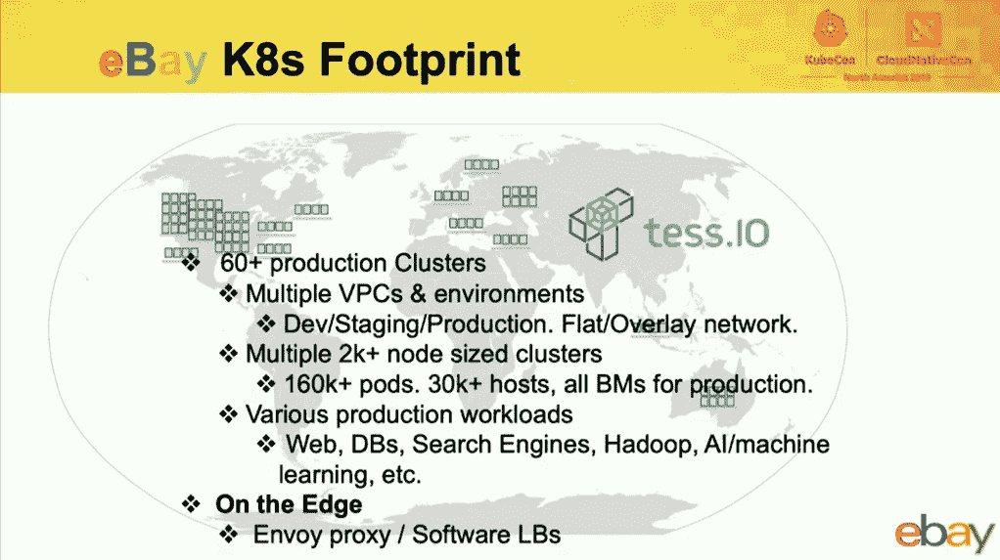

# EBay 为性能敏感的搜索业务推出 Kubernetes

> 原文：<https://thenewstack.io/ebay-rolls-out-kubernetes-for-performance-sensitive-search-operations/>

有没有可能在 Kubernetes 上运行像搜索应用程序这样的大规模延迟敏感型工作负载，其性能与直接在服务器上运行时几乎相同？这是电子商务巨头易贝的一组工程师正在调查的事情。到目前为止，他们的结果，稍加调整，看起来很有希望，他们已经在 11 月的 KubeCon+CloudNativeCon 北美会议上报告了。

目前，易贝运行着大约 60 个 Kubernetes 生产集群，管理着 30000 台服务器上的大约 160000 个应用程序。除了面向用户的搜索功能，K8s 实例还处理诸如管理 Hadoop AI/ML 管道之类的任务。为了更接近终端用户，一些 K8s 集群通过 Envoy 代理在边缘上运行。

工作清单上最大的工作是运行易贝自制的分布式搜索平台 Cassini 的一部分。在任何时间点，Cassini 都为超过 14 亿个活跃列表提供服务。平均而言，这导致每个数据中心每秒钟大约有 300，000 个查询，总计约占全球数据中心空间的 30-40%。平台团队努力为这项服务实现 99.999%的可用性(众所周知的“五个九”)。

目标是让 Kubernetes 驱动的搜索像在服务器上运行一样快。易贝基金发现，一套现成的 Kubernetes 集群每秒可以执行 3，200 个查询(QPS)，而裸机性能为 3，600 个 QPS，两者都消耗大约 18-20%的 CPU 资源。通过更新到最新的 Linux 内核，进行一些 CPU 调优，并采用高性能的 [IPVLAN](https://www.kernel.org/doc/Documentation/networking/ipvlan.txt) ，可以作为驱动程序添加到 Linux 内核中，从而获得了进一步的性能提升。有了这些额外的变化，他们几乎能够匹配 80% CPU 利用率的性能，实现惊人的 9，500 QPS。

使用 Kubernetes，易贝“能够实现搜索应用程序的速度和灵活性，而不影响该应用程序的性能，”为平台团队(包括所有 Kubernetes 的东西)工作的易贝开发人员 [Yashwanth Vempati](https://www.linkedin.com/in/yashwanthvempati/) 说。

## 动态搜索

出于多种原因，搜索团队决定尝试 Kubernetes。从历史上看，给 Cassini 添加新功能，甚至升级一个功能，都需要花费大量时间，包括咨询硬件团队，以及提供操作系统和各种服务。Kubernetes 可以大大缩短供应时间。K8s 还承诺了一种将应用程序带到边缘的方法。Kubernetes affinity rules 提供了一种自动化安全拓扑的方法，因此当一个碎片关闭时，它不会复制特定碎片的所有副本。当然，Kubernetes 将提供可扩展性，如果用户数量或销售的商品数量激增，可以轻松增加额外的 pod 来适应这种增长。

搜索团队的易贝开发者 Mohnish Kodnani 说:【EBay 的搜索空间不同于大多数搜索用例，因为内容总是在变化，因为项目被发布，然后被出售。在易贝的测试设置中，Kubernetes 拥有一个五层查询服务堆栈的底层，该堆栈跨多个包含大约 10 亿个列表的分片运行查询。以及管理评分、排名并将结果返回给用户。Kodnani 说，这是最复杂的一层，但如果处理得当，其他层也能成功。

为了利用 Kubernetes，易贝将搜索功能转换成一套微服务，这是一项艰巨的任务。例如，查询服务窗格由三个容器组成。一个运行应用程序逻辑，一个导出日志数据，第三个将操作指标发送给 Prometheus。团队编写了一个文件分发[操作符](https://thenewstack.io/databases-operators-bring-stateful-workloads-to-kubernetes/)来跨网格分发数据。

该公司面临的一个挑战是 Kubernetes 没有提供两个 pod 共享一个持久卷的简单方法。为了解决这个问题，易贝团队创建了一个“变异网络钩子”来帮助共享一个可以跨不同 pod 共享的持久卷声明。两位工程师承认，这是一个小小的骗局，但确实成功了。这个 webhook 从 K8s API 服务器中提取该 pod 上所有 PVC 的列表，并将它们作为卷附加到该节点的 Data Distribution Daemonset Pod。易贝没有运行 sidecars，而是将数据分布节点作为 Daemonset 来运行，以便更容易地升级各个组件。

Kodnani 说，尽管初步试验取得了成功，但易贝将所有搜索转移到 Kubernetes 上还需要几年时间。该公司希望将其服务中断的可能性降到最低。由于该公司内部开发的代理层，开发人员看不到两个后端之间的差异，该代理层为开发人员提供了单一的 API 来编写，无论底层平台是什么。

要了解所有细节，请点击此处查看整个演示:

[https://www.youtube.com/embed/chGN44Kqpd8?start=959&feature=oembed](https://www.youtube.com/embed/chGN44Kqpd8?start=959&feature=oembed)

视频

<svg xmlns:xlink="http://www.w3.org/1999/xlink" viewBox="0 0 68 31" version="1.1"><title>Group</title> <desc>Created with Sketch.</desc></svg>