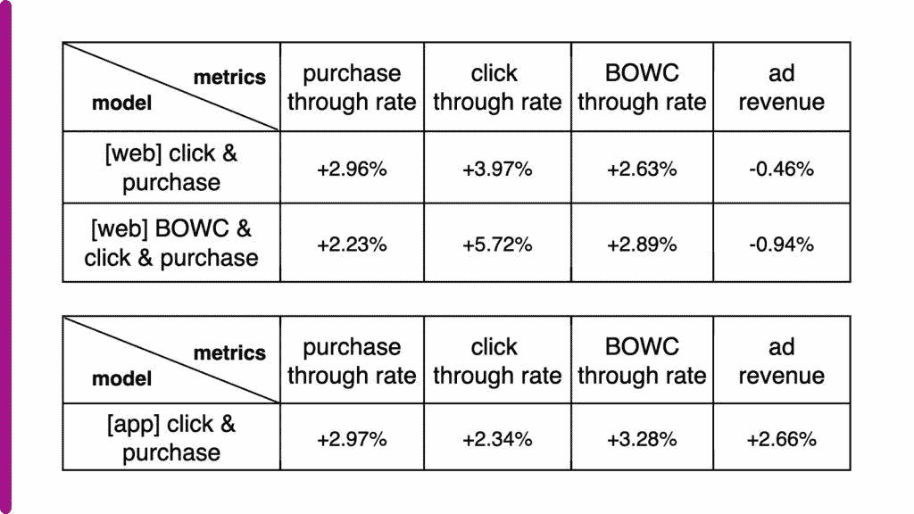

# EBay 使用机器学习来改进推广的列表

> 原文：<https://thenewstack.io/ebay-uses-machine-learning-to-refine-promoted-listings/>

在线市场[易贝](https://www.ebay.com/)在它的[机器学习](https://thenewstack.io/category/machine-learning/)模型中加入了额外的购买信号，如“添加到观察列表”、“出价”和“添加到购物车”，以提高推荐广告列表的相关性，基于最初搜索的商品。[陈雪](https://www.linkedin.com/in/chen-xue-98a90294/)在这篇[最近的文章](https://tech.ebayinc.com/engineering/multi-relevance-ranking-model-for-similar-item-recommendation/)中进行了详细介绍。

EBay 的推广列表标准(PLS)是卖家的付费选项。其中一个选项是 PLSIM，易贝的推荐引擎会推荐赞助商品，类似于潜在买家刚刚点击的商品。PLSIM 是按 CPA 模式支付的(卖家只有在成交后才向易贝支付)，因此在创建最有效的模式以推广最佳列表方面，这非常有激励作用。这对卖家、买家和易贝都有好处。

PLSIM 之旅如下所示:

1.  用户搜索一个项目。
2.  用户点击搜索结果，进入一个列表项的查看项(VI)页面(易贝称之为种子项)。
3.  用户向下滚动 VI 页面，查看 PLSIM 中的推荐项目。
4.  用户点击 PLSIMs 中的一个项目，然后采取行动(观看、添加到购物车、立即购买等)或检查另一组新的推荐项目

从机器学习的角度看 PLSIM 之旅:

1.  检索与种子项目最相关的候选提升列表标准子集(“召回集”)
2.  应用经过训练的机器学习排序器根据购买的可能性对召回集中的列表进行排序
3.  基于广告费率重新排列列表，以便平衡通过促销实现的卖家速度与推荐的相关性

## **排名模型**

排名模型基于以下历史数据:

*   推荐的项目数据
*   推荐项目与种子项目的相似性
*   背景(国家、产品类别)
*   用户个性化功能

EBay 使用梯度提升树，对于给定的种子项目，根据项目的相对购买概率对项目进行排序。

## **从二元反馈到多元关联反馈**

在过去，购买概率依赖于二进制购买数据。如果它是与种子项目一起购买的，那么它就是“相关的”，如果不是，那么它就是“不相关的”。这是一个失败的方法，但仍有许多需要优化的地方。

*   **假阴性**:由于用户通常只从推荐列表中购买一件商品，在没有购买导致假阴性的情况下，好的推荐可能被视为坏的。
*   **购买很少**:与其他用户事件相比，在购买中训练一个具有足够数量和多样性的模型来预测积极的类别是一项挑战。
*   **遗漏数据**:从点击到添加到购物车的用户行为揭示了大量用户信息，揭示了可能的结果

从所有这些，易贝的工程师考虑了除了最初的点击之外的以下用户行为，以及如何将它们添加到排名模型中。

*   **立即买**(仅适用于(立即买)箱列表)
*   **添加到购物车**(仅适用于箱列表)
*   **报价**(仅适用于最佳报价列表)
*   **竞价**(仅适用于拍卖挂牌)
*   **添加到观察列表**(适用于 BIN、最优惠或拍卖列表)

用户界面示例

## **多相关性反馈的相关性级别**

易贝现在明白购买是最相关的，需要增加其他行动，但新的问题是:这些行动在相关性的尺度上属于哪一级？

在看到新的耙地行动项目之前，总是先点击推荐的项目。这导致易贝将导致购买的“缺乏选择”行为和“选择推荐”(点击推荐)行为分别列为最不相关和第二不相关的行为。

下面的图表  展示了易贝如何排列剩余的可能行动——“出价”、“立即购买”、“添加到观察列表”和“添加到购物车”

在种子项目的历史训练数据中，每一个潜在项目都按照以下等级被标记为相关性级别。

标记的结果是，在训练中，排序者对排序错误的购买的惩罚比对排序错误的“现在买”的惩罚更重，以此类推。

## **多重相关反馈的样本权重**

但事情并没有那么简单，因为一次点击并不会比一次“点击”少一个点，就像“添加到购物车”比“点击”多两个点更可能导致购买一样。梯度提升树支持多个标签来捕捉一系列相关性，但是没有直接的方法来实现相关性的大小。

EBay 不得不反复进行测试，直到他们得出让模型工作的数字。研究人员引入了额外的权重(称为“样本权重”)，这些权重被输入到成对损失函数中。他们优化了 hyperparameter 调整工作，并运行了 25 次迭代，才得出最佳样本权重——“添加到观察列表”(6)、“添加到购物车”(15)、“出价”(38)、“立即购买”(8)和“购买”(15)。没有样本权重，新模型表现更差。对于样本权重，新模型的性能优于二进制模型。

他们试验只添加点击作为额外的相关性反馈，并应用调整的超参数“购买”样本权重 150。下面还显示了离线结果，其中“BOWC”代表“立即购买”、“出价”、“添加到观察列表”和“添加到购物车”等操作购买等级反映了所购买物品的平均等级。越小越好。

## **总之**

总共有超过 2000 个模型实例被训练。A/B 测试分两个阶段进行。第一阶段仅包括额外的选择标签，并显示购买数量增加了 2.97%，易贝移动应用程序的广告收入增加了 2.66%，这被认为是足够成功的，足以将该模型推向全球生产。

第二阶段包括更多的行动，如将“添加到观察列表”、“添加到购物车”、“出价”和“立即购买”添加到模型中，A/B 测试显示了更好的参与度(如更多的点击和 BOWCs)。

<svg xmlns:xlink="http://www.w3.org/1999/xlink" viewBox="0 0 68 31" version="1.1"><title>Group</title> <desc>Created with Sketch.</desc></svg>