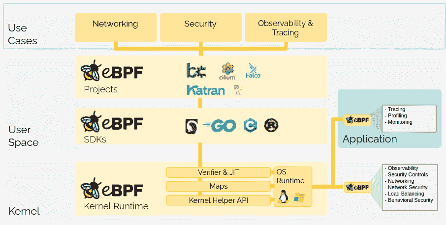

# eBPF 找到一个有新基础的家

> 原文：<https://thenewstack.io/ebpf-finds-a-home-with-a-new-foundation/>

脸书、谷歌、Isovalent、微软和网飞已经联合起来，在 [Linux 基金会](https://training.linuxfoundation.org/training/course-catalog/?utm_content=inline-mention)的保护伞下创建了 eBPF 基金会，为 eBPF 项目未来的努力提供了一个供应商中立的家。

[扩展的伯克利分组过滤器(eBPF)](https://ebpf.io/) 最初创建于 2014 年，是 1992 年创建的原始伯克利分组过滤器的后续。尽管名字如此，eBPF 不仅仅是原始版本的扩展。eBPF 是一个完全独立的项目，为 BPF 提供向后兼容性，并且被[称为](https://thenewstack.io/linux-technology-for-the-new-year-ebpf/)“Linux 最新的超级力量”eBPF 为 Linux 内核提供了一种使用实时(JIT)编译器代表用户执行定制操作的方法，同时还提供了一个完全沙箱化的环境。本质上，eBPF 允许您扩展 Linux 内核，而不需要实际更改它。

“eBPF 始于 2014 年，原因很简单:Linux 内核社区不再能够就每一项更改达成一致。像谷歌和脸书这样的公司加入进来，他们要求做出某些改变，但不可能在所有人之间找到共识，即这种改变对所有利益相关方都有意义。因此，需要某种方面的可编程性。eBPF 是这个问题的答案，”托马斯·格拉夫解释道，他是[等价](https://isovalent.com/)的联合创始人和首席技术官，该公司是[纤毛](https://cilium.io/)的幕后公司。“现在，你不必让整个 Linux 内核社区相信你的改变对每个人都很重要，你可以加载一个 eBPF 程序，这非常类似于 web 开发人员不再需要说服每一个浏览器供应商来引入一个新功能，而是可以编写 JavaScript 代码。”

Graf 解释说，像这样的功能以前只提供给可以雇佣内核团队来派生 Linux 内核并维护他们自己的分支的公司，或者使用 Linux 内核模块的公司。虽然第一种选择成本高昂，但 Linux 内核模块带来了另一个问题——任何错误都可能使 Linux 内核完全崩溃，最终，许多云提供商甚至不再允许它们用于某些发行版。

Graf 说:“除非你能主持、维护和雇佣你自己的内核团队，否则你就只能使用你的发行版中的 Linux 内核所能提供的功能。”。“eBPF 改变了这一点。这是第三种选择了。你可以做出自己的改变，你可以维护自己的改变，但你不必维护一个下游分叉。”

Graf 将 eBPF 与 JavaScript 环境进行了比较，因为它提供了沙箱环境和 JIT 编译器，这也意味着更改不需要重新编译内核，而是可以立即运行。对于那些使用 eBPF 构建应用程序的人来说，有一个 API，SDK 可用于 C++、Go、Python 和 Rust。

近年来，eBPF 有了相当大的发展，该项目为网络、安全、应用程序分析/跟踪和性能故障排除领域的各种工具奠定了基础。最近，eBPF 被[移植到 Windows](https://thenewstack.io/this-week-in-programming-ebpf-coming-to-a-windows-near-you/) ，其中 [eBPF for Windows](https://github.com/microsoft/ebpf-for-windows) 将把这一功能带到 Windows 10 和 Windows Server 2016，Graf 表示 BSD 的移植也在进行中。格拉夫说，最近的这种兴趣是成立 eBPF 基金会的部分原因。

“eBPF 基金会将所有人聚集在一起，创建了一个治理结构，允许每个人之间的安全创新，”Graf 说。“eBPF 变得非常受欢迎，所以有更多的人想要控制它，就像我们在许多其他开源技术中看到的那样。该基金会确保治理、运行事件之类的事情、做出技术决策、定义成为 eBPF 认证运行时的要求——所有这些决策都是由一个基金会完成的，该基金会由各方、工程师或创建 eBPF 的人来控制。重要的是，每个人都觉得贡献是安全的。这就是目标。”

在发布时，eBPF 基金会将从[许多已建立的项目和库](https://ebpf.io/projects/)开始，包括一些新兴的用例，并且该基金会也将是未来开源 eBPF 项目和技术的所在地。该基金会还将帮助举办社区活动和峰会，如下周 8 月 18 日和 19 日举行的免费虚拟 eBPF 峰会。

<svg xmlns:xlink="http://www.w3.org/1999/xlink" viewBox="0 0 68 31" version="1.1"><title>Group</title> <desc>Created with Sketch.</desc></svg>