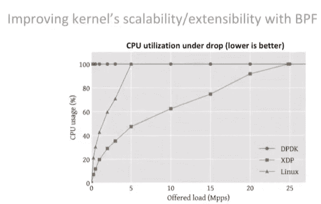
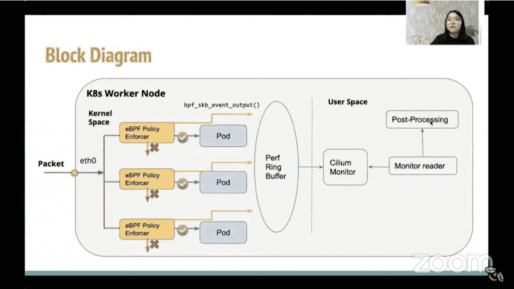

# eBPF:将 Kubernetes 数据平面放在内核中

> 原文：<https://thenewstack.io/ebpf-put-the-kubernetes-data-plane-in-the-kernel/>

eBPF 可以为云原生操作提供一个“从根本上更好的数据平面”，丹尼尔·博克曼(Daniel Borkmann)解释道，他是 T2 eBPF T3 的核心维护者之一，也是 Linux 网络公司 T4 等价 T5 的工程师，上周在虚拟的 eBPF 峰会 T7 上发言。

[Extended Berkeley Packet Filter](https://ebpf.io/)是一个[通用执行引擎](https://thenewstack.io/how-ebpf-turns-linux-into-a-programmable-kernel/)，它有一小组在 Linux 内核中运行的面向 C 的机器指令。它有 114 条指令和 11 个寄存器(如果编译成 x86，则有 2，000 条指令和 16 个寄存器)，并且是事件驱动的。Borkmann 说，它将 eBPF 指令映射到低开销的低级 Linux 指令，同时检查代码在内核中运行是否安全。

据介绍，尽管 eBPF 最初是为遥测技术准备的，但它可以提供一种更有效的方式来控制负载平衡、防火墙和其他基于规则的事件驱动的操作，从而在降低 CPU 使用率的同时加快操作速度。

在 Kubernetes 部署中，负载平衡器通常与实际工作负载位于同一节点上。不要从子系统运行它们，而是通过 eBPF 运行它们，连同 XDP ( [eXpress Data Path](https://prototype-kernel.readthedocs.io/en/latest/networking/XDP/) ，一个加速数据包处理的 Linux 钩子)。这种方法可以与 DPDK ( [数据平面开发套件](https://www.dpdk.org/)，一组用于加速数据包处理的库)的性能相媲美。由于没有 CPU 轮询，也没有在内核模式和用户模式之间切换，因此也可以使用这种更快速的方法来处理入站数据包的防火墙策略。脸书的 [Katran](https://github.com/facebookincubator/katran) 、[cillium](https://cilium.io/)和 Cloudflare 的 Unimog 都在使用这种方法。

一个 eBPF-dataplane，结合 [cgroups2](https://thenewstack.io/linux-cgroups-v2-brings-rootless-containers-superior-memory-management/) ，可以执行进出集装箱和 pod 的流量策略。在 **bpf_redirect_peer()** 和**bpf _ redirect _ neigh()**的帮助下，主机上的网卡可以将流量转发到 pod，而无需运行主机堆栈。他提到的其他例子包括 TCP 拥塞控制、自定义 TCP 报头创建。它可以与其他 eBPF 程序一起运行，例如用于跟踪的程序。eBPF 在用于多个子系统时简化了数据平面，因为依赖关系和移动部分较少。

博克曼说:“潜力是如此巨大，以至于我们真的觉得我们仍处于起步阶段。”。

[https://www.youtube.com/embed/1GSgyvn4N7E?start=2069&feature=oembed](https://www.youtube.com/embed/1GSgyvn4N7E?start=2069&feature=oembed)

视频

根据谷歌软件工程师臧力在峰会第二天的介绍，谷歌一直在使用 eBPF 为其谷歌 Kubernetes 引擎(GKE)运行数据层。网络策略日志是谷歌用这项技术创造的第一个功能。

Kubernetes 网络策略定义了允许哪些 pod 相互通信。虽然 Kubernetes 提供了一个用于设置网络策略的 API，但是它没有参考实现。因此，不同的供应商以不同的方式实现了它，通常用专有特性来扩展它。通常，他们依赖 iptables 或 Open vSwitch (OVM)。

李解释说，谷歌自己对使用 iptables 也不满意，因为 iptables 很笨拙，很难扩展，扩展性也不好。因此，该公司实现了 Cilium，这是一种基于 eBPF 的策略日志方法。eBPF 策略执行器安装在每个节点上，它根据一组规则检查每个数据包，这些规则可以动态更新，甚至可以动态生成。如果数据包不符合任何规则，就会被丢弃。李解释说，这种设置还可以将数据包信息推送到用户应用程序进行记录。事件类型、来源、身份、方向和数据包报头等信息都可以被解析并以线速传递给应用程序。

“我们已经看到了巨大的潜力。eBPF 用定制元数据增加网络数据包的能力支持一长串可能的用例。它可以帮助我们增强可观察性、安全性和许多其他 Kubernetes 感知的包操作，而不牺牲性能，”李说。

[https://www.youtube.com/embed/jw8tEPP6jwQ?start=4742&feature=oembed](https://www.youtube.com/embed/jw8tEPP6jwQ?start=4742&feature=oembed)

视频

<svg xmlns:xlink="http://www.w3.org/1999/xlink" viewBox="0 0 68 31" version="1.1"><title>Group</title> <desc>Created with Sketch.</desc></svg>