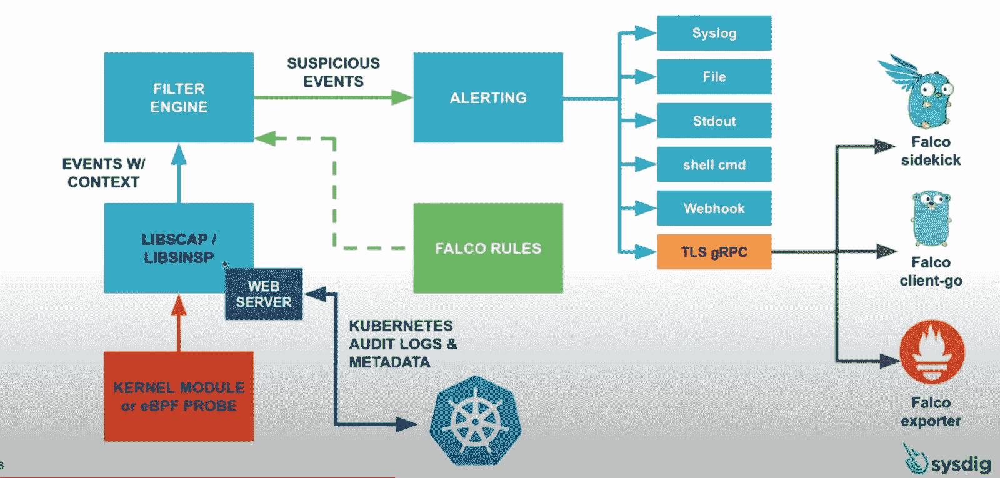
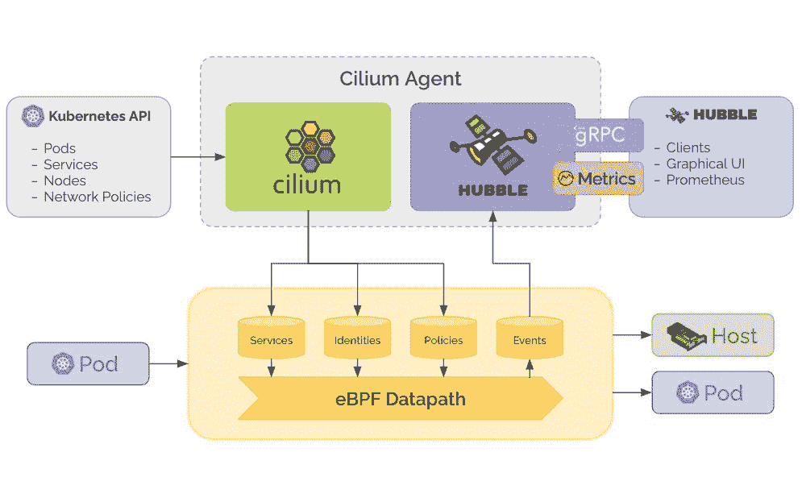
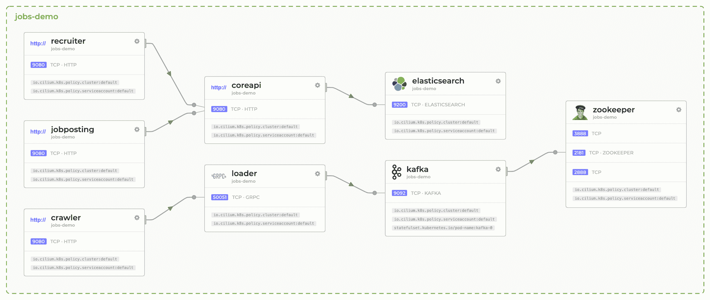
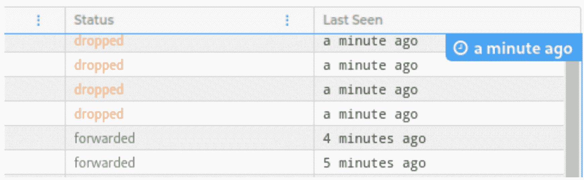
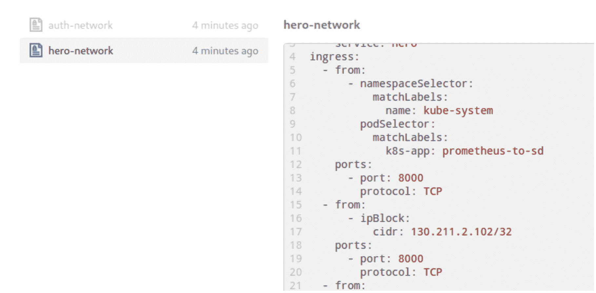
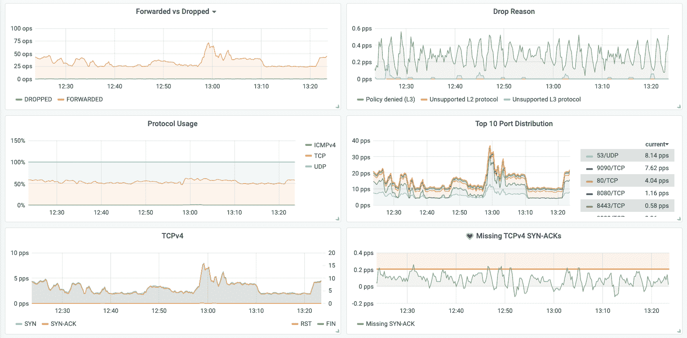
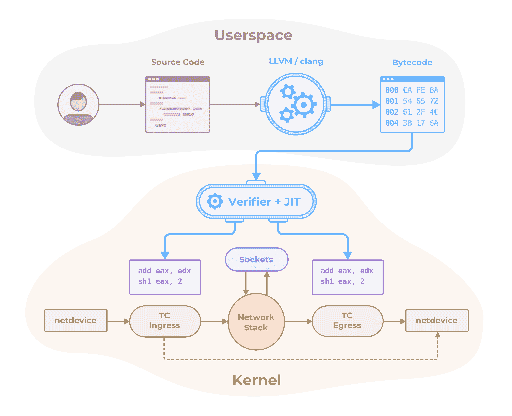

# eBPF 工具:Falco、Inspektor Gadget、Hubble 和 Cilium 概述

> 原文：<https://thenewstack.io/ebpf-tools-an-overview-of-falco-inspektor-gadget-hubble-and-cilium/>

 [卢卡斯·塞韦罗·阿尔维斯

卢卡斯·塞韦罗·阿尔维斯是 Container Solutions 的一名云原生工程师，这是一家专注于云原生的全球咨询公司。你可以在推特@canelasevero 上关注他。](https://www.container-solutions.com/) 

扩展的伯克利分组过滤器(eBPF)正在改变一切。在 eBPF 出现之前，内核跟踪、繁重的网络控制或者某些形式的可观察性在生产中是笨拙的或者不可能执行的，因为性能开销，或者仅仅是因为缺乏便利性。有了 eBPF，我们现在有了一个只运行安全代码的可编程 Linux 内核，并为工具的创建提供了无限的可能性。

在这篇博文中，我将向您展示四个使用 eBPF 技术的有用工具。对于每个工具，我将给出其功能的概述，简要地展示您可以用它做什么，并重点关注利用 eBPF 工作的部分。

下面我们来看看这一领域中出现的四种越来越受欢迎的工具。

## 法尔科

最初由安全公司 Sysdig 创建，[云本地计算基金会](https://cncf.io/?utm_content=inline-mention)采用， [Falco](https://github.com/falcosecurity/falco) 是一个云本地运行时安全工具。它监视节点和容器中的异常活动。它可以触发函数来处理这种意外行为，或者简单地将它报告给适当的通道。

开始使用 Falco 的基本工作流程如下:

*   定义 Falco 要监控的规则(异常行为)。
*   配置 Falco 将警报发布到主题、队列、聊天或日志聚合器。
*   (可选)配置一些由警报触发的东西，比如 AWS Lambda 或 Google Cloud 函数。

Falco 驱动程序有几个选项，您可以从中获取系统调用事件。但是如果你有一个支持 eBPF 的最新内核，你告诉 Falco 使用它的 eBPF 探测驱动，它所有的监控特性本质上都是基于 eBPF 的。

法尔科如何使用 eBPF？

以下是一些我觉得有趣并且设置简单的功能示例。

### 检测容器或节点上运行的外壳

有人访问容器并手动运行命令是开发/集成/登台环境中经常发生的事情，可能不会触发警报。但是，在您的生产环境中发生这种情况可能是违规的迹象，尤其是在您无法追踪到事件周期的情况下。Falco 可以在有人通过 shell 访问您基础设施上的容器或机器时发出警报。

### 容器或节点上产生意外的进程

假设您有一个容器，它应该只运行您的前端应用程序。只有为您的前端(npm)服务的进程应该在这个容器中运行。根据您使用的操作系统，或者如果您没有启用 AppArmor 或 SELinux，恶意软件仍然可以在实时容器中安装和运行。Falco 可以检测到这个意想不到的过程产卵的规则非常类似于前一个。您可以让规则在您的容器(或机器)中寻找任何流氓进程，而不是寻找特定的 shell 进程。

### 到不受信任的域的出站连接

不用说，如果您的工作负载正在访问您不认识的域，您可能应该查找一下。这可能是您的基础设施内部的威胁，但也可能是您的上游依赖关系之一受到损害。Falco 已经有一个宏来检测这种出站网络流量，您可以设置一个规则来使用它。

### 恶意的 Kubernetes API 调用

Falco 还可以监控开发者和运营商发送给 Kubernetes API 的调用。您可以设置规则，告诉它监视是否有人正在执行明显有风险的任务，例如向新用户授予集群管理权限或使用合理的信息创建配置映射。

### 尝试一下

对我来说，最有趣的快速彻底测试其功能的方法是遵循 Sysdig 的指南。通过它，你可以看到它与完整的警报和行动循环一起工作。

除了能够看到 Falco 的默认规则外，它还将设置云功能，例如，如果有人抓取容器的外壳，就可以删除 pod。Falco 的文档中有一些[例子](https://falco.org/docs/examples/)可以展示它的能力，还有一些 [Kubernetes API 审计](https://falco.org/docs/event-sources/kubernetes-audit/)规则可以配置。

### 形象化

Falco 没有自己的前端，但是您可以构建自己的集成来可视化它生成的数据。一种选择是购买 Sysdig 的企业解决方案，其中包括 Falco 的 web 前端。

## 检查员小工具

Inspektor Gadget 是由 [Kinvolk](https://kinvolk.io/) 开发的一个很酷的工具，用来帮助调试、跟踪和观察 Kubernetes 内部的应用程序。

开始使用 Inspektor 小工具的基本工作流程如下:

*   将其代理作为特权代理集部署在集群中。
*   安装 gadget kubectl 插件，开始使用它的内部工具。
*   选择一个小工具并使用它来探测特定的数据。

它的代理作为特权守护进程部署到您的集群中，它们使用内核 BPF 程序来监控与 pods 相关的系统调用。它的一些内部工具基于 [BCC](https://github.com/iovisor/bcc) 的 eBPF 工具集合。它的所有特性都是基于 eBPF 的。我将回顾几个我觉得特别有趣的例子。

### 跟踪循环

Inspektor Gadget 的 traceloop 工具使用独立的 eBPF [traceloop](https://github.com/kinvolk/traceloop) 工具。从您向前部署特权 DaemonSet 的那一刻起，您的所有 pods 系统调用都将被跟踪，一些最近的调用将被存储，以便您可以在以后使用它们。当一个 pod 失败时，您仍然可以访问它的事后跟踪数据来找出原因，这是非常有趣的。

### Execsnoop 和 Opensnoop

我认为，如果你需要一个工具来持续监控衍生的进程或打开的文件，Falco 将是最好的选择，因为它也给你警报和处理事件的方法。尽管如此，这些都是非常酷的工具，可以在调试会话期间轻松快速地探测 pod，或者找出现在正在发生的事情，而不是持续监视(进程或文件)。

### 引导初始网络策略

这个工具可以非常方便地为您的 Kubernetes 工作负载设计网络策略，而不必从头开始。这个想法是，如果您已经将您的应用程序部署到 Kubernetes，并且它们已经在相互对话，那么您可以使用这个工具来监控它们的通信，以“建议”您应用的网络策略。理想情况下，您会仔细检查它们，并根据您的需要进行调整，但它们仍然提供了一个坚实的起点。

### 尝试一下

Alban Crequy 和 Marga Manterola 在 2020 KubeCon 期间举办了一场很酷的[研讨会](https://www.youtube.com/watch?v=QhPXf4YFaJg&ab_channel=CNCF%255BCloudNativeComputingFoundation%255D)，他们在[这个 GitHub 资源库](https://github.com/kinvolk/cloud-native-bpf-workshop)中记录了相关说明。他们还讨论了 kube-trace 和本次研讨会中的其他一些主题。如果您计划测试本文中的一些工具，网络策略顾问工具会非常方便，因此您不必从头开始编写它们。

### 形象化

Inspektor Gadget 旨在与他们的 kubectl 插件一起使用，所以现在它主要是一个 CLI 工具。您仍然可以构建自己的集成来可视化其数据。

## 哈勃

哈勃是一个网络和安全观察工具。尽管它在某种程度上是[纤毛](https://cilium.io/)的一部分，但我想先了解一下它的功能，因为纤毛本身会更复杂。

开始使用哈勃的基本工作流程如下:

*   你已经在用纤毛了。
*   既然现在纤毛和哈勃的代理是一个东西，你只需要部署哈勃的中继和 UI。
*   然后，您可以使用它来可视化其服务地图、流程和正在应用的策略。

另一个可能的工作流程:

*   您正在使用另一个 CNI 插件(不是 Cilium)。
*   在另一个 CNI 上展开纤毛。
*   哈勃仍然可以依靠纤毛收集流量数据。

当 Cilium 将 BPF 程序发送到内核以控制数据包流、实施策略和负载平衡时，Hubble 提取从该流中生成的事件，以生成要使用的流数据和指标的日志。它的所有特性都与 eBPF 相关，因为它的所有数据都来自 eBPF 数据路径中的 events map。让我们来看看哈勃的能力。

哈勃如何与 eBPF 一起工作。

### 服务依赖关系和通信图

这个特性提供了服务连接图的可视化。随着您的架构中微服务数量的增加，很难理解谁与谁对话，以及您的设置中的数据流是什么。使用服务网格可以获得这种类型的可视化，但是使用 Hubble，开销要低得多(使用服务网格，您可能需要每个 pod 有一个边车，并且流量负载要大得多)。

哈勃可以创建的服务连接的可视化示例。

### 数据流日志和过滤

每次数据包通过您的服务时，它都会在此列表中生成一个日志。哈勃称这种信息为数据流，或者仅仅是流动。每个流提供关于源 pod 和服务、目的地 pod 和服务、目的地 ip 和端口的信息，告诉我们它是被丢弃还是被转发的数据包的状态，以及一个`last seen`时间戳。我们还可以过滤关键值，比如`ip=0.0.0.0`或`dns=google.com`。

哈勃流的样本，数据流的记录。

### 政策可视化

这只是一个简单的选项卡，用于查看现有的网络策略及其定义。

哈勃生成的政策可视化样本。

### 尝试一下

如果您已经构建了一个 GKE 集群来测试我之前提到的工具，我强烈推荐您按照这个官方教程在 GKE 上部署纤毛和哈勃。要启用 Hubble UI，只需按照说明为 Hubble 启用集群范围的可见性。部署任何多服务设置来可视化服务地图，并使用 Inspektor Gadget 网络策略引导程序来可视化在您的流上实施的这些策略(记得将它们更改为`kind: CiliumNetworkPolicy`并相应地进行调整)。

### 形象化

哈勃有一个好看的用户界面，你可以检查上面的例子，但你也可以导出它的指标，以在 Prometheus + Grafana 设置中可视化更多的数据。

数据可视化的例子，摘自哈勃的 GitHub 页面。

## 纤毛

我知道要使用哈勃，你实际上需要首先部署纤毛，如果你尝试了我提到的前一个教程，你就这么做了。然而，我想先谈谈哈勃，因为纤毛带来了一些复杂(有点难以测试)的功能。

好吧，纤毛到底是什么？ [Cilium](https://cilium.io/) 是一个完全基于 eBPF 的 Kubernetes 容器网络接口(CNI)插件，用于提供和透明地保护网络连接以及应用程序工作负载之间的负载平衡。

因为当您拥有非常大的集群或非常大的多集群设置时，Cilium 确实会大放异彩，如果您处于这种情况下和/或您需要高吞吐量的解决方案，选择它是非常有意义的。所以第一步是检查。

之后，您可以遵循以下步骤:

*   调整您的集群配置策略，将 Cilium 用作 pod 网络解决方案。
*   Cilium 为您提供了许多开始使用它的选项，有许多不同的配置，如用自己的 Kubernetes 代理解决方案(避免 iptables)替换 kube-proxy，接下来您会从它那里获得什么真的取决于您。

为了在服务之间提供安全性和负载平衡，Cilium 主要通过做两件事来利用 eBPF。首先，它在套接字层运行 eBPF 程序。第二，它在 XDP/tc 层运行 eBPF 程序。(如果你不熟悉这些定义，也不用太担心。但是如果您仍然对此感到好奇，您可以按照前面的超链接，查看另一篇关于在这个领域中实现 eBPF 程序的帖子:[使用 ip (iproute2)命令](https://medium.com/@fntlnz/load-xdp-programs-using-the-ip-iproute2-command-502043898263)加载 XDP 程序。

在套接字层，纤毛处理东西向的流量；即所有服务对服务的通信。在 XDP/tc 层，它处理南北通信，即外部流量进入节点。因此，基本上，它的所有特性都是基于 eBPF 的。现在让我告诉你一些我觉得有趣的特性。

Cilium 如何与 eBPF 一起工作，来自 Cilium 的 GitHub 页面。

### 不需要包级 NAT

因为 Cilium 使用 eBPF 来知道应用程序何时连接或发送数据包，所以它实际上在创建数据包之前就在 syscall 级别捕捉到了这一点。做一个包级的网络地址转换有些昂贵，但是 Cilium 发送给 socket 层的 eBPF 程序让应用程序“认为”它在与服务`ip:port`对话，而实际上 Cilium 让它直接与后端对话，不需要 NAT。

### 没有中间节点跃点

使用 kube-proxy(它在底层使用 iptables/netfilter ),中间节点跳跃是不可避免的，特别是在有很多节点的集群中。根据与上面提到的最后一个功能相同的推理，没有 kube-proxy 的 Cilium 会将数据包直接发送到其目的地，而不经过跳跃或转换。

### 哈勃本身

在某种程度上，你可以把哈勃看成纤毛的特征。要使用 Hubble，您仍然需要将纤毛部署到您的集群。

### 集群网格

[ClusterMesh](https://cilium.io/blog/2019/03/12/clustermesh/) 是 Cilium 的多集群设置方法。常见的用例是高可用性(在工作负载故障的情况下，而不是集群本身)和共享服务。

### 尝试一下

如果你因为这篇博客的哈勃部分已经在 GKE 上部署了 Cilium，你可以开始测试它的一些特性。然而，为了充分利用它的所有功能，您需要创建一个集群，使用 Cilium 作为它的主要 CNI 插件(而不是在另一个 CNI 插件之上)。像大多数在底层使用 eBPF 的工具一样，您还需要在您的节点上运行一个最新的 Linux 内核。

要使用不带 kube-proxy 的纤毛，请遵循不带 kube-proxy 的 Kubernetes 指南。在设置 ClusterMesh 之前，请确保使用专用的 etcd 部署 Cilium，以使用托管的 etcd 保持其安装状态。最后，设置你的[集群网格](https://docs.cilium.io/en/v1.8/gettingstarted/clustermesh/)。说起来容易做起来难，但是，如果你遇到什么问题，请 [ping me](https://twitter.com/canelasevero) ，或者写在评论里，或者 Cilium 的 [Slack](https://cilium.herokuapp.com/) ，寻求帮助。

## 包扎

在我之前写的一篇关于 eBPF 的博文中可以找到一些其他的工具，[“你应该给 eBPF 一个机会的主要原因”](https://blog.container-solutions.com/the-top-reasons-why-you-should-give-ebpf-a-chance)；查看“大玩家正在采用 eBPF”部分。这些工具有些是开源的，有些是企业解决方案(在这些情况下，您可以尝试申请试用订阅)。其他一些值得一提的工具是 [Calico](https://docs.projectcalico.org/maintenance/enabling-bpf) ，它最近增加了使用其 eBPF 数据平面的选项，以及 [Katran](https://github.com/facebookincubator/katran) ，一个来自脸书的负载平衡器。

我将继续探索 eBPF，现在更深入地了解如何编写和理解 BPF 程序。让我知道你使用 eBPF 或者基于它的工具的经验。

通过 Pixabay 的特征图像。

<svg xmlns:xlink="http://www.w3.org/1999/xlink" viewBox="0 0 68 31" version="1.1"><title>Group</title> <desc>Created with Sketch.</desc></svg>